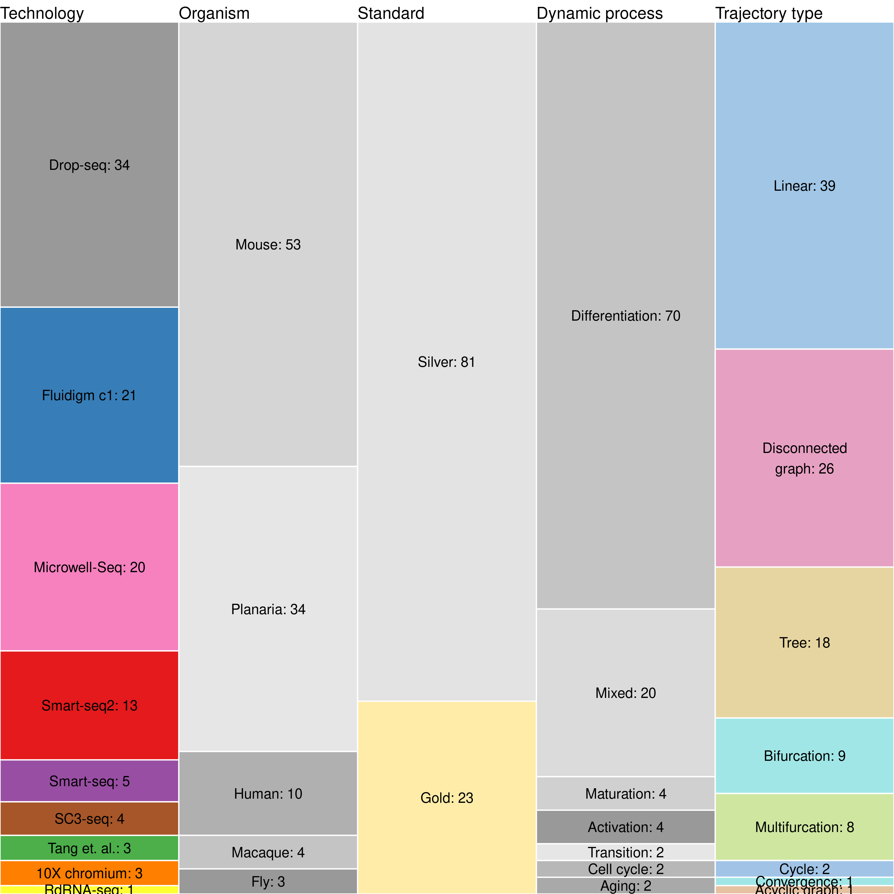
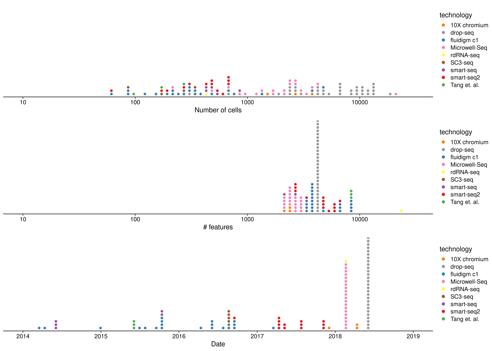

# Real datasets

<strong>[**Figure 1**](#fig_characteristics): Main characteristics of
the real datasets</strong>

-----

<strong>[**Figure 2**](#fig_sizes): Dimensions of the real
datasets</strong>

-----
