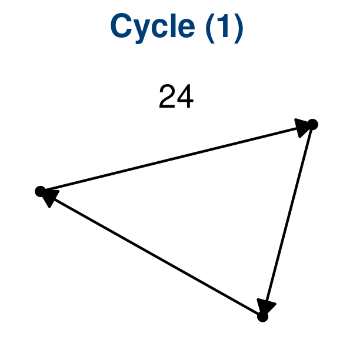
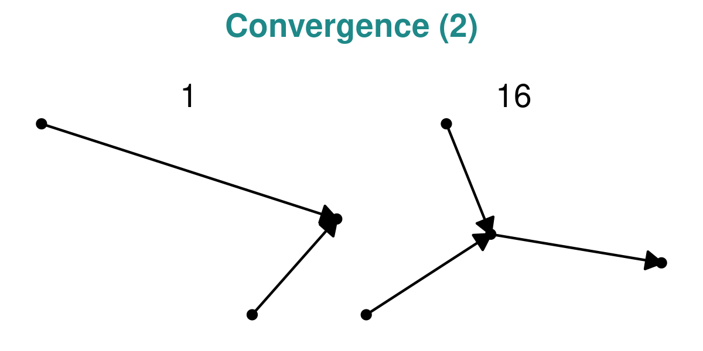

# Dataset characterisation

## Topologies

<strong>[**Figure 1**](#fig_cycle_topologies): The 1 distinct Cycle
topology, with a total of 24 datasets.</strong>

-----

<strong>[**Figure 2**](#fig_linear_topologies): The 1 distinct Linear
topology, with a total of 75 datasets.</strong>

-----

<strong>[**Figure 3**](#fig_convergence_topologies): The 2 distinct
Convergence topologies, with a total of 17 datasets.</strong>

-----

<strong>[**Figure 4**](#fig_bifurcation_topologies): The 3 distinct
Bifurcation topologies, with a total of 40 datasets.</strong>

-----

<strong>[**Figure 5**](#fig_multifurcation_topologies): The 6 distinct
Multifurcation topologies, with a total of 15 datasets.</strong>

-----

<strong>[**Figure 6**](#fig_tree_topologies): The 39 distinct Tree
topologies, with a total of 86 datasets.</strong>

-----

<strong>[**Figure 7**](#fig_acyclic_graph_topologies): The 13 distinct
Acyclic graph topologies, with a total of 17 datasets.</strong>

-----

<strong>[**Figure 8**](#fig_graph_topologies): The 19 distinct Connected
graph topologies, with a total of 35 datasets.</strong>

-----

<strong>[**Figure 9**](#fig_disconnected_graph_topologies): The 21
distinct Disconnected graph topologies, with a total of 24
datasets.</strong>

-----
