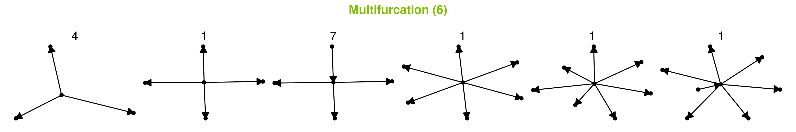
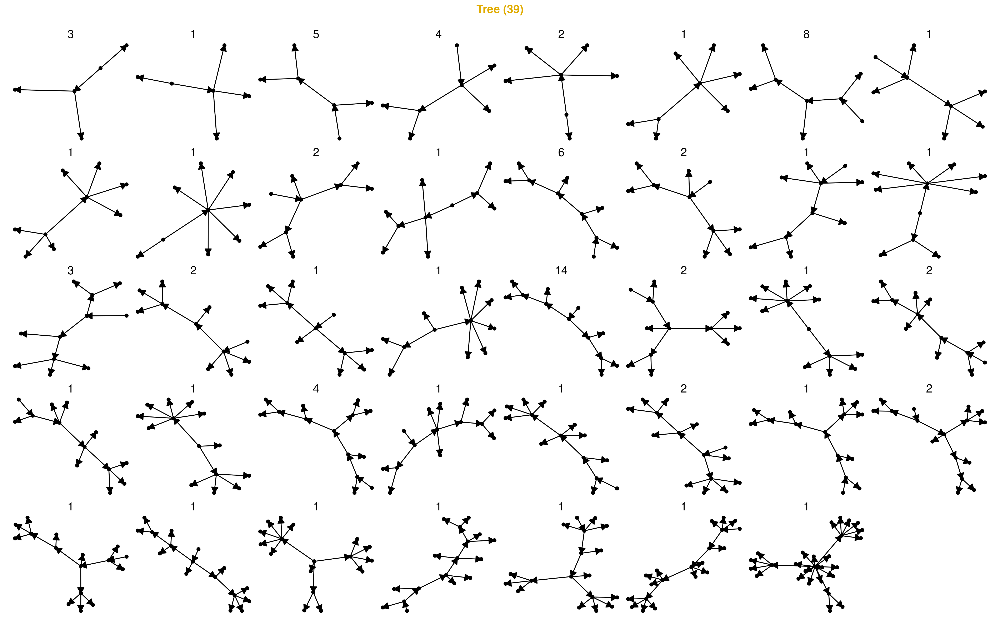

# Dataset characterisation

## Topologies

 

<strong>Figure 1: The 1 distinct Linear topology, with a total of 100 datasets.</strong>

------------------------------------------------------------------------

 

<strong>Figure 2: The 2 distinct Bifurcation topologies, with a total of 60 datasets.</strong>

------------------------------------------------------------------------

 

<strong>Figure 3: The 3 distinct Multifurcation topologies, with a total of 11 datasets.</strong>

------------------------------------------------------------------------

 

<strong>Figure 4: The 39 distinct Tree topologies, with a total of 87 datasets.</strong>

------------------------------------------------------------------------

 

<strong>Figure 5: The 8 distinct Acyclic graph topologies, with a total of 18 datasets.</strong>

------------------------------------------------------------------------

 

<strong>Figure 6: The 16 distinct Graph topologies, with a total of 32 datasets.</strong>

------------------------------------------------------------------------

 

<strong>Figure 7: The 19 distinct Disconnected graph topologies, with a total of 25 datasets.</strong>

------------------------------------------------------------------------
