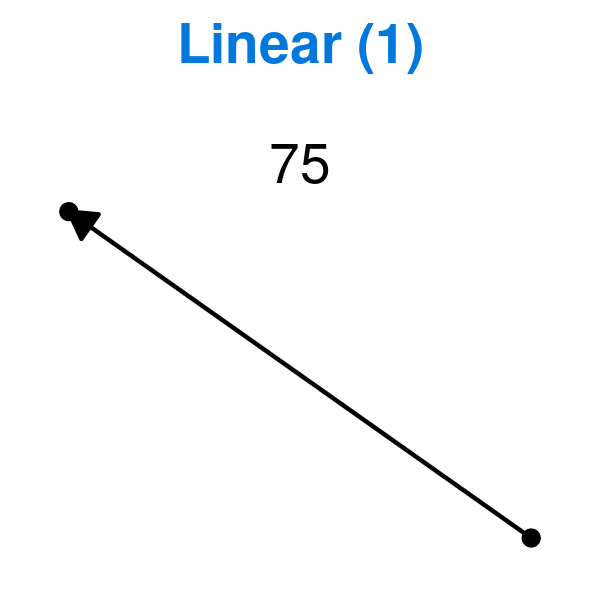
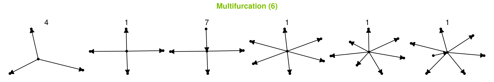
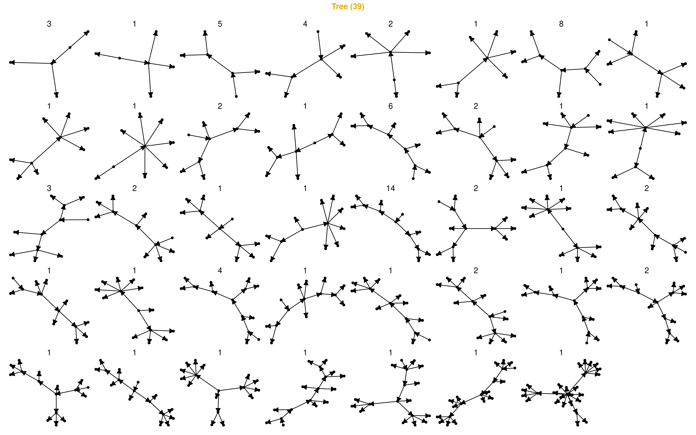
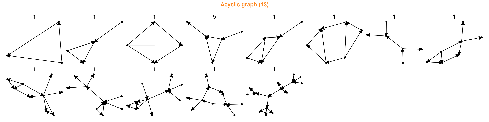
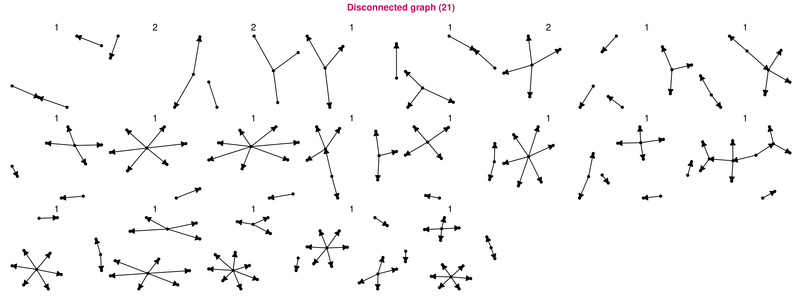

# Datasets containing trajectories

## [Dataset characterisation](04-dataset_characterisation)

### Topologies

 

<strong>Figure 1: The 100 distinct Linear datasets</strong>

------------------------------------------------------------------------

 

<strong>Figure 2: The 60 distinct Bifurcation datasets</strong>

------------------------------------------------------------------------

 

<strong>Figure 3: The 11 distinct Multifurcation datasets</strong>

------------------------------------------------------------------------

 

<strong>Figure 4: The 87 distinct Tree datasets</strong>

------------------------------------------------------------------------

 

<strong>Figure 5: The 18 distinct Acyclic graph datasets</strong>

------------------------------------------------------------------------

 

<strong>Figure 6: The 32 distinct Graph datasets</strong>

------------------------------------------------------------------------

 

<strong>Figure 7: The 25 distinct Disconnected graph datasets</strong>

------------------------------------------------------------------------
