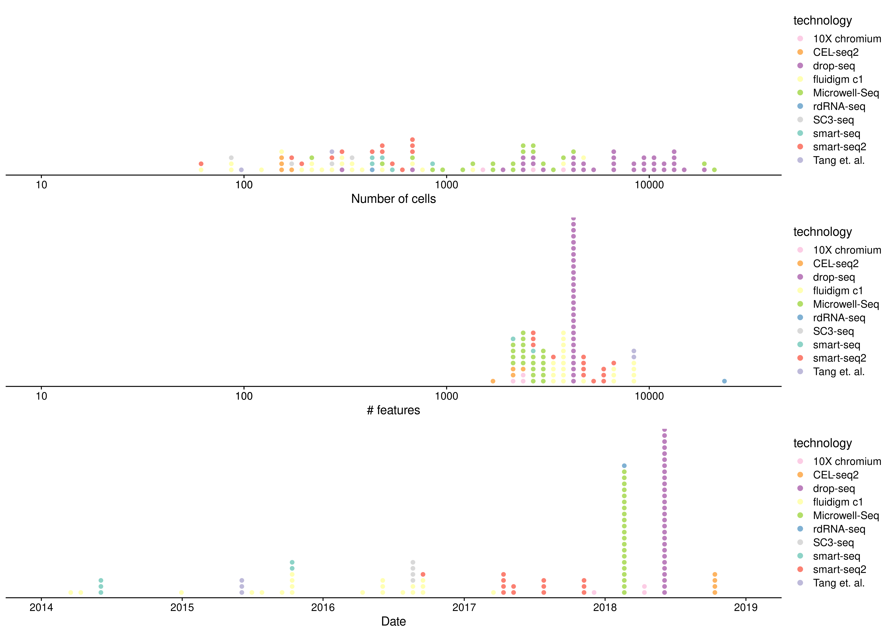
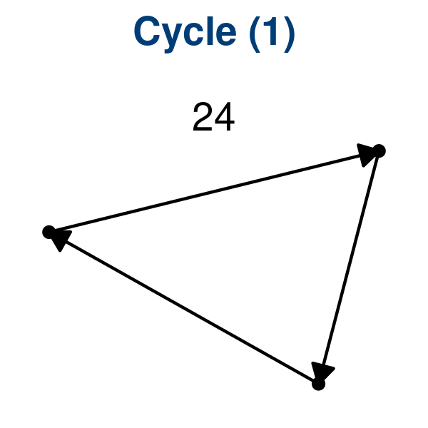
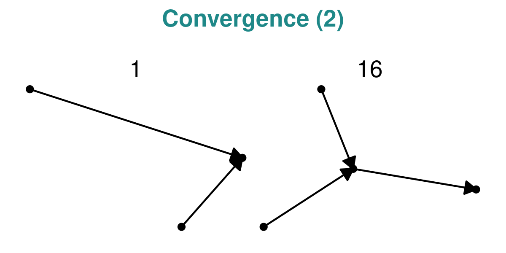
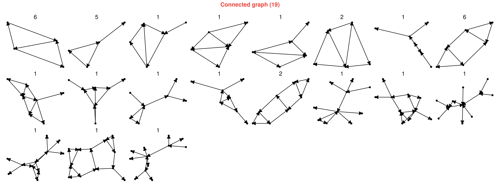

# Datasets containing trajectories

## [Real datasets](01-real)

<strong>Figure 1: Main characteristics of the real datasets</strong>

-----

<strong>Figure 2: Dimensions of the real datasets</strong>

-----

## [Synthetic datasets](02-synthetic)

## [Dataset characterisation](04-dataset_characterisation)

### Topologies

<strong>Figure 1: The 1 distinct Cycle topology, with a total of 24
datasets.</strong>

-----

<strong>Figure 2: The 1 distinct Linear topology, with a total of 75
datasets.</strong>

-----

<strong>Figure 3: The 2 distinct Convergence topologies, with a total of
17 datasets.</strong>

-----

<strong>Figure 4: The 3 distinct Bifurcation topologies, with a total of
40 datasets.</strong>

-----

<strong>Figure 5: The 6 distinct Multifurcation topologies, with a total
of 15 datasets.</strong>

-----

<strong>Figure 6: The 39 distinct Tree topologies, with a total of 86
datasets.</strong>

-----

<strong>Figure 7: The 13 distinct Acyclic graph topologies, with a total
of 17 datasets.</strong>

-----

<strong>Figure 8: The 19 distinct Graph topologies, with a total of 35
datasets.</strong>

-----

<strong>Figure 9: The 21 distinct Disconnected graph topologies, with a
total of 24 datasets.</strong>

-----
