# Metric conformity

Although most metrics described in the previous section make sense intuitively, this does not necessarily mean that these metrics are robust and will generate reasonable results when used for benchmarking. This is because different methods and datasets will all lead to a varied set of trajectory models:

-   Real datasets have all cells grouped onto milestones
-   Some methods place all cells in a region of delayed commitment, others never generate a region of delayed commitment
-   Some methods always return a linear trajectory, even if a bifurcation is present in the data
-   Some methods filter cells

A good metric, especially a good overall metric, should work in all these circumstances. To test this, we designed a set of rules to which a good metric should conform, and assessed empirically whether a metric conforms to these rules.

We generated a panel of toy datasets (using our [*dyntoy*](https://github.com/dynverse/dyntoy) package, <https://github.com/dynverse/dyntoy>) with all possible combinations of:

-   \# cells: 10, 50, 100, 200 and 500
-   \# features: 200
-   topologies: linear, bifurcation, multifurcating, tree, cycle, connected graph and disconnected graph
-   Whether cells are placed on the milestones (as in real data) or on the edges/regions of delayed commitment between the milestones (as in synthetic data)

We then perturbed the trajectories in these datasets in certain ways, and tested whether the scores follow an expected pattern. An overview of the conformity of every metric is first given in [**Table 1**](#table_conformity_overview). The individual rules and metric behaviour are discussed more into detail after that.

| name                                            | cordist | NMSErf | NMSElm | edgeflip | corfeatures | F1branches | F1milestones | hmean |
|:------------------------------------------------|:-------------------|:------------------|:------------------|:---------|:-----------------------|:----------------------|:------------------------|:------|
| New connecting edges                            | ✔                  | ✖                 | ✖                 | ✔        | ✖                      | ✔                     | ✔                       | ✔     |
| New leaf edges                                  | ✖                  | ✖                 | ✖                 | ✔        | ✖                      | ✔                     | ✔                       | ✔     |
| Cycle breaking                                  | ✔                  | ✖                 | ✖                 | ✔        | ✔                      | ✖                     | ✔                       | ✔     |
| Cells on milestones vs edges                    | ✔                  | ✔                 | ✔                 | ✔        | ✔                      | ✔                     | ✔                       | ✔     |
| Change of topology                              | ✔                  | ✖                 | ✖                 | ✔        | ✔                      | ✖                     | ✔                       | ✔     |
| Changing positions locally and/or globally      | ✔                  | ✔                 | ✔                 | ✖        | ✔                      | ✖                     | ✖                       | ✔     |
| Bifurcation merging and changing cell positions | ✔                  | ✔                 | ✔                 | ✖        | ✔                      | ✔                     | ✔                       | ✔     |
| Changing topology and cell position             | ✖                  | ✖                 | ✖                 | ✖        | ✔                      | ✖                     | ✖                       | ✔     |
| Bifurcation concatentation                      | ✔                  | ✖                 | ✔                 | ✔        | ✔                      | ✔                     | ✔                       | ✔     |
| Same score on identity                          | ✔                  | ✖                 | ✔                 | ✔        | ✖                      | ✔                     | ✔                       | ✔     |
| Cell filtering                                  | ✔                  | ✔                 | ✔                 | ✖        | ✔                      | ✔                     | ✔                       | ✔     |
| Linear joining                                  | ✔                  | ✖                 | ✖                 | ✔        | ✖                      | ✖                     | ✔                       | ✔     |
| Bifurcation merging                             | ✔                  | ✖                 | ✔                 | ✔        | ✔                      | ✔                     | ✔                       | ✔     |
| Cells into small subedges                       | ✖                  | ✖                 | ✖                 | ✔        | ✔                      | ✔                     | ✔                       | ✔     |
| Removing divergence regions                     | ✔                  | ✔                 | ✔                 | ✖        | ✔                      | ✖                     | ✔                       | ✔     |
| Local and global cell shuffling                 | ✔                  | ✖                 | ✖                 | ✖        | ✔                      | ✔                     | ✔                       | ✔     |
| Local cell shuffling                            | ✔                  | ✔                 | ✔                 | ✖        | ✔                      | ✖                     | ✖                       | ✔     |
| Edge shuffling                                  | ✔                  | ✔                 | ✔                 | ✖        | ✔                      | ✔                     | ✔                       | ✔     |
| Length shuffling                                | ✔                  | ✖                 | ✖                 | ✖        | ✖                      | ✖                     | ✖                       | ✔     |
| Linear splitting                                | ✔                  | ✔                 | ✖                 | ✔        | ✔                      | ✔                     | ✔                       | ✔     |
| Move cells to closest milestone                 | ✔                  | ✖                 | ✔                 | ✖        | ✔                      | ✖                     | ✔                       | ✔     |
| Move cells to start milestone                   | ✔                  | ✔                 | ✔                 | ✖        | ✔                      | ✖                     | ✔                       | ✔     |

**Table 1: Overview of whether a particular metric conforms to a particular rule**

### Same score on identity

The score should be approximately the same when comparing the trajectory to itself

A metric conforms to this rule if: 

Metrics which contain some stochasticity (random forest based metrics in particular), usually do not conform to this rule, even though their scores are still consistently high.

 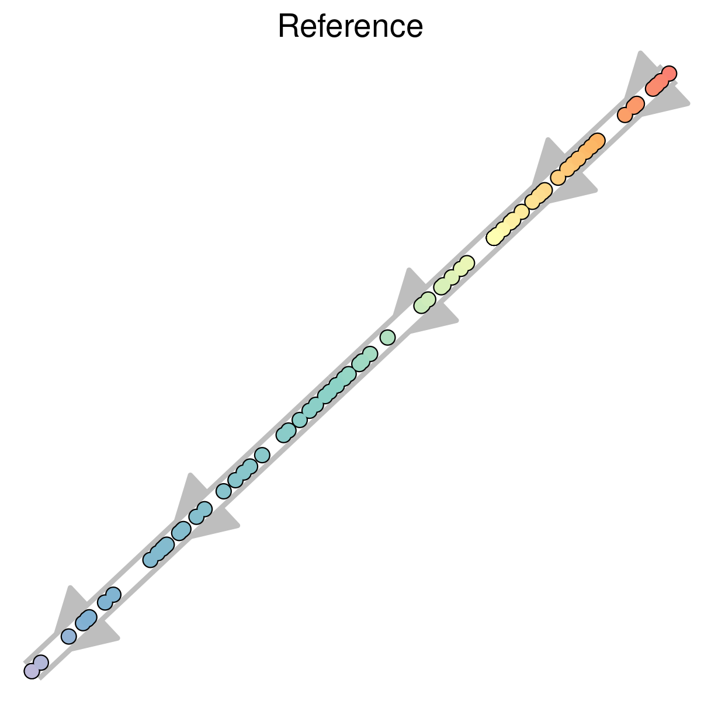

<strong>Figure 1: Example dataset(s) for this rule</strong>

------------------------------------------------------------------------

 

<strong>Figure 2: Example dataset(s) for this rule</strong>

------------------------------------------------------------------------

### Local cell shuffling

Shuffling the positions of cells within each edge should lower the score. This is equivalent to changing the cellular position locally.

A metric conforms to this rule if: 

Metrics which do not look at the cellular positioning, or group the cells within branches or milestones, do not conform to this rule.

 

<strong>Figure 3: Example dataset(s) for this rule</strong>

------------------------------------------------------------------------

 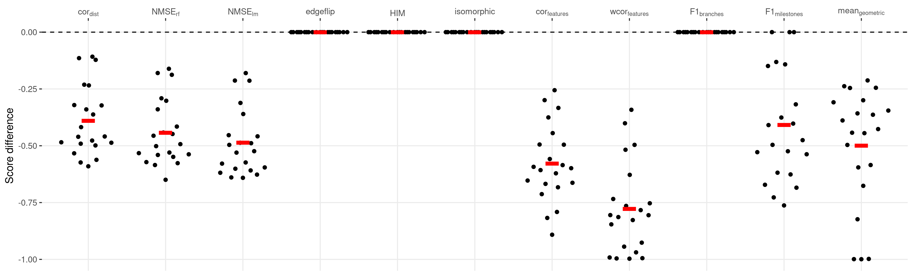

<strong>Figure 4: Example dataset(s) for this rule</strong>

------------------------------------------------------------------------

### Edge shuffling

Shuffling the edges in the milestone network should lower the score. This is equivalent to changing the cellular positions only globally.

A metric conforms to this rule if: )

Only metrics which only look at the topology do not conform to this rule.

 

<strong>Figure 5: Example dataset(s) for this rule</strong>

------------------------------------------------------------------------

 

<strong>Figure 6: Example dataset(s) for this rule</strong>

------------------------------------------------------------------------

### Local and global cell shuffling

Shuffling the positions of cells should lower the score. This is equivalent to changing the cellular position both locally and globally.

A metric conforms to this rule if: )

Most metrics that look at the position of each cell conform to this rule.

 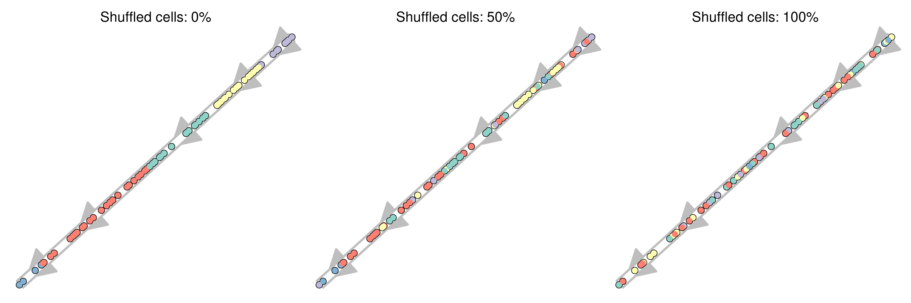

<strong>Figure 7: Example dataset(s) for this rule</strong>

------------------------------------------------------------------------

 

<strong>Figure 8: Example dataset(s) for this rule</strong>

------------------------------------------------------------------------

### Changing positions locally and/or globally

Changing the cellular position locally AND globally should lower the score more than any of the two individually.

A metric conforms to this rule if: 

Most metrics that look at the position of each cell conform to this rule.

 

<strong>Figure 9: Example dataset(s) for this rule</strong>

------------------------------------------------------------------------

 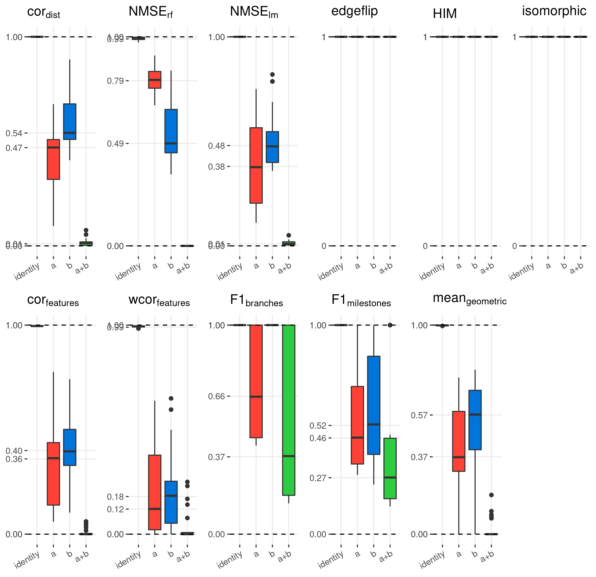

<strong>Figure 10: Example dataset(s) for this rule</strong>

------------------------------------------------------------------------

### Cell filtering

Removing cells from the trajectory should lower the score

A metric conforms to this rule if: )

Only metrics which look only at the topology do not conform to this rule.

 

<strong>Figure 11: Example dataset(s) for this rule</strong>

------------------------------------------------------------------------

 

<strong>Figure 12: Example dataset(s) for this rule</strong>

------------------------------------------------------------------------

### Removing divergence regions

Removing divergence regions should lower the score

A metric conforms to this rule if: 

Both  and  fail here because neither the topology nor the branche assignment changes.

 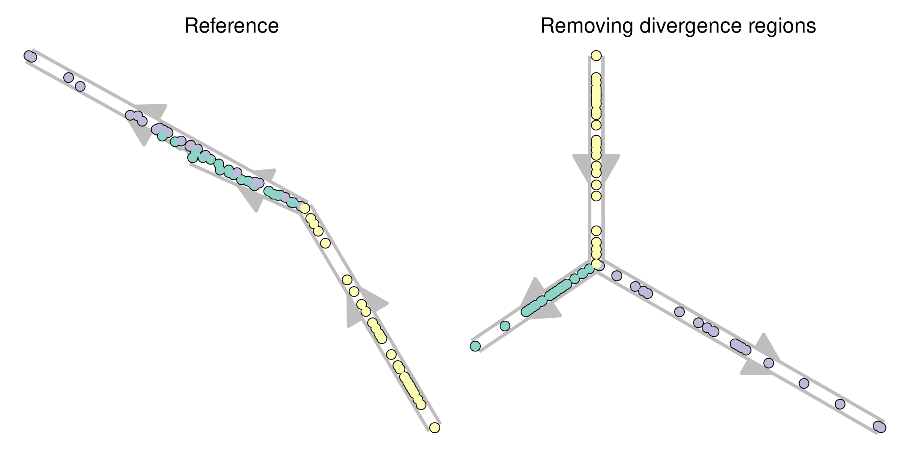

<strong>Figure 13: Example dataset(s) for this rule</strong>

------------------------------------------------------------------------

 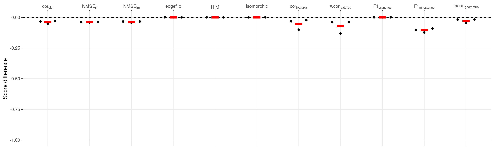

<strong>Figure 14: Example dataset(s) for this rule</strong>

------------------------------------------------------------------------

### Move cells to start milestone

Moving the cells closer to their start milestone should lower the score. Cells were moved closer to the start milestone by doing $^{}

A metric conforms to this rule if: )

Both  and  fail here because neither the topology nor the branche assignment changes.

 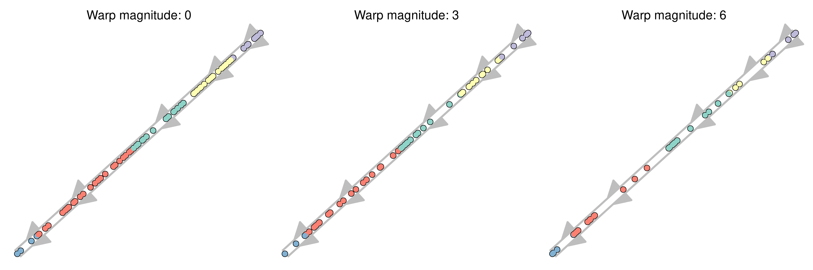

<strong>Figure 15: Example dataset(s) for this rule</strong>

------------------------------------------------------------------------

 

<strong>Figure 16: Example dataset(s) for this rule</strong>

------------------------------------------------------------------------

### Move cells to closest milestone

Moving the cells closer to their nearest milestone should lower the score

A metric conforms to this rule if: )

Both  and  fail here because neither the topology nor the branche assignment changes.

 

<strong>Figure 17: Example dataset(s) for this rule</strong>

------------------------------------------------------------------------

 

<strong>Figure 18: Example dataset(s) for this rule</strong>

------------------------------------------------------------------------

### Length shuffling

Shuffling the lengths of the edges of the milestone network should lower the score.

A metric conforms to this rule if: 

Only the correlation scores is consequently decreased when the lengths of the edges change.

 

<strong>Figure 19: Example dataset(s) for this rule</strong>

------------------------------------------------------------------------

 

<strong>Figure 20: Example dataset(s) for this rule</strong>

------------------------------------------------------------------------

### Cells into small subedges

Moving some cells into short subedges should lower the score

A metric conforms to this rule if: )

This rule is primarily captured by the scores looking at the topology and clustering quality.

 

<strong>Figure 21: Example dataset(s) for this rule</strong>

------------------------------------------------------------------------

 

<strong>Figure 22: Example dataset(s) for this rule</strong>

------------------------------------------------------------------------

### New leaf edges

Adding new edges only connected to one existing milestone should lower the score

A metric conforms to this rule if: )

As the positions of the cells are not affected, only metrics which investigate the clustering quality and topology conform to this rule.

 

<strong>Figure 23: Example dataset(s) for this rule</strong>

------------------------------------------------------------------------

 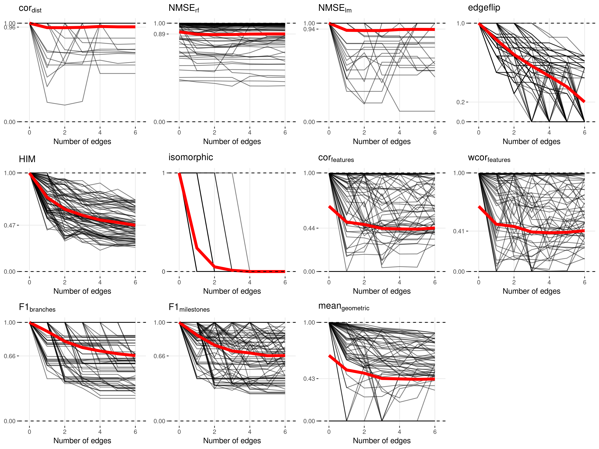

<strong>Figure 24: Example dataset(s) for this rule</strong>

------------------------------------------------------------------------

### New connecting edges

Adding new edges between existing milestones should lower the score

A metric conforms to this rule if: )

Even though the positions of the cells change, the  still conforms to this rule because new edges can create shortcuts which will affect the geodesic distances between cells. Apart from this, metrics which investigate the clustering quality and topology also conform to this rule.

 

<strong>Figure 25: Example dataset(s) for this rule</strong>

------------------------------------------------------------------------

 

<strong>Figure 26: Example dataset(s) for this rule</strong>

------------------------------------------------------------------------

### Changing topology and cell position

Changing both the topology and the cell positions should lower the score more than any of the two individually

A metric conforms to this rule if: 

Most metrics have problems with this rule as they focus on either the cellular positions or the topology individually. Only the {label\_metric('featureimp\_cor', 'latex')} and the {label\_metric('harm\_mean', 'latex')} conform to this rule.

 

<strong>Figure 27: Example dataset(s) for this rule</strong>

------------------------------------------------------------------------

 

<strong>Figure 28: Example dataset(s) for this rule</strong>

------------------------------------------------------------------------

### Bifurcation merging

Merging the two branches after a bifurcation point should lower the score

A metric conforms to this rule if: 

This changes both the cellular ordering and the topology so most metrics are affected.

 

<strong>Figure 29: Example dataset(s) for this rule</strong>

------------------------------------------------------------------------

 

<strong>Figure 30: Example dataset(s) for this rule</strong>

------------------------------------------------------------------------

### Bifurcation merging and changing cell positions

Merging the two branches of a bifurcation and changing the cells positions should lower the score more than any of the two individually

A metric conforms to this rule if: 

Only metrics which look uniquely at the topology do not conform to this rule.

 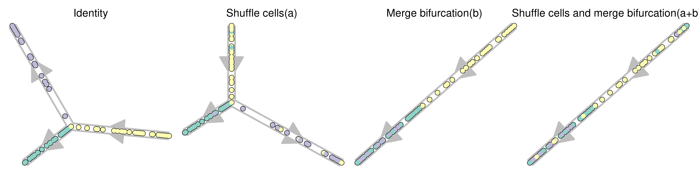

<strong>Figure 31: Example dataset(s) for this rule</strong>

------------------------------------------------------------------------

 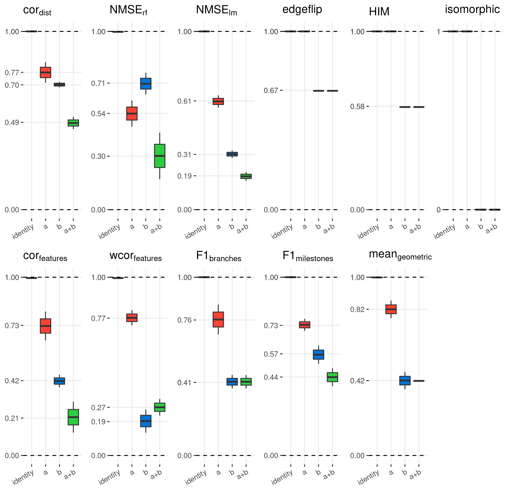

<strong>Figure 32: Example dataset(s) for this rule</strong>

------------------------------------------------------------------------

### Bifurcation concatentation

Concatenating one branch of a bifurcation to the other bifurcation branch should lower the score

A metric conforms to this rule if: 

This changes both the cellular ordering and the topology so most metrics conform to this rule.

 

<strong>Figure 33: Example dataset(s) for this rule</strong>

------------------------------------------------------------------------

 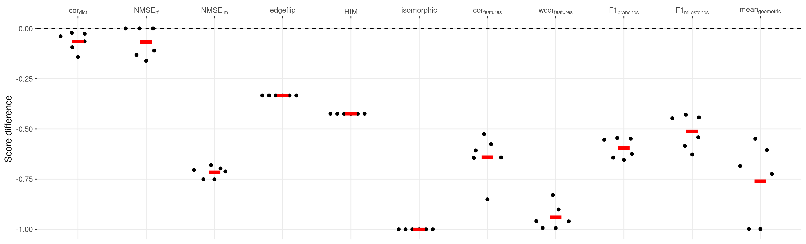

<strong>Figure 34: Example dataset(s) for this rule</strong>

------------------------------------------------------------------------

### Cycle breaking

Breaking a cyclic trajectory should lower the score

A metric conforms to this rule if: 

Because the actual positions of the cells nor the branch assignment change, both the MSE metrics and the  do not conform to this rule.

 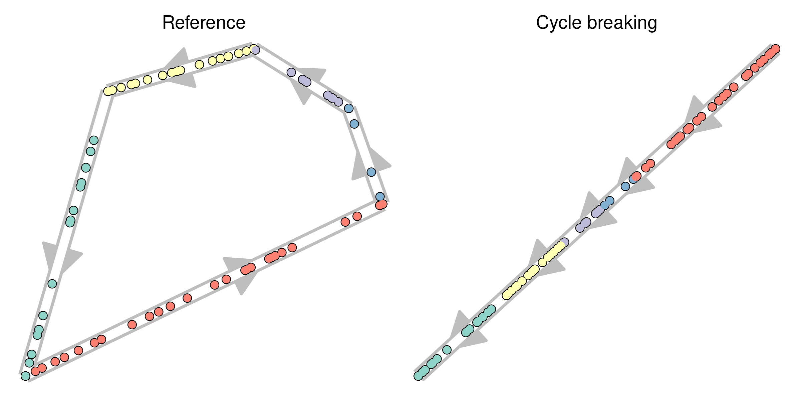

<strong>Figure 35: Example dataset(s) for this rule</strong>

------------------------------------------------------------------------

 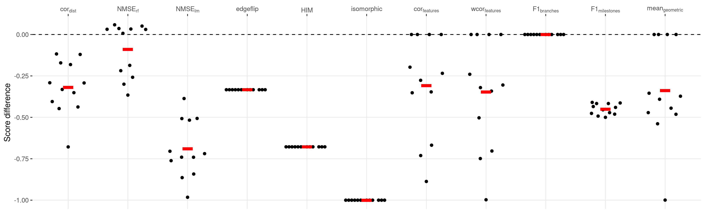

<strong>Figure 36: Example dataset(s) for this rule</strong>

------------------------------------------------------------------------

### Linear joining

Joining the two ends of a linear trajectory should lower the score

A metric conforms to this rule if: 

Because the positions of the cells can be perfectly predicted, the MSE metrics do not conform to this rule. Furthermore, because the branch assignment change stays the same, the  also does not conform to this rule.

 

<strong>Figure 37: Example dataset(s) for this rule</strong>

------------------------------------------------------------------------

 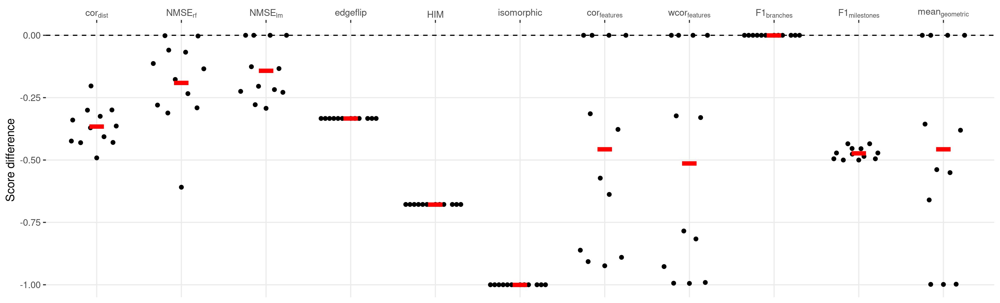

<strong>Figure 38: Example dataset(s) for this rule</strong>

------------------------------------------------------------------------

### Linear splitting

Splitting a linear trajectory into a bifurcation should lower the score

A metric conforms to this rule if: 

Only the MSE metrics do not conform to this rule as the positions of the cells can be perfectly predicted in the gold standard given the prediction.

 

<strong>Figure 39: Example dataset(s) for this rule</strong>

------------------------------------------------------------------------

 

<strong>Figure 40: Example dataset(s) for this rule</strong>

------------------------------------------------------------------------

### Change of topology

Changing the topology of the trajectory should lower the score

A metric conforms to this rule if: 

Because the positions of the cells can be perfectly predicted, the MSE metrics do not conform to this rule. Furthermore, because the branch assignment change stays the same, the  also does not conform to this rule.

 

<strong>Figure 41: Example dataset(s) for this rule</strong>

------------------------------------------------------------------------

 

<strong>Figure 42: Example dataset(s) for this rule</strong>

------------------------------------------------------------------------

### Cells on milestones vs edges

A score should behave similarly both when cells are located on the milestones (as is the case in real datasets) or on the edges between milestones (as is the case in synthetic datasets).

A metric conforms to this rule if: %20%3E%200.9)

All scores conform to this rule.

 

<strong>Figure 43: Example dataset(s) for this rule</strong>

------------------------------------------------------------------------

 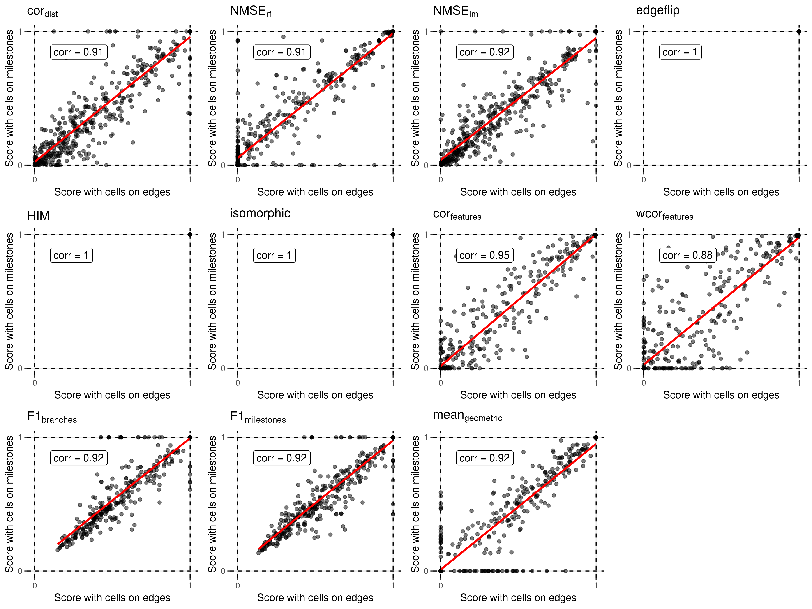

<strong>Figure 44: Example dataset(s) for this rule</strong>

------------------------------------------------------------------------
