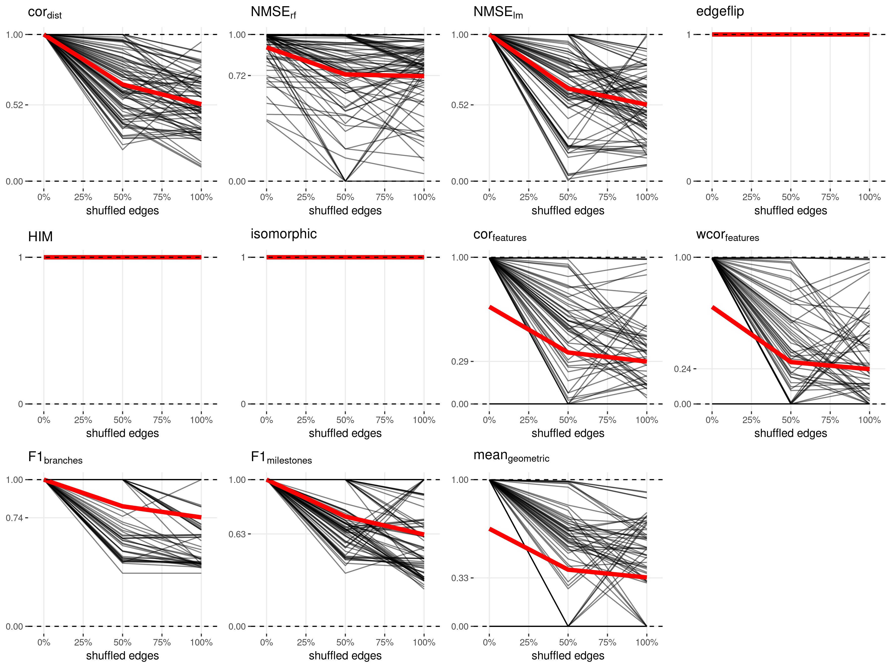
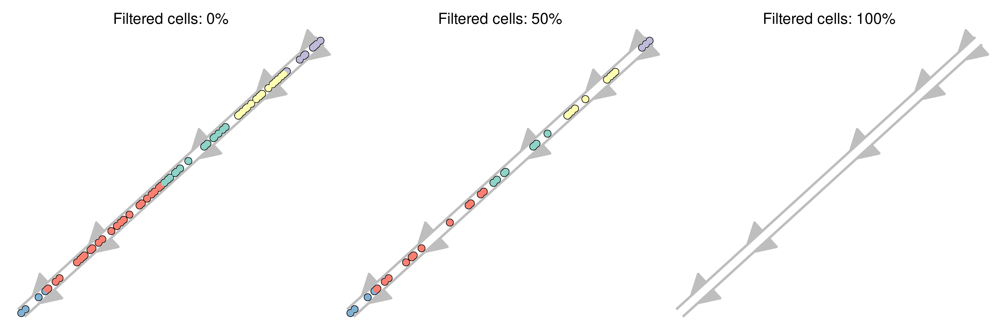
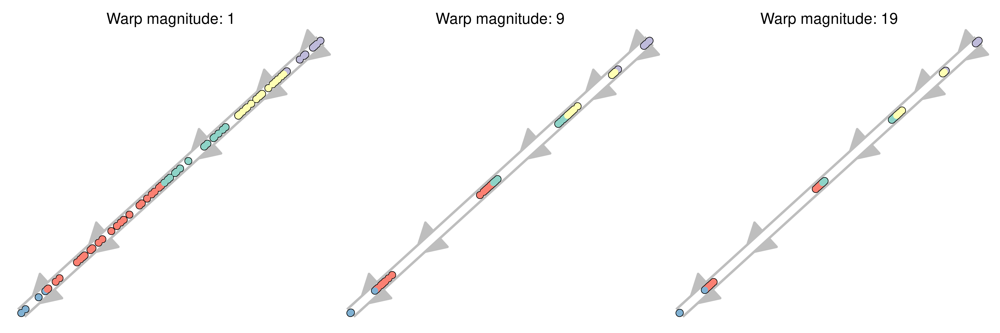
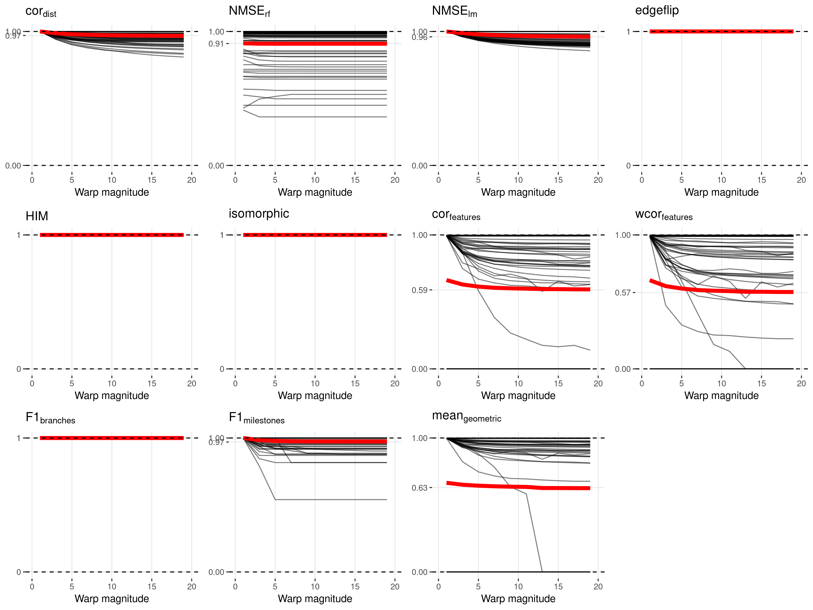
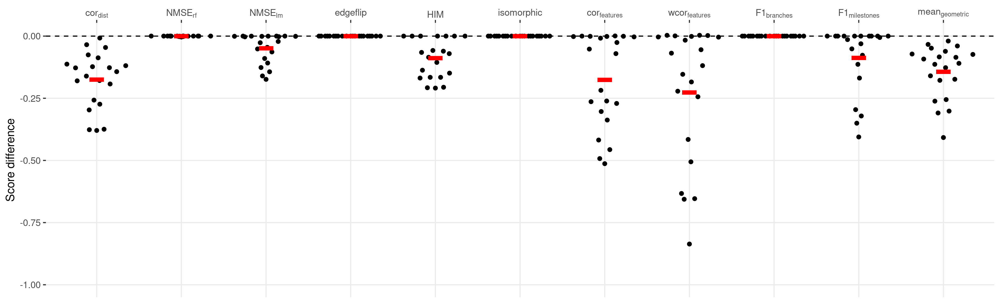
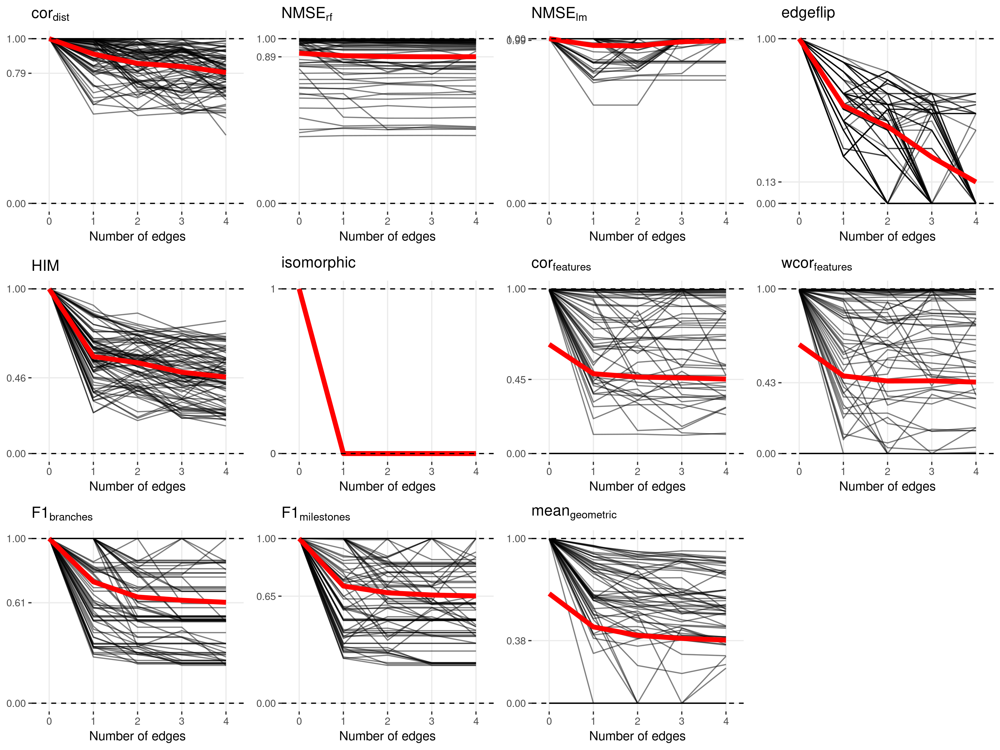
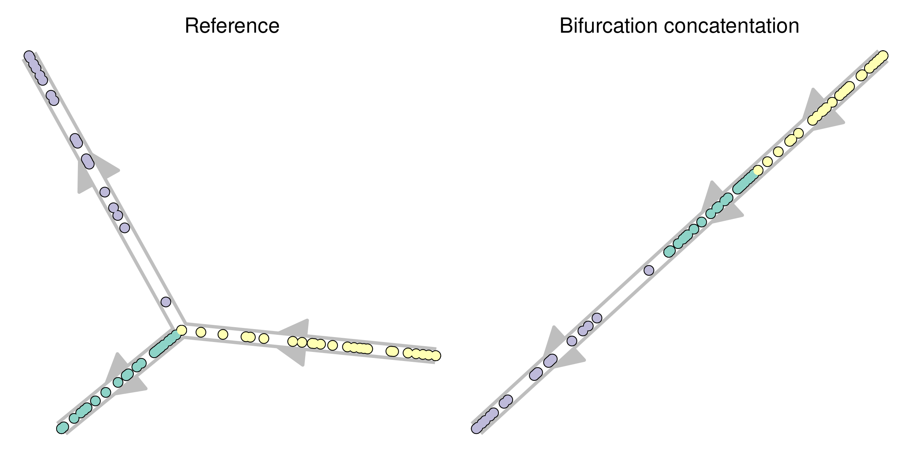
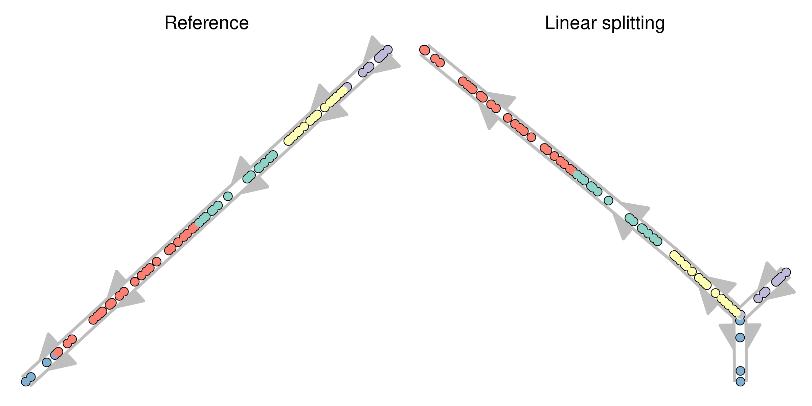
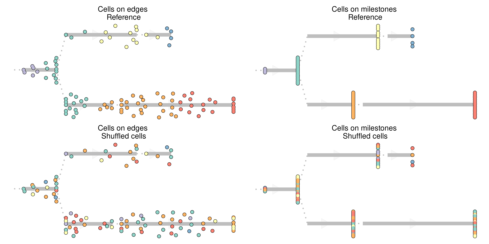

# Metric conformity

Although most metrics described in the previous section make sense
intuitively, this does not necessarily mean that these metrics are
robust and will generate reasonable results when used for benchmarking.
This is because different methods and datasets will all lead to a varied
set of trajectory models:

  - Real datasets have all cells grouped onto milestones
  - Some methods place all cells in a region of delayed commitment,
    others never generate a region of delayed commitment
  - Some methods always return a linear trajectory, even if a
    bifurcation is present in the data
  - Some methods filter cells

A good metric, especially a good overall metric, should work in all
these circumstances. To test this, we designed a set of rules to which a
good metric should conform, and assessed empirically whether a metric
conforms to these rules.

We generated a panel of toy datasets (using our
[*dyntoy*](https://github.com/dynverse/dyntoy) package,
<https://github.com/dynverse/dyntoy>) with all possible combinations of:

  - \# cells: 10, 20, 50, 100, 200 and 500
  - \# features: 200
  - topologies: linear, bifurcation, multifurcating, tree, cycle,
    connected graph and disconnected graph
  - Whether cells are placed on the milestones (as in real data) or on
    the edges/regions of delayed commitment between the milestones (as
    in synthetic data)

We then perturbed the trajectories in these datasets in certain ways,
and tested whether the scores follow an expected pattern. An overview of
the conformity of every metric is first given in [**Table
S1**](#table_conformity_overview). The individual rules and metric
behaviour are discussed more into detail after
that.

| name                                            | cordist | NMSErf | NMSElm | edgeflip | HIM | Isomorphic | corfeatures | wcorfeatures | F1branches | F1milestones | meangeometric |
| :---------------------------------------------- | :----------------- | :---------------- | :---------------- | :------- | :-- | :--------- | :--------------------- | :---------------------- | :-------------------- | :---------------------- | :----------------------- |
| New connecting edges                            | ✔                  | ✔                 | ✖                 | ✔        | ✔   | ✔          | ✔                      | ✔                       | ✔                     | ✔                       | ✔                        |
| New leaf edges                                  | ✔                  | ✔                 | ✖                 | ✔        | ✔   | ✔          | ✖                      | ✖                       | ✔                     | ✔                       | ✔                        |
| Cycle breaking                                  | ✔                  | ✖                 | ✔                 | ✔        | ✔   | ✔          | ✔                      | ✔                       | ✖                     | ✔                       | ✔                        |
| Cells on milestones vs edges                    | ✔                  | ✔                 | ✔                 | ✔        | ✔   | ✔          | ✔                      | ✔                       | ✔                     | ✔                       | ✔                        |
| Change of topology                              | ✔                  | ✖                 | ✖                 | ✔        | ✔   | ✔          | ✔                      | ✔                       | ✖                     | ✔                       | ✔                        |
| Changing positions locally and/or globally      | ✔                  | ✔                 | ✔                 | ✖        | ✖   | ✖          | ✔                      | ✔                       | ✖                     | ✖                       | ✔                        |
| Bifurcation merging and changing cell positions | ✔                  | ✔                 | ✔                 | ✖        | ✖   | ✖          | ✔                      | ✔                       | ✔                     | ✔                       | ✔                        |
| Changing topology and cell position             | ✖                  | ✖                 | ✖                 | ✖        | ✖   | ✖          | ✖                      | ✖                       | ✖                     | ✖                       | ✔                        |
| Bifurcation concatentation                      | ✔                  | ✖                 | ✔                 | ✔        | ✔   | ✔          | ✔                      | ✔                       | ✔                     | ✔                       | ✔                        |
| Same score on identity                          | ✔                  | ✖                 | ✔                 | ✔        | ✔   | ✔          | ✔                      | ✖                       | ✔                     | ✔                       | ✔                        |
| Cell filtering                                  | ✔                  | ✔                 | ✔                 | ✖        | ✖   | ✖          | ✔                      | ✔                       | ✔                     | ✔                       | ✔                        |
| Linear joining                                  | ✔                  | ✔                 | ✔                 | ✔        | ✔   | ✔          | ✔                      | ✔                       | ✖                     | ✔                       | ✔                        |
| Bifurcation merging                             | ✔                  | ✖                 | ✔                 | ✔        | ✔   | ✔          | ✔                      | ✔                       | ✔                     | ✔                       | ✔                        |
| Cells into small subedges                       | ✖                  | ✔                 | ✖                 | ✔        | ✔   | ✔          | ✔                      | ✖                       | ✔                     | ✔                       | ✔                        |
| Removing divergence regions                     | ✔                  | ✔                 | ✔                 | ✖        | ✖   | ✖          | ✔                      | ✔                       | ✖                     | ✔                       | ✔                        |
| Local and global cell shuffling                 | ✔                  | ✔                 | ✔                 | ✖        | ✖   | ✖          | ✔                      | ✔                       | ✔                     | ✔                       | ✔                        |
| Local cell shuffling                            | ✔                  | ✔                 | ✔                 | ✖        | ✖   | ✖          | ✔                      | ✔                       | ✖                     | ✔                       | ✔                        |
| Edge shuffling                                  | ✔                  | ✔                 | ✔                 | ✖        | ✖   | ✖          | ✔                      | ✔                       | ✔                     | ✔                       | ✔                        |
| Length shuffling                                | ✔                  | ✖                 | ✔                 | ✖        | ✔   | ✖          | ✖                      | ✖                       | ✖                     | ✔                       | ✔                        |
| Linear splitting                                | ✔                  | ✔                 | ✔                 | ✔        | ✔   | ✔          | ✔                      | ✔                       | ✔                     | ✔                       | ✔                        |
| Move cells to closest milestone                 | ✔                  | ✔                 | ✔                 | ✖        | ✖   | ✖          | ✔                      | ✔                       | ✖                     | ✔                       | ✔                        |
| Move cells to start milestone                   | ✔                  | ✔                 | ✔                 | ✖        | ✖   | ✖          | ✔                      | ✔                       | ✖                     | ✔                       | ✔                        |

**[**Table S1**](#table_conformity_overview): Overview of whether a
particular metric conforms to a particular rule**

\clearpage

### Rule 1: Same score on identity

\\begin{center}

\\end{center}

Description: The score should be approximately the same when comparing
the trajectory to itself.

A metric conforms to this rule if:
.

Conclusion(s): Metrics which contain some stochasticity (random forest
based metrics in particular), usually do not conform to this rule, even
though their scores are still consistently
high.

|  |  |  |  |  |  |  |  |  |  |  |
| :------------------------------------------------------ | :----------------------------------------------------- | :----------------------------------------------------- | :------------------------------------------------- | :-------------------------------------------- | :--------------------------------------------------- | :---------------------------------------------------------- | :----------------------------------------------------------- | :--------------------------------------------------------- | :----------------------------------------------------------- | :------------------------------------------------------------ |
| TRUE                                                    | FALSE                                                  | TRUE                                                   | TRUE                                               | TRUE                                          | TRUE                                                 | TRUE                                                        | FALSE                                                        | TRUE                                                       | TRUE                                                         | TRUE                                                          |

**[**Table S2**](#table_equal_identity_rule_table): Which metrics
conform to rule 1.**

<strong>[**Figure S1**](#fig_equal_identity_plot_datasets): Example
trajectory that was used to assess this rule.</strong>

-----

<strong>[**Figure S2**](#fig_equal_identity_plot_scores): Score values
of the different metrics across 42 datasets.</strong>

-----

\clearpage

### Rule 2: Local cell shuffling

\\begin{center}

\\end{center}

Description: Shuffling the positions of cells within each edge should
lower the score. This is equivalent to changing the cellular position
locally.

A metric conforms to this rule if:
.

Conclusion(s): Metrics which do not look at the cellular positioning, or
group the cells within branches or milestones, do not conform to this
rule.

|  |  |  |  |  |  |  |  |  |  |  |
| :------------------------------------------------------ | :----------------------------------------------------- | :----------------------------------------------------- | :------------------------------------------------- | :-------------------------------------------- | :--------------------------------------------------- | :---------------------------------------------------------- | :----------------------------------------------------------- | :--------------------------------------------------------- | :----------------------------------------------------------- | :------------------------------------------------------------ |
| TRUE                                                    | TRUE                                                   | TRUE                                                   | FALSE                                              | FALSE                                         | FALSE                                                | TRUE                                                        | TRUE                                                         | FALSE                                                      | TRUE                                                         | TRUE                                                          |

**[**Table S3**](#table_shuffle_cells_edgewise_rule_table): Which
metrics conform to rule 2.**

<strong>[**Figure S3**](#fig_shuffle_cells_edgewise_plot_datasets):
Example dataset before and after perturbation.</strong>

-----

<strong>[**Figure S4**](#fig_shuffle_cells_edgewise_plot_scores):
Differences in scores of 231 datasets before and after perturbation. Red
bar gives the mean.</strong>

-----

\clearpage

### Rule 3: Edge shuffling

\\begin{center}

\\end{center}

Description: Shuffling the edges in the milestone network should lower
the score. This is equivalent to changing the cellular positions only
globally.

A metric conforms to this rule if:
).

Conclusion(s): Metrics which only look at the topology do not conform to
this
rule.

|  |  |  |  |  |  |  |  |  |  |  |
| :------------------------------------------------------ | :----------------------------------------------------- | :----------------------------------------------------- | :------------------------------------------------- | :-------------------------------------------- | :--------------------------------------------------- | :---------------------------------------------------------- | :----------------------------------------------------------- | :--------------------------------------------------------- | :----------------------------------------------------------- | :------------------------------------------------------------ |
| TRUE                                                    | TRUE                                                   | TRUE                                                   | FALSE                                              | FALSE                                         | FALSE                                                | TRUE                                                        | TRUE                                                         | TRUE                                                       | TRUE                                                         | TRUE                                                          |

**[**Table S4**](#table_shuffle_edges_rule_table): Which metrics conform
to rule 3.**

<strong>[**Figure S5**](#fig_shuffle_edges_plot_datasets): Lowly (left),
moderatly (middle) and highly (right) perturbed example
dataset.</strong>

-----

<strong>[**Figure S6**](#fig_shuffle_edges_plot_scores): Score values at
different extents of the perturbation across 84 datasets. Red line
denotes the mean values.</strong>

-----

\clearpage

### Rule 4: Local and global cell shuffling

\\begin{center}

\\end{center}

Description: Shuffling the positions of cells should lower the score.
This is equivalent to changing the cellular position both locally and
globally.

A metric conforms to this rule if:
).

Conclusion(s): Most metrics that look at the position of each cell
conform to this
rule.

|  |  |  |  |  |  |  |  |  |  |  |
| :------------------------------------------------------ | :----------------------------------------------------- | :----------------------------------------------------- | :------------------------------------------------- | :-------------------------------------------- | :--------------------------------------------------- | :---------------------------------------------------------- | :----------------------------------------------------------- | :--------------------------------------------------------- | :----------------------------------------------------------- | :------------------------------------------------------------ |
| TRUE                                                    | TRUE                                                   | TRUE                                                   | FALSE                                              | FALSE                                         | FALSE                                                | TRUE                                                        | TRUE                                                         | TRUE                                                       | TRUE                                                         | TRUE                                                          |

**[**Table S5**](#table_shuffle_cells_rule_table): Which metrics conform
to rule 4.**

<strong>[**Figure S7**](#fig_shuffle_cells_plot_datasets): Lowly (left),
moderatly (middle) and highly (right) perturbed example
dataset.</strong>

-----

<strong>[**Figure S8**](#fig_shuffle_cells_plot_scores): Score values at
different extents of the perturbation across 84 datasets. Red line
denotes the mean values.</strong>

-----

\clearpage

### Rule 5: Changing positions locally and/or globally

\\begin{center}

\\end{center}

Description: Changing the cellular position locally AND globally should
lower the score more than any of the two individually.

A metric conforms to this rule if:
.

Conclusion(s): Because the topology remains the same, the topology
scores do not conform to this rule. Also the clustering based scores
have some difficulties with this
rule.

|  |  |  |  |  |  |  |  |  |  |  |
| :------------------------------------------------------ | :----------------------------------------------------- | :----------------------------------------------------- | :------------------------------------------------- | :-------------------------------------------- | :--------------------------------------------------- | :---------------------------------------------------------- | :----------------------------------------------------------- | :--------------------------------------------------------- | :----------------------------------------------------------- | :------------------------------------------------------------ |
| TRUE                                                    | TRUE                                                   | TRUE                                                   | FALSE                                              | FALSE                                         | FALSE                                                | TRUE                                                        | TRUE                                                         | FALSE                                                      | FALSE                                                        | TRUE                                                          |

**[**Table
S6**](#table_combined_local_global_position_change_rule_table): Which
metrics conform to rule 5.**

<strong>[**Figure
S9**](#fig_combined_local_global_position_change_plot_datasets): Example
dataset before perturbation (identity), with any of the two
perturbations (a and b) and both perturbations combined (a+b).</strong>

-----

<strong>[**Figure
S10**](#fig_combined_local_global_position_change_plot_scores): Score
values before perturbation (identity), with any of the two perturbations
(a and b) and both perturbations combined (a+b). The upper whisker of
the boxplot extends from the hinge (75% percentile) to the largest
value, no further than 1.5× the IQR from the hinge. The lower whisker
extends from the hinge (25% percentile) to the smallest value, at most
1.5× the IQR of the hinge. We used 84 different datasets.</strong>

-----

\clearpage

### Rule 6: Cell filtering

\\begin{center}

\\end{center}

Description: Removing cells from the trajectory should lower the score.

A metric conforms to this rule if:
).

Conclusion(s): Metrics which look at the topology do not conform to this
rule.

|  |  |  |  |  |  |  |  |  |  |  |
| :------------------------------------------------------ | :----------------------------------------------------- | :----------------------------------------------------- | :------------------------------------------------- | :-------------------------------------------- | :--------------------------------------------------- | :---------------------------------------------------------- | :----------------------------------------------------------- | :--------------------------------------------------------- | :----------------------------------------------------------- | :------------------------------------------------------------ |
| TRUE                                                    | TRUE                                                   | TRUE                                                   | FALSE                                              | FALSE                                         | FALSE                                                | TRUE                                                        | TRUE                                                         | TRUE                                                       | TRUE                                                         | TRUE                                                          |

**[**Table S7**](#table_filter_cells_rule_table): Which metrics conform
to rule 6.**

<strong>[**Figure S11**](#fig_filter_cells_plot_datasets): Lowly (left),
moderatly (middle) and highly (right) perturbed example
dataset.</strong>

-----

<strong>[**Figure S12**](#fig_filter_cells_plot_scores): Score values at
different extents of the perturbation across 84 datasets. Red line
denotes the mean values.</strong>

-----

\clearpage

### Rule 7: Removing divergence regions

\\begin{center}

\\end{center}

Description: Removing divergence regions should lower the score.

A metric conforms to this rule if:
.

Conclusion(s): Both

and 
fail here because neither the topology nor the branch assignment
changes. Moreover, the decreases in score are relatively minor for all
metrics, given that the impact of the positions of the cells is only
minimal.

|  |  |  |  |  |  |  |  |  |  |  |
| :------------------------------------------------------ | :----------------------------------------------------- | :----------------------------------------------------- | :------------------------------------------------- | :-------------------------------------------- | :--------------------------------------------------- | :---------------------------------------------------------- | :----------------------------------------------------------- | :--------------------------------------------------------- | :----------------------------------------------------------- | :------------------------------------------------------------ |
| TRUE                                                    | TRUE                                                   | TRUE                                                   | FALSE                                              | FALSE                                         | FALSE                                                | TRUE                                                        | TRUE                                                         | FALSE                                                      | TRUE                                                         | TRUE                                                          |

**[**Table S8**](#table_remove_divergence_regions_rule_table): Which
metrics conform to rule 7.**

<strong>[**Figure S13**](#fig_remove_divergence_regions_plot_datasets):
Example dataset before and after perturbation.</strong>

-----

<strong>[**Figure S14**](#fig_remove_divergence_regions_plot_scores):
Differences in scores of 33 datasets before and after perturbation. Red
bar gives the mean.</strong>

-----

\clearpage

### Rule 8: Move cells to start milestone

\\begin{center}

\\end{center}

Description: Moving the cells closer to their start milestone should
lower the score. Cells were moved closer to the start milestone using
.

A metric conforms to this rule if:
).

Conclusion(s): Both

and topology scores fail here because neither the topology nor the
branch assignment changes. The score decreases only slightly for all the
other metrics, given that only the relative distances change between
cells, but not their actual
ordering.

|  |  |  |  |  |  |  |  |  |  |  |
| :------------------------------------------------------ | :----------------------------------------------------- | :----------------------------------------------------- | :------------------------------------------------- | :-------------------------------------------- | :--------------------------------------------------- | :---------------------------------------------------------- | :----------------------------------------------------------- | :--------------------------------------------------------- | :----------------------------------------------------------- | :------------------------------------------------------------ |
| TRUE                                                    | TRUE                                                   | TRUE                                                   | FALSE                                              | FALSE                                         | FALSE                                                | TRUE                                                        | TRUE                                                         | FALSE                                                      | TRUE                                                         | TRUE                                                          |

**[**Table S9**](#table_time_warping_start_rule_table): Which metrics
conform to rule 8.**

<strong>[**Figure S15**](#fig_time_warping_start_plot_datasets): Lowly
(left), moderatly (middle) and highly (right) perturbed example
dataset.</strong>

-----

<strong>[**Figure S16**](#fig_time_warping_start_plot_scores): Score
values at different extents of the perturbation across 84 datasets. Red
line denotes the mean values.</strong>

-----

\clearpage

### Rule 9: Move cells to closest milestone

\\begin{center}

\\end{center}

Description: Moving the cells closer to their nearest milestone should
lower the score.

A metric conforms to this rule if:
).

Conclusion(s): Both

and topology scores fail here because neither the topology nor the
branch assignment changes. The score decreases only slightly for all the
other metrics, given that only the relative distances change between
cells, but not their actual
ordering.

|  |  |  |  |  |  |  |  |  |  |  |
| :------------------------------------------------------ | :----------------------------------------------------- | :----------------------------------------------------- | :------------------------------------------------- | :-------------------------------------------- | :--------------------------------------------------- | :---------------------------------------------------------- | :----------------------------------------------------------- | :--------------------------------------------------------- | :----------------------------------------------------------- | :------------------------------------------------------------ |
| TRUE                                                    | TRUE                                                   | TRUE                                                   | FALSE                                              | FALSE                                         | FALSE                                                | TRUE                                                        | TRUE                                                         | FALSE                                                      | TRUE                                                         | TRUE                                                          |

**[**Table S10**](#table_time_warping_parabole_rule_table): Which
metrics conform to rule 9.**

<strong>[**Figure S17**](#fig_time_warping_parabole_plot_datasets):
Lowly (left), moderatly (middle) and highly (right) perturbed example
dataset.</strong>

-----

<strong>[**Figure S18**](#fig_time_warping_parabole_plot_scores): Score
values at different extents of the perturbation across 84 datasets. Red
line denotes the mean values.</strong>

-----

\clearpage

### Rule 10: Length shuffling

\\begin{center}

\\end{center}

Description: Shuffling the lengths of the edges of the milestone network
should lower the score.

A metric conforms to this rule if:
.

Conclusion(s): Only the correlation between geodesic distances is
consistently decreases when the lengths of the edges
change.

|  |  |  |  |  |  |  |  |  |  |  |
| :------------------------------------------------------ | :----------------------------------------------------- | :----------------------------------------------------- | :------------------------------------------------- | :-------------------------------------------- | :--------------------------------------------------- | :---------------------------------------------------------- | :----------------------------------------------------------- | :--------------------------------------------------------- | :----------------------------------------------------------- | :------------------------------------------------------------ |
| TRUE                                                    | FALSE                                                  | TRUE                                                   | FALSE                                              | TRUE                                          | FALSE                                                | FALSE                                                       | FALSE                                                        | FALSE                                                      | TRUE                                                         | TRUE                                                          |

**[**Table S11**](#table_shuffle_lengths_rule_table): Which metrics
conform to rule 10.**

<strong>[**Figure S19**](#fig_shuffle_lengths_plot_datasets): Example
dataset before and after perturbation.</strong>

-----

<strong>[**Figure S20**](#fig_shuffle_lengths_plot_scores): Differences
in scores of 231 datasets before and after perturbation. Red bar gives
the mean.</strong>

-----

\clearpage

### Rule 11: Cells into small subedges

\\begin{center}

\\end{center}

Description: Moving some cells into short subedges should lower the
score.

A metric conforms to this rule if:
).

Conclusion(s): This rule is primarily captured by the scores looking at
the topology and clustering
quality.

|  |  |  |  |  |  |  |  |  |  |  |
| :------------------------------------------------------ | :----------------------------------------------------- | :----------------------------------------------------- | :------------------------------------------------- | :-------------------------------------------- | :--------------------------------------------------- | :---------------------------------------------------------- | :----------------------------------------------------------- | :--------------------------------------------------------- | :----------------------------------------------------------- | :------------------------------------------------------------ |
| FALSE                                                   | TRUE                                                   | FALSE                                                  | TRUE                                               | TRUE                                          | TRUE                                                 | TRUE                                                        | FALSE                                                        | TRUE                                                       | TRUE                                                         | TRUE                                                          |

**[**Table S12**](#table_move_cells_subedges_rule_table): Which metrics
conform to rule 11.**

<strong>[**Figure S21**](#fig_move_cells_subedges_plot_datasets): Lowly
(left), moderatly (middle) and highly (right) perturbed example
dataset.</strong>

-----

<strong>[**Figure S22**](#fig_move_cells_subedges_plot_scores): Score
values at different extents of the perturbation across 84 datasets. Red
line denotes the mean values.</strong>

-----

\clearpage

### Rule 12: New leaf edges

\\begin{center}

\\end{center}

Description: Adding new edges only connected to one existing milestone
should lower the score.

A metric conforms to this rule if:
).

Conclusion(s): As the positions of the cells are not affected, only
metrics which investigate the clustering quality and topology conform to
this
rule.

|  |  |  |  |  |  |  |  |  |  |  |
| :------------------------------------------------------ | :----------------------------------------------------- | :----------------------------------------------------- | :------------------------------------------------- | :-------------------------------------------- | :--------------------------------------------------- | :---------------------------------------------------------- | :----------------------------------------------------------- | :--------------------------------------------------------- | :----------------------------------------------------------- | :------------------------------------------------------------ |
| TRUE                                                    | TRUE                                                   | FALSE                                                  | TRUE                                               | TRUE                                          | TRUE                                                 | FALSE                                                       | FALSE                                                        | TRUE                                                       | TRUE                                                         | TRUE                                                          |

**[**Table S13**](#table_add_leaf_edges_rule_table): Which metrics
conform to rule 12.**

<strong>[**Figure S23**](#fig_add_leaf_edges_plot_datasets): Lowly
(left), moderatly (middle) and highly (right) perturbed example
dataset.</strong>

-----

<strong>[**Figure S24**](#fig_add_leaf_edges_plot_scores): Score values
at different extents of the perturbation across 84 datasets. Red line
denotes the mean values.</strong>

-----

\clearpage

### Rule 13: New connecting edges

\\begin{center}

\\end{center}

Description: Adding new edges between existing milestones should lower
the score.

A metric conforms to this rule if:
).

Conclusion(s): Even though the positions of the cells do not change, the

still conforms to this rule because new edges can create shortcuts which
will affect the geodesic distances between cells. Apart from this,
metrics which investigate the clustering quality and topology also
conform to this
rule.

|  |  |  |  |  |  |  |  |  |  |  |
| :------------------------------------------------------ | :----------------------------------------------------- | :----------------------------------------------------- | :------------------------------------------------- | :-------------------------------------------- | :--------------------------------------------------- | :---------------------------------------------------------- | :----------------------------------------------------------- | :--------------------------------------------------------- | :----------------------------------------------------------- | :------------------------------------------------------------ |
| TRUE                                                    | TRUE                                                   | FALSE                                                  | TRUE                                               | TRUE                                          | TRUE                                                 | TRUE                                                        | TRUE                                                         | TRUE                                                       | TRUE                                                         | TRUE                                                          |

**[**Table S14**](#table_add_connecting_edges_rule_table): Which metrics
conform to rule 13.**

<strong>[**Figure S25**](#fig_add_connecting_edges_plot_datasets): Lowly
(left), moderatly (middle) and highly (right) perturbed example
dataset.</strong>

-----

<strong>[**Figure S26**](#fig_add_connecting_edges_plot_scores): Score
values at different extents of the perturbation across 84 datasets. Red
line denotes the mean values.</strong>

-----

\clearpage

### Rule 14: Changing topology and cell position

\\begin{center}

\\end{center}

Description: Changing both the topology and the cell positions should
lower the score more than any of the two individually.

A metric conforms to this rule if:
.

Conclusion(s): Most metrics have problems with this rule as they focus
on either the cellular positions or the topology individually. Only the
cor\[dist\] and

consistently conform to this
rule.

|  |  |  |  |  |  |  |  |  |  |  |
| :------------------------------------------------------ | :----------------------------------------------------- | :----------------------------------------------------- | :------------------------------------------------- | :-------------------------------------------- | :--------------------------------------------------- | :---------------------------------------------------------- | :----------------------------------------------------------- | :--------------------------------------------------------- | :----------------------------------------------------------- | :------------------------------------------------------------ |
| FALSE                                                   | FALSE                                                  | FALSE                                                  | FALSE                                              | FALSE                                         | FALSE                                                | FALSE                                                       | FALSE                                                        | FALSE                                                      | FALSE                                                        | TRUE                                                          |

**[**Table S15**](#table_combined_position_topology_rule_table): Which
metrics conform to rule 14.**

<strong>[**Figure S27**](#fig_combined_position_topology_plot_datasets):
Example dataset before perturbation (identity), with any of the two
perturbations (a and b) and both perturbations combined (a+b).</strong>

-----

<strong>[**Figure S28**](#fig_combined_position_topology_plot_scores):
Score values before perturbation (identity), with any of the two
perturbations (a and b) and both perturbations combined (a+b). The upper
whisker of the boxplot extends from the hinge (75% percentile) to the
largest value, no further than 1.5× the IQR from the hinge. The lower
whisker extends from the hinge (25% percentile) to the smallest value,
at most 1.5× the IQR of the hinge. We used 56 different
datasets.</strong>

-----

\clearpage

### Rule 15: Bifurcation merging

\\begin{center}

\\end{center}

Description: Merging the two branches after a bifurcation point should
lower the score.

A metric conforms to this rule if:
.

Conclusion(s): This changes both the cellular ordering and the topology
so most metrics are
affected.

|  |  |  |  |  |  |  |  |  |  |  |
| :------------------------------------------------------ | :----------------------------------------------------- | :----------------------------------------------------- | :------------------------------------------------- | :-------------------------------------------- | :--------------------------------------------------- | :---------------------------------------------------------- | :----------------------------------------------------------- | :--------------------------------------------------------- | :----------------------------------------------------------- | :------------------------------------------------------------ |
| TRUE                                                    | FALSE                                                  | TRUE                                                   | TRUE                                               | TRUE                                          | TRUE                                                 | TRUE                                                        | TRUE                                                         | TRUE                                                       | TRUE                                                         | TRUE                                                          |

**[**Table S16**](#table_merge_bifurcation_rule_table): Which metrics
conform to rule 15.**

<strong>[**Figure S29**](#fig_merge_bifurcation_plot_datasets): Example
dataset before and after perturbation.</strong>

-----

<strong>[**Figure S30**](#fig_merge_bifurcation_plot_scores):
Differences in scores of 132 datasets before and after perturbation. Red
bar gives the mean.</strong>

-----

\clearpage

### Rule 16: Bifurcation merging and changing cell positions

\\begin{center}

\\end{center}

Description: Merging the two branches of a bifurcation and changing the
cells positions should lower the score more than any of the two
individually.

A metric conforms to this rule if:
.

Conclusion(s): Only metrics which look at the topology do not conform to
this
rule.

|  |  |  |  |  |  |  |  |  |  |  |
| :------------------------------------------------------ | :----------------------------------------------------- | :----------------------------------------------------- | :------------------------------------------------- | :-------------------------------------------- | :--------------------------------------------------- | :---------------------------------------------------------- | :----------------------------------------------------------- | :--------------------------------------------------------- | :----------------------------------------------------------- | :------------------------------------------------------------ |
| TRUE                                                    | TRUE                                                   | TRUE                                                   | FALSE                                              | FALSE                                         | FALSE                                                | TRUE                                                        | TRUE                                                         | TRUE                                                       | TRUE                                                         | TRUE                                                          |

**[**Table
S17**](#table_combined_merge_bifurcation_shuffle_cells_rule_table):
Which metrics conform to rule
16.**

<strong>[**Figure
S31**](#fig_combined_merge_bifurcation_shuffle_cells_plot_datasets):
Example dataset before perturbation (identity), with any of the two
perturbations (a and b) and both perturbations combined
(a+b).</strong>

-----

<strong>[**Figure
S32**](#fig_combined_merge_bifurcation_shuffle_cells_plot_scores): Score
values before perturbation (identity), with any of the two perturbations
(a and b) and both perturbations combined (a+b). The upper whisker of
the boxplot extends from the hinge (75% percentile) to the largest
value, no further than 1.5× the IQR from the hinge. The lower whisker
extends from the hinge (25% percentile) to the smallest value, at most
1.5× the IQR of the hinge. We used 8 different datasets.</strong>

-----

\clearpage

### Rule 17: Bifurcation concatentation

\\begin{center}

\\end{center}

Description: Concatenating one branch of a bifurcation to the other
bifurcation branch should lower the score.

A metric conforms to this rule if:
.

Conclusion(s): This changes both the cellular ordering and the topology
so most metrics conform to this
rule.

|  |  |  |  |  |  |  |  |  |  |  |
| :------------------------------------------------------ | :----------------------------------------------------- | :----------------------------------------------------- | :------------------------------------------------- | :-------------------------------------------- | :--------------------------------------------------- | :---------------------------------------------------------- | :----------------------------------------------------------- | :--------------------------------------------------------- | :----------------------------------------------------------- | :------------------------------------------------------------ |
| TRUE                                                    | FALSE                                                  | TRUE                                                   | TRUE                                               | TRUE                                          | TRUE                                                 | TRUE                                                        | TRUE                                                         | TRUE                                                       | TRUE                                                         | TRUE                                                          |

**[**Table S18**](#table_concatenate_bifurcation_rule_table): Which
metrics conform to rule 17.**

<strong>[**Figure S33**](#fig_concatenate_bifurcation_plot_datasets):
Example dataset before and after perturbation.</strong>

-----

<strong>[**Figure S34**](#fig_concatenate_bifurcation_plot_scores):
Differences in scores of 66 datasets before and after perturbation. Red
bar gives the mean.</strong>

-----

\clearpage

### Rule 18: Cycle breaking

\\begin{center}

\\end{center}

Description: Breaking a cyclic trajectory should lower the score.

A metric conforms to this rule if:
.

Conclusion(s): Because the actual positions of the cells nor the branch
assignment change, both the MSE metrics and the

do not conform to this
rule.

|  |  |  |  |  |  |  |  |  |  |  |
| :------------------------------------------------------ | :----------------------------------------------------- | :----------------------------------------------------- | :------------------------------------------------- | :-------------------------------------------- | :--------------------------------------------------- | :---------------------------------------------------------- | :----------------------------------------------------------- | :--------------------------------------------------------- | :----------------------------------------------------------- | :------------------------------------------------------------ |
| TRUE                                                    | FALSE                                                  | TRUE                                                   | TRUE                                               | TRUE                                          | TRUE                                                 | TRUE                                                        | TRUE                                                         | FALSE                                                      | TRUE                                                         | TRUE                                                          |

**[**Table S19**](#table_break_cycle_rule_table): Which metrics conform
to rule 18.**

<strong>[**Figure S35**](#fig_break_cycle_plot_datasets): Example
dataset before and after perturbation.</strong>

-----

<strong>[**Figure S36**](#fig_break_cycle_plot_scores): Differences in
scores of 132 datasets before and after perturbation. Red bar gives the
mean.</strong>

-----

\clearpage

### Rule 19: Linear joining

\\begin{center}

\\end{center}

Description: Joining the two ends of a linear trajectory should lower
the score.

A metric conforms to this rule if:
.

Conclusion(s): Because the positions of the cells can be perfectly
predicted, the MSE metrics do not conform to this rule. Furthermore,
because the branch assignment change stays the same, the

also does not conform to this
rule.

|  |  |  |  |  |  |  |  |  |  |  |
| :------------------------------------------------------ | :----------------------------------------------------- | :----------------------------------------------------- | :------------------------------------------------- | :-------------------------------------------- | :--------------------------------------------------- | :---------------------------------------------------------- | :----------------------------------------------------------- | :--------------------------------------------------------- | :----------------------------------------------------------- | :------------------------------------------------------------ |
| TRUE                                                    | TRUE                                                   | TRUE                                                   | TRUE                                               | TRUE                                          | TRUE                                                 | TRUE                                                        | TRUE                                                         | FALSE                                                      | TRUE                                                         | TRUE                                                          |

**[**Table S20**](#table_join_linear_rule_table): Which metrics conform
to rule 19.**

<strong>[**Figure S37**](#fig_join_linear_plot_datasets): Example
dataset before and after perturbation.</strong>

-----

<strong>[**Figure S38**](#fig_join_linear_plot_scores): Differences in
scores of 132 datasets before and after perturbation. Red bar gives the
mean.</strong>

-----

\clearpage

### Rule 20: Linear splitting

\\begin{center}

\\end{center}

Description: Splitting a linear trajectory into a bifurcation should
lower the score.

A metric conforms to this rule if:
.

Conclusion(s): Only the MSE metrics do not conform to this rule as the
positions of the cells can be perfectly predicted in the gold standard
given the
prediction.

|  |  |  |  |  |  |  |  |  |  |  |
| :------------------------------------------------------ | :----------------------------------------------------- | :----------------------------------------------------- | :------------------------------------------------- | :-------------------------------------------- | :--------------------------------------------------- | :---------------------------------------------------------- | :----------------------------------------------------------- | :--------------------------------------------------------- | :----------------------------------------------------------- | :------------------------------------------------------------ |
| TRUE                                                    | TRUE                                                   | TRUE                                                   | TRUE                                               | TRUE                                          | TRUE                                                 | TRUE                                                        | TRUE                                                         | TRUE                                                       | TRUE                                                         | TRUE                                                          |

**[**Table S21**](#table_split_linear_rule_table): Which metrics conform
to rule 20.**

<strong>[**Figure S39**](#fig_split_linear_plot_datasets): Example
dataset before and after perturbation.</strong>

-----

<strong>[**Figure S40**](#fig_split_linear_plot_scores): Differences in
scores of 66 datasets before and after perturbation. Red bar gives the
mean.</strong>

-----

\clearpage

### Rule 21: Change of topology

\\begin{center}

\\end{center}

Description: Changing the topology of the trajectory should lower the
score.

A metric conforms to this rule if:
.

Conclusion(s): Because the positions of the cells can be perfectly
predicted, the MSE metrics do not conform to this rule. Furthermore,
because the branch assignment change stays the same, the

also does not conform to this
rule.

|  |  |  |  |  |  |  |  |  |  |  |
| :------------------------------------------------------ | :----------------------------------------------------- | :----------------------------------------------------- | :------------------------------------------------- | :-------------------------------------------- | :--------------------------------------------------- | :---------------------------------------------------------- | :----------------------------------------------------------- | :--------------------------------------------------------- | :----------------------------------------------------------- | :------------------------------------------------------------ |
| TRUE                                                    | FALSE                                                  | FALSE                                                  | TRUE                                               | TRUE                                          | TRUE                                                 | TRUE                                                        | TRUE                                                         | FALSE                                                      | TRUE                                                         | TRUE                                                          |

**[**Table S22**](#table_change_topology_rule_table): Which metrics
conform to rule 21.**

<strong>[**Figure S41**](#fig_change_topology_plot_datasets): The
different trajectory topologies that were used to compare the
metrics.</strong>

-----

<strong>[**Figure S42**](#fig_change_topology_plot_scores): Score values
on different topologies (left).</strong>

-----

\clearpage

### Rule 22: Cells on milestones vs edges

\\begin{center}

\\end{center}

Description: A score should behave similarly both when cells are located
on the milestones (as is the case in real datasets) or on the edges
between milestones (as is the case in synthetic datasets).

A metric conforms to this rule if:
%20%3E%200.8).

Conclusion(s): All scores conform to this
rule.

|  |  |  |  |  |  |  |  |  |  |  |
| :------------------------------------------------------ | :----------------------------------------------------- | :----------------------------------------------------- | :------------------------------------------------- | :-------------------------------------------- | :--------------------------------------------------- | :---------------------------------------------------------- | :----------------------------------------------------------- | :--------------------------------------------------------- | :----------------------------------------------------------- | :------------------------------------------------------------ |
| TRUE                                                    | TRUE                                                   | TRUE                                                   | TRUE                                               | TRUE                                          | TRUE                                                 | TRUE                                                        | TRUE                                                         | TRUE                                                       | TRUE                                                         | TRUE                                                          |

**[**Table S23**](#table_cell_gathering_rule_table): Which metrics
conform to rule 22.**

<strong>[**Figure S43**](#fig_cell_gathering_plot_datasets): Example
dataset in which cells are placed on the edges (left) or on the
milestones (right), and with their original positions (top) or shuffled
(bottom).</strong>

-----

<strong>[**Figure S44**](#fig_cell_gathering_plot_scores): Score values
of the same datasets (n = 84) in which cells were put either on the
edges or on the milestones. Shown in the top left is the Spearman rank
correlation.</strong>

-----

\clearpage
