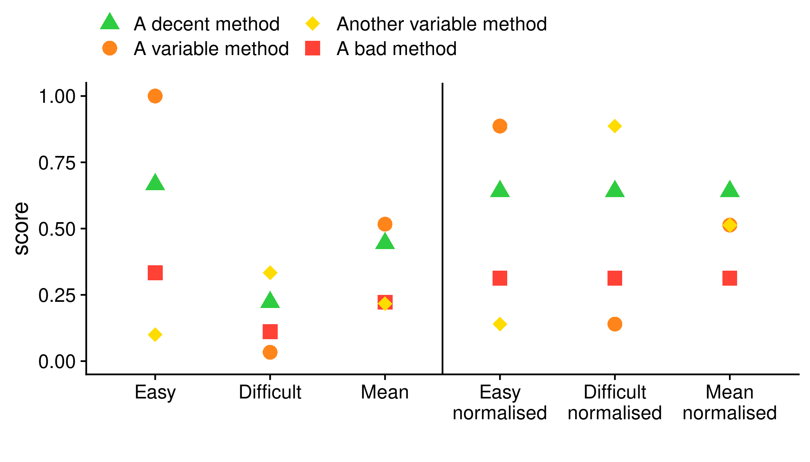
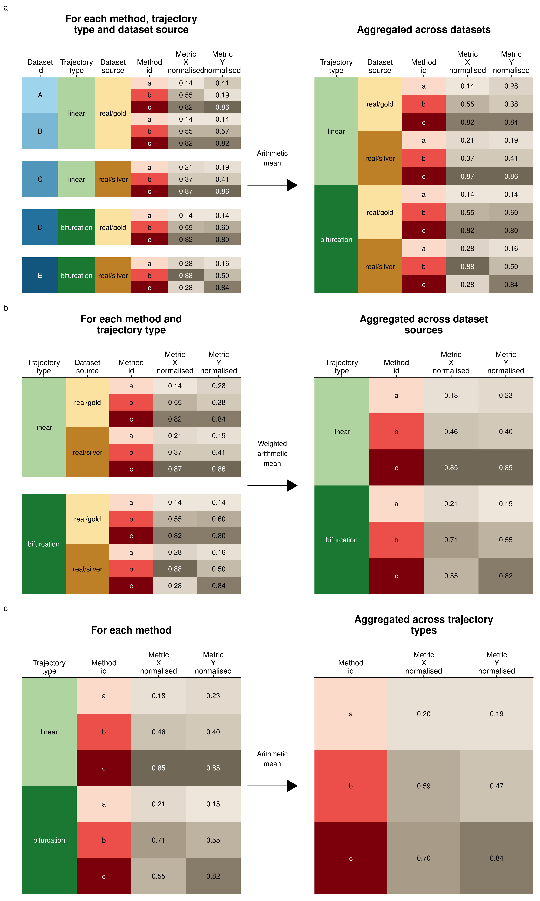

# Score aggregation

To rank the methods, we need to aggregate on two levels: across
**datasets** and across **specific metrics**.

## Aggregating over datasets

When combining different datasets, it is important that the biases in
the datasets does not influence the overall score. In our study, we
define three such biases, although there are potentially many more:

  - **Difficulty of the datasets**: Some datasets are more difficult
    than others. This can have various reasons, such as the complexity
    of the topology, the amount of biological and technical noise, or
    the dimensions of the data. WhatA small increase in performance on
    such a dataset should be given equal weight as a large increase in
    performance on easier datasets.
  - **Dataset sources**: It is much easier to generate synthetic
    datasets than real datasets, and this bias is reflected in our set
    of datasets. However, given their higher biological relevance, real
    datasets should be given at least equal importance than synthetic
    datasets.
  - **Trajectory types**: There are many more linear and disconnected
    real datasets, and only a limited number of tree or graph datasets.
    This imbalance is there because historically most datasets have been
    linear datasets, and because it is easy to create disconnected
    datasets by combining different unrelated datasets. The number of
    datasets in our evaluation study does not necessarily correlate with
    the importance of the trajectory type.

We designed an aggregation scheme which tries to prevent these biases
from influencing the ranking of the methods.

The difficulty of a dataset can easily have an impact on how much weight
the dataset gets in an overall ranking. We illustrate this with a simple
example in [**Figure 1**](#fig_normalisation_reasoning). One method
consistently performs well on both the easy and the difficult datasets.
But because the differences are small in the difficult datasets, the
mean would not give this method a high score. Meanwhile, a variable
method which does not perform well on the difficult dataset gets the
highest score, because it scored so high on the simple dataset.

To avoid this bias, we normalise the scores of each dataset by first
scaling and centering to
 and
, and then
moving the score values back to
 by applying the
unit normal density distribution function. This results in scores which
are comparable across different datasets ([**Figure
1**](#fig_normalisation_reasoning)). In contrast to other possible
normalisation techniques, such as ranking still retaining some
information on the relative difference between the scores, which would
have been lost when using the ranks for normalisation. An example of
this normalisation, which will also be used in the subsequent
aggregation steps, can be seen in [**Figure
2**](#fig_normalisation_example).

<strong>[**Figure 1**](#fig_normalisation_reasoning): An illustration of
how the difficulty of a dataset can influence the overall
ranking.</strong>

-----

<strong>[**Figure 2**](#fig_normalisation_example): An example of the
normalisation procedure.</strong>

-----

Next, we aggregate step by step the scores from different datasets. We
first aggregate the datasets with the same dataset source and trajectory
type using an arithmetic mean of their scores [**Figure
3a**](#fig_aggregation_example.rds). Next, the scores are averaged over
different dataset sources, using a arithmetic mean which was weighted
based on how much the synthetic and silver scores correlated with the
real gold scores [**Figure 3b**](#fig_aggregation_example.rds). Finally,
the scores were aggregated over the different trajectory types again
using a arithmetic mean [**Figure 3c**](#fig_aggregation_example.rds).

<strong>[**Figure 4**](#fig_aggregation_example): An example of the
aggregation procedure.</strong> In consecutive steps we aggregated
across (a) different datasets with the same source and trajectory type,
(b) different dataset sources with the same trajectory type (weighted
for the correlation of the dataset source with the real gold dataset
source) and (c) all trajectory types.

-----

## Overall metrics

Undoubtedly, a single optimal overall metric does not exist for
trajectories, as different users may have different priorities:

  - A user may be primarily interested in defining the correct topology,
    and only use the cellular ordering when the topology is correct
  - A user may be less interested in how the cells are ordered within a
    branch, but primarily in which cells are in which branches
  - A user may already know the topology, and may be primarily
    interested in finding good features related to a particular
    branching point
  - …

Each of these scenarios would require a combinations of *specific*
metrics with different weights. To provide an “overall” ranking of the
metrics, which is impartial for the scenarios described above, we
therefore chose a metric which weighs every aspect of the trajectory
equally:

  - Its **ordering**, using the cordist
  - Its **branch assignment**, using the F1branches
  - Its **topology**, using the HIM
  - The accuracy of **differentially expressed features**, using the
    wcorfeatures

Next, we considered three different ways of averaging different scores:
the meanarithmetic, meangeometric and
meanharmonic. Each of these types of mean have different use
cases. The meanharmonic is most appropriate when the scores
would all have a common denominator (as is the case for the
 and

described earlier). The meanarithmetic would be most
appropriate when all the metrics have the same range. For our use case,
the meangeometric is the most appropriate, because it gives a
meaningful average when the metrics are present in different ranges.
Even though the maximal and minimal values of our metrics all lie within
,
their actual values within our benchmark were very different. Moreover,
the geometric mean has as an added benefit that it is relatively low if
one of the values is low. For example, this means that if a method is
not good at inferring the correct topology, it will get a low overall
score, even if it performs better at all other scores.

The final overall score ([**Figure 5**](#fig_averaging_example)) for a
method was thus defined
as:

<strong>[**Figure 5**](#fig_averaging_example): An example of the
averaging procedure.</strong> To weight both the different dataset
sources and the

-----

We do however want to stress that different use cases will require a
different overall score to order the methods. Such a context-dependent
ranking of all methods is provided through the dynguidelines app
([guidelines.dynverse.org](guidelines.dynverse.org)).
