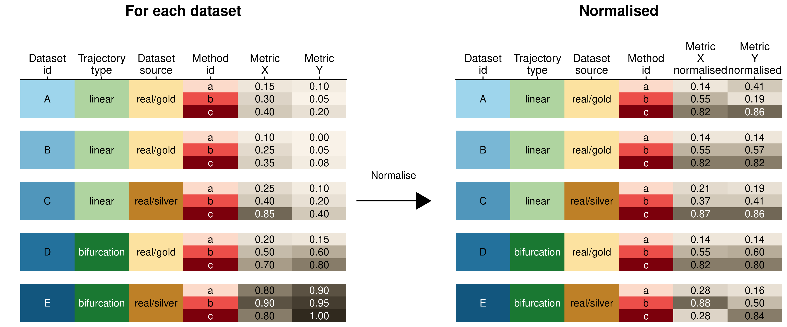

# Score aggregation

To rank the methods, we need to aggregate on two levels: across
**datasets** and across **specific metrics**.

## Aggregating over datasets

When combining different datasets, it is important that the biases in
the datasets does not influence the overall score. In our study, we
define three such biases, but there are potentially many more:

  - **Dataset sources**: There are many more synthetic than real
    datasets. However, given their biological relevance, real datasets
    should be given at least equal importance than synthetic datasets.
  - **Hard versus easy datasets**: Some datasets are more difficult than
    others, because they contain a more complex topology, or contain
    more noise. A small increase in performance on such a dataset should
    be given equal weight as a large increase in performance on easier
    datasets.
  - **Trajectory types**: There are many more linear and disconnected
    real datasets, and only a limited number of tree or graph datasets.
    This imbalance is there because historically most datasets have been
    linear datasets, and because it is easy to create disconnected
    datasets by combining different unrelated datasets. The number of
    datasets in our evaluation study does not necessarily correlate with
    the importance of the trajectory type.

We therefore designed an aggregation scheme which prevents that these
biases would influence the final ranking.

The difficulty of a dataset can easily have an impact on how much weight
the dataset gets in an overall ranking. We illustrate this with a very
simple example in [**Figure 1**](#fig_normalisation_example).

<strong>[**Figure 1**](#fig_normalisation_example): An illustration of
how the difficulty of a dataset can influence the overall
ranking.</strong>

-----

## Overall metrics

Undoubtedly, a single optimal overall metric does not exist for
trajectories, as different users may have different priorities:

  - A user may be primarily interested in defining the correct topology,
    and only use the cellular ordering when the topology is correct
  - A user may be less interested in how the cells are ordered within a
    branch, but primarily in which cells are in which branches
  - A user may already know the topology, and may be primarily
    interested in finding good features related to a particular
    branching point
  - …

Each of these scenarios would require a combinations of *specific*
metrics with different weights. To provide an “overall” ranking of the
metrics, which is impartial for the scenarios described above, we
therefore chose a metric which weighs every aspect of the trajectory
equally:

  - Its **ordering**, using the cordist
  - Its **branch assignment**, using the F1branches
  - Its **topology**, using the HIM
  - The accuracy of **differentially expressed features**, using the
    wcorfeatures

Next, we considered three different ways of averaging different scores:
the meanarithmetic, meangeometric and
meanharmonic. Each of these ‘pythagorean means’ have
different use cases. The meanharmonic is most appropriate
when the scores would all have a common denominator (as is the case for
the 
and 
described earlier). The meanarithmetic would be most
appropriate when all the metrics have the same range. For our use case,
the meangeometric is the most appropriate, because it gives a
meaningful average when the metrics are present in different ranges.
Even though the maximal and minimal values of our metrics all lie within
,
their actual values within our benchmark were very different. Moreover,
the geometric mean has as an added benefit that it is relatively low if
one of the values is low. This means that if a method is not good at
inferring the correct topology, it will get a low overall score, even if
it performs better at all other scores.

The final overall score for a method on a particular dataset was thus
defined
as:

We do however want to stress that different use cases will require a
different overall score to order the methods. Such a context-dependent
ranking of all methods is provided through the dynguidelines app
(<https://github.com/dynverse/dynguidelines>).
