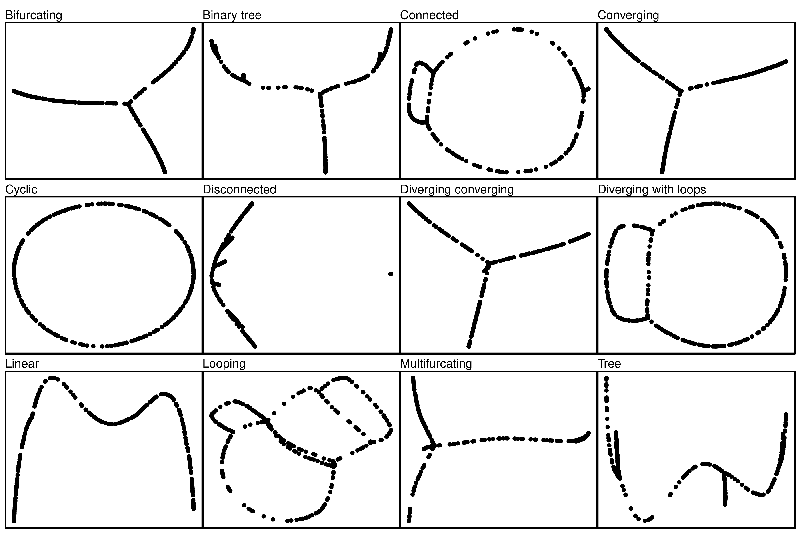
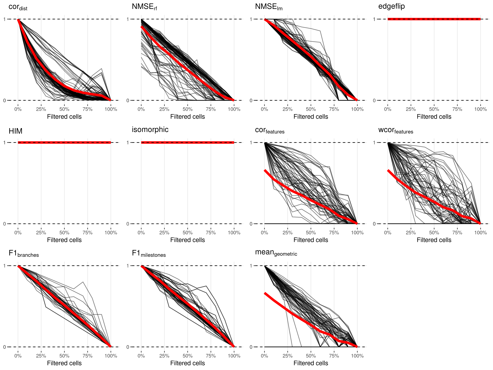
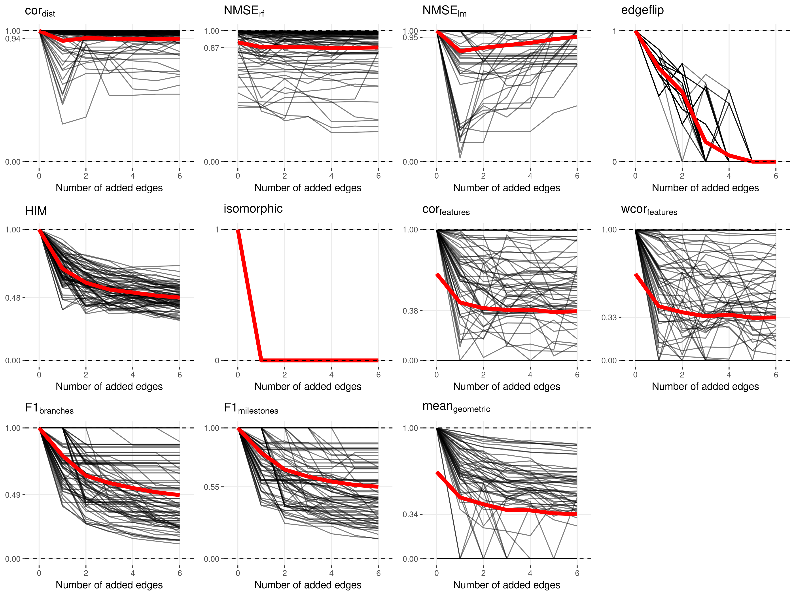
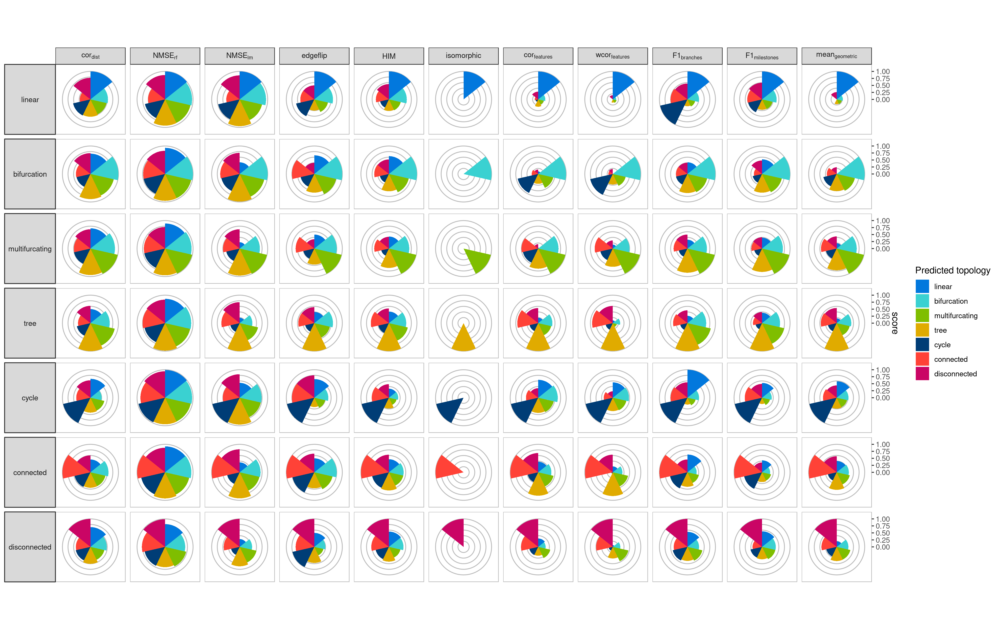

# Metrics to compare two trajectories

A trajectory, as defined in our evaluation, is a model with multiple
abstractions. The top abstraction is the topology which contains
information about the paths each cell can take from their starting
point. Deeper abstractions involve the mapping of each cell to a
particular branch within this network, and the position (or ordering) of
each cells within these branches. Internally, the topology is
represented by the milestone network and regions of delayed commitment,
the branch assignment and cellular positions are represented by the
milestone percentages ([**Figure S1**](#fig_trajectory_model_example)).

<strong>[**Figure S1**](#fig_trajectory_model_example): An example
trajectory that will be used throughout this section.</strong> It
contains contains four milestones (W to Z) and five cells (a to e).

-----

Given the multilayered complexity of a trajectory model, it is not
trivial to compare the similarity of two trajectory models using only
one metric. We therefore sought to use different comparison metrics,
each serving a different purpose:

  - **Specific metrics** investigate one particular aspect of the
    trajectory. Such metrics make it possible to find particular weak
    points for methods, e.g. that a method is very good at ordering but
    does not frequently find the correct topology. Moreover, having
    multiple individual metrics allow personalised rankings of methods,
    for example for users which are primarily interested in using the
    method correct topology.
  - **Application metrics** focus on the quality of a downstream
    analysis using the trajectory. For example, it measures whether the
    trajectory can be used to find accurate differentially expressed
    genes.
  - **Overall metrics** should capture all the different abstractions,
    in other words such metrics measure whether the resulting trajectory
    has a good topology, that the cells belong to similar branches *and*
    that they are ordered correctly.

Here, we first describe and illustrate several possible specific,
application and overall metrics. Next, we test these metrics on several
test cases, to make sure they robustly identify “wrong” trajectory
predictions.

All metrics described here were implemented within the
[*dyneval*](https://github.com/dynverse/dyneval) R package
(<https://github.com/dynverse/dyneval>).

## [Metric characterisation and testing](01-metric_characterisation)

### Specific metrics

#### Isomorphic, edgeflip and HIM: Edit distance between two trajectory topologies

We used three different scores to assess the similarity in the topology
between two trajectories, iregardless of where the cells were
positioned.

For all three scores, we first simplified the topology of the trajectory
to make both graph structures comparable:

  - As we are only interested in the main structure of the topology
    without start or end, the graph was made undirected.
  - All milestones with degree 2 were removed. For example in the
    topology A ⇨ B ⇨ C ⇨ D, C ⇨ D, the B milestone was removed
  - A linear topology was converted to A ⇨ B ⇨ C
  - A cyclical topology such as A ⇨ B ⇨ C ⇨ D or A ⇨ B ⇨ A were all
    simplified to A ⇨ B ⇨ C ⇨ A
  - Duplicated edges such as A ⇨ B, A ⇨ B were decoupled to A ⇨ B, A ⇨ C
    ⇨ B

The Isomorphic score returns 1 if two graphs are isomorphic, and 0 if
they were not. For this, we used the used the BLISS
algorithm[1](#ref-junttila_engineeringefficientcanonical_2007),
as implemented in the R *igraph* package.

The edgeflip score was defined as the minimal number of edges which
should be added or removed to convert one network into the other,
divided by the total number of edges in both networks. This problem is
equivalent to the maximum common edge subgraph problem, a known NP-hard
problem without a scalable
solution[2](#ref-bahiense_maximumcommonedge_2012). We
implemented a branch and bound approach for this problem, using several
heuristics to speed up the search:

  - First check all possible edge additions and removals corresponding
    to the number of different edges between the two graphs.
  - For each possible solution, first check whether:
      - The maximal degree is the same
      - The minimal degree is the same
      - All degrees are the same after sorting
  - Only then check if the two graphs are isomorphic as described
    earlier.
  - If no solution is found, check all possible solutions with two extra
    edge additions/removals.

The HIM metric (Hamming-Ipsen-Mikhailov
distance)[3](#ref-jurman_HIM_Glocal_Metric_2015) which was
adopted from the R nettools package
(<https://github.com/filosi/nettools>). It uses an adjacency matrix
which was weighted according to the lengths of each edges within the
milestone network. Conceptually, HIM is a linear combination of:

  - The normalised Hamming
    distance[4](#ref-doughertyValidationGeneRegulatory2011),
    which calculates the distance between two graphs by matching
    individual edges in the adjacency matrix, but disregards overall
    structural similarity.
  - The normalised Ipsen-Mikhailov
    distance[5](#ref-ipsenEvolutionaryReconstructionNetworks2002),
    which calculates the overall distance of two graphs based on matches
    between its degree and adjacency matrix, while disregarding local
    structural similarities. It requires a
     parameter, which
    is usually estimated based on the number of nodes in the graph, but
    which we fixed at  so
    as to make the score comparable across different graph sizes.

We compared the three scores on several common topologies ([**Figure
S1**](#fig_topology_scores_overview)). While conceptually very
different, the edgeflip and HIM still produce similar scores ([**Figure
S1b**](#fig_topology_scores_overview)). The HIM tends to punish the
detection of cycles, while the edgeflip is more harsh for differences in
the number of bifurcations ([**Figure
S1b**](#fig_topology_scores_overview)). The main difference however is
that the HIM takes into account edge lengths when comparing two
trajectories, as illustrated in ([**Figure
S1c**](#fig_topology_scores_overview)). Short “extra” edges in the
topology are less punished by the HIM than by the edgeflip.

<strong>[**Figure S1**](#fig_topology_scores_overview): Showcase of
three metrics to evaluate topologies: Isomorphic, edgeflip and
HIM.</strong> (a) The used topologies. (b) The scores when comparing
each pair of trajectory types. (c) Four datasets in which aan extra edge
is added and made progressively longer. This shows how the HIM can take
into account edge lengths.

-----

To summarise, the different topology based scores are useful for
different scenarios:

  - If the two trajectories should only be compared when the topology is
    exactly the same, the Isomorphic should be used.
  - If it is important that the topologies are similar, but not
    necessarily isomorphic, the edgeflip is most appropriate.
  - If the topologies should be similar, but shorter edges should not be
    punished as hard as longer edges, the HIM is most
appropriate.

#### F1branches and F1milestones: Comparing how well the cells are clustered in the trajectory

Perhaps one of the simplest ways to calculate the similarity between the
cellular positions of two topologies is by mapping each cell to its
closest milestone *or* branch ([**Figure
S2**](#fig_clustering_scores_overview)). These clusters of cells can
then be compared using one of the many external cluster evaluation
measures[6](#ref-saelens_comprehensiveevaluationmodule_2018).
When selecting a cluster evaluation metric, we had two main conditions:

  - Because we allow methods to filter cells in the trajectory, the
    metric should be able to handle “non-exhaustive assignment”, where
    some cells are not assigned to any cluster.
  - The metric should give each cluster equal weight, so that rare cell
    stages are equally important as large stages.

The  score
between the
 and
 is a
metric which conforms to both these conditions. This metric will map two
clustersets by using their shared members based on the

similarity. It then calculates the
 as the
average maximal
 for
every cluster in the first set of clusters (in our case the reference
trajectory). Conversely, the
 is
calculated based on the average maximal similarity in the second set of
clusters (in our case the prediction). Both the
 and
 are
then given equal weight in a harmonic mean
(). Formally,
if  and
 are two cell
clusters:

%20=%20%5Cfrac%7B%7Cc%20%5Ccap%20c'%7C%7D%7B%7Cc%20%5Ccup%20c'%7C%7D)

%7D%7D%7D)

%7D%7D%7D)

<strong>[**Figure S2**](#fig_clustering_scores_overview): Mapping cells
to their closest milestone or branch for the calculation of the
F1milestones and F1branches .</strong> To
calculate the F1milestones, cells are mapped towards the
nearest milestone, i.e. the milestone with the highest milestone
percentage. For the F1branches, the cells are mapped to the
closest edge.

-----

#### cordist: Correlation between geodesic distances

When the position of a cell is the same in both the reference and the
prediction, its *relative* distances to all other cells in the
trajectory should also be the same. This observation is the basis for
the cordist metric.

<strong>[**Figure 3**](#fig_metrics_geodesic): The calculation of
geodesic distances on a small example trajectory.</strong> a) A toy
example containing four milestones (W to Z) and five cells (a to e). b)
The corresponding milestone network, milestone percentages and regions
of delayed commitment, when the toy trajectory is converted to the
common trajectory model. c) The calculations made for calculating the
pairwise geodesic distances. d) A heatmap representation of the pairwise
geodesic distances.

-----

The geodesic distance is the distance a cell has to go through the
trajectory space to get from one position to another. The way this
distance is calculated depends on how two cells are positioned,
showcased by an example in [**Figure 3**](#fig_metrics_geodesic):

  - **Both cells are on the same edge in the milestone network.** In
    this case, the geodesic distance is defined as the product of the
    difference in milestone percentages and the length of their shared
    edge. For cells  and
     in the example,
    ) is equal to
    %20=%200.7).
  - **Cells reside on different edges in the milestone network.** First,
    the distance of the cell to all its nearby milestones is calculated,
    based on its percentage within the edge and the length of the edge.
    These distances in combination with the milestone network are used
    to calculate the shortest path distance between the two cells. For
    cells  and
     in the example,
    %20=%201%20%5Ctimes%200.9)
    and
    %20=%203%20%5Ctimes%200.2),
    and therefore
    %20=%201%20%5Ctimes%200.9%20+%203%20%5Ctimes%200.2).

The geodesic distance can be easily extended towards cells within
regions of delayed commitment. When both cells are part of the same
region of delayed commitment, the geodesic distance was defined as the
manhattan distances between the milestone percentages weighted by the
lengths from the milestone network. For cells
 and
 in the example,
) is equal to
%20+%202%20%5Ctimes%20\(0.7%20-%200.2\)%20+%203%20%5Ctimes\(0.4%20-%200.1\)%20=%201.9).
The distance between two cells where only one is part of a region of
delayed commitment is calculated similarly to the previous paragraph, by
first calculating the distance between the cells and their neighbouring
milestones first, then calculating the shortest path distances between
the two.

Calculating the pairwise distances between cells scales quadratically
with the number of cells, and would therefore not be scaleable for large
datasets. For this reason, a set of waypoint cells are defined *a
priori*, and only the distances between the waypoint cells and all other
cells is calculated, in order to calculate the correlation of geodesic
distances of two trajectories ([**Figure
S4a**](#fig_waypoints_overview)). These cell waypoints are determined by
viewing each milestone, edge and region of delayed commitment as a
collection of cells. We do stratified sampling from each collection of
cells by weighing them by the total number of cells within that
collection. For calculating the cordist between two
trajectories, the distances between all cells and the union of both
waypoint sets is computed.

To select the number of cell waypoints, we need to find a trade-off
between the accuracy versus the time to calculate cordist. To
select an optimal number of cell waypoints, we used the synthetic
dataset with the most complex topology, and determined the
cordist at different levels of both cell shuffling and number
of cell waypoints ([**Figure S4b**](#fig_waypoints_overview)). We found
that using cell waypoints does not induce a systematic bias in the
cordist, and that its variability was relatively minimal when
compared to the variability between different levels of cell shuffling
when using 100 or more cell waypoints.

<strong>[**Figure S4**](#fig_waypoints_overview): Determination of cell
waypoints</strong> a) Illustration of the stratified cell sampling using
an example dataset (top). Each milestone, edge between two milestones
and region of delayed commitment is seen as a collection of cells
(middle), and the number of waypoints (100 in this case) are divided
over each of these collection of cells (bottom). b) Accuracy versus time
to calculate cordist. Shown are distributions over 100 random
waypoint samples. The upper whisker of the boxplot extends from the
hinge (75% percentile) to the largest value, no further than 1.5× the
IQR of the hinge. The lower whisker extends from the hinge (25%
percentile) to the smallest value, at most 1.5× the IQR of the hinge.

-----

Although the cordist’s main characteristic is that it looks
at the positions of the cells, other features of the trajectory are also
(partly) captured. To illustrate this, we used the geodesic distances
themselves as input for dimensionality reduction ([**Figure
S5**](#fig_geodesic_distances_dimreds)) with varying topologies. This
reduced space captures the original trajectory structure quite well,
including the overall topology and branch lengths. Only some structures,
not easily visualisabe

<strong>[**Figure S5**](#fig_geodesic_distances_dimreds): The geodesic
distances can be used to reconstruct the original trajectory
structure</strong> We generated different toy trajectory datasets with
varying topologies and calculated the geodesic distances between all
cells within the trajectory. We then used these distances as input for
classical multidimensional scaling. This shows that the geodesic
distances do not only contain information regarding the cell’s
positions, but also information on the lengths and wiring of the
topology.

-----

#### NMSErf and NMSElm: Using the positions of the cells within one trajectory to predict the cellular positions in the other trajectory

An alternative approach to detect whether the positions of cells are
similar between two trajectories, is to use the positions of one
trajectory to predict the positions within the other trajectory. If the
cells are at similar positions in the trajectory (relative to its nearby
cells), the prediction error should be low.

Specifically, we implemented two metrics which predict the milestone
percentages from the reference by using the predicted milestone
percentages as features ([**Figure S6**](#fig_metrics_prediction)). We
did this with two regression methods, linear regression
(, using the
R `lm` function) and Random Forest
(,
implemented in the *ranger*
package[7](#ref-wright_rangerfastimplementation_2017)). In
both cases, the accuracy of the prediction was measured using the Mean
Squared error
(), in the
case of Random forest we used the out-of-bag mean-squared error. Next,
we calculated

equal to the
 when
predicting all milestone percentages as the average. We used this to
calculate the normalised mean squared error as
.
We created a regression model for every milestone in the gold standard,
and averaged the
 values to
finally obtain the NMSErf and NMSElm scores.

<strong>[**Figure S6**](#fig_metrics_prediction): The calculation of
NMSElm distances on a small example trajectory.</strong> The
milestone percentages of the reference are predicted based on the
milestone percentages of the prediction, using regression models such as
linear regression or random forests. The predicted trajectory is then
scored by comparing the mean-squared error (MSE° of this regression
model with the baseline MSE where the prediction is the average
milestone percentage

-----

### Application metrics

Although most metrics described above already assess some aspects
directly relevant to the user, such as whether the method is good at
finding the right topology, these metrics do not assess the quality of
downstream analyses and hypotheses which can be generated from these
models.

#### corfeatures and wcorfeatures: The accuracy of dynamical differentially expressed features/genes.

Perhaps the main advantage of studying cellular dynamic processes using
single-cell -omics data is that the dynamics of gene expression can be
studied for the whole transcriptome. This can be used to construct other
models such as dynamic regulatory networks and gene expression modules.
Such analyses rely on a “good-enough” cellular ordering, so that it can
be used to identify dynamical differentially expressed genes.

To calculate the corfeatures we used Random forest regression
to rank all the features according to their importance in predicting the
positions of cells in the trajectory. More specifically, we first
calculated the geodesic distances for each cell to all milestones in the
trajectory. Next, we trained a Random Forest regression model
(implemented in the R *ranger*
package[7](#ref-wright_rangerfastimplementation_2017),
<https://github.com/imbs-hl/ranger>) to predict these distances for each
milestone, based on the expression of genes within each cell. We then
extracted feature importances using the Mean Decrease in Impurity
(`importance = 'impurity'` parameter of the `ranger` function), as
illustrated in ([**Figure S7**](#fig_featureimp_overview)). The overall
importance of a feature (gene) was then equal to the mean importance
over all milestones. Finally, we compared the two rankings by
calculating the Pearson correlation, with values between -1 and 0
clipped to 0.

<strong>[**Figure S7**](#fig_featureimp_overview): An illustration of
ranking features based on their importance in a trajectory.</strong> (a)
A MDS dimensionality reudction of a real dataset in which mouse
embryonic fibroblasts (MEF) differentiate into Neurons and Myocytes. (b)
The ranking of feature importances from high to low. The majority of
features have a very low importance. (c) Some examples, which were also
highlighted in b. Higher features in the ranking are clearly specific to
certain parts of the trajectory, while features lower on the ranking
have a more dispersed expression pattern.

-----

Random forest regression has two main hyperparameters. The number of
trees to be fitted (`num_trees` parameter) was fixed to `10000` to
provide accurate and stable estimates of the feature importance
([**Figure S8**](#fig_featureimp_cor_distributions)). The number of
features on which can be split (`mtry` parameter) was set to 1% of all
available features (instead of the default square-root of the number of
features), as to make sure that predictive but highly correlated
features, omnipresent in transcriptomics data, are not suppressed in the
ranking.

<strong>[**Figure S8**](#fig_featureimp_cor_distributions): Effect of
the number of trees parameter on the accuracy and variability of the
corfeatures.</strong> We used the dataset from [**Figure
S7**](#fig_featureimp_overview) and calculated the
corfeatures after shuffling a percentage of cells.

-----

For most datasets, only a limited number of features will be
differentially expressed in the trajectory. For example, in the dataset
used in [**Figure S8**](#fig_featureimp_cor_distributions) only the top
10%-20% show a clear pattern of differential expression. The correlation
will weight each of these features equally, and will therefore give more
weight to the bottom, irrelevant features. To prioritise the top
differentially expressed features, we also implemented the
wcorfeatures, which will weight the correlation using the
feature importance scores in the reference so that the top features have
relatively more impact on the score ([**Figure
S9**](#fig_featureimp_wcor_effect)).

<strong>[**Figure S9**](#fig_featureimp_wcor_effect): Effect of
weighting the features based on their feature importance in the
reference.</strong> We used the same dataset as in [**Figure
S7**](#fig_featureimp_overview), and calculated the
corfeatures after shuffling a percentage of cells.

-----

#### References

1\. Junttila, T. & Kaski, P. Engineering an Efficient Canonical Labeling
Tool for Large and Sparse Graphs. in *2007 Proceedings of the Ninth
Workshop on Algorithm Engineering and Experiments (ALENEX)* 135–149
(Society for Industrial and Applied Mathematics, 2007).
[doi:\[10.1137/1.9781611972870.13\](https://doi.org/10.1137/1.9781611972870.13)](doi:%5B10.1137/1.9781611972870.13%5D\(https://doi.org/10.1137/1.9781611972870.13\))

2\. Bahiense, L., Manić, G., Piva, B. & de Souza, C. C. The maximum
common edge subgraph problem: A polyhedral investigation. *Discrete
Applied Mathematics* **160**, 2523–2541 (2012).

3\. Jurman, G., Visintainer, R., Filosi, M., Riccadonna, S. &
Furlanello, C. The HIM glocal metric and kernel for network comparison
and classification. in *2015 IEEE International Conference on Data
Science and Advanced Analytics (DSAA)* 1–10 (2015).
[doi:\[10.1109/DSAA.2015.7344816\](https://doi.org/10.1109/DSAA.2015.7344816)](doi:%5B10.1109/DSAA.2015.7344816%5D\(https://doi.org/10.1109/DSAA.2015.7344816\))

4\. Dougherty, E. R. Validation of gene regulatory networks: Scientific
and inferential. *Briefings in Bioinformatics* **12**, 245–252 (2011).

5\. Ipsen, M. & Mikhailov, A. S. Evolutionary reconstruction of
networks. *Physical Review. E, Statistical, Nonlinear, and Soft Matter
Physics* **66**, 046109 (2002).

6\. Saelens, W., Cannoodt, R. & Saeys, Y. A comprehensive evaluation of
module detection methods for gene expression data. *Nature
Communications* **9**, 1090 (2018).

7\. Wright, M. N. & Ziegler, A. Ranger: A Fast Implementation of Random
Forests for High Dimensional Data in C++ and R | Wright | Journal of
Statistical Software. *Journal of Statistical Software* **77**, (2017).

## [Metric conformity](02-metric_conformity)

Although most metrics described in the previous section make sense
intuitively, this does not necessarily mean that these metrics are
robust and will generate reasonable results when used for benchmarking.
This is because different methods and datasets will all lead to a varied
set of trajectory models:

  - Real datasets have all cells grouped onto milestones
  - Some methods place all cells in a region of delayed commitment,
    others never generate a region of delayed commitment
  - Some methods always return a linear trajectory, even if a
    bifurcation is present in the data
  - Some methods filter cells

A good metric, especially a good overall metric, should work in all
these circumstances. To test this, we designed a set of rules to which a
good metric should conform, and assessed empirically whether a metric
conforms to these rules.

We generated a panel of toy datasets (using our
[*dyntoy*](https://github.com/dynverse/dyntoy) package,
<https://github.com/dynverse/dyntoy>) with all possible combinations of:

  - \# cells: 10, 20, 50, 100, 200 and 500
  - \# features: 200
  - topologies: linear, bifurcation, multifurcating, tree, cycle,
    connected graph and disconnected graph
  - Whether cells are placed on the milestones (as in real data) or on
    the edges/regions of delayed commitment between the milestones (as
    in synthetic data)

We then perturbed the trajectories in these datasets in certain ways,
and tested whether the scores follow an expected pattern. An overview of
the conformity of every metric is first given in [**Table
S1**](#table_conformity_overview). The individual rules and metric
behaviour are discussed more into detail after
that.

| name                                            | cordist | NMSErf | NMSElm | edgeflip | HIM | Isomorphic | corfeatures | wcorfeatures | F1branches | F1milestones | meangeometric |
| :---------------------------------------------- | :----------------- | :---------------- | :---------------- | :------- | :-- | :--------- | :--------------------- | :---------------------- | :-------------------- | :---------------------- | :----------------------- |
| New connecting edges                            | ✔                  | ✔                 | ✖                 | ✔        | ✔   | ✔          | ✔                      | ✔                       | ✔                     | ✔                       | ✔                        |
| New leaf edges                                  | ✔                  | ✔                 | ✖                 | ✔        | ✔   | ✔          | ✖                      | ✖                       | ✔                     | ✔                       | ✔                        |
| Cycle breaking                                  | ✔                  | ✖                 | ✔                 | ✔        | ✔   | ✔          | ✔                      | ✔                       | ✖                     | ✔                       | ✔                        |
| Cells on milestones vs edges                    | ✔                  | ✔                 | ✔                 | ✔        | ✔   | ✔          | ✔                      | ✔                       | ✔                     | ✔                       | ✔                        |
| Change of topology                              | ✔                  | ✖                 | ✖                 | ✔        | ✔   | ✔          | ✔                      | ✔                       | ✖                     | ✔                       | ✔                        |
| Changing positions locally and/or globally      | ✔                  | ✔                 | ✔                 | ✖        | ✖   | ✖          | ✔                      | ✔                       | ✖                     | ✖                       | ✔                        |
| Bifurcation merging and changing cell positions | ✔                  | ✔                 | ✔                 | ✖        | ✖   | ✖          | ✔                      | ✔                       | ✔                     | ✔                       | ✔                        |
| Changing topology and cell position             | ✖                  | ✖                 | ✖                 | ✖        | ✖   | ✖          | ✖                      | ✖                       | ✖                     | ✖                       | ✔                        |
| Bifurcation concatentation                      | ✔                  | ✖                 | ✔                 | ✔        | ✔   | ✔          | ✔                      | ✔                       | ✔                     | ✔                       | ✔                        |
| Same score on identity                          | ✔                  | ✖                 | ✔                 | ✔        | ✔   | ✔          | ✔                      | ✖                       | ✔                     | ✔                       | ✔                        |
| Cell filtering                                  | ✔                  | ✔                 | ✔                 | ✖        | ✖   | ✖          | ✔                      | ✔                       | ✔                     | ✔                       | ✔                        |
| Linear joining                                  | ✔                  | ✔                 | ✔                 | ✔        | ✔   | ✔          | ✔                      | ✔                       | ✖                     | ✔                       | ✔                        |
| Bifurcation merging                             | ✔                  | ✖                 | ✔                 | ✔        | ✔   | ✔          | ✔                      | ✔                       | ✔                     | ✔                       | ✔                        |
| Cells into small subedges                       | ✖                  | ✔                 | ✖                 | ✔        | ✔   | ✔          | ✔                      | ✖                       | ✔                     | ✔                       | ✔                        |
| Removing divergence regions                     | ✔                  | ✔                 | ✔                 | ✖        | ✖   | ✖          | ✔                      | ✔                       | ✖                     | ✔                       | ✔                        |
| Local and global cell shuffling                 | ✔                  | ✔                 | ✔                 | ✖        | ✖   | ✖          | ✔                      | ✔                       | ✔                     | ✔                       | ✔                        |
| Local cell shuffling                            | ✔                  | ✔                 | ✔                 | ✖        | ✖   | ✖          | ✔                      | ✔                       | ✖                     | ✔                       | ✔                        |
| Edge shuffling                                  | ✔                  | ✔                 | ✔                 | ✖        | ✖   | ✖          | ✔                      | ✔                       | ✔                     | ✔                       | ✔                        |
| Length shuffling                                | ✔                  | ✖                 | ✔                 | ✖        | ✔   | ✖          | ✖                      | ✖                       | ✖                     | ✔                       | ✔                        |
| Linear splitting                                | ✔                  | ✔                 | ✔                 | ✔        | ✔   | ✔          | ✔                      | ✔                       | ✔                     | ✔                       | ✔                        |
| Move cells to closest milestone                 | ✔                  | ✔                 | ✔                 | ✖        | ✖   | ✖          | ✔                      | ✔                       | ✖                     | ✔                       | ✔                        |
| Move cells to start milestone                   | ✔                  | ✔                 | ✔                 | ✖        | ✖   | ✖          | ✔                      | ✔                       | ✖                     | ✔                       | ✔                        |

**[**Table S1**](#table_conformity_overview): Overview of whether a
particular metric conforms to a particular rule**

#### Rule 1: Same score on identity

\\begin{center}

\\end{center}

Description: The score should be approximately the same when comparing
the trajectory to itself.

A metric conforms to this rule if:
.

Conclusion(s): Metrics which contain some stochasticity (random forest
based metrics in particular), usually do not conform to this rule, even
though their scores are still consistently
high.

|  |  |  |  |  |  |  |  |  |  |  |
| :------------------------------------------------------ | :----------------------------------------------------- | :----------------------------------------------------- | :------------------------------------------------- | :-------------------------------------------- | :--------------------------------------------------- | :---------------------------------------------------------- | :----------------------------------------------------------- | :--------------------------------------------------------- | :----------------------------------------------------------- | :------------------------------------------------------------ |
| TRUE                                                    | FALSE                                                  | TRUE                                                   | TRUE                                               | TRUE                                          | TRUE                                                 | TRUE                                                        | FALSE                                                        | TRUE                                                       | TRUE                                                         | TRUE                                                          |

**[**Table S2**](#table_equal_identity_rule_table): Which metrics
conform to rule 1.**

<strong>[**Figure S1**](#fig_equal_identity_plot_datasets): Example
trajectory that was used to assess this rule.</strong>

-----

<strong>[**Figure S2**](#fig_equal_identity_plot_scores): Score values
of the different metrics across 42 datasets.</strong>

-----

#### Rule 2: Local cell shuffling

\\begin{center}

\\end{center}

Description: Shuffling the positions of cells within each edge should
lower the score. This is equivalent to changing the cellular position
locally.

A metric conforms to this rule if:
.

Conclusion(s): Metrics which do not look at the cellular positioning, or
group the cells within branches or milestones, do not conform to this
rule.

|  |  |  |  |  |  |  |  |  |  |  |
| :------------------------------------------------------ | :----------------------------------------------------- | :----------------------------------------------------- | :------------------------------------------------- | :-------------------------------------------- | :--------------------------------------------------- | :---------------------------------------------------------- | :----------------------------------------------------------- | :--------------------------------------------------------- | :----------------------------------------------------------- | :------------------------------------------------------------ |
| TRUE                                                    | TRUE                                                   | TRUE                                                   | FALSE                                              | FALSE                                         | FALSE                                                | TRUE                                                        | TRUE                                                         | FALSE                                                      | TRUE                                                         | TRUE                                                          |

**[**Table S3**](#table_shuffle_cells_edgewise_rule_table): Which
metrics conform to rule 2.**

<strong>[**Figure S3**](#fig_shuffle_cells_edgewise_plot_datasets):
Example dataset before and after perturbation.</strong>

-----

<strong>[**Figure S4**](#fig_shuffle_cells_edgewise_plot_scores):
Differences in scores of 231 datasets before and after perturbation. Red
bar gives the mean.</strong>

-----

#### Rule 3: Edge shuffling

\\begin{center}

\\end{center}

Description: Shuffling the edges in the milestone network should lower
the score. This is equivalent to changing the cellular positions only
globally.

A metric conforms to this rule if:
).

Conclusion(s): Metrics which only look at the topology do not conform to
this
rule.

|  |  |  |  |  |  |  |  |  |  |  |
| :------------------------------------------------------ | :----------------------------------------------------- | :----------------------------------------------------- | :------------------------------------------------- | :-------------------------------------------- | :--------------------------------------------------- | :---------------------------------------------------------- | :----------------------------------------------------------- | :--------------------------------------------------------- | :----------------------------------------------------------- | :------------------------------------------------------------ |
| TRUE                                                    | TRUE                                                   | TRUE                                                   | FALSE                                              | FALSE                                         | FALSE                                                | TRUE                                                        | TRUE                                                         | TRUE                                                       | TRUE                                                         | TRUE                                                          |

**[**Table S4**](#table_shuffle_edges_rule_table): Which metrics conform
to rule 3.**

<strong>[**Figure S5**](#fig_shuffle_edges_plot_datasets): Lowly (left),
moderatly (middle) and highly (right) perturbed example
dataset.</strong>

-----

<strong>[**Figure S6**](#fig_shuffle_edges_plot_scores): Score values at
different extents of the perturbation across 84 datasets. Red line
denotes the mean values.</strong>

-----

#### Rule 4: Local and global cell shuffling

\\begin{center}

\\end{center}

Description: Shuffling the positions of cells should lower the score.
This is equivalent to changing the cellular position both locally and
globally.

A metric conforms to this rule if:
).

Conclusion(s): Most metrics that look at the position of each cell
conform to this
rule.

|  |  |  |  |  |  |  |  |  |  |  |
| :------------------------------------------------------ | :----------------------------------------------------- | :----------------------------------------------------- | :------------------------------------------------- | :-------------------------------------------- | :--------------------------------------------------- | :---------------------------------------------------------- | :----------------------------------------------------------- | :--------------------------------------------------------- | :----------------------------------------------------------- | :------------------------------------------------------------ |
| TRUE                                                    | TRUE                                                   | TRUE                                                   | FALSE                                              | FALSE                                         | FALSE                                                | TRUE                                                        | TRUE                                                         | TRUE                                                       | TRUE                                                         | TRUE                                                          |

**[**Table S5**](#table_shuffle_cells_rule_table): Which metrics conform
to rule 4.**

<strong>[**Figure S7**](#fig_shuffle_cells_plot_datasets): Lowly (left),
moderatly (middle) and highly (right) perturbed example
dataset.</strong>

-----

<strong>[**Figure S8**](#fig_shuffle_cells_plot_scores): Score values at
different extents of the perturbation across 84 datasets. Red line
denotes the mean values.</strong>

-----

#### Rule 5: Changing positions locally and/or globally

\\begin{center}

\\end{center}

Description: Changing the cellular position locally AND globally should
lower the score more than any of the two individually.

A metric conforms to this rule if:
.

Conclusion(s): Because the topology remains the same, the topology
scores do not conform to this rule. Also the clustering based scores
have some difficulties with this
rule.

|  |  |  |  |  |  |  |  |  |  |  |
| :------------------------------------------------------ | :----------------------------------------------------- | :----------------------------------------------------- | :------------------------------------------------- | :-------------------------------------------- | :--------------------------------------------------- | :---------------------------------------------------------- | :----------------------------------------------------------- | :--------------------------------------------------------- | :----------------------------------------------------------- | :------------------------------------------------------------ |
| TRUE                                                    | TRUE                                                   | TRUE                                                   | FALSE                                              | FALSE                                         | FALSE                                                | TRUE                                                        | TRUE                                                         | FALSE                                                      | FALSE                                                        | TRUE                                                          |

**[**Table
S6**](#table_combined_local_global_position_change_rule_table): Which
metrics conform to rule 5.**

<strong>[**Figure
S9**](#fig_combined_local_global_position_change_plot_datasets): Example
dataset before perturbation (identity), with any of the two
perturbations (a and b) and both perturbations combined (a+b).</strong>

-----

<strong>[**Figure
S10**](#fig_combined_local_global_position_change_plot_scores): Score
values before perturbation (identity), with any of the two perturbations
(a and b) and both perturbations combined (a+b). The upper whisker of
the boxplot extends from the hinge (75% percentile) to the largest
value, no further than 1.5× the IQR from the hinge. The lower whisker
extends from the hinge (25% percentile) to the smallest value, at most
1.5× the IQR of the hinge. We used 84 different datasets.</strong>

-----

#### Rule 6: Cell filtering

\\begin{center}

\\end{center}

Description: Removing cells from the trajectory should lower the score.

A metric conforms to this rule if:
).

Conclusion(s): Metrics which look at the topology do not conform to this
rule.

|  |  |  |  |  |  |  |  |  |  |  |
| :------------------------------------------------------ | :----------------------------------------------------- | :----------------------------------------------------- | :------------------------------------------------- | :-------------------------------------------- | :--------------------------------------------------- | :---------------------------------------------------------- | :----------------------------------------------------------- | :--------------------------------------------------------- | :----------------------------------------------------------- | :------------------------------------------------------------ |
| TRUE                                                    | TRUE                                                   | TRUE                                                   | FALSE                                              | FALSE                                         | FALSE                                                | TRUE                                                        | TRUE                                                         | TRUE                                                       | TRUE                                                         | TRUE                                                          |

**[**Table S7**](#table_filter_cells_rule_table): Which metrics conform
to rule 6.**

<strong>[**Figure S11**](#fig_filter_cells_plot_datasets): Lowly (left),
moderatly (middle) and highly (right) perturbed example
dataset.</strong>

-----

<strong>[**Figure S12**](#fig_filter_cells_plot_scores): Score values at
different extents of the perturbation across 84 datasets. Red line
denotes the mean values.</strong>

-----

#### Rule 7: Removing divergence regions

\\begin{center}

\\end{center}

Description: Removing divergence regions should lower the score.

A metric conforms to this rule if:
.

Conclusion(s): Both

and 
fail here because neither the topology nor the branch assignment
changes. Moreover, the decreases in score are relatively minor for all
metrics, given that the impact of the positions of the cells is only
minimal.

|  |  |  |  |  |  |  |  |  |  |  |
| :------------------------------------------------------ | :----------------------------------------------------- | :----------------------------------------------------- | :------------------------------------------------- | :-------------------------------------------- | :--------------------------------------------------- | :---------------------------------------------------------- | :----------------------------------------------------------- | :--------------------------------------------------------- | :----------------------------------------------------------- | :------------------------------------------------------------ |
| TRUE                                                    | TRUE                                                   | TRUE                                                   | FALSE                                              | FALSE                                         | FALSE                                                | TRUE                                                        | TRUE                                                         | FALSE                                                      | TRUE                                                         | TRUE                                                          |

**[**Table S8**](#table_remove_divergence_regions_rule_table): Which
metrics conform to rule 7.**

<strong>[**Figure S13**](#fig_remove_divergence_regions_plot_datasets):
Example dataset before and after perturbation.</strong>

-----

<strong>[**Figure S14**](#fig_remove_divergence_regions_plot_scores):
Differences in scores of 33 datasets before and after perturbation. Red
bar gives the mean.</strong>

-----

#### Rule 8: Move cells to start milestone

\\begin{center}

\\end{center}

Description: Moving the cells closer to their start milestone should
lower the score. Cells were moved closer to the start milestone using
.

A metric conforms to this rule if:
).

Conclusion(s): Both

and topology scores fail here because neither the topology nor the
branch assignment changes. The score decreases only slightly for all the
other metrics, given that only the relative distances change between
cells, but not their actual
ordering.

|  |  |  |  |  |  |  |  |  |  |  |
| :------------------------------------------------------ | :----------------------------------------------------- | :----------------------------------------------------- | :------------------------------------------------- | :-------------------------------------------- | :--------------------------------------------------- | :---------------------------------------------------------- | :----------------------------------------------------------- | :--------------------------------------------------------- | :----------------------------------------------------------- | :------------------------------------------------------------ |
| TRUE                                                    | TRUE                                                   | TRUE                                                   | FALSE                                              | FALSE                                         | FALSE                                                | TRUE                                                        | TRUE                                                         | FALSE                                                      | TRUE                                                         | TRUE                                                          |

**[**Table S9**](#table_time_warping_start_rule_table): Which metrics
conform to rule 8.**

<strong>[**Figure S15**](#fig_time_warping_start_plot_datasets): Lowly
(left), moderatly (middle) and highly (right) perturbed example
dataset.</strong>

-----

<strong>[**Figure S16**](#fig_time_warping_start_plot_scores): Score
values at different extents of the perturbation across 84 datasets. Red
line denotes the mean values.</strong>

-----

#### Rule 9: Move cells to closest milestone

\\begin{center}

\\end{center}

Description: Moving the cells closer to their nearest milestone should
lower the score.

A metric conforms to this rule if:
).

Conclusion(s): Both

and topology scores fail here because neither the topology nor the
branch assignment changes. The score decreases only slightly for all the
other metrics, given that only the relative distances change between
cells, but not their actual
ordering.

|  |  |  |  |  |  |  |  |  |  |  |
| :------------------------------------------------------ | :----------------------------------------------------- | :----------------------------------------------------- | :------------------------------------------------- | :-------------------------------------------- | :--------------------------------------------------- | :---------------------------------------------------------- | :----------------------------------------------------------- | :--------------------------------------------------------- | :----------------------------------------------------------- | :------------------------------------------------------------ |
| TRUE                                                    | TRUE                                                   | TRUE                                                   | FALSE                                              | FALSE                                         | FALSE                                                | TRUE                                                        | TRUE                                                         | FALSE                                                      | TRUE                                                         | TRUE                                                          |

**[**Table S10**](#table_time_warping_parabole_rule_table): Which
metrics conform to rule 9.**

<strong>[**Figure S17**](#fig_time_warping_parabole_plot_datasets):
Lowly (left), moderatly (middle) and highly (right) perturbed example
dataset.</strong>

-----

<strong>[**Figure S18**](#fig_time_warping_parabole_plot_scores): Score
values at different extents of the perturbation across 84 datasets. Red
line denotes the mean values.</strong>

-----

#### Rule 10: Length shuffling

\\begin{center}

\\end{center}

Description: Shuffling the lengths of the edges of the milestone network
should lower the score.

A metric conforms to this rule if:
.

Conclusion(s): Only the correlation between geodesic distances is
consistently decreases when the lengths of the edges
change.

|  |  |  |  |  |  |  |  |  |  |  |
| :------------------------------------------------------ | :----------------------------------------------------- | :----------------------------------------------------- | :------------------------------------------------- | :-------------------------------------------- | :--------------------------------------------------- | :---------------------------------------------------------- | :----------------------------------------------------------- | :--------------------------------------------------------- | :----------------------------------------------------------- | :------------------------------------------------------------ |
| TRUE                                                    | FALSE                                                  | TRUE                                                   | FALSE                                              | TRUE                                          | FALSE                                                | FALSE                                                       | FALSE                                                        | FALSE                                                      | TRUE                                                         | TRUE                                                          |

**[**Table S11**](#table_shuffle_lengths_rule_table): Which metrics
conform to rule 10.**

<strong>[**Figure S19**](#fig_shuffle_lengths_plot_datasets): Example
dataset before and after perturbation.</strong>

-----

<strong>[**Figure S20**](#fig_shuffle_lengths_plot_scores): Differences
in scores of 231 datasets before and after perturbation. Red bar gives
the mean.</strong>

-----

#### Rule 11: Cells into small subedges

\\begin{center}

\\end{center}

Description: Moving some cells into short subedges should lower the
score.

A metric conforms to this rule if:
).

Conclusion(s): This rule is primarily captured by the scores looking at
the topology and clustering
quality.

|  |  |  |  |  |  |  |  |  |  |  |
| :------------------------------------------------------ | :----------------------------------------------------- | :----------------------------------------------------- | :------------------------------------------------- | :-------------------------------------------- | :--------------------------------------------------- | :---------------------------------------------------------- | :----------------------------------------------------------- | :--------------------------------------------------------- | :----------------------------------------------------------- | :------------------------------------------------------------ |
| FALSE                                                   | TRUE                                                   | FALSE                                                  | TRUE                                               | TRUE                                          | TRUE                                                 | TRUE                                                        | FALSE                                                        | TRUE                                                       | TRUE                                                         | TRUE                                                          |

**[**Table S12**](#table_move_cells_subedges_rule_table): Which metrics
conform to rule 11.**

<strong>[**Figure S21**](#fig_move_cells_subedges_plot_datasets): Lowly
(left), moderatly (middle) and highly (right) perturbed example
dataset.</strong>

-----

<strong>[**Figure S22**](#fig_move_cells_subedges_plot_scores): Score
values at different extents of the perturbation across 84 datasets. Red
line denotes the mean values.</strong>

-----

#### Rule 12: New leaf edges

\\begin{center}

\\end{center}

Description: Adding new edges only connected to one existing milestone
should lower the score.

A metric conforms to this rule if:
).

Conclusion(s): As the positions of the cells are not affected, only
metrics which investigate the clustering quality and topology conform to
this
rule.

|  |  |  |  |  |  |  |  |  |  |  |
| :------------------------------------------------------ | :----------------------------------------------------- | :----------------------------------------------------- | :------------------------------------------------- | :-------------------------------------------- | :--------------------------------------------------- | :---------------------------------------------------------- | :----------------------------------------------------------- | :--------------------------------------------------------- | :----------------------------------------------------------- | :------------------------------------------------------------ |
| TRUE                                                    | TRUE                                                   | FALSE                                                  | TRUE                                               | TRUE                                          | TRUE                                                 | FALSE                                                       | FALSE                                                        | TRUE                                                       | TRUE                                                         | TRUE                                                          |

**[**Table S13**](#table_add_leaf_edges_rule_table): Which metrics
conform to rule 12.**

<strong>[**Figure S23**](#fig_add_leaf_edges_plot_datasets): Lowly
(left), moderatly (middle) and highly (right) perturbed example
dataset.</strong>

-----

<strong>[**Figure S24**](#fig_add_leaf_edges_plot_scores): Score values
at different extents of the perturbation across 84 datasets. Red line
denotes the mean values.</strong>

-----

#### Rule 13: New connecting edges

\\begin{center}

\\end{center}

Description: Adding new edges between existing milestones should lower
the score.

A metric conforms to this rule if:
).

Conclusion(s): Even though the positions of the cells do not change, the

still conforms to this rule because new edges can create shortcuts which
will affect the geodesic distances between cells. Apart from this,
metrics which investigate the clustering quality and topology also
conform to this
rule.

|  |  |  |  |  |  |  |  |  |  |  |
| :------------------------------------------------------ | :----------------------------------------------------- | :----------------------------------------------------- | :------------------------------------------------- | :-------------------------------------------- | :--------------------------------------------------- | :---------------------------------------------------------- | :----------------------------------------------------------- | :--------------------------------------------------------- | :----------------------------------------------------------- | :------------------------------------------------------------ |
| TRUE                                                    | TRUE                                                   | FALSE                                                  | TRUE                                               | TRUE                                          | TRUE                                                 | TRUE                                                        | TRUE                                                         | TRUE                                                       | TRUE                                                         | TRUE                                                          |

**[**Table S14**](#table_add_connecting_edges_rule_table): Which metrics
conform to rule 13.**

<strong>[**Figure S25**](#fig_add_connecting_edges_plot_datasets): Lowly
(left), moderatly (middle) and highly (right) perturbed example
dataset.</strong>

-----

<strong>[**Figure S26**](#fig_add_connecting_edges_plot_scores): Score
values at different extents of the perturbation across 84 datasets. Red
line denotes the mean values.</strong>

-----

#### Rule 14: Changing topology and cell position

\\begin{center}

\\end{center}

Description: Changing both the topology and the cell positions should
lower the score more than any of the two individually.

A metric conforms to this rule if:
.

Conclusion(s): Most metrics have problems with this rule as they focus
on either the cellular positions or the topology individually. Only the
cor\[dist\] and

consistently conform to this
rule.

|  |  |  |  |  |  |  |  |  |  |  |
| :------------------------------------------------------ | :----------------------------------------------------- | :----------------------------------------------------- | :------------------------------------------------- | :-------------------------------------------- | :--------------------------------------------------- | :---------------------------------------------------------- | :----------------------------------------------------------- | :--------------------------------------------------------- | :----------------------------------------------------------- | :------------------------------------------------------------ |
| FALSE                                                   | FALSE                                                  | FALSE                                                  | FALSE                                              | FALSE                                         | FALSE                                                | FALSE                                                       | FALSE                                                        | FALSE                                                      | FALSE                                                        | TRUE                                                          |

**[**Table S15**](#table_combined_position_topology_rule_table): Which
metrics conform to rule 14.**

<strong>[**Figure S27**](#fig_combined_position_topology_plot_datasets):
Example dataset before perturbation (identity), with any of the two
perturbations (a and b) and both perturbations combined (a+b).</strong>

-----

<strong>[**Figure S28**](#fig_combined_position_topology_plot_scores):
Score values before perturbation (identity), with any of the two
perturbations (a and b) and both perturbations combined (a+b). The upper
whisker of the boxplot extends from the hinge (75% percentile) to the
largest value, no further than 1.5× the IQR from the hinge. The lower
whisker extends from the hinge (25% percentile) to the smallest value,
at most 1.5× the IQR of the hinge. We used 56 different
datasets.</strong>

-----

#### Rule 15: Bifurcation merging

\\begin{center}

\\end{center}

Description: Merging the two branches after a bifurcation point should
lower the score.

A metric conforms to this rule if:
.

Conclusion(s): This changes both the cellular ordering and the topology
so most metrics are
affected.

|  |  |  |  |  |  |  |  |  |  |  |
| :------------------------------------------------------ | :----------------------------------------------------- | :----------------------------------------------------- | :------------------------------------------------- | :-------------------------------------------- | :--------------------------------------------------- | :---------------------------------------------------------- | :----------------------------------------------------------- | :--------------------------------------------------------- | :----------------------------------------------------------- | :------------------------------------------------------------ |
| TRUE                                                    | FALSE                                                  | TRUE                                                   | TRUE                                               | TRUE                                          | TRUE                                                 | TRUE                                                        | TRUE                                                         | TRUE                                                       | TRUE                                                         | TRUE                                                          |

**[**Table S16**](#table_merge_bifurcation_rule_table): Which metrics
conform to rule 15.**

<strong>[**Figure S29**](#fig_merge_bifurcation_plot_datasets): Example
dataset before and after perturbation.</strong>

-----

<strong>[**Figure S30**](#fig_merge_bifurcation_plot_scores):
Differences in scores of 132 datasets before and after perturbation. Red
bar gives the mean.</strong>

-----

#### Rule 16: Bifurcation merging and changing cell positions

\\begin{center}

\\end{center}

Description: Merging the two branches of a bifurcation and changing the
cells positions should lower the score more than any of the two
individually.

A metric conforms to this rule if:
.

Conclusion(s): Only metrics which look at the topology do not conform to
this
rule.

|  |  |  |  |  |  |  |  |  |  |  |
| :------------------------------------------------------ | :----------------------------------------------------- | :----------------------------------------------------- | :------------------------------------------------- | :-------------------------------------------- | :--------------------------------------------------- | :---------------------------------------------------------- | :----------------------------------------------------------- | :--------------------------------------------------------- | :----------------------------------------------------------- | :------------------------------------------------------------ |
| TRUE                                                    | TRUE                                                   | TRUE                                                   | FALSE                                              | FALSE                                         | FALSE                                                | TRUE                                                        | TRUE                                                         | TRUE                                                       | TRUE                                                         | TRUE                                                          |

**[**Table
S17**](#table_combined_merge_bifurcation_shuffle_cells_rule_table):
Which metrics conform to rule
16.**

<strong>[**Figure
S31**](#fig_combined_merge_bifurcation_shuffle_cells_plot_datasets):
Example dataset before perturbation (identity), with any of the two
perturbations (a and b) and both perturbations combined
(a+b).</strong>

-----

<strong>[**Figure
S32**](#fig_combined_merge_bifurcation_shuffle_cells_plot_scores): Score
values before perturbation (identity), with any of the two perturbations
(a and b) and both perturbations combined (a+b). The upper whisker of
the boxplot extends from the hinge (75% percentile) to the largest
value, no further than 1.5× the IQR from the hinge. The lower whisker
extends from the hinge (25% percentile) to the smallest value, at most
1.5× the IQR of the hinge. We used 8 different datasets.</strong>

-----

#### Rule 17: Bifurcation concatentation

\\begin{center}

\\end{center}

Description: Concatenating one branch of a bifurcation to the other
bifurcation branch should lower the score.

A metric conforms to this rule if:
.

Conclusion(s): This changes both the cellular ordering and the topology
so most metrics conform to this
rule.

|  |  |  |  |  |  |  |  |  |  |  |
| :------------------------------------------------------ | :----------------------------------------------------- | :----------------------------------------------------- | :------------------------------------------------- | :-------------------------------------------- | :--------------------------------------------------- | :---------------------------------------------------------- | :----------------------------------------------------------- | :--------------------------------------------------------- | :----------------------------------------------------------- | :------------------------------------------------------------ |
| TRUE                                                    | FALSE                                                  | TRUE                                                   | TRUE                                               | TRUE                                          | TRUE                                                 | TRUE                                                        | TRUE                                                         | TRUE                                                       | TRUE                                                         | TRUE                                                          |

**[**Table S18**](#table_concatenate_bifurcation_rule_table): Which
metrics conform to rule 17.**

<strong>[**Figure S33**](#fig_concatenate_bifurcation_plot_datasets):
Example dataset before and after perturbation.</strong>

-----

<strong>[**Figure S34**](#fig_concatenate_bifurcation_plot_scores):
Differences in scores of 66 datasets before and after perturbation. Red
bar gives the mean.</strong>

-----

#### Rule 18: Cycle breaking

\\begin{center}

\\end{center}

Description: Breaking a cyclic trajectory should lower the score.

A metric conforms to this rule if:
.

Conclusion(s): Because the actual positions of the cells nor the branch
assignment change, both the MSE metrics and the

do not conform to this
rule.

|  |  |  |  |  |  |  |  |  |  |  |
| :------------------------------------------------------ | :----------------------------------------------------- | :----------------------------------------------------- | :------------------------------------------------- | :-------------------------------------------- | :--------------------------------------------------- | :---------------------------------------------------------- | :----------------------------------------------------------- | :--------------------------------------------------------- | :----------------------------------------------------------- | :------------------------------------------------------------ |
| TRUE                                                    | FALSE                                                  | TRUE                                                   | TRUE                                               | TRUE                                          | TRUE                                                 | TRUE                                                        | TRUE                                                         | FALSE                                                      | TRUE                                                         | TRUE                                                          |

**[**Table S19**](#table_break_cycle_rule_table): Which metrics conform
to rule 18.**

<strong>[**Figure S35**](#fig_break_cycle_plot_datasets): Example
dataset before and after perturbation.</strong>

-----

<strong>[**Figure S36**](#fig_break_cycle_plot_scores): Differences in
scores of 132 datasets before and after perturbation. Red bar gives the
mean.</strong>

-----

#### Rule 19: Linear joining

\\begin{center}

\\end{center}

Description: Joining the two ends of a linear trajectory should lower
the score.

A metric conforms to this rule if:
.

Conclusion(s): Because the positions of the cells can be perfectly
predicted, the MSE metrics do not conform to this rule. Furthermore,
because the branch assignment change stays the same, the

also does not conform to this
rule.

|  |  |  |  |  |  |  |  |  |  |  |
| :------------------------------------------------------ | :----------------------------------------------------- | :----------------------------------------------------- | :------------------------------------------------- | :-------------------------------------------- | :--------------------------------------------------- | :---------------------------------------------------------- | :----------------------------------------------------------- | :--------------------------------------------------------- | :----------------------------------------------------------- | :------------------------------------------------------------ |
| TRUE                                                    | TRUE                                                   | TRUE                                                   | TRUE                                               | TRUE                                          | TRUE                                                 | TRUE                                                        | TRUE                                                         | FALSE                                                      | TRUE                                                         | TRUE                                                          |

**[**Table S20**](#table_join_linear_rule_table): Which metrics conform
to rule 19.**

<strong>[**Figure S37**](#fig_join_linear_plot_datasets): Example
dataset before and after perturbation.</strong>

-----

<strong>[**Figure S38**](#fig_join_linear_plot_scores): Differences in
scores of 132 datasets before and after perturbation. Red bar gives the
mean.</strong>

-----

#### Rule 20: Linear splitting

\\begin{center}

\\end{center}

Description: Splitting a linear trajectory into a bifurcation should
lower the score.

A metric conforms to this rule if:
.

Conclusion(s): Only the MSE metrics do not conform to this rule as the
positions of the cells can be perfectly predicted in the gold standard
given the
prediction.

|  |  |  |  |  |  |  |  |  |  |  |
| :------------------------------------------------------ | :----------------------------------------------------- | :----------------------------------------------------- | :------------------------------------------------- | :-------------------------------------------- | :--------------------------------------------------- | :---------------------------------------------------------- | :----------------------------------------------------------- | :--------------------------------------------------------- | :----------------------------------------------------------- | :------------------------------------------------------------ |
| TRUE                                                    | TRUE                                                   | TRUE                                                   | TRUE                                               | TRUE                                          | TRUE                                                 | TRUE                                                        | TRUE                                                         | TRUE                                                       | TRUE                                                         | TRUE                                                          |

**[**Table S21**](#table_split_linear_rule_table): Which metrics conform
to rule 20.**

<strong>[**Figure S39**](#fig_split_linear_plot_datasets): Example
dataset before and after perturbation.</strong>

-----

<strong>[**Figure S40**](#fig_split_linear_plot_scores): Differences in
scores of 66 datasets before and after perturbation. Red bar gives the
mean.</strong>

-----

#### Rule 21: Change of topology

\\begin{center}

\\end{center}

Description: Changing the topology of the trajectory should lower the
score.

A metric conforms to this rule if:
.

Conclusion(s): Because the positions of the cells can be perfectly
predicted, the MSE metrics do not conform to this rule. Furthermore,
because the branch assignment change stays the same, the

also does not conform to this
rule.

|  |  |  |  |  |  |  |  |  |  |  |
| :------------------------------------------------------ | :----------------------------------------------------- | :----------------------------------------------------- | :------------------------------------------------- | :-------------------------------------------- | :--------------------------------------------------- | :---------------------------------------------------------- | :----------------------------------------------------------- | :--------------------------------------------------------- | :----------------------------------------------------------- | :------------------------------------------------------------ |
| TRUE                                                    | FALSE                                                  | FALSE                                                  | TRUE                                               | TRUE                                          | TRUE                                                 | TRUE                                                        | TRUE                                                         | FALSE                                                      | TRUE                                                         | TRUE                                                          |

**[**Table S22**](#table_change_topology_rule_table): Which metrics
conform to rule 21.**

<strong>[**Figure S41**](#fig_change_topology_plot_datasets): The
different trajectory topologies that were used to compare the
metrics.</strong>

-----

<strong>[**Figure S42**](#fig_change_topology_plot_scores): Score values
on different topologies (left).</strong>

-----

#### Rule 22: Cells on milestones vs edges

\\begin{center}

\\end{center}

Description: A score should behave similarly both when cells are located
on the milestones (as is the case in real datasets) or on the edges
between milestones (as is the case in synthetic datasets).

A metric conforms to this rule if:
%20%3E%200.8).

Conclusion(s): All scores conform to this
rule.

|  |  |  |  |  |  |  |  |  |  |  |
| :------------------------------------------------------ | :----------------------------------------------------- | :----------------------------------------------------- | :------------------------------------------------- | :-------------------------------------------- | :--------------------------------------------------- | :---------------------------------------------------------- | :----------------------------------------------------------- | :--------------------------------------------------------- | :----------------------------------------------------------- | :------------------------------------------------------------ |
| TRUE                                                    | TRUE                                                   | TRUE                                                   | TRUE                                               | TRUE                                          | TRUE                                                 | TRUE                                                        | TRUE                                                         | TRUE                                                       | TRUE                                                         | TRUE                                                          |

**[**Table S23**](#table_cell_gathering_rule_table): Which metrics
conform to rule 22.**

<strong>[**Figure S43**](#fig_cell_gathering_plot_datasets): Example
dataset in which cells are placed on the edges (left) or on the
milestones (right), and with their original positions (top) or shuffled
(bottom).</strong>

-----

<strong>[**Figure S44**](#fig_cell_gathering_plot_scores): Score values
of the same datasets (n = 84) in which cells were put either on the
edges or on the milestones. Shown in the top left is the Spearman rank
correlation.</strong>

-----

## [Score aggregation](03-aggregation)

To rank the methods, we need to aggregate on two levels: across
**datasets** and across specific/application metrics to calculate an
**overall metric**.

### Aggregating over datasets

When combining different datasets, it is important that the biases in
the datasets does not influence the overall score. In our study, we
define three such biases, although there are potentially many more:

  - **Difficulty of the datasets**: Some datasets are more difficult
    than others. This can have various reasons, such as the complexity
    of the topology, the amount of biological and technical noise, or
    the dimensions of the data. It is important that a small increase in
    performance on a more difficult dataset has an equal impact on the
    final score as a large increase in performance on easier datasets.
  - **Dataset sources**: It is much easier to generate synthetic
    datasets than real datasets, and this bias is reflected in our set
    of datasets. However, given their higher biological relevance, real
    datasets should be given at least equal importance than synthetic
    datasets.
  - **Trajectory types**: There are many more linear and disconnected
    real datasets, and only a limited number of tree or graph datasets.
    This imbalance is there because historically most datasets have been
    linear datasets, and because it is easy to create disconnected
    datasets by combining different datasets. However, this imbalance in
    trajectory types does not necessarily reflect the general importance
    of that trajectory type.

We designed an aggregation scheme which tries to prevent these biases
from influencing the ranking of the methods.

The difficulty of a dataset can easily have an impact on how much weight
the dataset gets in an overall ranking. We illustrate this with a simple
example in [**Figure S1**](#fig_normalisation_reasoning). One method
consistently performs well on both the easy and the difficult datasets.
But because the differences are small in the difficult datasets, the
mean would not give this method a high score. Meanwhile, a variable
method which does not perform well on the difficult dataset gets the
highest score, because it scored so high on the easier dataset.

To avoid this bias, we normalise the scores of each dataset by first
scaling and centering to
 and
, and then
moving the score values back to
 by applying the
unit normal density distribution function. This results in scores which
are comparable across different datasets ([**Figure
S1**](#fig_normalisation_reasoning)). In contrast to other possible
normalisation techniques, this will still retain some information on the
relative difference between the scores, which would have been lost when
using the ranks for normalisation. An example of this normalisation,
which will also be used in the subsequent aggregation steps, can be seen
in [**Figure S2**](#fig_normalisation_example).

<strong>[**Figure S1**](#fig_normalisation_reasoning): An illustration
of how the difficulty of a dataset can influence the overall
ranking.</strong> A decent method, which consistently ranks high on an
easy and difficult dataset, does not get a high score when averaging. On
the other hand, a method which ranks high on the easy dataset, but very
low on the difficult dataset does get a high score on average. After
normalising the scores (right), this problem dissapears.

-----

<strong>[**Figure S2**](#fig_normalisation_example): An example of the
normalisation procedure.</strong> Shown are some results of a
benchmarking procedure, where every row contains the scores of a
particular method (red shading) on a particular dataset (blue shading),
with a trajectory type (green shading) and dataset source (orange
shading). In this example, we first split the datasets

-----

After normalisation, we aggregate step by step the scores from different
datasets. We first aggregate the datasets with the same dataset source
and trajectory type using an arithmetic mean of their scores [**Figure
S3a**](#fig_aggregation_example). Next, the scores are averaged over
different dataset sources, using a arithmetic mean which was weighted
based on how much the synthetic and silver scores correlated with the
real gold scores [**Figure S3b**](#fig_aggregation_example). Finally,
the scores are aggregated over the different trajectory types again
using a arithmetic mean [**Figure S3c**](#fig_aggregation_example).

<strong>[**Figure S3**](#fig_aggregation_example): An example of the
aggregation procedure.</strong> In consecutive steps we aggregated
across (a) different datasets with the same source and trajectory type,
(b) different dataset sources with the same trajectory type (weighted
for the correlation of the dataset source with the real gold dataset
source) and (c) all trajectory types.

-----

### Overall metrics

Undoubtedly, a single optimal overall metric does not exist for
trajectories, as different users may have different priorities:

  - A user may be primarily interested in defining the correct topology,
    and only use the cellular ordering when the topology is correct
  - A user may be less interested in how the cells are ordered within a
    branch, but primarily in which cells are in which branches
  - A user may already know the topology, and may be primarily
    interested in finding good features related to a particular
    branching point
  - …

Each of these scenarios would require a combinations of *specific* and
*application* metrics with different weights. To provide an “overall”
ranking of the metrics, which is impartial for the scenarios described
above, we therefore chose a metric which weighs every aspect of the
trajectory equally:

  - Its **ordering**, using the cordist
  - Its **branch assignment**, using the F1branches
  - Its **topology**, using the HIM
  - The accuracy of **differentially expressed features**, using the
    wcorfeatures

Next, we considered three different ways of averaging different scores:
the arithmetic mean, geometric mean and harmonic mean. Each of these
types of mean have different use cases. The harmonic mean is most
appropriate when the scores would all have a common denominator (as is
the case for the
 and

described earlier). The arithmetic mean would be most appropriate when
all the metrics have the same range. For our use case, the geometric
mean is the most appropriate, because it is low if one of the values is
low. For example, this means that if a method is not good at inferring
the correct topology, it will get a low overall score, even if it
performs better at all other scores. This ensures that a high score will
only be reached if a prediction has a good ordering, branch assignment,
topology, and set of differentially expressed features.

The final overall score ([**Figure S4**](#fig_averaging_example)) for a
method was thus defined
as:

<strong>[**Figure S4**](#fig_averaging_example): An example of the
averaging procedure.</strong> For each method, we calculated the
geometric mean between its normalised and aggregated scores

-----

We do however want to stress that different use cases will require a
different overall score to order the methods. Such a context-dependent
ranking of all methods is provided through the dynguidelines app
([guidelines.dynverse.org](03-aggregation/guidelines.dynverse.org)).
