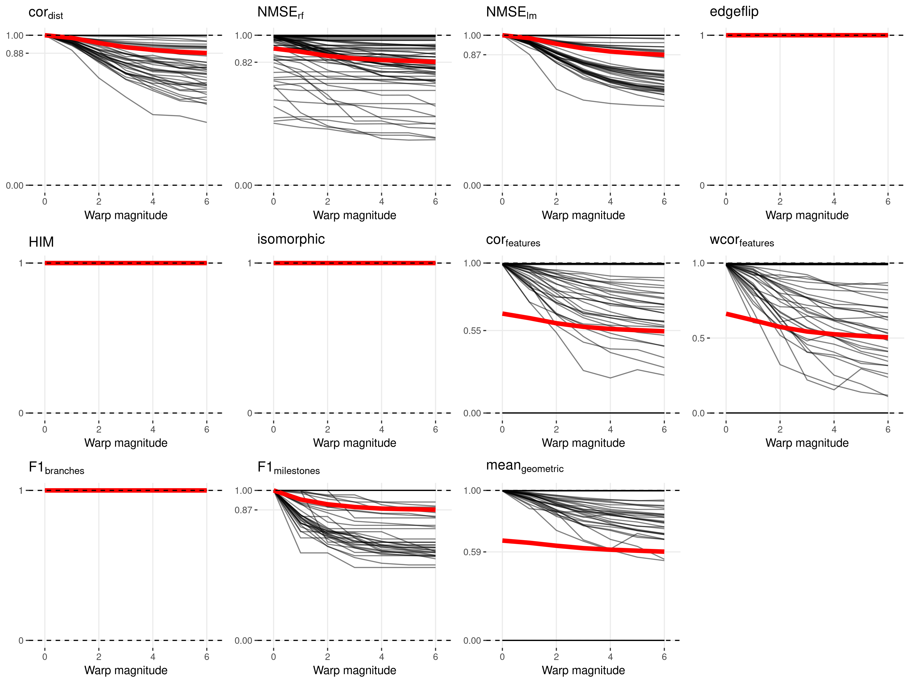
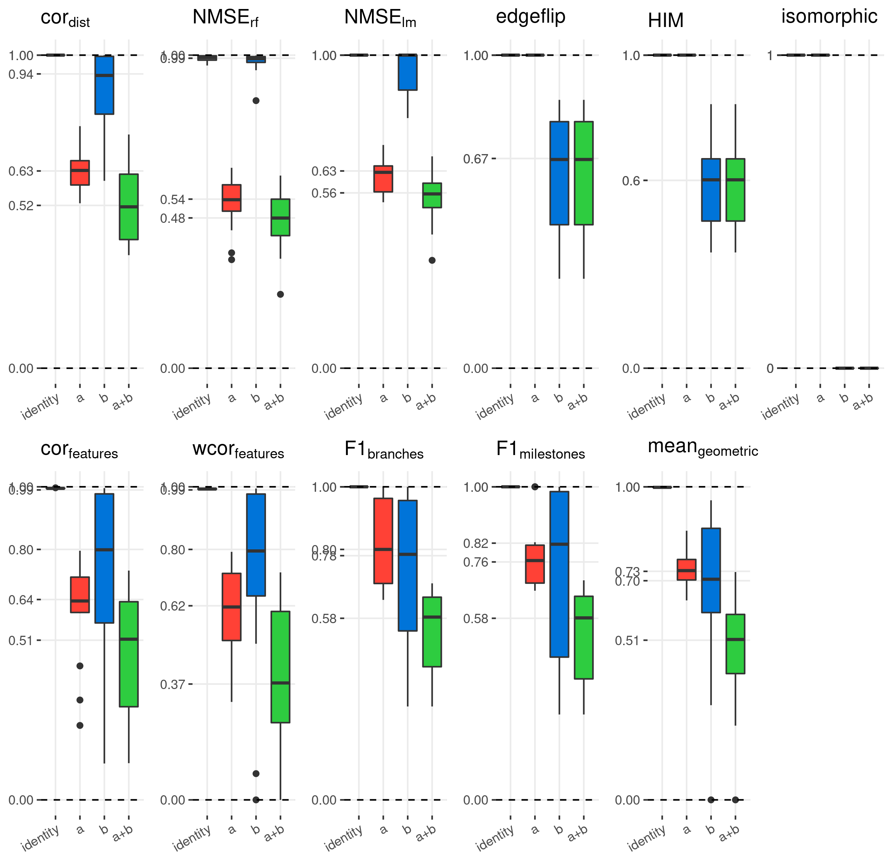
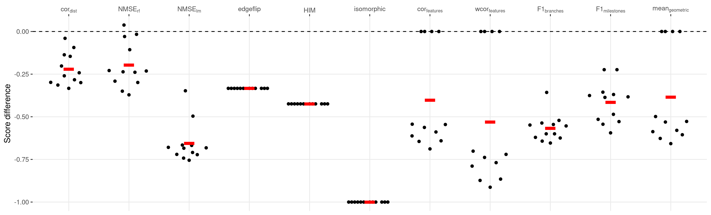

# Metrics to compare two trajectories

A trajectory, as defined in our evaluation, is a model with multiple abstractions. The top abstraction is the topology which contains information about the paths each cell can take from their starting point. Deeper abstractions involve the mapping of each cell to a particular branch within this network, and the position (or ordering) of each cells within these branches. Internally, the topology is represented by the milestone network and regions of delayed commitment, the branch assignment and cellular positions are represented by the milestone percentages ([**Figure 1**](#fig_trajectory_model_example)).

 

<strong>Figure 1: An example trajectory that will be used throughout this section.</strong> It contains contains four milestones (W to Z) and five cells (a to e).

------------------------------------------------------------------------

Given the multilayered complexity of a trajectory model, it is not trivial to compare the similarity of two trajectory models using only one metric. We therefore sought to use different comparison metrics, each serving a different purpose:

-   **Specific metrics** investigate one particular aspect of the trajectory. Such metrics make it possible to find particular weak points for methods, e.g. that a method is very good at ordering but does not frequently find the correct topology. Moreover, having multiple individual metrics make it possible to create personalised rankings of methods, for example for users which are primarily interested in using the method correct topology.
-   **Application metrics** focus on the quality of a downstream analysis using the trajectory. For example, it measures whether the trajectory can be used to find accurate differentially expressed genes.
-   **Overall metrics** should capture all the different abstractions, in other words such metrics measure whether the resulting trajectory has a good topology, that the cells belong to similar branches *and* that they are ordered correctly.

Here, we first describe and illustrate several possible specific, application and overall metrics. Next, we test these metrics on several test cases, to make sure they were robustly identify different wrong trajectory predictions.

All metrics described here were implemented within the [*dyneval*](https://github.com/dynverse/dyneval) R package (<https://github.com/dynverse/dyneval>).

## [Metric characterisation and testing](01-metric_characterisation)

### Specific metrics

#### Isomorphic, edgeflip and HIM: Edit distance between two trajectory topologies

We used three different scores to assess the similarity in the topology between two trajectories, iregardless of where the cells were positioned.

For all three scores, we first simplified the topology of the trajectory to make both graph structures comparable:

-   As we are only interested in the main structure of the topology without start or end, the graph was made undirected.
-   All milestones with degree 2 were removed. For example in the topology A ⇨ B ⇨ C ⇨ D, C ⇨ D, the B milestone was removed
-   A linear topology was converted to A ⇨ B ⇨ C
-   A cyclical topology such as A ⇨ B ⇨ C ⇨ D or A ⇨ B ⇨ A were all simplified to A ⇨ B ⇨ C ⇨ A
-   Duplicated edges such as A ⇨ B, A ⇨ B were decoupled to A ⇨ B, A ⇨ C ⇨ B

The Isomorphic score returns 1 if two graphs are isomorphic, and 0 if they were not. For this, we used the used the BLISS algorithm[1](01-metric_characterisation/#ref-junttila_engineeringefficientcanonical_2007), as implemented in the R *igraph* package.

The edgeflip score was defined as the minimal number of edges which should be added or removed to convert one network into the other, divided by the total number of edges in both networks. This problem is equivalent to the maximum common edge subgraph problem, a known NP-hard problem without a scalable solution[2](01-metric_characterisation/#ref-bahiense_maximumcommonedge_2012). We implemented a branch and bound approach for this problem, using several heuristics to speed up the search:

-   First check all possible edge additions and removals corresponding to the number of different edges between the two graphs. If no solution is found, check all possible solutions with two extra edge additions/removals.
-   For each possible solution, first check whether:
-   The maximal degree is the same
-   The minimal degree is the same
-   All degrees are the same after sorting
-   Only then check if the two graphs are isomorphic as described earlier.

The HIM metric (Hamming-Ipsen-Mikhailov distance)[3](01-metric_characterisation/#ref-jurmanHIMGlocalMetric2015) which was adopted from the R nettools package <https://github.com/filosi/nettools>. It uses an adjacency matrix which was weighted according to the lengths of each edges within the milestone network. Conceptually, HIM is a linear combination of:

-   The normalised Hamming distance[4](01-metric_characterisation/#ref-doughertyValidationGeneRegulatory2011), which calculates the distance between two graphs by matching individual edges in the adjacency matrix, but disregards overall structural similarity.
-   The normalised Ipsen-Mikhailov distance[5](01-metric_characterisation/#ref-ipsenEvolutionaryReconstructionNetworks2002), which calculates the overall distance of two graphs based on matches between its degree and adjacency matrix, while disregarding local structural similarities. It requires a  parameter, which is usually estimated based on the number of nodes in the graph, but which we fixed at  so as to make the score comparable across different graph sizes.

We compared the three scores for several common topologies ([**Figure 1**](01-metric_characterisation/#fig_topology_scores_overview)). While conceptually very different, the edgeflip and HIM still produce similar scores ([**Figure 1b**](01-metric_characterisation/#fig_topology_scores_overview)). The HIM tends to punish the detection of cycles, while the edgeflip is more harsh for differences in the number of bifurcations ([**Figure 1c**](01-metric_characterisation/#fig_topology_scores_overview)). The main difference however is that the HIM takes into account edge lengths when comparing two trajectories, as illustrated in ([**Figure 1d**](01-metric_characterisation/#fig_topology_scores_overview)). Short "extra" edges in the topology are less punished by the HIM than by the edgeflip.

 

<strong>Figure 1: Isomorphic, edgeflip and HIM .</strong>

------------------------------------------------------------------------

To summarise, the different topology based scores are useful for different scenarios:

-   If the two trajectories should only be compared when the topology is exactly the same, the Isomorphic should be used.
-   If it is important that the topologies are similar (but possible exactly isomorphic), the edgeflip is most appropriate.
-   If the topologies should be similar, but shorter edges should not be punished as hard as longer edges, the HIM is most appropriate.

#### F1branches and F1milestones: Comparing how well the cells are clustered in the trajectory

Perhaps one of the simplest ways to calculate the similarity between the cellular positions of two topologies is by mapping each cell to its closest milestone *or* branch ([**Figure 2**](01-metric_characterisation/#fig_clustering_scores_overview)). These clusters of cells can then be compared using one of the many external cluster evaluation measures[6](01-metric_characterisation/#ref-saelensComprehensiveEvaluationModule2018). When selecting a cluster evaluation metric, we had two main conditions:

-   Because we allow some methods to filter cells in the trajectory, the metric should be able to handle "non-exhaustive assignment", where some cells are not assigned to any cluster.
-   The metric should give each cluster equal weight, so that rare cell stages are equally important as large stages.

The  score between the  and  is a metric which conforms to both these conditions. This metric will map two clustersets by using their shared members based on the  similarity. It then calculates the  as the average maximal  for every cluster in the first set of clusters (in our case the gold standard). Conversely, the  is calculated based on the average maximal similarity in the second set of clusters (in our case the prediction). Both the  and  are then given equal weight in a harmonic mean (). Formally, if  and  are two cell clusters:

%20=%20%5Cfrac%7B%7Cc%20%5Ccap%20c'%7C%7D%7B%7Cc%20%5Ccup%20c'%7C%7D)

%7D%7D%7D)

%7D%7D%7D)

 

<strong>Figure 2: Mapping cells to their closest milestone or branch for the calculation of the F1milestones and F1branches .</strong>

------------------------------------------------------------------------

#### cordist: Correlation between geodesic distances

When the position of a cell is the same in both the gold standard and the prediction, its *relative* distances to all other cells in the trajectory should also be the same. This observation is the basis for the cordist metric.

 

<strong>Figure 3: The calculation of geodesic distances on a small example trajectory.</strong> a) A toy example containing four milestones (W to Z) and five cells (a to e). b) The corresponding milestone network, milestone percentages and regions of delayed commitment, when the toy trajectory is converted to the common trajectory model. c) The calculations made for calculating the pairwise geodesic distances. d) A heatmap representation of the pairwise geodesic distances.

------------------------------------------------------------------------

The geodesic distance is the distance a cell has to go through the trajectory space to get from one position to another ([**Figure 3**](01-metric_characterisation/#fig_metrics_geodesic)). The way this distance is calculated depends on how two cells are positioned:

-   **Both cells are on the same edge in the milestone network.** In this case, the distance is defined as the product of the difference in milestone percentages and the length of the transition they both reside on. The geodesic distance is defined as the product of the difference in milestone percentages and the length of their common edge. For cells  and  in the example, ) is equal to %20=%200.7).
-   **Cells reside on different edges in the milestone network.** First, the distance of the cell to all its nearby milestones is calculated, based on its percentage within the edge and the length of the edge. These distances in combination with the milestone network are used to calculate the shortest path distance between the two cells. For cells  and  in the example, %20=%201%20%5Ctimes%200.9) and %20=%203%20%5Ctimes%200.2), and therefore %20=%201%20%5Ctimes%200.9%20+%203%20%5Ctimes%200.2).

The geodesic distance can be easily extended towards cells within regions of delayed commitment. When both cells are part of the same region of delayed commitment, the geodesic distance was defined as the manhattan distances between the milestone percentages weighted by the lengths from the milestone network. For cells  and  in the example, ) is equal to %20+%202%20%5Ctimes%20(0.7%20-%200.2)%20+%203%20%5Ctimes(0.4%20-%200.1)), which is equal to . The distance between two cells where one is part of a region of delayed commitment is calculated similarly to the previous paragraph, by first calculating the distance between the cells and their neighbouring milestones first, then calculating the shortest path distances between the two.

Calculating the pairwise distances between cells scales quadratically with the number of cells, and would therefore not be scaleable for large datasets. For this reason, a set of waypoint cells are defined *a priori*, and only the distances between the waypoint cells and all other cells is calculated, in order to calculate the correlation of geodesic distances of two trajectories ([**Figure 4a**](01-metric_characterisation/#fig_waypoints_overview)). These cell waypoints are determined by viewing each milestone, edge between two milestones and region of delayed commitment as a collection of cells. We do stratified sampling from each collection of cells by weighing them by the total number of cells within that collection. For calculating the cordist between two trajectories, the distances between all cells and the union of both waypoint sets is computed.

To select the number of cell waypoints, we need to find a trade-off between the accuracy versus the time to calculate cordist. To select an optimal number of cell waypoints, we used the synthetic dataset with the most complex topology, and determined the cordist at different levels of both cell shuffling and number of cell waypoints ([**Figure 4b**](01-metric_characterisation/#fig_waypoints_overview)). We found that using cell waypoints does not induce a systematic bias in the cordist, and that its variability was relatively minimal when compared to the variability between different levels of cell shuffling when using 100 or more cell waypoints.

 

<strong>Figure 4: Determination of cell waypoints</strong> a) Illustration of the stratified cell sampling using an example dataset (top). Each milestone, edge between two milestones and region of delayed commitment is seen as a collection of cells (middle), and the number of waypoints (100 in this case) are divided over each of these collection of cells (bottom). b) Accuracy versus time to calculate cordist

------------------------------------------------------------------------

#### NMSErf and NMSElm: Using the positions of the cells within one trajectory to predict the cellular positions in the other trajectory

An alternative approach to detect whether the positions of cells are similar between two trajectories, is to use the positions of one trajectory to predict the positions within the other trajectory. If the cells are at similar positions in the trajectory (relative to its nearby cells), its prediction error should be low.

Specifically, we implemented two metrics which predict the milestone percentages from the gold standards by using the predicted milestone percentages as features ([**Figure 5**](01-metric_characterisation/#fig_metrics_prediction)). We did this with two regression methods, linear regression (, using the R `lm` function) and Random Forest (, implemented in the *ranger* package[7](01-metric_characterisation/#ref-wright_rangerfastimplementation_2017)). In both cases, the accuracy of the prediction was measured using the Mean Squared error (), in the case of Random forest we used the out-of-bag mean-squared error. Next, we calculated  equal to the  when predicting all milestone percentages as the average. We used this to calculate the normalised mean squared error as . We created a regression model for every milestone in the gold standard, and averaged the  values to finally obtain the NMSErf and NMSElm scores.

 

<strong>Figure 5: The calculation of NMSElm distances on a small example trajectory.</strong>

------------------------------------------------------------------------

### Application metrics

Although most metrics described above already assess some aspects directly relevant to the user, such as whether the method is good at finding the right topology, these metrics do not assess the quality of downstream analyses and hypotheses which can be generated from these models.

#### corfeatures and wcorfeatures: The accuracy of dynamical differentially expressed features/genes.

Perhaps the main advantage of studying cellular dynamic processes using single-cell -omics data is that the dynamics of gene expression can be studied for the whole transcriptome. This can be used to construct other models such as dynamic regulatory networks and gene expression modules. Such analyses rely on a "good-enough" cellular ordering, so that it can be used to identify dynamical differentially expressed genes.

To calculate the corfeatures we used Random forest regression to rank all the features according to their importance in predicting the positions of cells in the trajectory. Specifically, we calculated the geodesic distances for each cell to all milestones in the trajectory. Next, we trained a Random Forest regression model (implemented in the R *ranger* package[7](01-metric_characterisation/#ref-wright_rangerfastimplementation_2017), <https://github.com/imbs-hl/ranger>) to predict these distances for each milestone, based on the expression of genes within each cell. We then extracted feature importances using the Mean Decrease in Impurity (`importance = 'impurity'` parameter of the `ranger` function), as illustrated in ([**Figure 6**](01-metric_characterisation/#fig_featureimp_overview)). The overall importance of a feature (gene) was then equal to the mean importance over all milestones. Finally, we compared the two rankings by calculating the Pearson correlation, with values lower than between -1 and 0 clipped to 0.

 

<strong>Figure 6: </strong>

------------------------------------------------------------------------

Random forest regression has two main hyperparameters. The number of trees to be fitted (`num_trees` parameter) was fixed to `10000` to provide accurate and stable estimates of the feature importance ([**Figure 7**](01-metric_characterisation/#fig_featureimp_cor_distributions)). The number of features on which can be split (`mtry` parameter) was set to 1% of all available features (instead of the default square-root of the number of features), as to make sure that predictive but highly correlated features (omnipresent in transcriptomics data) are not suppressed in the ranking.

 

<strong>Figure 7: </strong>

------------------------------------------------------------------------

For most datasets, only a limited number of features will be differentially expressed in the trajectory. For example, in the dataset used in [**Figure 7**](01-metric_characterisation/#fig_featureimp_cor_distributions) only the top 10%-20% show a clear pattern of differential expression. The correlation will weight each of these features equally, and will therefore give more weight to the bottom, irrelevant features. To prioritise the top differentially expressed features, we also implemented the wcorfeatures, which will weight the correlation using the feature importance scores in the gold standard so that the top features have relatively more impact on the score ([**Figure 8**](01-metric_characterisation/#fig_featureimp_wcor_effect)).

 

<strong>Figure 8: </strong>

------------------------------------------------------------------------

### Overall metrics

Undoubtedly, a single optimal overall metric does not exist for trajectories, as different users may have different priorities:

-   A user may be primarily interested in defining the correct topology, and only use the cellular ordering when the topology is correct
-   A user may be less interested in how the cells are ordered within a branch, but primarily in which cells are in which branches
-   A user may already know the topology, and may be primarily interested in finding good features related to a particular branching point
-   ...

As the main overall metric for the evaluation, we therefore chose a metric which weighs every aspect of the trajectory equally:

-   Its **ordering**, using the cordist
-   Its **branch assignment**, using the F1branches
-   Its **topology**, using the edgeflip
-   The accuracy of **differentially expressed features**, using the wcorfeatures

Even though all metrics range between 0 and 1, their actual values have

## [References](01-metric_characterisation)

1.  Junttila, T. & Kaski, P. Engineering an Efficient Canonical Labeling Tool for Large and Sparse Graphs. in *2007 Proceedings of the Ninth Workshop on Algorithm Engineering and Experiments (ALENEX)* 135–149 (Society for Industrial and Applied Mathematics, 2007). <doi:%5B10.1137/1.9781611972870.13%5D(https://doi.org/10.1137/1.9781611972870.13)>

2.  Bahiense, L., Manić, G., Piva, B. & de Souza, C. C. The maximum common edge subgraph problem: A polyhedral investigation. *Discrete Applied Mathematics* **160,** 2523–2541 (2012).

3.  Jurman, G., Visintainer, R., Filosi, M., Riccadonna, S. & Furlanello, C. The HIM glocal metric and kernel for network comparison and classification. in *2015 IEEE International Conference on Data Science and Advanced Analytics (DSAA)* 1–10 (2015). <doi:%5B10.1109/DSAA.2015.7344816%5D(https://doi.org/10.1109/DSAA.2015.7344816)>

4.  Dougherty, E. R. Validation of gene regulatory networks: Scientific and inferential. *Briefings in Bioinformatics* **12,** 245–252 (2011).

5.  Ipsen, M. & Mikhailov, A. S. Evolutionary reconstruction of networks. *Physical Review. E, Statistical, Nonlinear, and Soft Matter Physics* **66,** 046109 (2002).

6.  Saelens, W., Cannoodt, R. & Saeys, Y. A comprehensive evaluation of module detection methods for gene expression data. *Nature Communications* **9,** 1090 (2018).

7.  Wright, M. N. & Ziegler, A. Ranger: A Fast Implementation of Random Forests for High Dimensional Data in C++ and R | Wright | Journal of Statistical Software. *Journal of Statistical Software* **77,** (2017).

## [Metric conformity](02-metric_conformity)

Although most metrics described in the previous section make sense intuitively, this does not necessarily mean that these metrics are robust and will generate reasonable results when used for benchmarking. This is because different methods and datasets will all lead to a varied set of trajectory models:

-   Real datasets have all cells grouped onto milestones
-   Some methods place all cells in a region of delayed commitment, others never generate a region of delayed commitment
-   Some methods always return a linear trajectory, even if a bifurcation is present in the data
-   Some methods filter cells

A good metric, especially a good overall metric, should work in all these circumstances. To test this, we designed a set of rules to which a good metric should conform, and assessed empirically whether a metric conforms to these rules.

We generated a panel of toy datasets (using our [*dyntoy*](https://github.com/dynverse/dyntoy) package, <https://github.com/dynverse/dyntoy>) with all possible combinations of:

-   \# cells: 10, 50, 100, 200 and 500
-   \# features: 200
-   topologies: linear, bifurcation, multifurcating, tree, cycle, connected graph and disconnected graph
-   Whether cells are placed on the milestones (as in real data) or on the edges/regions of delayed commitment between the milestones (as in synthetic data)

We then perturbed the trajectories in these datasets in certain ways, and tested whether the scores follow an expected pattern. An overview of the conformity of every metric is first given in [**Table 1**](02-metric_conformity/#table_conformity_overview). The individual rules and metric behaviour are discussed more into detail after that.

| name                                            | cordist | NMSErf | NMSElm | edgeflip | corfeatures | F1branches | F1milestones | hmean |
|:------------------------------------------------|:-------------------|:------------------|:------------------|:---------|:-----------------------|:----------------------|:------------------------|:------|
| New connecting edges                            | ✔                  | ✖                 | ✖                 | ✔        | ✖                      | ✔                     | ✔                       | ✔     |
| New leaf edges                                  | ✖                  | ✖                 | ✖                 | ✔        | ✖                      | ✔                     | ✔                       | ✔     |
| Cycle breaking                                  | ✔                  | ✖                 | ✖                 | ✔        | ✔                      | ✖                     | ✔                       | ✔     |
| Cells on milestones vs edges                    | ✔                  | ✔                 | ✔                 | ✔        | ✔                      | ✔                     | ✔                       | ✔     |
| Change of topology                              | ✔                  | ✖                 | ✖                 | ✔        | ✔                      | ✖                     | ✔                       | ✔     |
| Changing positions locally and/or globally      | ✔                  | ✔                 | ✔                 | ✖        | ✔                      | ✖                     | ✖                       | ✔     |
| Bifurcation merging and changing cell positions | ✔                  | ✔                 | ✔                 | ✖        | ✔                      | ✔                     | ✔                       | ✔     |
| Changing topology and cell position             | ✖                  | ✖                 | ✖                 | ✖        | ✔                      | ✖                     | ✖                       | ✔     |
| Bifurcation concatentation                      | ✔                  | ✖                 | ✔                 | ✔        | ✔                      | ✔                     | ✔                       | ✔     |
| Same score on identity                          | ✔                  | ✖                 | ✔                 | ✔        | ✖                      | ✔                     | ✔                       | ✔     |
| Cell filtering                                  | ✔                  | ✔                 | ✔                 | ✖        | ✔                      | ✔                     | ✔                       | ✔     |
| Linear joining                                  | ✔                  | ✖                 | ✖                 | ✔        | ✖                      | ✖                     | ✔                       | ✔     |
| Bifurcation merging                             | ✔                  | ✖                 | ✔                 | ✔        | ✔                      | ✔                     | ✔                       | ✔     |
| Cells into small subedges                       | ✖                  | ✖                 | ✖                 | ✔        | ✔                      | ✔                     | ✔                       | ✔     |
| Removing divergence regions                     | ✔                  | ✔                 | ✔                 | ✖        | ✔                      | ✖                     | ✔                       | ✔     |
| Local and global cell shuffling                 | ✔                  | ✖                 | ✖                 | ✖        | ✔                      | ✔                     | ✔                       | ✔     |
| Local cell shuffling                            | ✔                  | ✔                 | ✔                 | ✖        | ✔                      | ✖                     | ✖                       | ✔     |
| Edge shuffling                                  | ✔                  | ✔                 | ✔                 | ✖        | ✔                      | ✔                     | ✔                       | ✔     |
| Length shuffling                                | ✔                  | ✖                 | ✖                 | ✖        | ✖                      | ✖                     | ✖                       | ✔     |
| Linear splitting                                | ✔                  | ✔                 | ✖                 | ✔        | ✔                      | ✔                     | ✔                       | ✔     |
| Move cells to closest milestone                 | ✔                  | ✖                 | ✔                 | ✖        | ✔                      | ✖                     | ✔                       | ✔     |
| Move cells to start milestone                   | ✔                  | ✔                 | ✔                 | ✖        | ✔                      | ✖                     | ✔                       | ✔     |

**Table 1: Overview of whether a particular metric conforms to a particular rule**

### Same score on identity

The score should be approximately the same when comparing the trajectory to itself

A metric conforms to this rule if: 

Metrics which contain some stochasticity (random forest based metrics in particular), usually do not conform to this rule, even though their scores are still consistently high.

 

<strong>Figure 1: Example dataset(s) for this rule</strong>

------------------------------------------------------------------------

 

<strong>Figure 2: Example dataset(s) for this rule</strong>

------------------------------------------------------------------------

### Local cell shuffling

Shuffling the positions of cells within each edge should lower the score. This is equivalent to changing the cellular position locally.

A metric conforms to this rule if: 

Metrics which do not look at the cellular positioning, or group the cells within branches or milestones, do not conform to this rule.

 

<strong>Figure 3: Example dataset(s) for this rule</strong>

------------------------------------------------------------------------

 

<strong>Figure 4: Example dataset(s) for this rule</strong>

------------------------------------------------------------------------

### Edge shuffling

Shuffling the edges in the milestone network should lower the score. This is equivalent to changing the cellular positions only globally.

A metric conforms to this rule if: )

Only metrics which only look at the topology do not conform to this rule.

 

<strong>Figure 5: Example dataset(s) for this rule</strong>

------------------------------------------------------------------------

 

<strong>Figure 6: Example dataset(s) for this rule</strong>

------------------------------------------------------------------------

### Local and global cell shuffling

Shuffling the positions of cells should lower the score. This is equivalent to changing the cellular position both locally and globally.

A metric conforms to this rule if: )

Most metrics that look at the position of each cell conform to this rule.

 

<strong>Figure 7: Example dataset(s) for this rule</strong>

------------------------------------------------------------------------

 

<strong>Figure 8: Example dataset(s) for this rule</strong>

------------------------------------------------------------------------

### Changing positions locally and/or globally

Changing the cellular position locally AND globally should lower the score more than any of the two individually.

A metric conforms to this rule if: 

Most metrics that look at the position of each cell conform to this rule.

 

<strong>Figure 9: Example dataset(s) for this rule</strong>

------------------------------------------------------------------------

 

<strong>Figure 10: Example dataset(s) for this rule</strong>

------------------------------------------------------------------------

### Cell filtering

Removing cells from the trajectory should lower the score

A metric conforms to this rule if: )

Only metrics which look only at the topology do not conform to this rule.

 

<strong>Figure 11: Example dataset(s) for this rule</strong>

------------------------------------------------------------------------

 

<strong>Figure 12: Example dataset(s) for this rule</strong>

------------------------------------------------------------------------

### Removing divergence regions

Removing divergence regions should lower the score

A metric conforms to this rule if: 

Both !\[\](*h**t**t**p**s* : //*l**a**t**e**x*.\*c**o**d**e**c**o**g**s*.*c**o**m*/*g**i**f*.*l**a**t**e\*\*x\*? fail here because neither the topology nor the branche assignment changes.

 

<strong>Figure 13: Example dataset(s) for this rule</strong>

------------------------------------------------------------------------

 

<strong>Figure 14: Example dataset(s) for this rule</strong>

------------------------------------------------------------------------

### Move cells to start milestone

Moving the cells closer to their start milestone should lower the score. Cells were moved closer to the start milestone by doing $^{}

A metric conforms to this rule if: )

Both !\[\](*h**t**t**p**s* : //*l**a**t**e**x*.\*c**o**d**e**c**o**g**s*.*c**o**m*/*g**i**f*.*l**a**t**e\*\*x\*? fail here because neither the topology nor the branche assignment changes.

 

<strong>Figure 15: Example dataset(s) for this rule</strong>

------------------------------------------------------------------------

 

<strong>Figure 16: Example dataset(s) for this rule</strong>

------------------------------------------------------------------------

### Move cells to closest milestone

Moving the cells closer to their nearest milestone should lower the score

A metric conforms to this rule if: )

Both !\[\](*h**t**t**p**s* : //*l**a**t**e**x*.\*c**o**d**e**c**o**g**s*.*c**o**m*/*g**i**f*.*l**a**t**e\*\*x\*? fail here because neither the topology nor the branche assignment changes.

 

<strong>Figure 17: Example dataset(s) for this rule</strong>

------------------------------------------------------------------------

 

<strong>Figure 18: Example dataset(s) for this rule</strong>

------------------------------------------------------------------------

### Length shuffling

Shuffling the lengths of the edges of the milestone network should lower the score.

A metric conforms to this rule if: 

Only the correlation scores is consequently decreased when the lengths of the edges change.

 

<strong>Figure 19: Example dataset(s) for this rule</strong>

------------------------------------------------------------------------

 

<strong>Figure 20: Example dataset(s) for this rule</strong>

------------------------------------------------------------------------

### Cells into small subedges

Moving some cells into short subedges should lower the score

A metric conforms to this rule if: )

This rule is primarily captured by the scores looking at the topology and clustering quality.

 

<strong>Figure 21: Example dataset(s) for this rule</strong>

------------------------------------------------------------------------

 

<strong>Figure 22: Example dataset(s) for this rule</strong>

------------------------------------------------------------------------

### New leaf edges

Adding new edges only connected to one existing milestone should lower the score

A metric conforms to this rule if: )

As the positions of the cells are not affected, only metrics which investigate the clustering quality and topology conform to this rule.

 

<strong>Figure 23: Example dataset(s) for this rule</strong>

------------------------------------------------------------------------

 

<strong>Figure 24: Example dataset(s) for this rule</strong>

------------------------------------------------------------------------

### New connecting edges

Adding new edges between existing milestones should lower the score

A metric conforms to this rule if: )

Even though the positions of the cells change, the !\[\](*h**t**t**p**s* : //*l**a**t**e**x*.\*c**o**d**e**c**o**g**s*.*c**o**m*/*g**i**f*.*l**a**t**e\*\*x\*? still conforms to this rule because new edges can create shortcuts which will affect the geodesic distances between cells. Apart from this, metrics which investigate the clustering quality and topology also conform to this rule.

 

<strong>Figure 25: Example dataset(s) for this rule</strong>

------------------------------------------------------------------------

 

<strong>Figure 26: Example dataset(s) for this rule</strong>

------------------------------------------------------------------------

### Changing topology and cell position

Changing both the topology and the cell positions should lower the score more than any of the two individually

A metric conforms to this rule if: 

Most metrics have problems with this rule as they focus on either the cellular positions or the topology individually. Only the %7D) and the %7D) conform to this rule.

 

<strong>Figure 27: Example dataset(s) for this rule</strong>

------------------------------------------------------------------------

 

<strong>Figure 28: Example dataset(s) for this rule</strong>

------------------------------------------------------------------------

### Bifurcation merging

Merging the two branches after a bifurcation point should lower the score

A metric conforms to this rule if: 

This changes both the cellular ordering and the topology so most metrics are affected.

 

<strong>Figure 29: Example dataset(s) for this rule</strong>

------------------------------------------------------------------------

 

<strong>Figure 30: Example dataset(s) for this rule</strong>

------------------------------------------------------------------------

### Bifurcation merging and changing cell positions

Merging the two branches of a bifurcation and changing the cells positions should lower the score more than any of the two individually

A metric conforms to this rule if: 

Only metrics which look uniquely at the topology do not conform to this rule.

 

<strong>Figure 31: Example dataset(s) for this rule</strong>

------------------------------------------------------------------------

 

<strong>Figure 32: Example dataset(s) for this rule</strong>

------------------------------------------------------------------------

### Bifurcation concatentation

Concatenating one branch of a bifurcation to the other bifurcation branch should lower the score

A metric conforms to this rule if: 

This changes both the cellular ordering and the topology so most metrics conform to this rule.

 

<strong>Figure 33: Example dataset(s) for this rule</strong>

------------------------------------------------------------------------

 

<strong>Figure 34: Example dataset(s) for this rule</strong>

------------------------------------------------------------------------

### Cycle breaking

Breaking a cyclic trajectory should lower the score

A metric conforms to this rule if: 

Because the actual positions of the cells nor the branch assignment change, both the MSE metrics and the !\[\](*h**t**t**p**s* : //*l**a**t**e**x*.\*c**o**d**e**c**o**g**s*.*c**o**m*/*g**i**f*.*l**a**t**e\*\*x\*? do not conform to this rule.

 

<strong>Figure 35: Example dataset(s) for this rule</strong>

------------------------------------------------------------------------

 

<strong>Figure 36: Example dataset(s) for this rule</strong>

------------------------------------------------------------------------

### Linear joining

Joining the two ends of a linear trajectory should lower the score

A metric conforms to this rule if: 

Because the positions of the cells can be perfectly predicted, the MSE metrics do not conform to this rule. Furthermore, because the branch assignment change stays the same, the !\[\](*h**t**t**p**s* : //*l**a**t**e**x*.\*c**o**d**e**c**o**g**s*.*c**o**m*/*g**i**f*.*l**a**t**e\*\*x\*? also does not conform to this rule.

 

<strong>Figure 37: Example dataset(s) for this rule</strong>

------------------------------------------------------------------------

 

<strong>Figure 38: Example dataset(s) for this rule</strong>

------------------------------------------------------------------------

### Linear splitting

Splitting a linear trajectory into a bifurcation should lower the score

A metric conforms to this rule if: 

Only the MSE metrics do not conform to this rule as the positions of the cells can be perfectly predicted in the gold standard given the prediction.

 

<strong>Figure 39: Example dataset(s) for this rule</strong>

------------------------------------------------------------------------

 

<strong>Figure 40: Example dataset(s) for this rule</strong>

------------------------------------------------------------------------

### Change of topology

Changing the topology of the trajectory should lower the score

A metric conforms to this rule if: 

Because the positions of the cells can be perfectly predicted, the MSE metrics do not conform to this rule. Furthermore, because the branch assignment change stays the same, the !\[\](*h**t**t**p**s* : //*l**a**t**e**x*.\*c**o**d**e**c**o**g**s*.*c**o**m*/*g**i**f*.*l**a**t**e\*\*x\*? also does not conform to this rule.

 

<strong>Figure 41: Example dataset(s) for this rule</strong>

------------------------------------------------------------------------

 

<strong>Figure 42: Example dataset(s) for this rule</strong>

------------------------------------------------------------------------

### Cells on milestones vs edges

A score should behave similarly both when cells are located on the milestones (as is the case in real datasets) or on the edges between milestones (as is the case in synthetic datasets).

A metric conforms to this rule if: %20%3E%200.9)

All scores conform to this rule.

 

<strong>Figure 43: Example dataset(s) for this rule</strong>

------------------------------------------------------------------------

 

<strong>Figure 44: Example dataset(s) for this rule</strong>

------------------------------------------------------------------------
