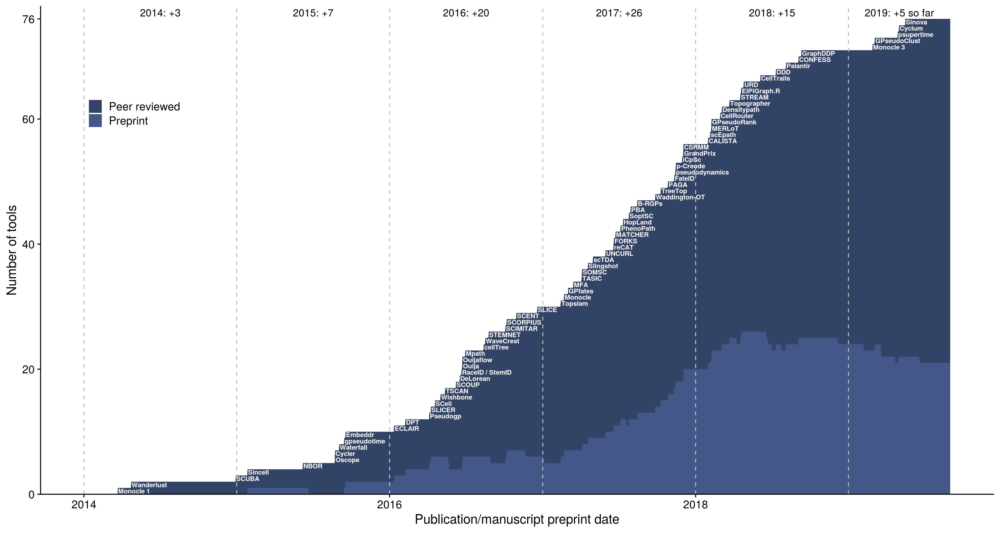
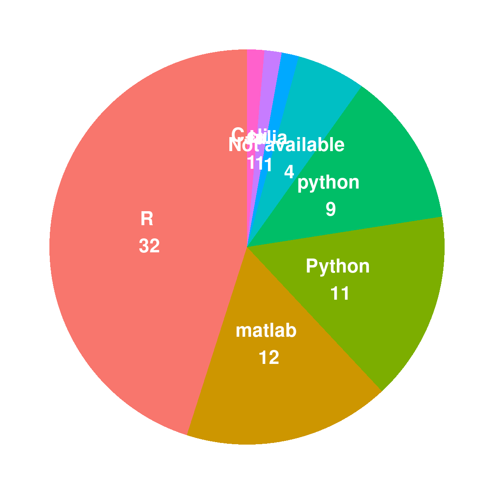

# Characterisation of TI tools and methods

<strong>[**Figure 1**](#fig_tool_ordering): Number of trajectory
inference tools over time</strong>

-----

<strong>[**Figure 2**](#fig_platforms): Computer languages in which
these TI tools are written</strong>

-----

<strong>[**Figure 3**](#fig_tool_trajectory_types_over_time): Number of
tools able to predict a particular trajectory type over time</strong>

-----

<strong>[**Figure 4**](#fig_topology_inference_timeline): Number of
tools fixing the topology over time</strong>

-----
