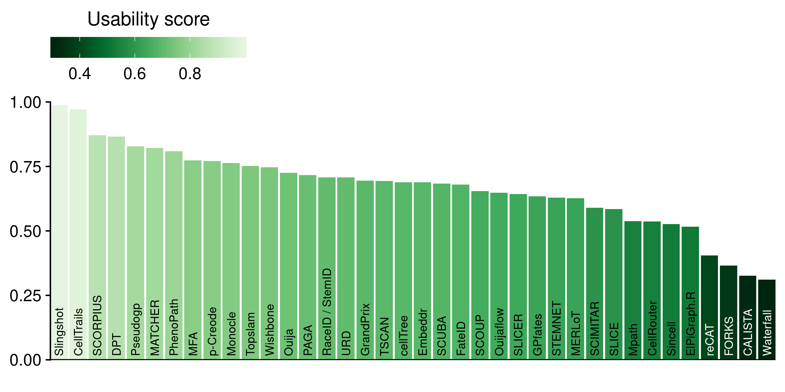
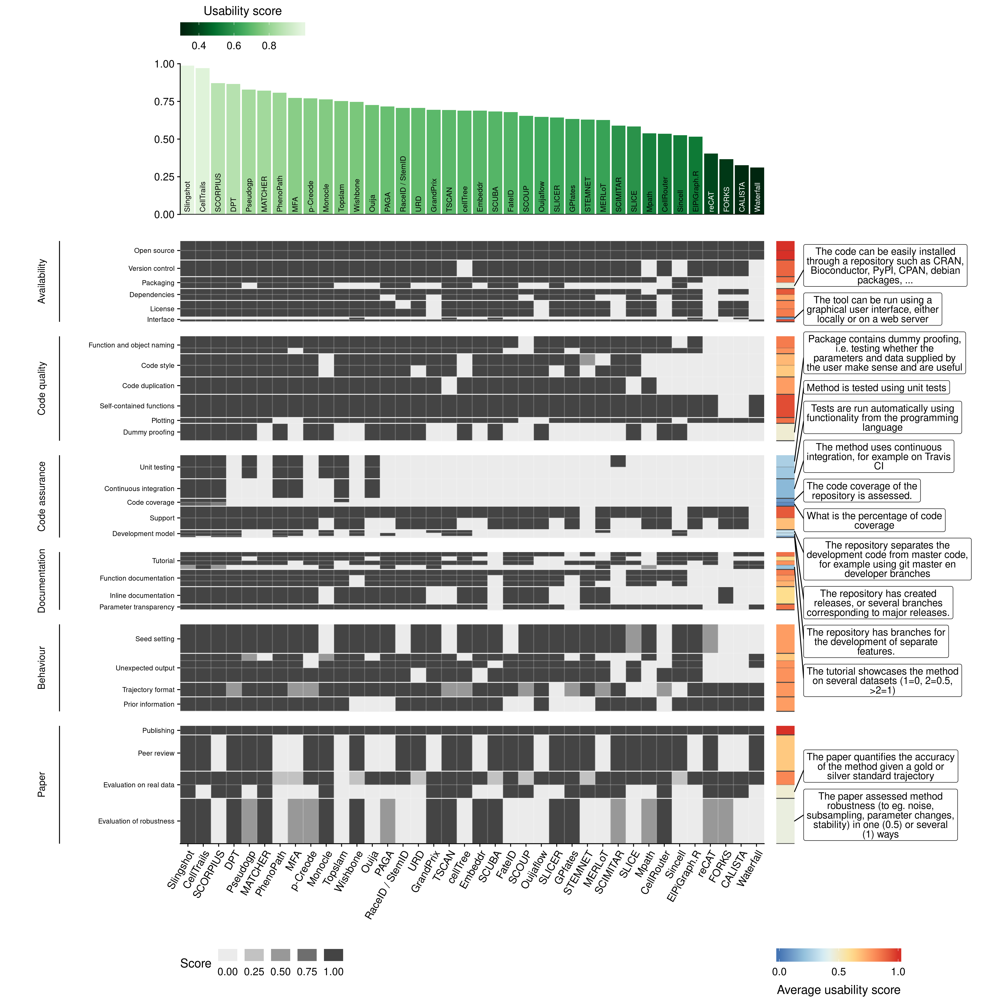

# Trajectory inference methods

## [Tool quality control](02-tool_qc)

While not directly related to the accuracy of the inferred trajectory, the quality of the implementation of a method is also an important evaluation metric[1](#ref-_doesyourcode_2018). **User friendly** tools can be easily installed, have an intuitive user interface, and contain in depth documentation. SUch tools are thus easy to apply on new datasets by both experienced and novice users. **Developer friendly** tools can be easily adapted by other developers, expanding the scope, scalability or accuracy of the tool and thus stimulating new developments in the field. Finally, **future proof** tools contain several indications that the tool will stand the test of time, by (among other things) including a rigorous assessment of the accuracy and robustness of the method. an important evaluation metric.

To assess these three major reasons behind the need for good tools, we created a transparent checklist of important scientific and software development practices. Each point of this checklist is grouped inside an "aspect", which is weighted based on how often we found it being cited in a set of articles discussing good practices ([**Table 1**](#table_qc_checks)). We also labelled each item based on whether it concerned the user friendliness, developer friendliness or potential broad applicability.

<table>
<colgroup>
<col width="5%" />
<col width="2%" />
<col width="1%" />
<col width="36%" />
<col width="54%" />
</colgroup>
<thead>
<tr class="header">
<th align="left">
name
</th>
<th align="left">
category
</th>
<th align="right">
weight
</th>
<th align="left">
references
</th>
<th align="left">
items
</th>
</tr>
</thead>
<tbody>
<tr class="odd">
<td align="left">
Open source
</td>
<td align="left">
availability
</td>
<td align="right">
8
</td>
<td align="left">
<a href="#ref-l_rpackages_2017">2</a>, <a href="#ref-wilson_best_2014">3</a>, <a href="#ref-taschuk_ten_2017">4</a>, <a href="#ref-wickham_packagesorganizetest_2015">5</a>, <a href="#ref-artaza_top10metrics_2016">6</a>, <a href="#ref-silva_generalguidelinesbiomedical_2017">7</a>, <a href="#ref-jimenez_foursimplerecommendations_2017">8</a>
</td>
<td align="left">
Method's code is freely available (0.5). The code can be run on a freely available platform (0.5).
</td>
</tr>
<tr class="even">
<td align="left">
Version control
</td>
<td align="left">
availability
</td>
<td align="right">
7
</td>
<td align="left">
<a href="#ref-l_rpackages_2017">2</a>, <a href="#ref-wilson_best_2014">3</a>, <a href="#ref-taschuk_ten_2017">4</a>, <a href="#ref-wickham_packagesorganizetest_2015">5</a>, <a href="#ref-artaza_top10metrics_2016">6</a>, <a href="#ref-silva_generalguidelinesbiomedical_2017">7</a>
</td>
<td align="left">
The code is available on a public version controlled repository, such as Github (1).
</td>
</tr>
<tr class="odd">
<td align="left">
Packaging
</td>
<td align="left">
availability
</td>
<td align="right">
5
</td>
<td align="left">
<a href="#ref-l_rpackages_2017">2</a>, <a href="#ref-wickham_packagesorganizetest_2015">5</a>, <a href="#ref-jimenez_foursimplerecommendations_2017">8</a>, <a href="#ref-silva_generalguidelinesbiomedical_2017">7</a>
</td>
<td align="left">
The code is provided as a "package", exposing functionality through functions or shell commands (0.5). The code can be easily installed through a repository such as CRAN, Bioconductor, PyPI, CPAN, debian packages, ... (0.5).
</td>
</tr>
<tr class="even">
<td align="left">
Dependencies
</td>
<td align="left">
availability
</td>
<td align="right">
5
</td>
<td align="left">
<a href="#ref-taschuk_ten_2017">4</a>, <a href="#ref-wickham_packagesorganizetest_2015">5</a>, <a href="#ref-artaza_top10metrics_2016">6</a>, <a href="#ref-karimzadeh_topconsiderationscreating_">9</a>
</td>
<td align="left">
Dependencies are clearly stated in the tutorial or in the code (0.5). Dependencies are automatically installed (0.5).
</td>
</tr>
<tr class="odd">
<td align="left">
License
</td>
<td align="left">
availability
</td>
<td align="right">
7
</td>
<td align="left">
<a href="#ref-l_rpackages_2017">2</a>, <a href="#ref-taschuk_ten_2017">4</a>, <a href="#ref-wickham_packagesorganizetest_2015">5</a>, <a href="#ref-artaza_top10metrics_2016">6</a>, <a href="#ref-silva_generalguidelinesbiomedical_2017">7</a>, <a href="#ref-jimenez_foursimplerecommendations_2017">8</a>
</td>
<td align="left">
The code is licensed (0.5). License allows academic use (0.5).
</td>
</tr>
<tr class="even">
<td align="left">
Interface
</td>
<td align="left">
availability
</td>
<td align="right">
2
</td>
<td align="left">
<a href="#ref-silva_generalguidelinesbiomedical_2017">7</a>
</td>
<td align="left">
The tool can be run using a graphical user interface, either locally or on a web server (0.5). The tool can be run through the command line or through a programming language (0.5).
</td>
</tr>
<tr class="odd">
<td align="left">
Function and object naming
</td>
<td align="left">
code\_quality
</td>
<td align="right">
3
</td>
<td align="left">
<a href="#ref-wilson_best_2014">3</a>, <a href="#ref-wickham_packagesorganizetest_2015">5</a>
</td>
<td align="left">
Functions/commands have well chosen names (0.67). Arguments/parameters have well chosen names (0.33).
</td>
</tr>
<tr class="even">
<td align="left">
Code style
</td>
<td align="left">
code\_quality
</td>
<td align="right">
4
</td>
<td align="left">
<a href="#ref-wilson_best_2014">3</a>, <a href="#ref-wickham_packagesorganizetest_2015">5</a>, <a href="#ref-artaza_top10metrics_2016">6</a>
</td>
<td align="left">
Code has a consistent style (0.5). Code follows (basic) good practices in the programming language of choice, for example PEP8 or the tidyverse style guide (0.5).
</td>
</tr>
<tr class="odd">
<td align="left">
Code duplication
</td>
<td align="left">
code\_quality
</td>
<td align="right">
3
</td>
<td align="left">
<a href="#ref-wilson_best_2014">3</a>, <a href="#ref-wickham_packagesorganizetest_2015">5</a>
</td>
<td align="left">
Duplicated code is minimal (1).
</td>
</tr>
<tr class="even">
<td align="left">
Self-contained functions
</td>
<td align="left">
code\_quality
</td>
<td align="right">
4
</td>
<td align="left">
<a href="#ref-anderson_writing_2016">10</a>, <a href="#ref-taschuk_ten_2017">4</a>, <a href="#ref-silva_generalguidelinesbiomedical_2017">7</a>
</td>
<td align="left">
The method is exposed to the user as self-contained functions or commands (1).
</td>
</tr>
<tr class="odd">
<td align="left">
Plotting
</td>
<td align="left">
code\_quality
</td>
<td align="right">
1
</td>
<td align="left">
</td>
<td align="left">
Plotting functions are provided for the final and/or intermediate results (1).
</td>
</tr>
<tr class="even">
<td align="left">
Dummy proofing
</td>
<td align="left">
code\_quality
</td>
<td align="right">
3
</td>
<td align="left">
<a href="#ref-l_rpackages_2017">2</a>, <a href="#ref-karimzadeh_topconsiderationscreating_">9</a>
</td>
<td align="left">
Package contains dummy proofing, i.e. testing whether the parameters and data supplied by the user make sense and are useful (1).
</td>
</tr>
<tr class="odd">
<td align="left">
Unit testing
</td>
<td align="left">
code\_assurance
</td>
<td align="right">
6
</td>
<td align="left">
<a href="#ref-l_rpackages_2017">2</a>, <a href="#ref-wilson_best_2014">3</a>, <a href="#ref-anderson_writing_2016">10</a>, <a href="#ref-wickham_packagesorganizetest_2015">5</a>, <a href="#ref-silva_generalguidelinesbiomedical_2017">7</a>
</td>
<td align="left">
Method is tested using unit tests (0.5). Tests are run automatically using functionality from the programming language (0.5).
</td>
</tr>
<tr class="even">
<td align="left">
Continuous integration
</td>
<td align="left">
code\_assurance
</td>
<td align="right">
5
</td>
<td align="left">
<a href="#ref-beaulieu-jones_reproducibility_2017">11</a>, <a href="#ref-wickham_packagesorganizetest_2015">5</a>, <a href="#ref-artaza_top10metrics_2016">6</a>, <a href="#ref-silva_generalguidelinesbiomedical_2017">7</a>
</td>
<td align="left">
The method uses continuous integration, for example on Travis CI (1).
</td>
</tr>
<tr class="odd">
<td align="left">
Code coverage
</td>
<td align="left">
code\_assurance
</td>
<td align="right">
1
</td>
<td align="left">
</td>
<td align="left">
The code coverage of the repository is assessed. (1). What is the percentage of code coverage (1).
</td>
</tr>
<tr class="even">
<td align="left">
Support
</td>
<td align="left">
code\_assurance
</td>
<td align="right">
6
</td>
<td align="left">
<a href="#ref-wilson_best_2014">3</a>, <a href="#ref-wickham_packagesorganizetest_2015">5</a>, <a href="#ref-artaza_top10metrics_2016">6</a>, <a href="#ref-silva_generalguidelinesbiomedical_2017">7</a>, <a href="#ref-jimenez_foursimplerecommendations_2017">8</a>
</td>
<td align="left">
There is a support ticket system, for example on Github (0.5). The authors respond to tickets and issues are resolved within a reasonable time frame (0.5).
</td>
</tr>
<tr class="odd">
<td align="left">
Development model
</td>
<td align="left">
code\_assurance
</td>
<td align="right">
2
</td>
<td align="left">
<a href="#ref-driessen_successfulgitbranching_2010">12</a>
</td>
<td align="left">
The repository separates the development code from master code, for example using git master en developer branches (0.4). The repository has created releases, or several branches corresponding to major releases. (0.4). The repository has branches for the development of separate features. (0.2).
</td>
</tr>
<tr class="even">
<td align="left">
Tutorial
</td>
<td align="left">
documentation
</td>
<td align="right">
6
</td>
<td align="left">
<a href="#ref-wickham_packagesorganizetest_2015">5</a>, <a href="#ref-silva_generalguidelinesbiomedical_2017">7</a>, <a href="#ref-jimenez_foursimplerecommendations_2017">8</a>, <a href="#ref-karimzadeh_topconsiderationscreating_">9</a>, <a href="#ref-boulesteix_tensimplerules_2015">13</a>
</td>
<td align="left">
A tutorial or vignette is available (0.25). The tutorial has example results (0.25). The tutorial has real example data (0.25). The tutorial showcases the method on several datasets (1=0, 2=0.5, &gt;2=1) (0.25).
</td>
</tr>
<tr class="odd">
<td align="left">
Function documentation
</td>
<td align="left">
documentation
</td>
<td align="right">
6
</td>
<td align="left">
<a href="#ref-wilson_best_2014">3</a>, <a href="#ref-taschuk_ten_2017">4</a>, <a href="#ref-wickham_packagesorganizetest_2015">5</a>, <a href="#ref-silva_generalguidelinesbiomedical_2017">7</a>, <a href="#ref-karimzadeh_topconsiderationscreating_">9</a>
</td>
<td align="left">
The purpose and usage of functions/commands is documented (0.33). The parameters of functions/commands are documented (0.33). The output of functions/commands is documented (0.33).
</td>
</tr>
<tr class="even">
<td align="left">
Inline documentation
</td>
<td align="left">
documentation
</td>
<td align="right">
6
</td>
<td align="left">
<a href="#ref-wilson_best_2014">3</a>, <a href="#ref-taschuk_ten_2017">4</a>, <a href="#ref-wickham_packagesorganizetest_2015">5</a>, <a href="#ref-silva_generalguidelinesbiomedical_2017">7</a>, <a href="#ref-karimzadeh_topconsiderationscreating_">9</a>
</td>
<td align="left">
Inline documentation is present in the code (1).
</td>
</tr>
<tr class="odd">
<td align="left">
Parameter transparency
</td>
<td align="left">
documentation
</td>
<td align="right">
2
</td>
<td align="left">
<a href="#ref-taschuk_ten_2017">4</a>
</td>
<td align="left">
All important parameters are exposed to the user (1).
</td>
</tr>
<tr class="even">
<td align="left">
Seed setting
</td>
<td align="left">
behaviour
</td>
<td align="right">
2
</td>
<td align="left">
<a href="#ref-jfp_greendiceare_2016">14</a>
</td>
<td align="left">
The method does not artificially become deterministic, for example by setting some (0.5) or a lot (1) of seeds (1).
</td>
</tr>
<tr class="odd">
<td align="left">
Unexpected output
</td>
<td align="left">
behaviour
</td>
<td align="right">
2
</td>
<td align="left">
<a href="#ref-artaza_top10metrics_2016">6</a>
</td>
<td align="left">
No unexpected output messages are generated by the method (0.25). No unexpected files, folders or plots are generated (0.25). No unexpected warnings during runtime or compilation are generated (0.5).
</td>
</tr>
<tr class="even">
<td align="left">
Trajectory format
</td>
<td align="left">
behaviour
</td>
<td align="right">
1
</td>
<td align="left">
</td>
<td align="left">
The postprocessing necessary to extract the relevant output from the method is minimal (1), moderate (0.5) or extensive (0) (1).
</td>
</tr>
<tr class="odd">
<td align="left">
Prior information
</td>
<td align="left">
behaviour
</td>
<td align="right">
1
</td>
<td align="left">
</td>
<td align="left">
Prior information is required (0), optional (1) or not required (1) (1).
</td>
</tr>
<tr class="even">
<td align="left">
Publishing
</td>
<td align="left">
paper
</td>
<td align="right">
1
</td>
<td align="left">
</td>
<td align="left">
The method is published (1).
</td>
</tr>
<tr class="odd">
<td align="left">
Peer review
</td>
<td align="left">
paper
</td>
<td align="right">
4
</td>
<td align="left">
<a href="#ref-karimzadeh_topconsiderationscreating_">9</a>, <a href="#ref-gannon_essentialrolepeer_2001">15</a>, <a href="#ref-baldwin_refereeswetrust_2017">16</a>
</td>
<td align="left">
The paper is published in a peer-reviewed journal (1).
</td>
</tr>
<tr class="even">
<td align="left">
Evaluation on real data
</td>
<td align="left">
paper
</td>
<td align="right">
3
</td>
<td align="left">
<a href="#ref-aniba_issuesbioinformaticsbenchmarking_2010">17</a>, <a href="#ref-jelizarow_overoptimismbioinformaticsillustration_2010">18</a>
</td>
<td align="left">
The paper shows the method's usefulness on several (1), one (0.25) or no real datasets. (0.5). The paper quantifies the accuracy of the method given a gold or silver standard trajectory (0.5).
</td>
</tr>
<tr class="odd">
<td align="left">
Evaluation of robustness
</td>
<td align="left">
paper
</td>
<td align="right">
5
</td>
<td align="left">
<a href="#ref-karimzadeh_topconsiderationscreating_">9</a>, <a href="#ref-aniba_issuesbioinformaticsbenchmarking_2010">17</a>, <a href="#ref-boulesteix_tensimplerules_2015">13</a>, <a href="#ref-jelizarow_overoptimismbioinformaticsillustration_2010">18</a>
</td>
<td align="left">
The paper assessed method robustness (to eg. noise, subsampling, parameter changes, stability) in one (0.5) or several (1) ways (1).
</td>
</tr>
</tbody>
</table>
**Table 1: Scoring checklist for tool quality control.** Each quality aspect was given a weight based on how often it was mentioned in a set of articles discussing best practices for tool development.

We made an initial assessment of the quality of each tool based on this score sheet. Next, we allowed the authors to respond and rebut through the github issue system at our [dynmethods](https://github.com/dynverse/dynmethods) repository (<https://github.com/dynverse/dynmethods>). After several adapations, we created our final qc score for each method ([**Figure 1**](#fig_tool_ordering)).

 

<strong>Figure 1: Overall quality control score for each method</strong>

------------------------------------------------------------------------

Only 2 tools reached an near-perfect quality control score (CellTrails and Slingshot), with only minor issues regarding the absence of a graphical user interface or the absence of separate development branches ([**Figure 2**](#fig_qc_overview)). The bulk of tools reach a score between 0.5 and 0.7, with several qc items consequently lacking among most of these tools, as listed in [**Figure 2 right**](#fig_qc_overview), with mostly issues regarding the code assurance and the depth by which the tool is evaluated within the paper. Only a limited number of methods reached a score lower than 0.5 (CALISTA, FORKS, reCAT and Waterfall), with issues among all categories.

 

<strong>Figure 2: Overview of the quality control scores for every tool</strong> Shown is the score given for each method on every item from our quality control score sheet. Each aspect of the quality control was part of a category, and each category was weighted so that it contributed equally to the final quality score. Within each category, each aspect also received a weight depending on how often it was mentioned in a set of papers discussing good practices in tool development and evaluation. This is represented in the plot as the height on the y-axis. Top: Average QC score for each method. Right: The average score of each quality control item. Shown into more detail are those items which had an average score lower than 0.5.

------------------------------------------------------------------------

#### References

1.  Does your code stand up to scrutiny? *Nature* **555,** 142 (2018).

2.  Lee, J. Rpackages: R package development - the Leek group way! (2017).

3.  Wilson, G. *et al.* Best Practices for Scientific Computing. *PLOS Biology* **12,** e1001745 (2014).

4.  Taschuk, M. & Wilson, G. Ten simple rules for making research software more robust. *PLOS Computational Biology* **13,** e1005412 (2017).

5.  Wickham, H. *R Packages: Organize, Test, Document, and Share Your Code*. (‘O’Reilly Media, Inc.’, 2015).

6.  Artaza, H. *et al.* Top 10 metrics for life science software good practices. *F1000Research* **5,** 2000 (2016).

7.  Silva, L. B., Jimenez, R. C., Blomberg, N. & Luis Oliveira, J. General guidelines for biomedical software development. *F1000Research* **6,** (2017).

8.  Jiménez, R. C. *et al.* Four simple recommendations to encourage best practices in research software. *F1000Research* **6,** (2017).

9.  Karimzadeh, M. & Hoffman, M. M. Top considerations for creating bioinformatics software documentation. *Briefings in Bioinformatics* <doi:%5B10.1093/bib/bbw134%5D(https://doi.org/10.1093/bib/bbw134)>

10. Anderson, A. Writing Great Scientific Code. (2016).

11. Beaulieu-Jones, B. K. & Greene, C. S. Reproducibility of computational workflows is automated using continuous analysis. *Nature Biotechnology* **35,** nbt.3780 (2017).

12. Driessen, V. A successful Git branching model. *nvie.com* (2010).

13. Boulesteix, A.-L. Ten Simple Rules for Reducing Overoptimistic Reporting in Methodological Computational Research. *PLOS Computational Biology* **11,** e1004191 (2015).

14. Puget, J. F. Green dice are loaded (welcome to p-hacking). (2016).

15. Gannon, F. The essential role of peer review. *EMBO Reports* **2,** 743 (2001).

16. Baldwin, M. In referees we trust? *Physics Today* **70,** 44–49 (2017).

17. Aniba, M. R., Poch, O. & Thompson, J. D. Issues in bioinformatics benchmarking: The case study of multiple sequence alignment. *Nucleic Acids Research* **38,** 7353–7363 (2010).

18. Jelizarow, M., Guillemot, V., Tenenhaus, A., Strimmer, K. & Boulesteix, A.-L. Over-optimism in bioinformatics: An illustration. *Bioinformatics* **26,** 1990–1998 (2010).
