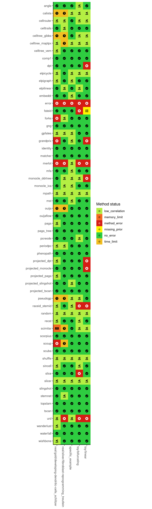

# Quick testing of methods using small datasets

As finding one dataset on which all methods are able to execute
successfully, each method also has its own *specific example* dataset.
At the very least, each method should be able to execute on their own
specific example.

<strong>Figure 1: Execution status of each of the TI methods on a small
set of real and toy datasets.</strong>

-----
