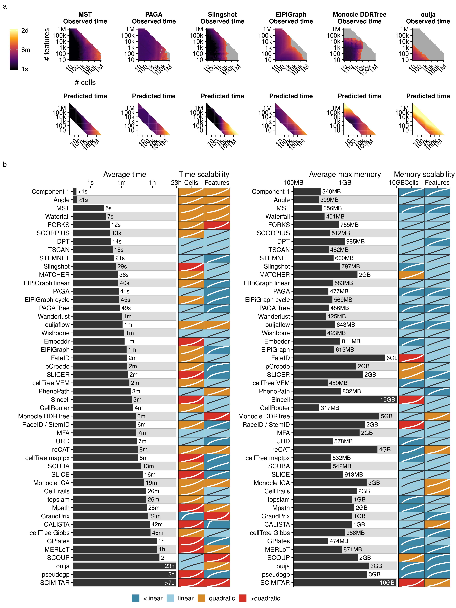
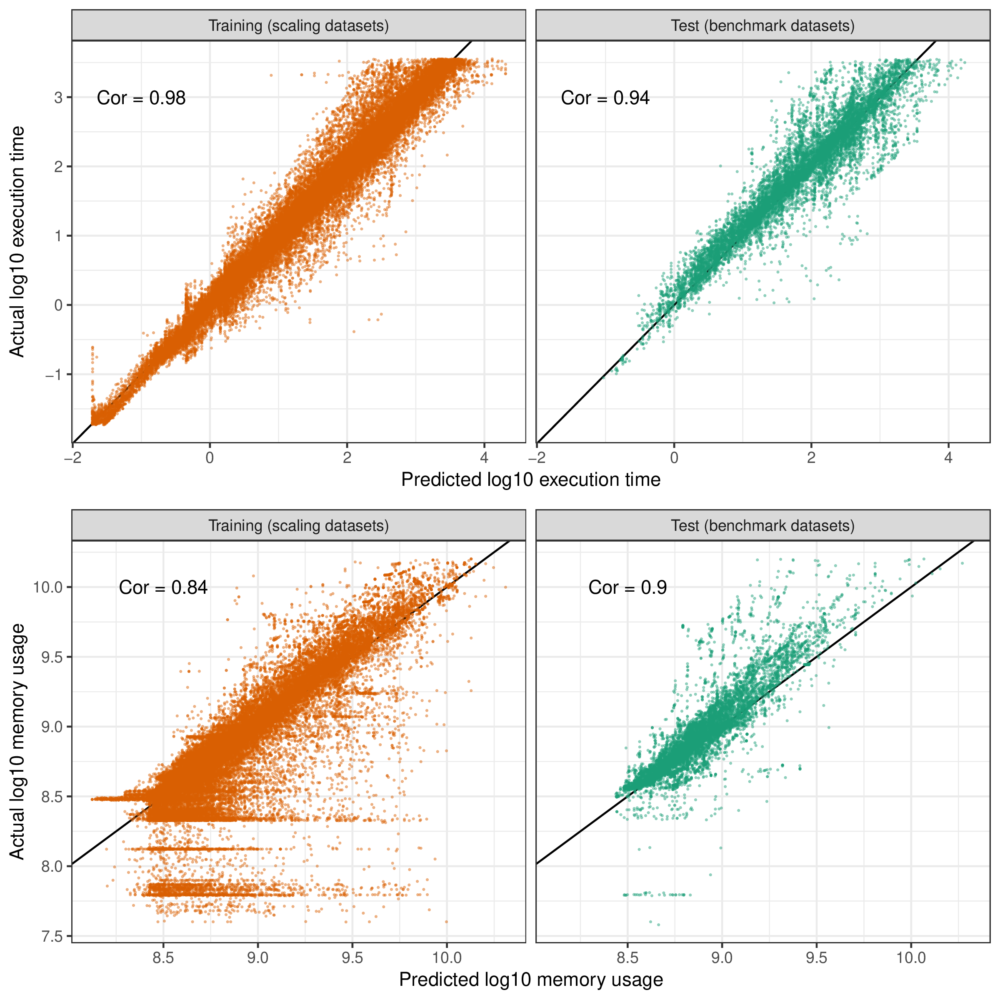
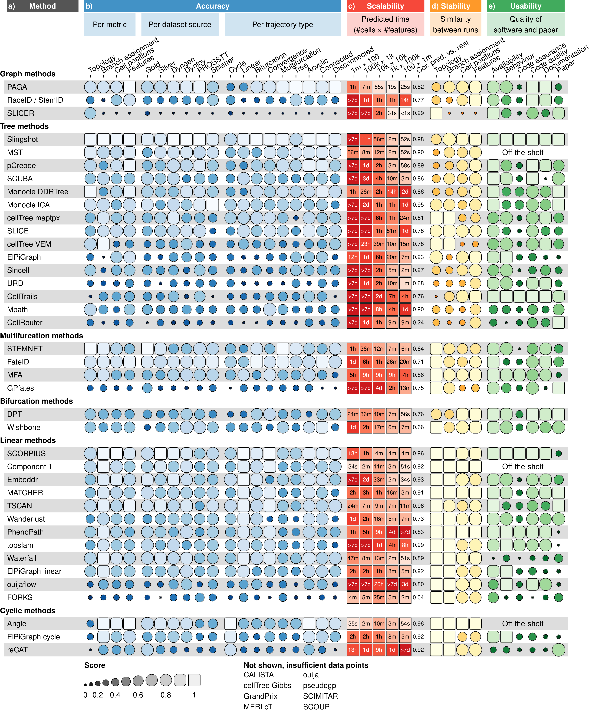

# Scalability with increasing number of cells and features

While early TI methods were developed at a time where profiling more
than a thousand cells was exceptional, methods now have to cope with
hundreds of thousands of cells, and perhaps soon with more than ten
million[1](#ref-svensson_exponentialscalingsinglecell_2018).
Moreover, the recent application of TI methods on multi-omics
single-cell data also showcases the increasing demands on the number of
features[2](#ref-cao_jointprofilingchromatin_2018). To assess
the scalability, we ran each method on up- and downscaled versions of
five distinct real datasets. We modelled the running time and memory
usage using a Shape Constrained Additive
Model[3](#ref-pya_shapeconstrainedadditive_2015) ([**Figure
1a**](#fig_scaling)). As a control, we compared the predicted time (and
memory) with the actual time (resp. memory) on all benchmarking
datasets, and found that these were highly correlated overall (\> 0.9,
[**Figure 2**](#fig_predcors)), and moderately to highly correlated (0.5
– 0.9) for almost every method, depending on to what extent the
execution of a method succeeded during the scalability experiments
([**Figure 3c**](#fig_results_detailed) and [**Figure
4a**](#fig_results)).

We found that the scalability of most methods was overall very poor,
with most graph and tree methods not finishing within an hour on a
dataset with ten thousand cells and ten thousand features ([**Figure
3c**](#fig_results_detailed)), around the size of a typical
droplet-based single-cell
dataset[1](#ref-svensson_exponentialscalingsinglecell_2018).
Running times increased further with increasing number of cells, with
only a handful of graph/tree methods completing within a day on a
million of cells (PAGA, PAGA Tree, Monocle DDRTree, Stemnet and
GrandPrix). Some methods, such as Monocle DDRTree and GrandPrix, also
suffered from unsatisfactory running times when given a high number of
features.

Methods with a low running time typically had two defining aspects: they
had a linear time complexity with respect to the features and/or cells,
and adding new cells or features led to a relatively low increase in
time ([**Figure 1b**](#fig_scaling)). We found that more than half of
all methods had a quadratic or superquadratic complexity with respect to
the number of cells, which would make it difficult to apply any of these
methods in a reasonable time frame on datasets with more than a thousand
cells ([**Figure 1b**](#fig_scaling)).

We also assessed the memory requirements of each methods ([**Figure
4c**](#fig_results)). Most methods had reasonable memory requirements
for modern workstations or computer clusters (≤12GB) with PAGA and
STEMNET in particular having a low memory usage with both a high number
of cells or high number of features. Notably, the memory requirements
were very high for several methods on datasets with high number of cells
(RaceID/StemID, pCreode and MATCHER) or features (Monocle DDRTree, SLICE
and MFA).

Altogether, the scalability analysis indicated that the dimensions of
the data is an important factor in the choice of method and that method
development should pay more attention to maintaining reasonable running
times and memory usage.

<strong>[**Figure 1**](#fig_scaling): Scalability of trajectory
inference methods.</strong> (a) Three examples of average observed
running times across five datasets (left) and the predicted running time
(right). (b) Overview of the scalability results of all methods, ordered
by their average predicted running time from (a). We predicted execution
times and memory usage for each method with increasing number of
features or cells, and used these values to classify each method into
sublinear, linear, quadratic and superquadratic based on the shape of
the curve.

-----

<strong>[**Figure 2**](#fig_predcors): Agreement between actual values
and predictions for execution times and memory usage.</strong>

-----

<strong>[**Figure 3**](#fig_results_detailed): Detailed results of the
four main evaluation criteria: accuracy, scalability, stability and
usability.</strong> (a) The names of the methods, ordered as in
[**Figure 5**](#fig_results_summary). (b) Accuracy of trajectory
inference methods across metrics, dataset sources and dataset trajectory
types. The performance of a method is generally more stable across
dataset sources, but very variable depending on the metric and
trajectory type. (c) Predicted execution times for varying numbers of
cells and features (\# cells × \# features). Predictions were made by
training a regression model after running each method on bootstrapped
datasets with varying numbers of cells and features. (d) Stability
results by calculating the average pairwise similarity between models
inferred across multiple runs of the same method. (e) Usability scores
of the tool and corresponding manuscript, grouped per category.
Off-the-shelf methods were directly implemented in R and thus do not
have a usability score.

-----

<strong>[**Figure 4**](#fig_results): Results from the evaluation, for
all methods and across all evaluation criteria.</strong> (a) We
characterised the methods according to the wrapper type, their required
priors, whether the inferred topology is constrained by the algorithm
(fixed) or a parameter (param), and the types of inferable topologies.
The methods are grouped vertically based on the most complex trajectory
type they can infer. (b) The overall results of the evaluation on four
criteria: benchmarking using a reference trajectory on real and
synthetic data, scalability with increasing number of cells and
features, stability across dataset subsamples, and quality of the
implementation. (c) Accuracy of trajectory inference methods across
metrics, dataset sources and dataset trajectory types. The performance
of a method is generally more stable across dataset sources, but very
variable depending on the metric and trajectory type. (d) Predicted
execution times and memory usage for varying numbers of cells and
features (\# cells × \# features). Predictions were made by training a
regression model after running each method on bootstrapped datasets with
varying numbers of cells and features. (e) Stability results by
calculating the average pairwise similarity between models inferred
across multiple runs of the same method. (f) Usability scores of the
tool and corresponding manuscript, grouped per category.

-----

# References

1\. Svensson, V., Vento-Tormo, R. & Teichmann, S. A. Exponential scaling
of single-cell RNA-seq in the past decade. *Nature Protocols* **13**,
599–604 (2018).

2\. Cao, J. *et al.* Joint profiling of chromatin accessibility and gene
expression in thousands of single cells. *Science* eaau0730 (2018).
doi:[10.1126/science.aau0730](https://doi.org/10.1126/science.aau0730)

3\. Pya, N. & Wood, S. N. Shape constrained additive models. *Statistics
and Computing* **25**, 543–559 (2015).

