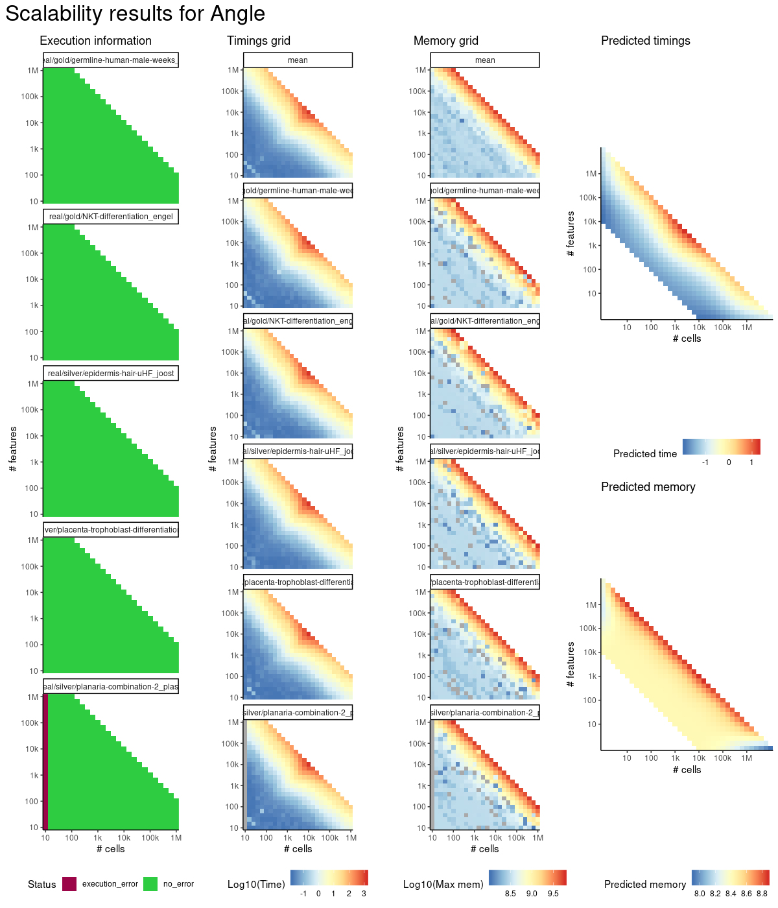
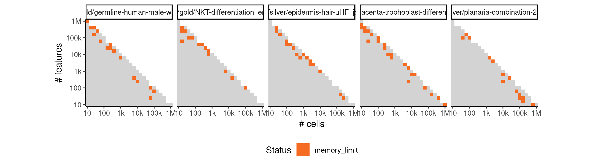
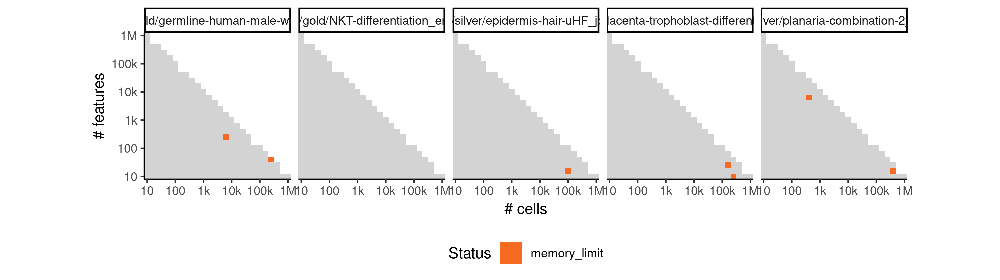

# angle


## ERROR STATUS MEMORY_LIMIT

### ERROR CLUSTER MEMORY_LIMIT -- 1


 * Number of instances: 84
 * Dataset ids: scaling_1148, scaling_1249, scaling_1258, scaling_1260, scaling_1289, scaling_1290, scaling_1374, scaling_1378, scaling_1379, scaling_1381, scaling_1394, scaling_1407, scaling_1408, scaling_1409, scaling_1420, scaling_1421, scaling_1430, scaling_1439, scaling_1440, scaling_1443, scaling_1444, scaling_1454, scaling_1477, scaling_1478, scaling_1498, scaling_1506, scaling_1507, scaling_1508, scaling_1509, scaling_1514, scaling_1521, scaling_1522, scaling_1528, scaling_1532, scaling_1536, scaling_1537, scaling_1538, scaling_1545, scaling_1551, scaling_1552, scaling_1561, scaling_1562, scaling_1571, scaling_1572, scaling_1573, scaling_1574, scaling_1578, scaling_1584, scaling_1585, scaling_1588, scaling_1589, scaling_1590, scaling_1591, scaling_1592, scaling_1593, scaling_1602, scaling_1603, scaling_1625, scaling_1626, scaling_1627, scaling_1628, scaling_1631, scaling_1653, scaling_1654, scaling_1655, scaling_1665, scaling_1671, scaling_1678, scaling_1679, scaling_1680, scaling_1681, scaling_1683, scaling_1696, scaling_1697, scaling_1703, scaling_1704, scaling_1706, scaling_1712, scaling_1713, scaling_1717, scaling_1718, scaling_1723, scaling_1724, scaling_1729

Last 10 lines of scaling_1148:
```
error writing to connection
```

### ERROR CLUSTER MEMORY_LIMIT -- 2


 * Number of instances: 7
 * Dataset ids: scaling_1212, scaling_1248, scaling_1359, scaling_1367, scaling_1428, scaling_1624, scaling_1645

Last 10 lines of scaling_1212:
```
    filter, lag
The following objects are masked from ‘package:base’:
    intersect, setdiff, setequal, union
Attaching package: ‘purrr’
The following object is masked from ‘package:jsonlite’:
    flatten
Loading required package: dynutils
Error in saveRDS(x, con) : error writing to connection
Calls: write_rds -> saveRDS
Execution halted
```


