# calista


## ERROR STATUS EXECUTION_ERROR

### ERROR CLUSTER EXECUTION_ERROR -- 1
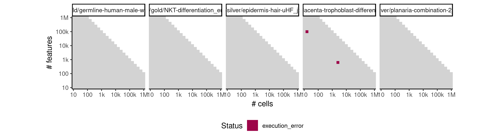

 * Number of instances: 130
 * Dataset ids: scaling_0681, scaling_0683, scaling_0686, scaling_0687, scaling_0688, scaling_0689, scaling_0690, scaling_0691, scaling_0692, scaling_0693, scaling_0694, scaling_0695, scaling_0696, scaling_0697, scaling_0698, scaling_0699, scaling_0700, scaling_0701, scaling_0702, scaling_0703, scaling_0704, scaling_0705, scaling_0706, scaling_0707, scaling_0708, scaling_0709, scaling_0710, scaling_0711, scaling_0712, scaling_0713, scaling_0714, scaling_0715, scaling_0716, scaling_0717, scaling_0718, scaling_0719, scaling_0720, scaling_0721, scaling_0722, scaling_0723, scaling_0724, scaling_0725, scaling_0726, scaling_0727, scaling_0728, scaling_0729, scaling_0730, scaling_0731, scaling_0732, scaling_0733, scaling_0734, scaling_0735, scaling_0736, scaling_0737, scaling_0738, scaling_0739, scaling_0740, scaling_0741, scaling_0742, scaling_0743, scaling_0744, scaling_0746, scaling_0750, scaling_0751, scaling_0754, scaling_0755, scaling_0756, scaling_0757, scaling_0758, scaling_0760, scaling_0763, scaling_0765, scaling_0766, scaling_0767, scaling_0768, scaling_0770, scaling_0772, scaling_0773, scaling_0790, scaling_0791, scaling_0800, scaling_0810, scaling_0819, scaling_0826, scaling_0834, scaling_0865, scaling_0872, scaling_0873, scaling_0874, scaling_0897, scaling_0903, scaling_0911, scaling_0912, scaling_0919, scaling_0926, scaling_0932, scaling_0933, scaling_0935, scaling_0944, scaling_0950, scaling_0978, scaling_0986, scaling_0987, scaling_0990, scaling_0999, scaling_1005, scaling_1018, scaling_1019, scaling_1030, scaling_1031, scaling_1038, scaling_1040, scaling_1041, scaling_1044, scaling_1050, scaling_1055, scaling_1056, scaling_1057, scaling_1071, scaling_1086, scaling_1088, scaling_1113, scaling_1122, scaling_1123, scaling_1128, scaling_1129, scaling_1134, scaling_1135, scaling_1136, scaling_1145

Last 10 lines of scaling_0681:
```
File: /home/rcannood/Workspace/dynverse/dynbenchmark//derived/05-scaling/suite/calista/Cat2/r2gridengine/20181008_215108_calista_Cat2_cepFo3qjaO/log/log.1.e.txt
In addition: There were 46 warnings (use warnings() to see them)
Execution halted
```

### ERROR CLUSTER EXECUTION_ERROR -- 2
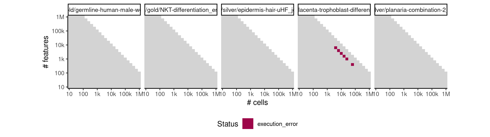

 * Number of instances: 5
 * Dataset ids: scaling_0759, scaling_0762, scaling_0764, scaling_0866, scaling_0988

Last 10 lines of scaling_0759:
```
File: /home/rcannood/Workspace/dynverse/dynbenchmark//derived/05-scaling/suite/calista/Cat2/r2gridengine/20181008_215108_calista_Cat2_cepFo3qjaO/log/log.79.e.txt
Execution halted
```

## ERROR STATUS MEMORY_LIMIT

### ERROR CLUSTER MEMORY_LIMIT -- 1


 * Number of instances: 97
 * Dataset ids: scaling_0682, scaling_0684, scaling_0685, scaling_0752, scaling_0753, scaling_0761, scaling_0803, scaling_0840, scaling_0843, scaling_0844, scaling_0845, scaling_0854, scaling_0859, scaling_0864, scaling_0870, scaling_0886, scaling_0887, scaling_0888, scaling_0890, scaling_0892, scaling_0893, scaling_0896, scaling_0905, scaling_0906, scaling_0910, scaling_0913, scaling_0916, scaling_0922, scaling_0923, scaling_0925, scaling_0931, scaling_0943, scaling_0955, scaling_0956, scaling_0957, scaling_0962, scaling_0966, scaling_0972, scaling_0995, scaling_0996, scaling_1002, scaling_1004, scaling_1007, scaling_1008, scaling_1013, scaling_1015, scaling_1025, scaling_1027, scaling_1029, scaling_1034, scaling_1047, scaling_1048, scaling_1052, scaling_1053, scaling_1054, scaling_1059, scaling_1062, scaling_1063, scaling_1065, scaling_1066, scaling_1067, scaling_1068, scaling_1069, scaling_1070, scaling_1072, scaling_1074, scaling_1078, scaling_1083, scaling_1084, scaling_1089, scaling_1091, scaling_1092, scaling_1093, scaling_1094, scaling_1095, scaling_1096, scaling_1097, scaling_1104, scaling_1106, scaling_1107, scaling_1108, scaling_1111, scaling_1114, scaling_1115, scaling_1116, scaling_1117, scaling_1120, scaling_1121, scaling_1130, scaling_1131, scaling_1133, scaling_1138, scaling_1139, scaling_1141, scaling_1142, scaling_1143, scaling_1144

Last 10 lines of scaling_0682:
```
error writing to connection
```

### ERROR CLUSTER MEMORY_LIMIT -- 2
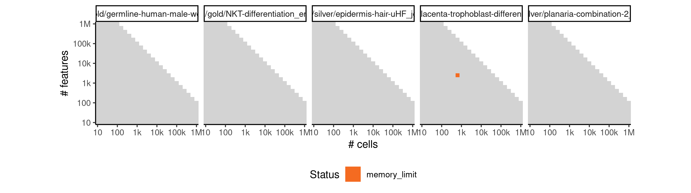

 * Number of instances: 2
 * Dataset ids: scaling_1022, scaling_1126

Last 10 lines of scaling_1022:
```
The following object is masked from ‘package:stats’:
    lowess
Warning messages:
1: In rgl.init(initValue, onlyNULL) : RGL: unable to open X11 display
2: 'rgl_init' failed, running with rgl.useNULL = TRUE 
[1] "**** Please upload normalized data. File formats accepted: .txt , .xlxs , .csv ****"
Data loading...
CALISTA_clustering is running...
Error: cannot allocate vector of size 29.7 Gb
Execution halted
```

## ERROR STATUS METHOD_ERROR

### ERROR CLUSTER METHOD_ERROR -- 1


 * Number of instances: 53
 * Dataset ids: scaling_0001, scaling_0002, scaling_0003, scaling_0004, scaling_0006, scaling_0008, scaling_0010, scaling_0012, scaling_0016, scaling_0019, scaling_0022, scaling_0025, scaling_0041, scaling_0043, scaling_0047, scaling_0051, scaling_0056, scaling_0061, scaling_0066, scaling_0076, scaling_0082, scaling_0088, scaling_0106, scaling_0113, scaling_0120, scaling_0127, scaling_0151, scaling_0157, scaling_0163, scaling_0181, scaling_0188, scaling_0195, scaling_0202, scaling_0226, scaling_0232, scaling_0238, scaling_0244, scaling_0276, scaling_0287, scaling_0341, scaling_0351, scaling_0361, scaling_0391, scaling_0404, scaling_0417, scaling_0456, scaling_0466, scaling_0476, scaling_0556, scaling_0565, scaling_0601, scaling_0617, scaling_0633

Last 10 lines of scaling_0001:
```
Warning messages:
1: In rgl.init(initValue, onlyNULL) : RGL: unable to open X11 display
2: 'rgl_init' failed, running with rgl.useNULL = TRUE 
[1] "**** Please upload normalized data. File formats accepted: .txt , .xlxs , .csv ****"
Data loading...
CALISTA_clustering is running...
Error in { : 
  task 1 failed - "number of items to replace is not a multiple of replacement length"
Calls: CALISTA_clustering_main ... CALISTA_clustering -> greedy_cabsel -> %dopar% -> <Anonymous>
Execution halted
```

### ERROR CLUSTER METHOD_ERROR -- 2


 * Number of instances: 198
 * Dataset ids: scaling_0007, scaling_0011, scaling_0013, scaling_0015, scaling_0018, scaling_0024, scaling_0027, scaling_0030, scaling_0036, scaling_0038, scaling_0040, scaling_0042, scaling_0044, scaling_0046, scaling_0048, scaling_0050, scaling_0052, scaling_0054, scaling_0055, scaling_0062, scaling_0064, scaling_0065, scaling_0069, scaling_0070, scaling_0074, scaling_0075, scaling_0080, scaling_0081, scaling_0092, scaling_0093, scaling_0098, scaling_0099, scaling_0104, scaling_0105, scaling_0110, scaling_0111, scaling_0112, scaling_0124, scaling_0125, scaling_0126, scaling_0130, scaling_0131, scaling_0132, scaling_0133, scaling_0139, scaling_0140, scaling_0148, scaling_0150, scaling_0155, scaling_0156, scaling_0162, scaling_0164, scaling_0167, scaling_0168, scaling_0172, scaling_0173, scaling_0174, scaling_0178, scaling_0179, scaling_0180, scaling_0186, scaling_0187, scaling_0194, scaling_0200, scaling_0201, scaling_0205, scaling_0207, scaling_0208, scaling_0212, scaling_0214, scaling_0215, scaling_0217, scaling_0221, scaling_0223, scaling_0225, scaling_0227, scaling_0230, scaling_0231, scaling_0237, scaling_0242, scaling_0243, scaling_0245, scaling_0246, scaling_0247, scaling_0248, scaling_0249, scaling_0253, scaling_0254, scaling_0255, scaling_0267, scaling_0270, scaling_0271, scaling_0274, scaling_0275, scaling_0284, scaling_0285, scaling_0286, scaling_0297, scaling_0299, scaling_0306, scaling_0307, scaling_0308, scaling_0314, scaling_0315, scaling_0316, scaling_0317, scaling_0318, scaling_0319, scaling_0324, scaling_0325, scaling_0326, scaling_0327, scaling_0328, scaling_0329, scaling_0332, scaling_0335, scaling_0336, scaling_0338, scaling_0340, scaling_0349, scaling_0350, scaling_0360, scaling_0369, scaling_0370, scaling_0375, scaling_0377, scaling_0378, scaling_0379, scaling_0384, scaling_0386, scaling_0387, scaling_0388, scaling_0389, scaling_0401, scaling_0402, scaling_0403, scaling_0405, scaling_0414, scaling_0416, scaling_0418, scaling_0427, scaling_0428, scaling_0429, scaling_0434, scaling_0438, scaling_0439, scaling_0440, scaling_0449, scaling_0451, scaling_0452, scaling_0464, scaling_0465, scaling_0475, scaling_0483, scaling_0484, scaling_0485, scaling_0489, scaling_0492, scaling_0493, scaling_0499, scaling_0502, scaling_0503, scaling_0509, scaling_0513, scaling_0517, scaling_0523, scaling_0524, scaling_0530, scaling_0531, scaling_0537, scaling_0542, scaling_0543, scaling_0548, scaling_0551, scaling_0552, scaling_0553, scaling_0554, scaling_0562, scaling_0563, scaling_0564, scaling_0580, scaling_0581, scaling_0582, scaling_0611, scaling_0613, scaling_0614, scaling_0615, scaling_0645, scaling_0646, scaling_0647, scaling_0660, scaling_0661, scaling_0670, scaling_0671, scaling_0676, scaling_0677, scaling_0786, scaling_0824

Last 10 lines of scaling_0007:
```
 
Press 1 if you want to remove edges, 0 otherwise:
Plotting mean gene expressions...
Saving 7 x 7 in image
 Done! Mean gene expression plot is saved in "Plotting  mean gene expression.pdf" in current working directory  
Calculating cell to cell variability...
CALISTA_transition_genes is running...
Error in 1:num_transition_genes[[i]] : argument of length 0
Calls: CALISTA_transition_genes_main
Execution halted
```

### ERROR CLUSTER METHOD_ERROR -- 3


 * Number of instances: 129
 * Dataset ids: scaling_0023, scaling_0026, scaling_0029, scaling_0031, scaling_0035, scaling_0037, scaling_0039, scaling_0045, scaling_0053, scaling_0067, scaling_0068, scaling_0072, scaling_0073, scaling_0079, scaling_0089, scaling_0090, scaling_0091, scaling_0094, scaling_0095, scaling_0096, scaling_0097, scaling_0101, scaling_0103, scaling_0108, scaling_0109, scaling_0122, scaling_0123, scaling_0128, scaling_0129, scaling_0135, scaling_0136, scaling_0137, scaling_0141, scaling_0145, scaling_0147, scaling_0149, scaling_0153, scaling_0165, scaling_0169, scaling_0170, scaling_0171, scaling_0176, scaling_0177, scaling_0182, scaling_0183, scaling_0190, scaling_0196, scaling_0197, scaling_0204, scaling_0210, scaling_0211, scaling_0216, scaling_0220, scaling_0222, scaling_0224, scaling_0251, scaling_0256, scaling_0257, scaling_0264, scaling_0265, scaling_0268, scaling_0269, scaling_0272, scaling_0273, scaling_0278, scaling_0279, scaling_0300, scaling_0301, scaling_0309, scaling_0310, scaling_0312, scaling_0321, scaling_0322, scaling_0323, scaling_0339, scaling_0343, scaling_0363, scaling_0371, scaling_0372, scaling_0373, scaling_0382, scaling_0383, scaling_0393, scaling_0394, scaling_0419, scaling_0420, scaling_0430, scaling_0431, scaling_0432, scaling_0433, scaling_0444, scaling_0445, scaling_0446, scaling_0457, scaling_0458, scaling_0477, scaling_0478, scaling_0486, scaling_0487, scaling_0488, scaling_0497, scaling_0498, scaling_0518, scaling_0522, scaling_0544, scaling_0550, scaling_0558, scaling_0566, scaling_0575, scaling_0576, scaling_0583, scaling_0584, scaling_0585, scaling_0593, scaling_0594, scaling_0604, scaling_0619, scaling_0636, scaling_0649, scaling_0650, scaling_0651, scaling_0652, scaling_0666, scaling_0667, scaling_0668, scaling_0802, scaling_0869, scaling_0889, scaling_0891

Last 10 lines of scaling_0023:
```
    lowess
Warning messages:
1: In rgl.init(initValue, onlyNULL) : RGL: unable to open X11 display
2: 'rgl_init' failed, running with rgl.useNULL = TRUE 
[1] "**** Please upload normalized data. File formats accepted: .txt , .xlxs , .csv ****"
Data loading...
CALISTA_clustering is running...
Error in { : task 33 failed - "missing value where TRUE/FALSE needed"
Calls: CALISTA_clustering_main ... CALISTA_clustering -> greedy_cabsel -> %dopar% -> <Anonymous>
Execution halted
```

### ERROR CLUSTER METHOD_ERROR -- 4


 * Number of instances: 22
 * Dataset ids: scaling_0077, scaling_0083, scaling_0102, scaling_0114, scaling_0138, scaling_0143, scaling_0152, scaling_0203, scaling_0239, scaling_0288, scaling_0289, scaling_0311, scaling_0333, scaling_0337, scaling_0362, scaling_0392, scaling_0406, scaling_0447, scaling_0467, scaling_0500, scaling_0557, scaling_0635

Last 10 lines of scaling_0077:
```
CALISTA_clustering is running...
No time info found. Please enter the starting cell or the marker gene whenever available
Press 1 to enter the starting cell, 2 to enter the marker gene, 3 otherwise: 
Skip relabeling step
Plotting...
CALISTA_transtion is running...
Error in base::colMeans(x, na.rm = na.rm, dims = dims, ...) : 
  'x' must be an array of at least two dimensions
Calls: CALISTA_transition_main ... CALISTA_transition -> colMeans -> colMeans -> <Anonymous>
Execution halted
```

### ERROR CLUSTER METHOD_ERROR -- 5


 * Number of instances: 2
 * Dataset ids: scaling_0252, scaling_0653

Last 10 lines of scaling_0252:
```
Plotting mean gene expressions...
Saving 7 x 7 in image
 Done! Mean gene expression plot is saved in "Plotting  mean gene expression.pdf" in current working directory  
Calculating cell to cell variability...
Warning message:
In cor(t(DATA$totDATA[aaa, ])) : the standard deviation is zero
CALISTA_transition_genes is running...
Error in 1:num_transition_genes[[i]] : argument of length 0
Calls: CALISTA_transition_genes_main
Execution halted
```

### ERROR CLUSTER METHOD_ERROR -- 6


 * Number of instances: 30
 * Dataset ids: scaling_0298, scaling_0330, scaling_0380, scaling_0390, scaling_0441, scaling_0442, scaling_0453, scaling_0454, scaling_0455, scaling_0494, scaling_0495, scaling_0504, scaling_0505, scaling_0521, scaling_0525, scaling_0549, scaling_0555, scaling_0589, scaling_0590, scaling_0591, scaling_0598, scaling_0599, scaling_0600, scaling_0662, scaling_0663, scaling_0664, scaling_0678, scaling_0679, scaling_0680, scaling_0835

Last 10 lines of scaling_0298:
```
Warning messages:
1: In rgl.init(initValue, onlyNULL) : RGL: unable to open X11 display
2: 'rgl_init' failed, running with rgl.useNULL = TRUE 
[1] "**** Please upload normalized data. File formats accepted: .txt , .xlxs , .csv ****"
Data loading...
CALISTA_clustering is running...
Error in { : 
  task 1 failed - "dims [product 10] do not match the length of object [60]"
Calls: CALISTA_clustering_main ... CALISTA_clustering -> greedy_cabsel -> %dopar% -> <Anonymous>
Execution halted
```

### ERROR CLUSTER METHOD_ERROR -- 7


 * Number of instances: 1
 * Dataset ids: scaling_0450

Last 10 lines of scaling_0450:
```
1: In rgl.init(initValue, onlyNULL) : RGL: unable to open X11 display
2: 'rgl_init' failed, running with rgl.useNULL = TRUE 
[1] "**** Please upload normalized data. File formats accepted: .txt , .xlxs , .csv ****"
Data loading...
CALISTA_clustering is running...
Optimal number of cluster according to max. eigenvalue: 3 
if you want to use this value press 0, else provide desired number of cluster:
CALISTA_clustering is running...
terminate called after throwing an instance of 'std::logic_error'
  what():  Mat::operator(): index out of bounds
```

### ERROR CLUSTER METHOD_ERROR -- 8
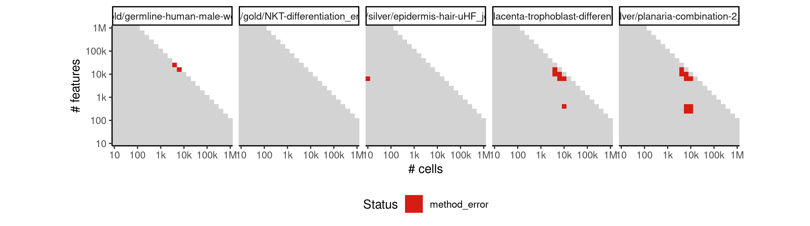

 * Number of instances: 1
 * Dataset ids: scaling_0574

Last 10 lines of scaling_0574:
```
The following object is masked from ‘package:stats’:
    lowess
Warning messages:
1: In rgl.init(initValue, onlyNULL) : RGL: unable to open X11 display
2: 'rgl_init' failed, running with rgl.useNULL = TRUE 
[1] "**** Please upload normalized data. File formats accepted: .txt , .xlxs , .csv ****"
Data loading...
CALISTA_clustering is running...
terminate called after throwing an instance of 'std::logic_error'
  what():  Mat::operator(): index out of bounds
```

### ERROR CLUSTER METHOD_ERROR -- 9
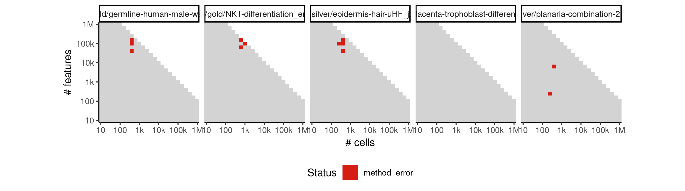

 * Number of instances: 1
 * Dataset ids: scaling_0596

Last 10 lines of scaling_0596:
```
 Done! Mean gene expression plot is saved in "Plotting  mean gene expression.pdf" in current working directory  
Calculating cell to cell variability...
Warning message:
In cor(t(DATA$totDATA[aaa, ])) : the standard deviation is zero
CALISTA_transition_genes is running...
CALISTA_ordering is running...
Error in mutate_impl(.data, dots) : 
  Evaluation error: object 'from' not found.
Calls: %>% ... <Anonymous> -> mutate -> mutate.tbl_df -> mutate_impl
Execution halted
```

### ERROR CLUSTER METHOD_ERROR -- 10
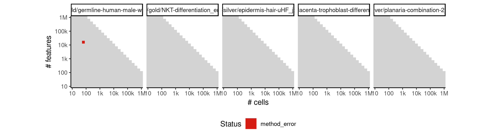

 * Number of instances: 67
 * Dataset ids: scaling_0745, scaling_0747, scaling_0748, scaling_0798, scaling_0811, scaling_0815, scaling_0820, scaling_0822, scaling_0828, scaling_0829, scaling_0836, scaling_0841, scaling_0847, scaling_0850, scaling_0853, scaling_0856, scaling_0858, scaling_0862, scaling_0863, scaling_0867, scaling_0871, scaling_0878, scaling_0880, scaling_0881, scaling_0882, scaling_0894, scaling_0895, scaling_0901, scaling_0902, scaling_0909, scaling_0921, scaling_0927, scaling_0938, scaling_0939, scaling_0942, scaling_0945, scaling_0946, scaling_0947, scaling_0960, scaling_0963, scaling_0968, scaling_0969, scaling_0971, scaling_0973, scaling_0977, scaling_0980, scaling_0984, scaling_0985, scaling_0992, scaling_0994, scaling_1006, scaling_1010, scaling_1011, scaling_1014, scaling_1026, scaling_1032, scaling_1036, scaling_1042, scaling_1075, scaling_1076, scaling_1079, scaling_1081, scaling_1085, scaling_1098, scaling_1100, scaling_1101, scaling_1110

Last 10 lines of scaling_0745:
```
    intersect, setdiff, setequal, union
[1] FALSE
There were 33 warnings (use warnings() to see them)
Error in file(filename, "r", encoding = encoding) : 
  cannot open the connection
Calls: source -> file
In addition: Warning message:
In file(filename, "r", encoding = encoding) :
  cannot open file 'R/initialization.R': No such file or directory
Execution halted
```

### ERROR CLUSTER METHOD_ERROR -- 11
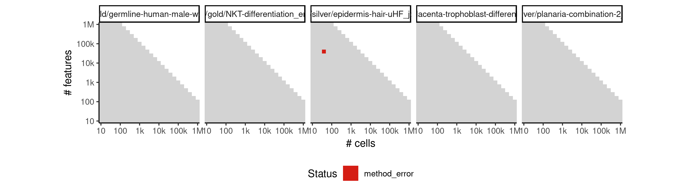

 * Number of instances: 19
 * Dataset ids: scaling_0769, scaling_0784, scaling_0795, scaling_0816, scaling_0839, scaling_0851, scaling_0861, scaling_0885, scaling_0899, scaling_0915, scaling_0940, scaling_0952, scaling_0981, scaling_0982, scaling_1020, scaling_1046, scaling_1051, scaling_1087, scaling_1132

Last 10 lines of scaling_0769:
```
 }
 ^
compilation terminated.
make: *** [up_cell.o] Error 1
g++  -I"/usr/local/lib/R/include" -DNDEBUG   -I"/usr/local/lib/R/site-library/Rcpp/include" -I"/ti/workspace/CALISTA-R/R" -I/usr/local/include   -fpic  -g -O2 -fstack-protector-strong -Wformat -Werror=format-security -Wdate-time -D_FORTIFY_SOURCE=2 -g  -c up_cell.cpp -o up_cell.o
/usr/local/lib/R/etc/Makeconf:168: recipe for target 'up_cell.o' failed
Error in sourceCpp("./R/up_cell.cpp") : 
  Error 1 occurred building shared library.
Calls: CALISTA_clustering_main -> CALISTA_clustering -> greedy_cabsel -> sourceCpp
Execution halted
```

### ERROR CLUSTER METHOD_ERROR -- 12
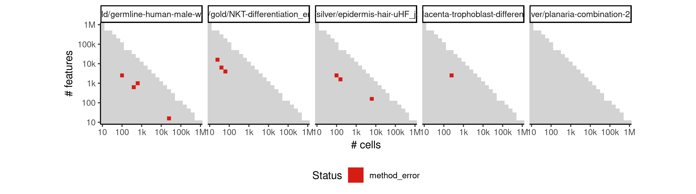

 * Number of instances: 11
 * Dataset ids: scaling_0771, scaling_0774, scaling_0787, scaling_0788, scaling_0807, scaling_0808, scaling_0868, scaling_0918, scaling_0953, scaling_1028, scaling_1102

Last 10 lines of scaling_0771:
```
Warning messages:
1: In rgl.init(initValue, onlyNULL) : RGL: unable to open X11 display
2: 'rgl_init' failed, running with rgl.useNULL = TRUE 
[1] "**** Please upload normalized data. File formats accepted: .txt , .xlxs , .csv ****"
Data loading...
CALISTA_clustering is running...
Error in sourceCpp("./R/up_cell.cpp") : 
  Evaluation error: empty (zero-byte) input file.
Calls: CALISTA_clustering_main -> CALISTA_clustering -> greedy_cabsel -> sourceCpp
Execution halted
```

### ERROR CLUSTER METHOD_ERROR -- 13
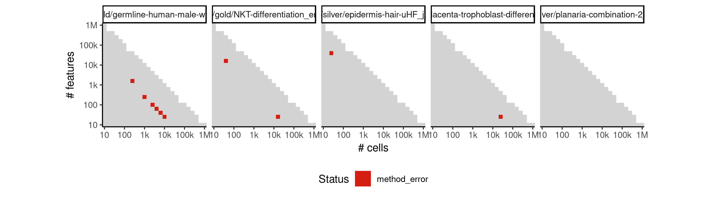

 * Number of instances: 10
 * Dataset ids: scaling_0776, scaling_0778, scaling_0779, scaling_0780, scaling_0781, scaling_0876, scaling_0914, scaling_0997, scaling_1035, scaling_1090

Last 10 lines of scaling_0776:
```
  Discarded single-line footer: <<8.820178962415188,0,0,0,1,0,0,0,0,3.4594316186372973,2,0,2,1,0,1,1,0,0,0,2.807354922057604,0,0,0,1.584962500721156,0,3.4594316186372973,1,2.807354922057604,0,2.584962500721156,0,0,0,1.584962500721156,1,0,0,0,1,0,0,0,0,0,2,2,0,1,0,1.584962500721156,0,1,0,0,1,1.584962500721156,2,1,1.584962500721156,0,1,1.584962500721156,0,1,0,0,1,0,0,2,0,0,0,0,0,1.584962500721156,0,0,0,0,0,0,0,0,1,0,2,0,1.584962500721156,2,2.584962500721156,1,0,0,0,0,0,1.584962500721156,0,1,0,1,0,1,0,0,0,0,0,1,0,0,0,0,2,0,0,0,0,0,>>
CALISTA_clustering is running...
up_cell.cpp:59:1: fatal error: error writing to /tmp2/ccrWjOGY.s: No space left on device
 }
 ^
compilation terminated.
make: *** [up_cell.o] Error 1
Error in { : task 1 failed - "Error 1 occurred building shared library."
Calls: CALISTA_clustering_main ... CALISTA_clustering -> greedy_cabsel -> %dopar% -> <Anonymous>
Execution halted
```

### ERROR CLUSTER METHOD_ERROR -- 14
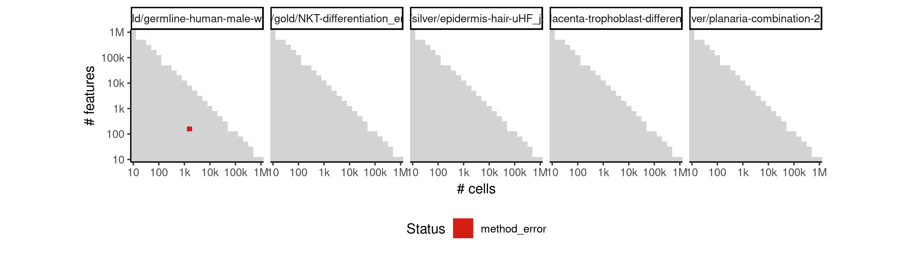

 * Number of instances: 1
 * Dataset ids: scaling_0777

Last 10 lines of scaling_0777:
```
[1] "**** Please upload normalized data. File formats accepted: .txt , .xlxs , .csv ****"
Data loading...
CALISTA_clustering is running...
/tmp2/ccTX3xt0.s: Assembler messages:
/tmp2/ccTX3xt0.s: Fatal error: can't write 3928 bytes to section .debug_info of up_cell.o because: 'No space left on device'
/tmp2/ccTX3xt0.s: Fatal error: can't close up_cell.o: No space left on device
make: *** [up_cell.o] Error 1
Error in { : task 1 failed - "Error 1 occurred building shared library."
Calls: CALISTA_clustering_main ... CALISTA_clustering -> greedy_cabsel -> %dopar% -> <Anonymous>
Execution halted
```

### ERROR CLUSTER METHOD_ERROR -- 15
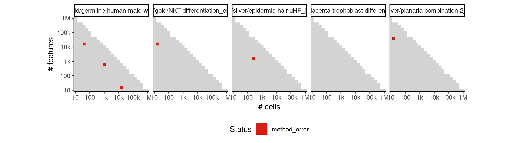

 * Number of instances: 6
 * Dataset ids: scaling_0782, scaling_0785, scaling_0930, scaling_0954, scaling_0975, scaling_0983

Last 10 lines of scaling_0782:
```
Error in source("./R/CALISTA_transition.R") : 
  ./R/CALISTA_transition.R:102:0: unexpected end of input
100:           h=add_edges(h,c(nodes[i,1],nodes[i,2]),weight=nodes[i,3])
101:         }
    ^
Calls: source -> withVisible -> eval -> eval -> source
In addition: Warning messages:
1: In rgl.init(initValue, onlyNULL) : RGL: unable to open X11 display
2: 'rgl_init' failed, running with rgl.useNULL = TRUE 
Execution halted
```

### ERROR CLUSTER METHOD_ERROR -- 16
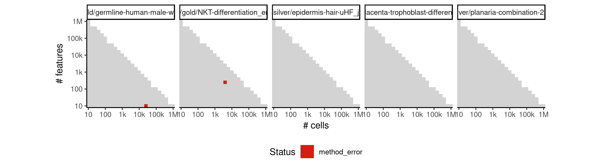

 * Number of instances: 2
 * Dataset ids: scaling_0783, scaling_1082

Last 10 lines of scaling_0783:
```
    lowess
Warning messages:
1: In rgl.init(initValue, onlyNULL) : RGL: unable to open X11 display
2: 'rgl_init' failed, running with rgl.useNULL = TRUE 
[1] "**** Please upload normalized data. File formats accepted: .txt , .xlxs , .csv ****"
Data loading...
Error in eatRawBuffer(nbfr * size) : 
  INTERNAL ERROR: More bytes was read from the raw buffer than existed: 2859319 > 741240
Calls: import_data ... readMat5DataElement -> mat5ReadTag -> readBinMat -> eatRawBuffer
Execution halted
```

### ERROR CLUSTER METHOD_ERROR -- 17
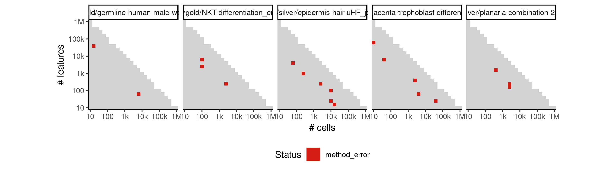

 * Number of instances: 19
 * Dataset ids: scaling_0789, scaling_0806, scaling_0809, scaling_0817, scaling_0818, scaling_0823, scaling_0833, scaling_0917, scaling_0948, scaling_0951, scaling_0998, scaling_1003, scaling_1017, scaling_1023, scaling_1043, scaling_1045, scaling_1103, scaling_1119, scaling_1125

Last 10 lines of scaling_0789:
```
The following objects are masked from ‘package:stats’:
    filter, lag
The following objects are masked from ‘package:base’:
    intersect, setdiff, setequal, union
[1] FALSE
Warning message:
In close.connection(path) :
  Problem closing connection:  No space left on device
Error in import_data(INPUTS) : could not find function "import_data"
Execution halted
```

### ERROR CLUSTER METHOD_ERROR -- 18
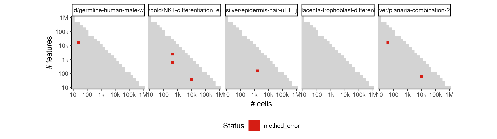

 * Number of instances: 7
 * Dataset ids: scaling_0792, scaling_0813, scaling_0857, scaling_0875, scaling_0979, scaling_1039, scaling_1077

Last 10 lines of scaling_0792:
```
  '/data/tmp//RtmpMnrkEo/file1abd31aae7233/ti:/ti,/data/tmp//RtmpMnrkEo/file1abd36c94b655/tmp:/tmp2' \
  /group/irc/shared/dynverse/dynbenchmark/derived/singularity_images/dynverse/ti_calista.simg
Attaching package: ‘dplyr’
The following objects are masked from ‘package:stats’:
    filter, lag
The following objects are masked from ‘package:base’:
    intersect, setdiff, setequal, union
[1] FALSE
Error in import_data(INPUTS) : could not find function "import_data"
Execution halted
```

### ERROR CLUSTER METHOD_ERROR -- 19
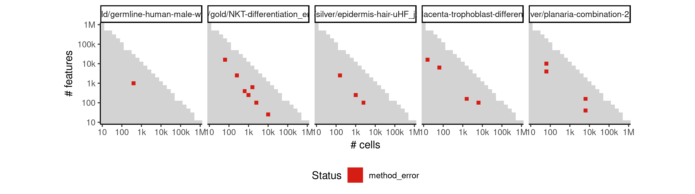

 * Number of instances: 19
 * Dataset ids: scaling_0793, scaling_0794, scaling_0796, scaling_0799, scaling_0812, scaling_0814, scaling_0821, scaling_0831, scaling_0842, scaling_0852, scaling_0860, scaling_0929, scaling_0936, scaling_0976, scaling_1000, scaling_1033, scaling_1073, scaling_1080, scaling_1140

Last 10 lines of scaling_0793:
```
1: In rgl.init(initValue, onlyNULL) : RGL: unable to open X11 display
2: 'rgl_init' failed, running with rgl.useNULL = TRUE 
Warning message:
In close.connection(path) :
  Problem closing connection:  No space left on device
[1] "**** Please upload normalized data. File formats accepted: .txt , .xlxs , .csv ****"
Error in fread(data_location, header = TRUE, stringsAsFactors = TRUE,  : 
  File is empty: /tmp2/RtmpShZIaY/expression.csv1ad8a277b9a3b
Calls: import_data -> normalization -> fread
Execution halted
```

### ERROR CLUSTER METHOD_ERROR -- 20
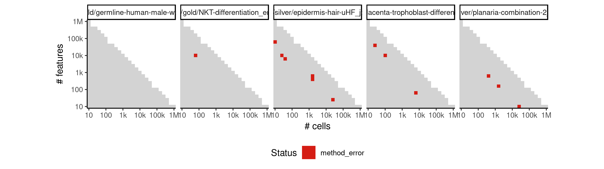

 * Number of instances: 13
 * Dataset ids: scaling_0804, scaling_0805, scaling_0846, scaling_0849, scaling_0855, scaling_0941, scaling_0958, scaling_1009, scaling_1016, scaling_1021, scaling_1099, scaling_1109, scaling_1112

Last 10 lines of scaling_0804:
```
    lowess
Error in file(filename, "r", encoding = encoding) : 
  cannot open the connection
Calls: source -> withVisible -> eval -> eval -> source -> file
In addition: Warning messages:
1: In rgl.init(initValue, onlyNULL) : RGL: unable to open X11 display
2: 'rgl_init' failed, running with rgl.useNULL = TRUE 
3: In file(filename, "r", encoding = encoding) :
  cannot open file './R/get_consensus.R': No such file or directory
Execution halted
```

### ERROR CLUSTER METHOD_ERROR -- 21
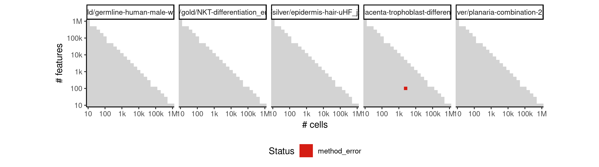

 * Number of instances: 1
 * Dataset ids: scaling_0832

Last 10 lines of scaling_0832:
```
Warning messages:
1: In rgl.init(initValue, onlyNULL) : RGL: unable to open X11 display
2: 'rgl_init' failed, running with rgl.useNULL = TRUE 
[1] "**** Please upload normalized data. File formats accepted: .txt , .xlxs , .csv ****"
Data loading...
CALISTA_clustering is running...
up_cell.cpp:1:0: fatal error: error closing /tmp2/ccbq57SD.s: No space left on device
compilation terminated.
make: *** [up_cell.o] Error 1
g++  -I"/usr/local/lib/R/include" -DNDEBUG   -I"/usr/local/lib/R/site-library/Rcpp/include" -I"/ti/workspace/CALISTA-R/R" -I/usr/local/include   -fpic  -g -O2 -fstack-protector-strong -Wformat -Werror=format-security -Wdate-time -D_FORTIFY_SOUExecution halted
```

### ERROR CLUSTER METHOD_ERROR -- 22
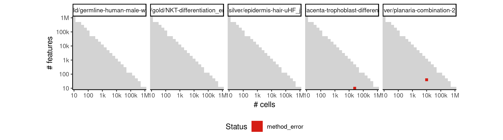

 * Number of instances: 2
 * Dataset ids: scaling_0837, scaling_0908

Last 10 lines of scaling_0837:
```
The following object is masked from ‘package:stats’:
    lowess
Warning messages:
1: In rgl.init(initValue, onlyNULL) : RGL: unable to open X11 display
2: 'rgl_init' failed, running with rgl.useNULL = TRUE 
[1] "**** Please upload normalized data. File formats accepted: .txt , .xlxs , .csv ****"
Data loading...
Error in CALISTA_clustering_main(DATA, INPUTS) : 
  could not find function "CALISTA_clustering_main"
Execution halted
```

### ERROR CLUSTER METHOD_ERROR -- 23


 * Number of instances: 2
 * Dataset ids: scaling_0877, scaling_0967

Last 10 lines of scaling_0877:
```
    lowess
Error in file(filename, "r", encoding = encoding) : 
  cannot open the connection
Calls: source -> withVisible -> eval -> eval -> source -> file
In addition: Warning messages:
1: In rgl.init(initValue, onlyNULL) : RGL: unable to open X11 display
2: 'rgl_init' failed, running with rgl.useNULL = TRUE 
3: In file(filename, "r", encoding = encoding) :
  cannot open file './R/CALISTA_transition_genes.R': No such file or directory
Exe
```

### ERROR CLUSTER METHOD_ERROR -- 24
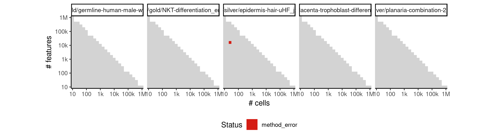

 * Number of instances: 1
 * Dataset ids: scaling_0879

Last 10 lines of scaling_0879:
```
    lowess
Warning messages:
1: In rgl.init(initValue, onlyNULL) : RGL: unable to open X11 display
2: 'rgl_init' failed, running with rgl.useNULL = TRUE 
[1] "**** Please upload normalized data. File formats accepted: .txt , .xlxs , .csv ****"
Data loading...
Error in CALISTA_clustering(DATA$totDATA, Parameters$Parameters[[3]],  : 
  could not find function "CALISTA_clustering"
Calls: CALISTA_clustering_main
Execution halted
```

### ERROR CLUSTER METHOD_ERROR -- 25
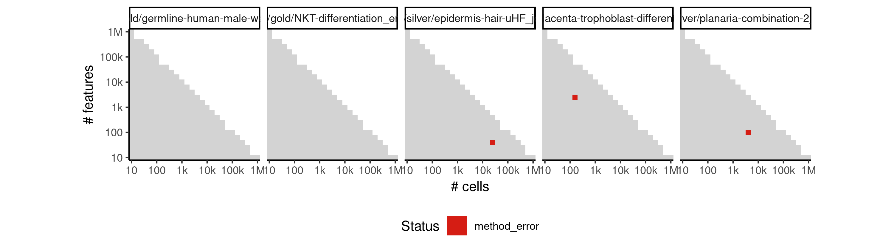

 * Number of instances: 3
 * Dataset ids: scaling_0907, scaling_0937, scaling_1105

Last 10 lines of scaling_0907:
```
[1] "**** Please upload normalized data. File formats accepted: .txt , .xlxs , .csv ****"
Data loading...
Warning message:
In fread(data_location, header = TRUE, stringsAsFactors = TRUE,  :
  Discarded single-line footer: <<5.523561956057013,0,0,0,0,0,0,0,0,0,0,0,0,0,0,0,0,0,0,0,0,1,0,1.584962500721156,0,0,0,0,1,0,0,0,0,0,0,1,0,0,0,0,0,0,0,0,>>
CALISTA_clustering is running...
Error in { : 
  task 1 failed - "Evaluation error: empty (zero-byte) input file."
Calls: CALISTA_clustering_main ... CALISTA_clustering -> greedy_cabsel -> %dopar% -> <Anonymous>
Execution halted
```

### ERROR CLUSTER METHOD_ERROR -- 26
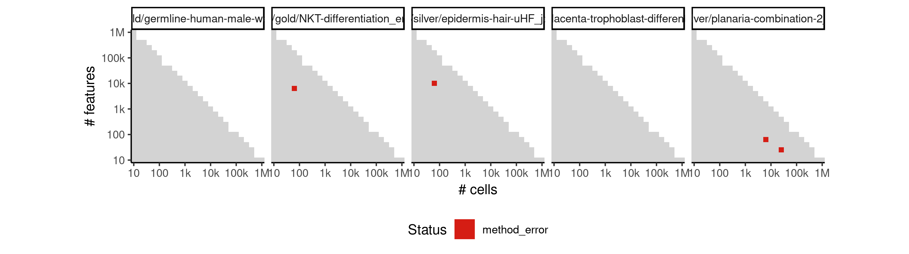

 * Number of instances: 4
 * Dataset ids: scaling_0920, scaling_0949, scaling_0964, scaling_1049

Last 10 lines of scaling_0920:
```
In close.connection(path) :
  Problem closing connection:  No space left on device
[1] "**** Please upload normalized data. File formats accepted: .txt , .xlxs , .csv ****"
Data loading...
Warning message:
In fread(data_location, header = TRUE, stringsAsFactors = TRUE,  :
  Discarded single-line footer: <<5.930737337562887,5.672425341971495,2,1,4.392317422778761,0,0,0,0,5.491853096329675,6.087462841250339,6.321928094887363,0,4.700439718141092,5.882643049361842,3.321928094887362,0,1,5.169925001442312,0,0,5.247927513443585,4.392317422778761,0,5.832890014164741,0,6.78135971352466,0,0,0,6.523561956057013,0,2,5.247927513443585,1,0,6.303780748177103,2.321928094887362,4.247927513443585,5.459431618637297,0,5.807354922057604,0,0,5.169925001442312,0,6.409390936137702,4.857980995127572,0,6.044394119358453,0>>
Error in CALISTA_clustering_main(DATA, INPUTS) : 
  could not find function "CALISTA_clustering_main"
Execution halted
```

### ERROR CLUSTER METHOD_ERROR -- 27
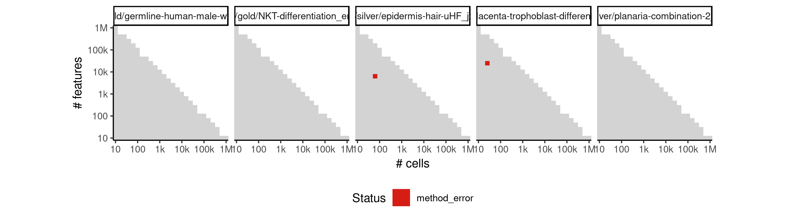

 * Number of instances: 2
 * Dataset ids: scaling_0928, scaling_1024

Last 10 lines of scaling_0928:
```
    union
Attaching package: ‘gridExtra’
The following object is masked from ‘package:dplyr’:
    combine
Attaching package: ‘matrixStats’
The following object is masked from ‘package:dplyr’:
    count
Loading required package: MASS
Attaching package: ‘MASS’
The 
```

### ERROR CLUSTER METHOD_ERROR -- 28
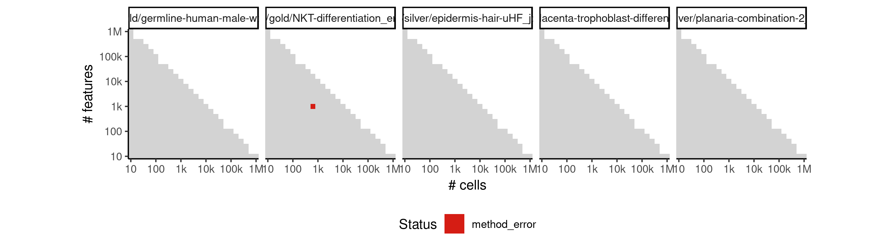

 * Number of instances: 1
 * Dataset ids: scaling_0959

Last 10 lines of scaling_0959:
```
1: In rgl.init(initValue, onlyNULL) : RGL: unable to open X11 display
2: 'rgl_init' failed, running with rgl.useNULL = TRUE 
Warning message:
In close.connection(path) :
  Problem closing connection:  No space left on device
[1] "**** Please upload normalized data. File formats accepted: .txt , .xlxs , .csv ****"
Data loading...
Warning message:
In fread(data_location, header = TRUE, stringsAsFactors = TRUE,  :
  Discarded single-line footer: <<8.566054038171092,6.285402218862249,3.700439718141092,0,0,0,0,1,2.321928094887362,7.22881869049588,6.794415866350106,8.31741261376487,0,6.539158811108031,5.977279923499917,0,0,0,3.321928094887362,0,0
```

### ERROR CLUSTER METHOD_ERROR -- 29
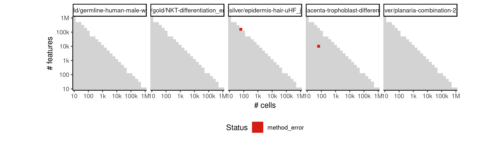

 * Number of instances: 1
 * Dataset ids: scaling_0970

Last 10 lines of scaling_0970:
```
  Problem closing connection:  No space left on device
[1] "**** Please upload normalized data. File formats accepted: .txt , .xlxs , .csv ****"
Data loading...
Error in seq.default(min(MEAN), max(MEAN), length.out = nbin) : 
  'from' must be a finite number
Calls: import_data ... normalization -> hist -> hist.default -> seq -> seq.default
In addition: Warning messages:
1: In max(totDATA) : no non-missing arguments to max; returning -Inf
2: In max(totDATA) : no non-missing arguments to max; returning -Inf
Execution halted
```

### ERROR CLUSTER METHOD_ERROR -- 30


 * Number of instances: 1
 * Dataset ids: scaling_1012

Last 10 lines of scaling_1012:
```
CALISTA_clustering is running...
collect2: error: ld returned 1 exit status
make: *** [sourceCpp_2.so] Error 1
g++  -I"/usr/local/lib/R/include" -DNDEBUG   -I"/usr/local/lib/R/site-library/Rcpp/include" -I"/ti/workspace/CALISTA-R/R" -I/usr/local/include   -fpic  -g -O2 -fstack-protector-strong -Wformat -Werror=format-security -Wdate-time -D_FORTIFY_SOURCE=2 -g  -c up_cell.cpp -o up_cell.o
g++ -shared -L/usr/local/lib/R/lib -L/usr/local/lib -o sourceCpp_2.so up_cell.o -L/usr/local/lib/R/lib -lR
/usr/local/lib/R/share/make/shlib.mk:6: recipe for target 'sourceCpp_2.so' failed
Error in sourceCpp("./R/up_cell.cpp") : 
  Error 1 occurred building shared library.
Calls: CALISTA_clustering_main -> CALISTA_clustering -> greedy_cabsel -> sourceCpp
Execution halted
```

### ERROR CLUSTER METHOD_ERROR -- 31
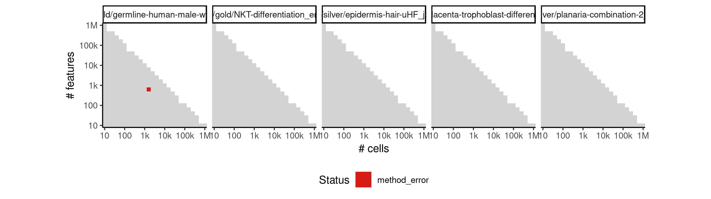

 * Number of instances: 1
 * Dataset ids: scaling_1061

Last 10 lines of scaling_1061:
```
In close.connection(path) :
  Problem closing connection:  No space left on device
[1] "**** Please upload normalized data. File formats accepted: .txt , .xlxs , .csv ****"
Data loading...
Warning message:
In fread(data_location, header = TRUE, stringsAsFactors = TRUE,  :
  Discarded single-line footer: <<10.448116305409464,0,0,0,0,0,0,2,1,2,1,0,0,0,0,0,0,0,1.584962500721156,0,2,0,0,0,1,0,3.807354922057604,0,2,0,0,0,0,1.584962500721156,1.584962500721156,0,0,0,0,0,0,1,0,0,1,0,1,0,0,1,0,0,0,0,0,0,0,0,0,0,0,1,Error in sourceCpp("./R/up_cell.cpp") : 
  Evaluation error: empty (zero-byte) input file.
Calls: CALISTA_clustering_main -> CALISTA_clustering -> greedy_cabsel -> sourceCpp
Execution halted
```

### ERROR CLUSTER METHOD_ERROR -- 32
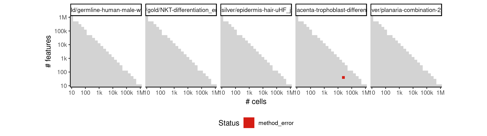

 * Number of instances: 1
 * Dataset ids: scaling_1124

Last 10 lines of scaling_1124:
```
In close.connection(path) :
  Problem closing connection:  No space left on device
[1] "**** Please upload normalized data. File formats accepted: .txt , .xlxs , .csv ****"
Data loading...
Warning message:
In fread(data_location, header = TRUE, stringsAsFactors = TRUE,  :
  Discarded single-line footer: <<14.118129977497281,1,0,0,0,0,0,0,0,0,0,0,0,0,0,0,0,0,0,0,0,0,0,1,0,>>
CALISTA_clustering is running...
up_cell.cpp:1:0: fatal error: error closing /tmp2/cckVpabJ.s: No space left on device
compilation Execution halted
```

## ERROR STATUS TIME_LIMIT

### ERROR CLUSTER TIME_LIMIT -- 1


 * Number of instances: 60
 * Dataset ids: scaling_0376, scaling_0436, scaling_0437, scaling_0491, scaling_0501, scaling_0515, scaling_0519, scaling_0520, scaling_0547, scaling_0560, scaling_0561, scaling_0578, scaling_0579, scaling_0586, scaling_0587, scaling_0588, scaling_0597, scaling_0608, scaling_0609, scaling_0610, scaling_0616, scaling_0632, scaling_0640, scaling_0641, scaling_0642, scaling_0648, scaling_0654, scaling_0655, scaling_0656, scaling_0657, scaling_0658, scaling_0659, scaling_0672, scaling_0673, scaling_0674, scaling_0675, scaling_0775, scaling_0801, scaling_0825, scaling_0827, scaling_0830, scaling_0848, scaling_0883, scaling_0884, scaling_0898, scaling_0904, scaling_0924, scaling_0934, scaling_0961, scaling_0965, scaling_0974, scaling_0989, scaling_0991, scaling_0993, scaling_1001, scaling_1058, scaling_1060, scaling_1064, scaling_1118, scaling_1137

Last 10 lines of scaling_0376:
```
File: /home/rcannood/Workspace/dynverse/dynbenchmark//derived/05-scaling/suite/calista/Cat1/r2gridengine/20181008_142143_calista_Cat1_DwBN8nO89e/log/log.376.e.txt
```


