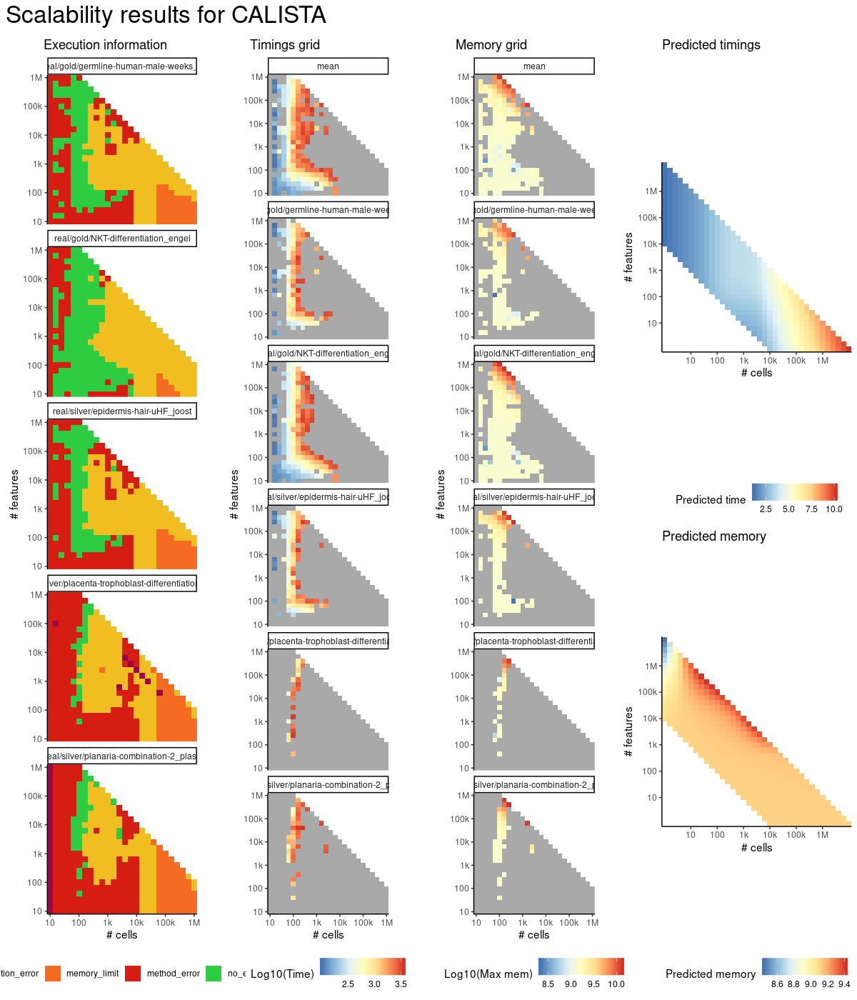
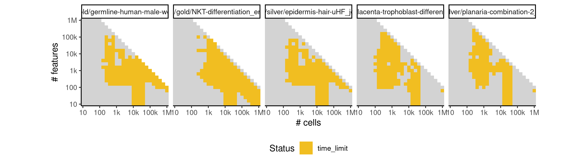

# calista


## ERROR STATUS METHOD_ERROR

### ERROR CLUSTER METHOD_ERROR -- 1


 * Number of instances: 61
 * Dataset ids: scaling_0001, scaling_0002, scaling_0003, scaling_0004, scaling_0006, scaling_0008, scaling_0010, scaling_0012, scaling_0016, scaling_0019, scaling_0022, scaling_0025, scaling_0041, scaling_0043, scaling_0047, scaling_0051, scaling_0056, scaling_0061, scaling_0066, scaling_0076, scaling_0082, scaling_0088, scaling_0106, scaling_0113, scaling_0120, scaling_0127, scaling_0151, scaling_0157, scaling_0163, scaling_0181, scaling_0188, scaling_0195, scaling_0202, scaling_0226, scaling_0232, scaling_0238, scaling_0244, scaling_0276, scaling_0287, scaling_0341, scaling_0351, scaling_0361, scaling_0391, scaling_0404, scaling_0417, scaling_0456, scaling_0466, scaling_0476, scaling_0556, scaling_0565, scaling_0601, scaling_0617, scaling_0633, scaling_0681, scaling_0698, scaling_0716, scaling_0867, scaling_0963, scaling_0995, scaling_1009, scaling_1046

Last 10 lines of scaling_0001:
```
Warning messages:
1: In rgl.init(initValue, onlyNULL) : RGL: unable to open X11 display
2: 'rgl_init' failed, running with rgl.useNULL = TRUE 
[1] "**** Please upload normalized data. File formats accepted: .txt , .xlxs , .csv ****"
Data loading...
CALISTA_clustering is running...
Error in { : 
  task 1 failed - "number of items to replace is not a multiple of replacement length"
Calls: CALISTA_clustering_main ... CALISTA_clustering -> greedy_cabsel -> %dopar% -> <Anonymous>
Execution halted
```

### ERROR CLUSTER METHOD_ERROR -- 2


 * Number of instances: 216
 * Dataset ids: scaling_0007, scaling_0011, scaling_0013, scaling_0015, scaling_0018, scaling_0024, scaling_0027, scaling_0030, scaling_0036, scaling_0038, scaling_0040, scaling_0042, scaling_0044, scaling_0046, scaling_0048, scaling_0050, scaling_0052, scaling_0054, scaling_0055, scaling_0062, scaling_0064, scaling_0065, scaling_0069, scaling_0070, scaling_0074, scaling_0075, scaling_0080, scaling_0081, scaling_0092, scaling_0093, scaling_0098, scaling_0099, scaling_0104, scaling_0105, scaling_0110, scaling_0111, scaling_0112, scaling_0124, scaling_0125, scaling_0126, scaling_0130, scaling_0131, scaling_0132, scaling_0133, scaling_0139, scaling_0140, scaling_0148, scaling_0150, scaling_0155, scaling_0156, scaling_0162, scaling_0164, scaling_0167, scaling_0168, scaling_0172, scaling_0173, scaling_0174, scaling_0178, scaling_0179, scaling_0180, scaling_0186, scaling_0187, scaling_0194, scaling_0200, scaling_0201, scaling_0205, scaling_0207, scaling_0208, scaling_0212, scaling_0214, scaling_0215, scaling_0217, scaling_0221, scaling_0223, scaling_0225, scaling_0227, scaling_0230, scaling_0231, scaling_0237, scaling_0242, scaling_0243, scaling_0245, scaling_0246, scaling_0247, scaling_0248, scaling_0249, scaling_0253, scaling_0254, scaling_0255, scaling_0267, scaling_0270, scaling_0271, scaling_0274, scaling_0275, scaling_0284, scaling_0285, scaling_0286, scaling_0297, scaling_0299, scaling_0306, scaling_0307, scaling_0308, scaling_0315, scaling_0316, scaling_0317, scaling_0318, scaling_0319, scaling_0324, scaling_0325, scaling_0326, scaling_0327, scaling_0328, scaling_0329, scaling_0332, scaling_0335, scaling_0336, scaling_0338, scaling_0340, scaling_0349, scaling_0350, scaling_0360, scaling_0369, scaling_0370, scaling_0377, scaling_0378, scaling_0379, scaling_0384, scaling_0387, scaling_0388, scaling_0389, scaling_0401, scaling_0402, scaling_0403, scaling_0405, scaling_0414, scaling_0416, scaling_0418, scaling_0427, scaling_0428, scaling_0429, scaling_0434, scaling_0439, scaling_0440, scaling_0451, scaling_0452, scaling_0464, scaling_0465, scaling_0475, scaling_0483, scaling_0484, scaling_0485, scaling_0489, scaling_0493, scaling_0499, scaling_0502, scaling_0503, scaling_0509, scaling_0513, scaling_0517, scaling_0530, scaling_0531, scaling_0537, scaling_0542, scaling_0543, scaling_0548, scaling_0551, scaling_0552, scaling_0554, scaling_0562, scaling_0563, scaling_0564, scaling_0580, scaling_0581, scaling_0582, scaling_0611, scaling_0613, scaling_0614, scaling_0615, scaling_0645, scaling_0646, scaling_0647, scaling_0660, scaling_0661, scaling_0670, scaling_0676, scaling_0677, scaling_0694, scaling_0695, scaling_0712, scaling_0728, scaling_0729, scaling_0736, scaling_0743, scaling_0744, scaling_0745, scaling_0760, scaling_0761, scaling_0779, scaling_0780, scaling_0786, scaling_0815, scaling_0816, scaling_0824, scaling_0832, scaling_0833, scaling_0850, scaling_0896, scaling_0917, scaling_0933, scaling_0936, scaling_0941, scaling_0948, scaling_0991, scaling_1019, scaling_1032, scaling_1033

Last 10 lines of scaling_0007:
```
 
Press 1 if you want to remove edges, 0 otherwise:
Plotting mean gene expressions...
Saving 7 x 7 in image
 Done! Mean gene expression plot is saved in "Plotting  mean gene expression.pdf" in current working directory  
Calculating cell to cell variability...
CALISTA_transition_genes is running...
Error in 1:num_transition_genes[[i]] : argument of length 0
Calls: CALISTA_transition_genes_main
Execution halted
```

### ERROR CLUSTER METHOD_ERROR -- 3


 * Number of instances: 182
 * Dataset ids: scaling_0023, scaling_0026, scaling_0029, scaling_0031, scaling_0035, scaling_0037, scaling_0039, scaling_0045, scaling_0053, scaling_0067, scaling_0068, scaling_0072, scaling_0073, scaling_0079, scaling_0089, scaling_0090, scaling_0091, scaling_0094, scaling_0095, scaling_0096, scaling_0097, scaling_0101, scaling_0103, scaling_0108, scaling_0109, scaling_0122, scaling_0123, scaling_0128, scaling_0129, scaling_0135, scaling_0136, scaling_0137, scaling_0141, scaling_0145, scaling_0147, scaling_0149, scaling_0153, scaling_0165, scaling_0169, scaling_0170, scaling_0171, scaling_0176, scaling_0177, scaling_0182, scaling_0183, scaling_0190, scaling_0196, scaling_0197, scaling_0204, scaling_0210, scaling_0211, scaling_0216, scaling_0220, scaling_0222, scaling_0224, scaling_0251, scaling_0256, scaling_0257, scaling_0264, scaling_0265, scaling_0268, scaling_0269, scaling_0272, scaling_0273, scaling_0278, scaling_0279, scaling_0300, scaling_0301, scaling_0309, scaling_0310, scaling_0312, scaling_0321, scaling_0322, scaling_0323, scaling_0339, scaling_0343, scaling_0363, scaling_0371, scaling_0372, scaling_0373, scaling_0382, scaling_0383, scaling_0393, scaling_0394, scaling_0419, scaling_0420, scaling_0430, scaling_0431, scaling_0432, scaling_0433, scaling_0444, scaling_0445, scaling_0446, scaling_0457, scaling_0458, scaling_0477, scaling_0478, scaling_0486, scaling_0487, scaling_0488, scaling_0497, scaling_0498, scaling_0518, scaling_0522, scaling_0544, scaling_0550, scaling_0558, scaling_0566, scaling_0575, scaling_0576, scaling_0583, scaling_0584, scaling_0585, scaling_0593, scaling_0594, scaling_0604, scaling_0619, scaling_0636, scaling_0649, scaling_0650, scaling_0651, scaling_0652, scaling_0666, scaling_0667, scaling_0668, scaling_0684, scaling_0700, scaling_0715, scaling_0717, scaling_0718, scaling_0732, scaling_0733, scaling_0734, scaling_0735, scaling_0750, scaling_0751, scaling_0752, scaling_0766, scaling_0767, scaling_0768, scaling_0787, scaling_0802, scaling_0803, scaling_0804, scaling_0820, scaling_0821, scaling_0822, scaling_0823, scaling_0839, scaling_0840, scaling_0841, scaling_0856, scaling_0857, scaling_0858, scaling_0868, scaling_0869, scaling_0878, scaling_0879, scaling_0880, scaling_0889, scaling_0890, scaling_0891, scaling_0901, scaling_0902, scaling_0911, scaling_0927, scaling_0935, scaling_0943, scaling_0951, scaling_0969, scaling_0975, scaling_0981, scaling_0982, scaling_0983, scaling_0997, scaling_1010, scaling_1011, scaling_1023, scaling_1024, scaling_1025, scaling_1038, scaling_1039

Last 10 lines of scaling_0023:
```
    lowess
Warning messages:
1: In rgl.init(initValue, onlyNULL) : RGL: unable to open X11 display
2: 'rgl_init' failed, running with rgl.useNULL = TRUE 
[1] "**** Please upload normalized data. File formats accepted: .txt , .xlxs , .csv ****"
Data loading...
CALISTA_clustering is running...
Error in { : task 33 failed - "missing value where TRUE/FALSE needed"
Calls: CALISTA_clustering_main ... CALISTA_clustering -> greedy_cabsel -> %dopar% -> <Anonymous>
Execution halted
```

### ERROR CLUSTER METHOD_ERROR -- 4


 * Number of instances: 23
 * Dataset ids: scaling_0077, scaling_0083, scaling_0102, scaling_0114, scaling_0138, scaling_0143, scaling_0152, scaling_0203, scaling_0239, scaling_0288, scaling_0289, scaling_0311, scaling_0333, scaling_0337, scaling_0362, scaling_0392, scaling_0406, scaling_0447, scaling_0467, scaling_0500, scaling_0557, scaling_0635, scaling_0682

Last 10 lines of scaling_0077:
```
CALISTA_clustering is running...
No time info found. Please enter the starting cell or the marker gene whenever available
Press 1 to enter the starting cell, 2 to enter the marker gene, 3 otherwise: 
Skip relabeling step
Plotting...
CALISTA_transtion is running...
Error in base::colMeans(x, na.rm = na.rm, dims = dims, ...) : 
  'x' must be an array of at least two dimensions
Calls: CALISTA_transition_main ... CALISTA_transition -> colMeans -> colMeans -> <Anonymous>
Execution halted
```

### ERROR CLUSTER METHOD_ERROR -- 5


 * Number of instances: 3
 * Dataset ids: scaling_0252, scaling_0653, scaling_0970

Last 10 lines of scaling_0252:
```
Plotting mean gene expressions...
Saving 7 x 7 in image
 Done! Mean gene expression plot is saved in "Plotting  mean gene expression.pdf" in current working directory  
Calculating cell to cell variability...
Warning message:
In cor(t(DATA$totDATA[aaa, ])) : the standard deviation is zero
CALISTA_transition_genes is running...
Error in 1:num_transition_genes[[i]] : argument of length 0
Calls: CALISTA_transition_genes_main
Execution halted
```

### ERROR CLUSTER METHOD_ERROR -- 6


 * Number of instances: 47
 * Dataset ids: scaling_0298, scaling_0330, scaling_0380, scaling_0390, scaling_0441, scaling_0442, scaling_0453, scaling_0454, scaling_0455, scaling_0494, scaling_0495, scaling_0504, scaling_0505, scaling_0521, scaling_0525, scaling_0549, scaling_0555, scaling_0589, scaling_0590, scaling_0591, scaling_0598, scaling_0599, scaling_0600, scaling_0662, scaling_0663, scaling_0664, scaling_0678, scaling_0679, scaling_0680, scaling_0746, scaling_0747, scaling_0762, scaling_0763, scaling_0764, scaling_0784, scaling_0834, scaling_0835, scaling_0851, scaling_0852, scaling_0853, scaling_0897, scaling_0907, scaling_0908, scaling_0949, scaling_0979, scaling_1045, scaling_1047

Last 10 lines of scaling_0298:
```
Warning messages:
1: In rgl.init(initValue, onlyNULL) : RGL: unable to open X11 display
2: 'rgl_init' failed, running with rgl.useNULL = TRUE 
[1] "**** Please upload normalized data. File formats accepted: .txt , .xlxs , .csv ****"
Data loading...
CALISTA_clustering is running...
Error in { : 
  task 1 failed - "dims [product 10] do not match the length of object [60]"
Calls: CALISTA_clustering_main ... CALISTA_clustering -> greedy_cabsel -> %dopar% -> <Anonymous>
Execution halted
```

### ERROR CLUSTER METHOD_ERROR -- 7


 * Number of instances: 1
 * Dataset ids: scaling_0574

Last 10 lines of scaling_0574:
```
The following object is masked from ‘package:stats’:
    lowess
Warning messages:
1: In rgl.init(initValue, onlyNULL) : RGL: unable to open X11 display
2: 'rgl_init' failed, running with rgl.useNULL = TRUE 
[1] "**** Please upload normalized data. File formats accepted: .txt , .xlxs , .csv ****"
Data loading...
CALISTA_clustering is running...
terminate called after throwing an instance of 'std::logic_error'
  what():  Mat::operator(): index out of bounds
```

## ERROR STATUS TIME_LIMIT

### ERROR CLUSTER TIME_LIMIT -- 1


 * Number of instances: 255
 * Dataset ids: scaling_0206, scaling_0314, scaling_0375, scaling_0376, scaling_0386, scaling_0397, scaling_0423, scaling_0435, scaling_0436, scaling_0437, scaling_0438, scaling_0449, scaling_0450, scaling_0461, scaling_0481, scaling_0490, scaling_0491, scaling_0492, scaling_0501, scaling_0507, scaling_0508, scaling_0515, scaling_0516, scaling_0519, scaling_0520, scaling_0523, scaling_0524, scaling_0529, scaling_0541, scaling_0546, scaling_0547, scaling_0553, scaling_0559, scaling_0560, scaling_0561, scaling_0569, scaling_0570, scaling_0577, scaling_0578, scaling_0579, scaling_0586, scaling_0587, scaling_0588, scaling_0595, scaling_0596, scaling_0597, scaling_0608, scaling_0609, scaling_0610, scaling_0616, scaling_0624, scaling_0625, scaling_0626, scaling_0627, scaling_0632, scaling_0639, scaling_0640, scaling_0641, scaling_0642, scaling_0643, scaling_0648, scaling_0654, scaling_0655, scaling_0656, scaling_0657, scaling_0658, scaling_0659, scaling_0671, scaling_0672, scaling_0673, scaling_0674, scaling_0675, scaling_0688, scaling_0689, scaling_0690, scaling_0691, scaling_0692, scaling_0696, scaling_0697, scaling_0705, scaling_0706, scaling_0707, scaling_0708, scaling_0709, scaling_0713, scaling_0714, scaling_0721, scaling_0722, scaling_0723, scaling_0724, scaling_0725, scaling_0726, scaling_0730, scaling_0731, scaling_0737, scaling_0738, scaling_0739, scaling_0740, scaling_0741, scaling_0742, scaling_0748, scaling_0755, scaling_0756, scaling_0757, scaling_0758, scaling_0759, scaling_0765, scaling_0772, scaling_0773, scaling_0774, scaling_0775, scaling_0776, scaling_0777, scaling_0778, scaling_0781, scaling_0782, scaling_0783, scaling_0791, scaling_0792, scaling_0793, scaling_0794, scaling_0795, scaling_0796, scaling_0797, scaling_0798, scaling_0799, scaling_0800, scaling_0801, scaling_0808, scaling_0809, scaling_0810, scaling_0811, scaling_0812, scaling_0813, scaling_0814, scaling_0817, scaling_0818, scaling_0819, scaling_0825, scaling_0826, scaling_0827, scaling_0828, scaling_0829, scaling_0830, scaling_0831, scaling_0836, scaling_0837, scaling_0844, scaling_0845, scaling_0846, scaling_0847, scaling_0848, scaling_0849, scaling_0854, scaling_0855, scaling_0860, scaling_0861, scaling_0862, scaling_0863, scaling_0864, scaling_0865, scaling_0871, scaling_0872, scaling_0873, scaling_0874, scaling_0875, scaling_0876, scaling_0882, scaling_0883, scaling_0884, scaling_0885, scaling_0886, scaling_0887, scaling_0892, scaling_0893, scaling_0894, scaling_0895, scaling_0898, scaling_0904, scaling_0905, scaling_0906, scaling_0909, scaling_0913, scaling_0914, scaling_0915, scaling_0916, scaling_0918, scaling_0923, scaling_0924, scaling_0925, scaling_0926, scaling_0929, scaling_0930, scaling_0931, scaling_0932, scaling_0934, scaling_0937, scaling_0938, scaling_0939, scaling_0940, scaling_0942, scaling_0945, scaling_0946, scaling_0947, scaling_0950, scaling_0953, scaling_0954, scaling_0955, scaling_0959, scaling_0960, scaling_0961, scaling_0965, scaling_0966, scaling_0967, scaling_0971, scaling_0972, scaling_0973, scaling_0977, scaling_0978, scaling_0985, scaling_0987, scaling_0988, scaling_0989, scaling_0990, scaling_0992, scaling_0993, scaling_1001, scaling_1002, scaling_1003, scaling_1004, scaling_1005, scaling_1006, scaling_1007, scaling_1013, scaling_1014, scaling_1015, scaling_1016, scaling_1017, scaling_1018, scaling_1020, scaling_1021, scaling_1026, scaling_1027, scaling_1028, scaling_1029, scaling_1030, scaling_1031, scaling_1034, scaling_1035, scaling_1041, scaling_1042, scaling_1043, scaling_1044, scaling_1048, scaling_1049

Last 10 lines of scaling_0206:
```
File: /home/rcannood/Workspace/dynverse/dynbenchmark//derived/05-scaling/suite/calista/10/r2gridengine/20180924_185112_calista_10_MtWCBvWFKM/log/log.206.e.txt
```

## ERROR STATUS MEMORY_LIMIT

### ERROR CLUSTER MEMORY_LIMIT -- 1


 * Number of instances: 15
 * Dataset ids: scaling_0866, scaling_0877, scaling_0888, scaling_0899, scaling_0910, scaling_0956, scaling_0962, scaling_0968, scaling_0974, scaling_0980, scaling_0994, scaling_1008, scaling_1022, scaling_1036, scaling_1050

Last 10 lines of scaling_0866:
```
The following object is masked from ‘package:stats’:
    lowess
Warning messages:
1: In rgl.init(initValue, onlyNULL) : RGL: unable to open X11 display
2: 'rgl_init' failed, running with rgl.useNULL = TRUE 
[1] "**** Please upload normalized data. File formats accepted: .txt , .xlxs , .csv ****"
Data loading...
CALISTA_clustering is running...
Error: cannot allocate vector of size 11.8 Gb
Execution halted
```


