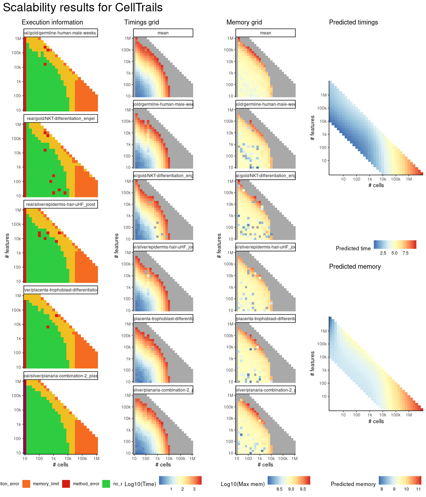
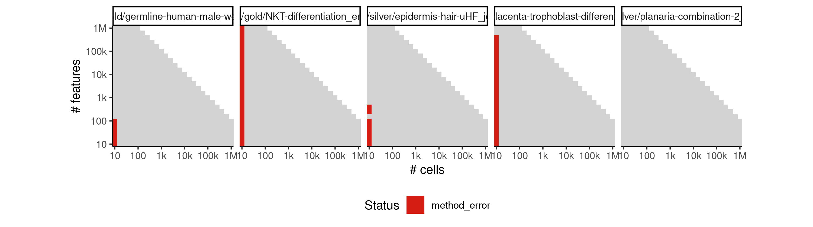
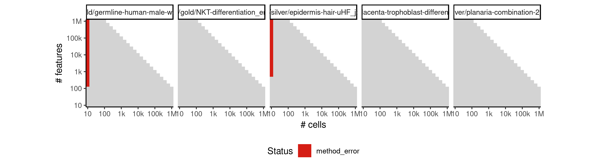
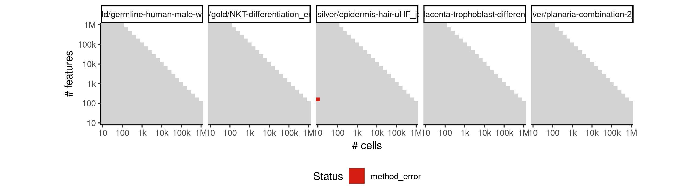
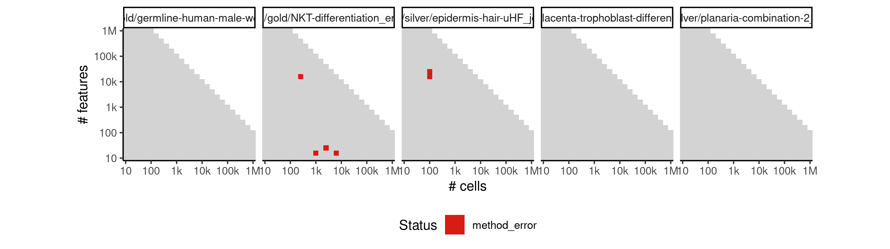
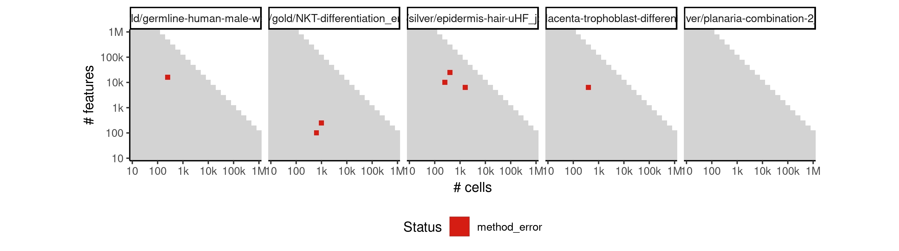
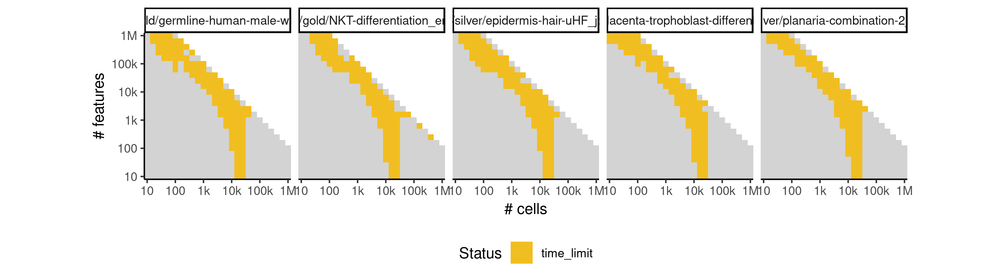
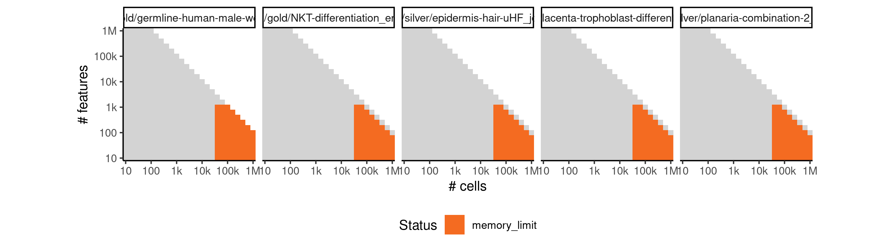

# celltrails


## ERROR STATUS METHOD_ERROR

### ERROR CLUSTER METHOD_ERROR -- 1


 * Number of instances: 108
 * Dataset ids: scaling_0001, scaling_0002, scaling_0003, scaling_0004, scaling_0006, scaling_0008, scaling_0010, scaling_0012, scaling_0016, scaling_0019, scaling_0022, scaling_0025, scaling_0041, scaling_0043, scaling_0045, scaling_0047, scaling_0051, scaling_0056, scaling_0061, scaling_0066, scaling_0076, scaling_0082, scaling_0088, scaling_0094, scaling_0113, scaling_0127, scaling_0157, scaling_0163, scaling_0169, scaling_0188, scaling_0195, scaling_0202, scaling_0232, scaling_0244, scaling_0287, scaling_0309, scaling_0351, scaling_0371, scaling_0404, scaling_0430, scaling_0466, scaling_0486, scaling_0565, scaling_0583, scaling_0617, scaling_0649, scaling_0698, scaling_0732, scaling_0784, scaling_0820, scaling_0867, scaling_0889, scaling_0995, scaling_1023, scaling_0001, scaling_0002, scaling_0003, scaling_0004, scaling_0006, scaling_0008, scaling_0010, scaling_0012, scaling_0016, scaling_0019, scaling_0022, scaling_0025, scaling_0041, scaling_0043, scaling_0045, scaling_0047, scaling_0051, scaling_0056, scaling_0061, scaling_0066, scaling_0076, scaling_0082, scaling_0088, scaling_0094, scaling_0113, scaling_0127, scaling_0157, scaling_0163, scaling_0169, scaling_0188, scaling_0195, scaling_0202, scaling_0232, scaling_0244, scaling_0287, scaling_0309, scaling_0351, scaling_0371, scaling_0404, scaling_0430, scaling_0466, scaling_0486, scaling_0565, scaling_0583, scaling_0617, scaling_0649, scaling_0698, scaling_0732, scaling_0784, scaling_0820, scaling_0867, scaling_0889, scaling_0995, scaling_1023

Last 10 lines of scaling_0001:
```
Warning message:
Removed 91 rows containing missing values (geom_point). 
Calculating approximation of CellTrails manifold for 2D visualization...
Used tSNE perplexity: 2
Initialized 3 clusters with a minimum size of 1 samples each.
Performing post-hoc test ...
Found 1 states.
Error in `[.data.frame`(dt, , 3) : undefined columns selected
Calls: <Anonymous> ... .connectStates_def -> [ -> [.data.frame -> order -> [ -> [.data.frame
Execution halted
```

### ERROR CLUSTER METHOD_ERROR -- 2


 * Number of instances: 50
 * Dataset ids: scaling_0106, scaling_0151, scaling_0181, scaling_0226, scaling_0238, scaling_0276, scaling_0298, scaling_0341, scaling_0361, scaling_0391, scaling_0417, scaling_0456, scaling_0476, scaling_0556, scaling_0574, scaling_0601, scaling_0633, scaling_0681, scaling_0715, scaling_0766, scaling_0802, scaling_0856, scaling_0878, scaling_0981, scaling_1009, scaling_0106, scaling_0151, scaling_0181, scaling_0226, scaling_0238, scaling_0276, scaling_0298, scaling_0341, scaling_0361, scaling_0391, scaling_0417, scaling_0456, scaling_0476, scaling_0556, scaling_0574, scaling_0601, scaling_0633, scaling_0681, scaling_0715, scaling_0766, scaling_0802, scaling_0856, scaling_0878, scaling_0981, scaling_1009

Last 10 lines of scaling_0106:
```
Computing spectral embedding ...
Warning message:
Removed 91 rows containing missing values (geom_point). 
Calculating approximation of CellTrails manifold for 2D visualization...
Used tSNE perplexity: 2
Initialized 0 clusters with a minimum size of 1 samples each.
Error in .findStates_def(X = X, ordi = ordi, link.method = "ward.D2",  : 
  No maximal defragmentation found. Choose smaller min_size.
Calls: %>% ... <Anonymous> -> <Anonymous> -> <Anonymous> -> .findStates_def
Execution halted
```

### ERROR CLUSTER METHOD_ERROR -- 3


 * Number of instances: 2
 * Dataset ids: scaling_0120, scaling_0120

Last 10 lines of scaling_0120:
```
The following objects are masked from ‘package:base’:
    aperm, apply
Computing adjacency matrix ...
Computing spectral embedding ...
Error in rep("red", x$n - 1) : invalid 'times' argument
Calls: <Anonymous> ... .findSpectrum_def -> .plotSpectrum_def -> geom_point -> layer
In addition: Warning message:
In min(which(diff(which(h > fit$y)) > 1)) :
  no non-missing arguments to min; returning Inf
Execution halted
```

### ERROR CLUSTER METHOD_ERROR -- 4


 * Number of instances: 6
 * Dataset ids: scaling_0359, scaling_0572, scaling_0631, scaling_0359, scaling_0572, scaling_0631

Last 10 lines of scaling_0359:
```
Calculating approximation of CellTrails manifold for 2D visualization...
Used tSNE perplexity: 30
Initialized 40 clusters with a minimum size of 10 samples each.
Performing post-hoc test ...
Found 2 states.
Calculating layout of state trajectory graph component 1...
Error in apply(ordi[v, ], 1L, function(x) { : 
  dim(X) must have a positive length
Calls: map ... .fitTrajectory_def -> .connect_ordi -> factor -> apply
Execution halted
```

### ERROR CLUSTER METHOD_ERROR -- 5


 * Number of instances: 4
 * Dataset ids: scaling_0535, scaling_0794, scaling_0535, scaling_0794

Last 10 lines of scaling_0535:
```
Calculating approximation of CellTrails manifold for 2D visualization...
Used tSNE perplexity: 30
Initialized 27 clusters with a minimum size of 6 samples each.
Performing post-hoc test ...
Found 9 states.
Calculating layout of state trajectory graph component 1...
output saved in /data/tmp//RtmpBprnpo/file41c05feb1856/ti/output: 
	output.rds
all(pg_check >= 0 & pg_check < (1 + 1e-06)) isn't true.
Sum of progressions per cell_id should be exactly one
```

## ERROR STATUS TIME_LIMIT

### ERROR CLUSTER TIME_LIMIT -- 1


 * Number of instances: 120
 * Dataset ids: scaling_0616, scaling_0632, scaling_0648, scaling_0664, scaling_0680, scaling_0696, scaling_0697, scaling_0713, scaling_0714, scaling_0730, scaling_0731, scaling_0747, scaling_0748, scaling_0764, scaling_0765, scaling_0781, scaling_0782, scaling_0783, scaling_0799, scaling_0800, scaling_0801, scaling_0817, scaling_0818, scaling_0819, scaling_0835, scaling_0836, scaling_0837, scaling_0853, scaling_0854, scaling_0855, scaling_0864, scaling_0865, scaling_0875, scaling_0876, scaling_0886, scaling_0887, scaling_0897, scaling_0898, scaling_0908, scaling_0909, scaling_0918, scaling_0926, scaling_0934, scaling_0942, scaling_0950, scaling_0955, scaling_0961, scaling_0967, scaling_0973, scaling_0979, scaling_0992, scaling_0993, scaling_1006, scaling_1007, scaling_1020, scaling_1021, scaling_1034, scaling_1035, scaling_1048, scaling_1049, scaling_0616, scaling_0632, scaling_0648, scaling_0664, scaling_0680, scaling_0696, scaling_0697, scaling_0713, scaling_0714, scaling_0730, scaling_0731, scaling_0747, scaling_0748, scaling_0764, scaling_0765, scaling_0781, scaling_0782, scaling_0783, scaling_0799, scaling_0800, scaling_0801, scaling_0817, scaling_0818, scaling_0819, scaling_0835, scaling_0836, scaling_0837, scaling_0853, scaling_0854, scaling_0855, scaling_0864, scaling_0865, scaling_0875, scaling_0876, scaling_0886, scaling_0887, scaling_0897, scaling_0898, scaling_0908, scaling_0909, scaling_0918, scaling_0926, scaling_0934, scaling_0942, scaling_0950, scaling_0955, scaling_0961, scaling_0967, scaling_0973, scaling_0979, scaling_0992, scaling_0993, scaling_1006, scaling_1007, scaling_1020, scaling_1021, scaling_1034, scaling_1035, scaling_1048, scaling_1049

Last 10 lines of scaling_0616:
```
File: /home/rcannood/Workspace/dynverse/dynbenchmark//derived/05-scaling/suite/celltrails/10/r2gridengine/20180924_185058_celltrails_10_8FhYyI4ixL/log/log.616.e.txt
```

## ERROR STATUS MEMORY_LIMIT

### ERROR CLUSTER MEMORY_LIMIT -- 1


 * Number of instances: 30
 * Dataset ids: scaling_0866, scaling_0877, scaling_0888, scaling_0899, scaling_0910, scaling_0956, scaling_0962, scaling_0968, scaling_0974, scaling_0980, scaling_0994, scaling_1008, scaling_1022, scaling_1036, scaling_1050, scaling_0866, scaling_0877, scaling_0888, scaling_0899, scaling_0910, scaling_0956, scaling_0962, scaling_0968, scaling_0974, scaling_0980, scaling_0994, scaling_1008, scaling_1022, scaling_1036, scaling_1050

Last 10 lines of scaling_0866:
```
    colMaxs, colMins, colRanges, rowMaxs, rowMins, rowRanges
The following object is masked from ‘package:igraph’:
    simplify
The following object is masked from ‘package:purrr’:
    simplify
The following objects are masked from ‘package:base’:
    aperm, apply
Computing adjacency matrix ...
Error: cannot allocate vector of size 11.8 Gb
Execution halted
```


