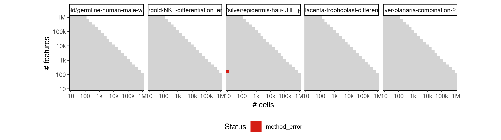
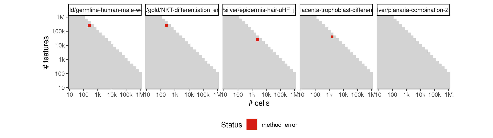
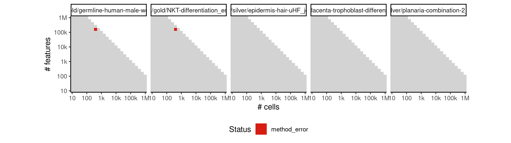
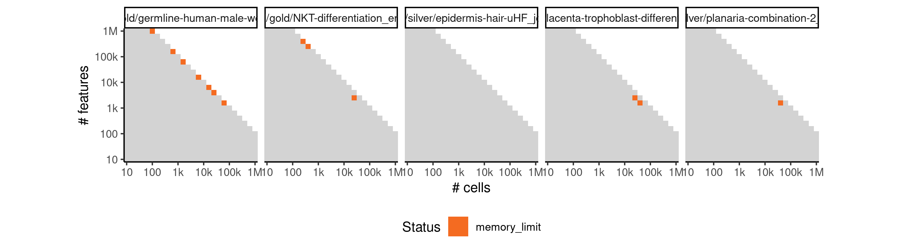

# celltrails


## ERROR STATUS METHOD_ERROR

### ERROR CLUSTER METHOD_ERROR -- 1


 * Number of instances: 64
 * Dataset ids: scaling_0001, scaling_0002, scaling_0003, scaling_0004, scaling_0006, scaling_0008, scaling_0010, scaling_0012, scaling_0016, scaling_0019, scaling_0022, scaling_0025, scaling_0041, scaling_0043, scaling_0045, scaling_0047, scaling_0051, scaling_0056, scaling_0061, scaling_0066, scaling_0076, scaling_0082, scaling_0088, scaling_0094, scaling_0113, scaling_0127, scaling_0157, scaling_0163, scaling_0169, scaling_0188, scaling_0195, scaling_0202, scaling_0232, scaling_0244, scaling_0287, scaling_0309, scaling_0351, scaling_0371, scaling_0404, scaling_0430, scaling_0466, scaling_0486, scaling_0565, scaling_0583, scaling_0617, scaling_0649, scaling_0698, scaling_0732, scaling_0784, scaling_0820, scaling_0867, scaling_0889, scaling_0995, scaling_1023, scaling_1070, scaling_1108, scaling_1182, scaling_1214, scaling_1297, scaling_1339, scaling_1453, scaling_1477, scaling_1550, scaling_1648

Last 10 lines of scaling_0001:
```
Warning message:
Removed 91 rows containing missing values (geom_point). 
Calculating approximation of CellTrails manifold for 2D visualization...
Used tSNE perplexity: 2
Initialized 3 clusters with a minimum size of 1 samples each.
Performing post-hoc test ...
Found 1 states.
Error in `[.data.frame`(dt, , 3) : undefined columns selected
Calls: <Anonymous> ... .connectStates_def -> [ -> [.data.frame -> order -> [ -> [.data.frame
Execution halted
```

### ERROR CLUSTER METHOD_ERROR -- 2


 * Number of instances: 37
 * Dataset ids: scaling_0106, scaling_0151, scaling_0181, scaling_0226, scaling_0238, scaling_0276, scaling_0298, scaling_0341, scaling_0361, scaling_0391, scaling_0417, scaling_0456, scaling_0476, scaling_0556, scaling_0574, scaling_0601, scaling_0633, scaling_0681, scaling_0715, scaling_0766, scaling_0802, scaling_0856, scaling_0878, scaling_0981, scaling_1009, scaling_1051, scaling_1089, scaling_1166, scaling_1198, scaling_1276, scaling_1318, scaling_1441, scaling_1465, scaling_1531, scaling_1569, scaling_1626, scaling_1670

Last 10 lines of scaling_0106:
```
Computing spectral embedding ...
Warning message:
Removed 91 rows containing missing values (geom_point). 
Calculating approximation of CellTrails manifold for 2D visualization...
Used tSNE perplexity: 2
Initialized 0 clusters with a minimum size of 1 samples each.
Error in .findStates_def(X = X, ordi = ordi, link.method = "ward.D2",  : 
  No maximal defragmentation found. Choose smaller min_size.
Calls: %>% ... <Anonymous> -> <Anonymous> -> <Anonymous> -> .findStates_def
Execution halted
```

### ERROR CLUSTER METHOD_ERROR -- 3


 * Number of instances: 1
 * Dataset ids: scaling_0120

Last 10 lines of scaling_0120:
```
The following objects are masked from ‘package:base’:
    aperm, apply
Computing adjacency matrix ...
Computing spectral embedding ...
Error in rep("red", x$n - 1) : invalid 'times' argument
Calls: <Anonymous> ... .findSpectrum_def -> .plotSpectrum_def -> geom_point -> layer
In addition: Warning message:
In min(which(diff(which(h > fit$y)) > 1)) :
  no non-missing arguments to min; returning Inf
Execution halted
```

### ERROR CLUSTER METHOD_ERROR -- 4


 * Number of instances: 6
 * Dataset ids: scaling_0359, scaling_0572, scaling_0631, scaling_1201, scaling_1322, scaling_1457

Last 10 lines of scaling_0359:
```
Calculating approximation of CellTrails manifold for 2D visualization...
Used tSNE perplexity: 30
Initialized 40 clusters with a minimum size of 10 samples each.
Performing post-hoc test ...
Found 2 states.
Calculating layout of state trajectory graph component 1...
Error in apply(ordi[v, ], 1L, function(x) { : 
  dim(X) must have a positive length
Calls: map ... .fitTrajectory_def -> .connect_ordi -> factor -> apply
Execution halted
```

### ERROR CLUSTER METHOD_ERROR -- 5


 * Number of instances: 7
 * Dataset ids: scaling_0535, scaling_0794, scaling_1324, scaling_1346, scaling_1445, scaling_1676, scaling_1679

Last 10 lines of scaling_0535:
```
Calculating approximation of CellTrails manifold for 2D visualization...
Used tSNE perplexity: 30
Initialized 27 clusters with a minimum size of 6 samples each.
Performing post-hoc test ...
Found 9 states.
Calculating layout of state trajectory graph component 1...
output saved in /data/tmp//RtmpzH1HRv/file3c567a742680/ti/output: 
	output.rds
all(pg_check >= 0 & pg_check < (1 + 1e-06)) isn't true.
Sum of progressions per cell_id should be exactly one
```

### ERROR CLUSTER METHOD_ERROR -- 6


 * Number of instances: 4
 * Dataset ids: scaling_2136, scaling_2148, scaling_2164, scaling_2183

Last 10 lines of scaling_2136:
```
 *** caught segfault ***
address (nil), cause 'unknown'
Traceback:
 1: tcrossprod(W.x, W.y)
 2: f.MI(W[, , i], W[, , j], pmar[, i], pmar[, j], n)
 3: f.I(W)
 4: .embedSamples_def(x = M, design = design)
 5: CellTrails::embedSamples(sce)
 6: CellTrails::embedSamples(sce)
An irrecoverable exception occurred. R is aborting now ...
```

### ERROR CLUSTER METHOD_ERROR -- 7


 * Number of instances: 2
 * Dataset ids: scaling_2149, scaling_2165

Last 10 lines of scaling_2149:
```
Error in base::eigen(L, symmetric = TRUE) : 
  LAPACK routines cannot be loaded
Calls: <Anonymous> -> <Anonymous> -> .embedSamples_def -> <Anonymous>
In addition: Warning messages:
1: In .embedSamples_def(x = M, design = design) :
  Please note that trajectory features weren't selected. Thus, spectral embedding will be performed on all features, which may result in lower accuracy and longer computation time.
2: In base::eigen(L, symmetric = TRUE) :
  unable to load shared object '/usr/local/lib/R/modules//lapack.so':
  /usr/local/lib/R/modules//lapack.so: failed to map segment from shared object
Execution halted
```

## ERROR STATUS TIME_LIMIT

### ERROR CLUSTER TIME_LIMIT -- 1


 * Number of instances: 497
 * Dataset ids: scaling_0697, scaling_0714, scaling_0731, scaling_0748, scaling_0765, scaling_0782, scaling_0783, scaling_0800, scaling_0801, scaling_0818, scaling_0819, scaling_0836, scaling_0837, scaling_0854, scaling_0855, scaling_0865, scaling_0875, scaling_0876, scaling_0887, scaling_0897, scaling_0898, scaling_0909, scaling_0918, scaling_0926, scaling_0934, scaling_0942, scaling_0950, scaling_0961, scaling_0973, scaling_0979, scaling_0992, scaling_0993, scaling_1006, scaling_1007, scaling_1020, scaling_1021, scaling_1034, scaling_1035, scaling_1048, scaling_1049, scaling_1065, scaling_1066, scaling_1067, scaling_1084, scaling_1085, scaling_1086, scaling_1103, scaling_1104, scaling_1105, scaling_1122, scaling_1123, scaling_1124, scaling_1141, scaling_1142, scaling_1143, scaling_1177, scaling_1178, scaling_1179, scaling_1193, scaling_1194, scaling_1195, scaling_1209, scaling_1210, scaling_1211, scaling_1225, scaling_1226, scaling_1227, scaling_1241, scaling_1242, scaling_1243, scaling_1290, scaling_1291, scaling_1292, scaling_1311, scaling_1312, scaling_1313, scaling_1332, scaling_1333, scaling_1334, scaling_1353, scaling_1354, scaling_1355, scaling_1374, scaling_1375, scaling_1376, scaling_1388, scaling_1389, scaling_1400, scaling_1401, scaling_1412, scaling_1413, scaling_1424, scaling_1425, scaling_1436, scaling_1437, scaling_1448, scaling_1449, scaling_1460, scaling_1461, scaling_1472, scaling_1473, scaling_1484, scaling_1485, scaling_1496, scaling_1497, scaling_1504, scaling_1510, scaling_1513, scaling_1516, scaling_1522, scaling_1528, scaling_1533, scaling_1534, scaling_1535, scaling_1541, scaling_1542, scaling_1543, scaling_1544, scaling_1560, scaling_1561, scaling_1562, scaling_1563, scaling_1572, scaling_1573, scaling_1579, scaling_1580, scaling_1581, scaling_1582, scaling_1588, scaling_1598, scaling_1599, scaling_1600, scaling_1601, scaling_1617, scaling_1618, scaling_1619, scaling_1620, scaling_1627, scaling_1628, scaling_1629, scaling_1630, scaling_1636, scaling_1637, scaling_1638, scaling_1639, scaling_1640, scaling_1641, scaling_1650, scaling_1651, scaling_1652, scaling_1658, scaling_1659, scaling_1660, scaling_1661, scaling_1662, scaling_1663, scaling_1671, scaling_1672, scaling_1673, scaling_1674, scaling_1677, scaling_1680, scaling_1681, scaling_1682, scaling_1683, scaling_1684, scaling_1685, scaling_1692, scaling_1693, scaling_1694, scaling_1696, scaling_1702, scaling_1703, scaling_1704, scaling_1705, scaling_1706, scaling_1707, scaling_1725, scaling_1726, scaling_1727, scaling_1728, scaling_1729, scaling_1736, scaling_1741, scaling_1744, scaling_1745, scaling_1748, scaling_1752, scaling_1756, scaling_1760, scaling_1766, scaling_1767, scaling_1768, scaling_1770, scaling_1771, scaling_1772, scaling_1773, scaling_1774, scaling_1775, scaling_1776, scaling_1782, scaling_1783, scaling_1784, scaling_1785, scaling_1787, scaling_1788, scaling_1789, scaling_1790, scaling_1791, scaling_1796, scaling_1797, scaling_1798, scaling_1799, scaling_1800, scaling_1801, scaling_1802, scaling_1803, scaling_1804, scaling_1805, scaling_1806, scaling_1811, scaling_1812, scaling_1813, scaling_1815, scaling_1816, scaling_1817, scaling_1818, scaling_1819, scaling_1820, scaling_1821, scaling_1826, scaling_1827, scaling_1829, scaling_1831, scaling_1832, scaling_1833, scaling_1834, scaling_1835, scaling_1836, scaling_1841, scaling_1842, scaling_1843, scaling_1844, scaling_1845, scaling_1849, scaling_1850, scaling_1851, scaling_1852, scaling_1853, scaling_1857, scaling_1858, scaling_1859, scaling_1860, scaling_1861, scaling_1865, scaling_1866, scaling_1867, scaling_1868, scaling_1869, scaling_1873, scaling_1874, scaling_1876, scaling_1877, scaling_1881, scaling_1883, scaling_1885, scaling_1887, scaling_1889, scaling_1891, scaling_1892, scaling_1893, scaling_1894, scaling_1895, scaling_1896, scaling_1897, scaling_1898, scaling_1899, scaling_1900, scaling_1901, scaling_1902, scaling_1903, scaling_1904, scaling_1905, scaling_1913, scaling_1914, scaling_1915, scaling_1916, scaling_1917, scaling_1918, scaling_1919, scaling_1920, scaling_1921, scaling_1922, scaling_1923, scaling_1924, scaling_1925, scaling_1926, scaling_1927, scaling_1935, scaling_1936, scaling_1937, scaling_1938, scaling_1939, scaling_1940, scaling_1941, scaling_1942, scaling_1943, scaling_1944, scaling_1945, scaling_1946, scaling_1947, scaling_1948, scaling_1949, scaling_1957, scaling_1958, scaling_1959, scaling_1960, scaling_1961, scaling_1962, scaling_1963, scaling_1964, scaling_1965, scaling_1966, scaling_1967, scaling_1968, scaling_1969, scaling_1970, scaling_1971, scaling_1979, scaling_1980, scaling_1981, scaling_1982, scaling_1983, scaling_1984, scaling_1985, scaling_1986, scaling_1987, scaling_1988, scaling_1989, scaling_1990, scaling_1991, scaling_1992, scaling_1993, scaling_2001, scaling_2002, scaling_2003, scaling_2004, scaling_2005, scaling_2009, scaling_2010, scaling_2011, scaling_2012, scaling_2013, scaling_2017, scaling_2018, scaling_2019, scaling_2020, scaling_2021, scaling_2025, scaling_2026, scaling_2027, scaling_2028, scaling_2029, scaling_2033, scaling_2034, scaling_2035, scaling_2036, scaling_2037, scaling_2041, scaling_2042, scaling_2043, scaling_2044, scaling_2045, scaling_2046, scaling_2047, scaling_2048, scaling_2049, scaling_2050, scaling_2056, scaling_2057, scaling_2058, scaling_2059, scaling_2060, scaling_2061, scaling_2062, scaling_2063, scaling_2064, scaling_2065, scaling_2071, scaling_2072, scaling_2073, scaling_2074, scaling_2075, scaling_2076, scaling_2077, scaling_2078, scaling_2079, scaling_2080, scaling_2086, scaling_2087, scaling_2088, scaling_2089, scaling_2090, scaling_2091, scaling_2092, scaling_2093, scaling_2094, scaling_2095, scaling_2101, scaling_2102, scaling_2103, scaling_2104, scaling_2105, scaling_2106, scaling_2107, scaling_2108, scaling_2109, scaling_2110, scaling_2116, scaling_2117, scaling_2118, scaling_2119, scaling_2122, scaling_2123, scaling_2124, scaling_2125, scaling_2128, scaling_2129, scaling_2130, scaling_2131, scaling_2134, scaling_2135, scaling_2140, scaling_2141, scaling_2142, scaling_2146, scaling_2147, scaling_2150, scaling_2151, scaling_2152, scaling_2153, scaling_2154, scaling_2155, scaling_2156, scaling_2162, scaling_2163, scaling_2166, scaling_2167, scaling_2168, scaling_2169, scaling_2170, scaling_2171, scaling_2178, scaling_2179, scaling_2180, scaling_2181, scaling_2182, scaling_2184, scaling_2185, scaling_2186, scaling_2187, scaling_2188, scaling_2194, scaling_2195, scaling_2196, scaling_2197, scaling_2198, scaling_2199, scaling_2200, scaling_2201, scaling_2202, scaling_2203, scaling_2210, scaling_2211, scaling_2212, scaling_2213, scaling_2214, scaling_2215, scaling_2216, scaling_2217, scaling_2218, scaling_2219, scaling_2220, scaling_2227, scaling_2228, scaling_2229, scaling_2231, scaling_2233, scaling_2234, scaling_2236, scaling_2239, scaling_2247, scaling_2248, scaling_2251, scaling_2252, scaling_2253, scaling_2254

Last 10 lines of scaling_0697:
```
File: /home/rcannood/Workspace/dynverse/dynbenchmark//derived/05-scaling/suite/celltrails/Cat2/r2gridengine/20181008_215045_celltrails_Cat2_7gEkzpaoME/log/log.17.e.txt
```

## ERROR STATUS MEMORY_LIMIT

### ERROR CLUSTER MEMORY_LIMIT -- 1


 * Number of instances: 341
 * Dataset ids: scaling_0866, scaling_0877, scaling_0888, scaling_0899, scaling_0910, scaling_0956, scaling_0962, scaling_0968, scaling_0974, scaling_0980, scaling_0994, scaling_1008, scaling_1022, scaling_1036, scaling_1050, scaling_1068, scaling_1069, scaling_1087, scaling_1088, scaling_1106, scaling_1107, scaling_1125, scaling_1126, scaling_1144, scaling_1145, scaling_1147, scaling_1149, scaling_1151, scaling_1153, scaling_1155, scaling_1157, scaling_1159, scaling_1161, scaling_1163, scaling_1165, scaling_1180, scaling_1181, scaling_1196, scaling_1197, scaling_1212, scaling_1213, scaling_1228, scaling_1229, scaling_1244, scaling_1245, scaling_1249, scaling_1253, scaling_1257, scaling_1261, scaling_1265, scaling_1267, scaling_1269, scaling_1271, scaling_1273, scaling_1275, scaling_1293, scaling_1294, scaling_1295, scaling_1296, scaling_1314, scaling_1315, scaling_1316, scaling_1317, scaling_1335, scaling_1336, scaling_1337, scaling_1338, scaling_1356, scaling_1357, scaling_1358, scaling_1359, scaling_1377, scaling_1378, scaling_1379, scaling_1380, scaling_1390, scaling_1391, scaling_1392, scaling_1402, scaling_1403, scaling_1404, scaling_1414, scaling_1415, scaling_1416, scaling_1426, scaling_1427, scaling_1428, scaling_1438, scaling_1439, scaling_1440, scaling_1450, scaling_1451, scaling_1452, scaling_1462, scaling_1463, scaling_1464, scaling_1474, scaling_1475, scaling_1476, scaling_1486, scaling_1487, scaling_1488, scaling_1498, scaling_1499, scaling_1500, scaling_1505, scaling_1506, scaling_1511, scaling_1512, scaling_1517, scaling_1518, scaling_1523, scaling_1524, scaling_1529, scaling_1530, scaling_1545, scaling_1546, scaling_1547, scaling_1548, scaling_1549, scaling_1564, scaling_1565, scaling_1566, scaling_1567, scaling_1568, scaling_1583, scaling_1584, scaling_1585, scaling_1586, scaling_1587, scaling_1602, scaling_1603, scaling_1604, scaling_1605, scaling_1606, scaling_1621, scaling_1622, scaling_1623, scaling_1624, scaling_1625, scaling_1642, scaling_1643, scaling_1644, scaling_1645, scaling_1646, scaling_1647, scaling_1664, scaling_1665, scaling_1666, scaling_1667, scaling_1668, scaling_1669, scaling_1686, scaling_1687, scaling_1688, scaling_1689, scaling_1690, scaling_1691, scaling_1708, scaling_1709, scaling_1710, scaling_1711, scaling_1712, scaling_1713, scaling_1730, scaling_1731, scaling_1732, scaling_1733, scaling_1734, scaling_1735, scaling_1738, scaling_1739, scaling_1742, scaling_1743, scaling_1746, scaling_1747, scaling_1750, scaling_1751, scaling_1754, scaling_1755, scaling_1757, scaling_1759, scaling_1761, scaling_1763, scaling_1765, scaling_1777, scaling_1778, scaling_1779, scaling_1780, scaling_1792, scaling_1793, scaling_1794, scaling_1795, scaling_1807, scaling_1808, scaling_1809, scaling_1810, scaling_1822, scaling_1823, scaling_1824, scaling_1825, scaling_1837, scaling_1838, scaling_1839, scaling_1840, scaling_1846, scaling_1847, scaling_1848, scaling_1854, scaling_1855, scaling_1856, scaling_1862, scaling_1863, scaling_1864, scaling_1870, scaling_1871, scaling_1872, scaling_1878, scaling_1879, scaling_1880, scaling_1882, scaling_1884, scaling_1886, scaling_1888, scaling_1890, scaling_1906, scaling_1907, scaling_1908, scaling_1909, scaling_1910, scaling_1911, scaling_1912, scaling_1928, scaling_1929, scaling_1930, scaling_1931, scaling_1932, scaling_1933, scaling_1934, scaling_1950, scaling_1951, scaling_1952, scaling_1953, scaling_1954, scaling_1955, scaling_1956, scaling_1972, scaling_1973, scaling_1974, scaling_1975, scaling_1976, scaling_1977, scaling_1978, scaling_1994, scaling_1995, scaling_1996, scaling_1997, scaling_1998, scaling_1999, scaling_2000, scaling_2006, scaling_2007, scaling_2008, scaling_2014, scaling_2015, scaling_2016, scaling_2022, scaling_2023, scaling_2024, scaling_2030, scaling_2031, scaling_2032, scaling_2038, scaling_2039, scaling_2040, scaling_2051, scaling_2052, scaling_2053, scaling_2054, scaling_2055, scaling_2066, scaling_2067, scaling_2068, scaling_2069, scaling_2070, scaling_2081, scaling_2082, scaling_2083, scaling_2084, scaling_2085, scaling_2096, scaling_2097, scaling_2098, scaling_2099, scaling_2100, scaling_2111, scaling_2112, scaling_2113, scaling_2114, scaling_2115, scaling_2120, scaling_2121, scaling_2126, scaling_2127, scaling_2132, scaling_2133, scaling_2138, scaling_2139, scaling_2144, scaling_2145, scaling_2157, scaling_2158, scaling_2159, scaling_2160, scaling_2161, scaling_2173, scaling_2174, scaling_2175, scaling_2176, scaling_2177, scaling_2189, scaling_2190, scaling_2191, scaling_2192, scaling_2193, scaling_2205, scaling_2206, scaling_2207, scaling_2208, scaling_2209, scaling_2221, scaling_2222, scaling_2223, scaling_2224, scaling_2225, scaling_2241, scaling_2242, scaling_2243, scaling_2244, scaling_2245, scaling_2246

Last 10 lines of scaling_0866:
```
    colMaxs, colMins, colRanges, rowMaxs, rowMins, rowRanges
The following object is masked from ‘package:igraph’:
    simplify
The following object is masked from ‘package:purrr’:
    simplify
The following objects are masked from ‘package:base’:
    aperm, apply
Computing adjacency matrix ...
Error: cannot allocate vector of size 11.8 Gb
Execution halted
```

### ERROR CLUSTER MEMORY_LIMIT -- 2


 * Number of instances: 13
 * Dataset ids: scaling_2137, scaling_2143, scaling_2172, scaling_2204, scaling_2226, scaling_2230, scaling_2232, scaling_2235, scaling_2237, scaling_2238, scaling_2240, scaling_2249, scaling_2250

Last 10 lines of scaling_2137:
```
The following object is masked from ‘package:purrr’:
    simplify
The following objects are masked from ‘package:base’:
    aperm, apply
Computing adjacency matrix ...
Error: cannot allocate vector of size 11.8 Gb
In addition: Warning message:
In .embedSamples_def(x = M, design = design) :
  Please note that trajectory features weren't selected. Thus, spectral embedding will be performed on all features, which may result in lower accuracy and longer computation time.
Execution halted
```


