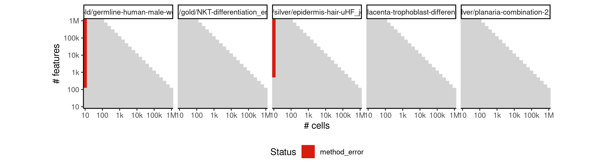
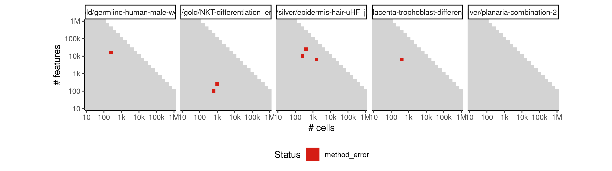
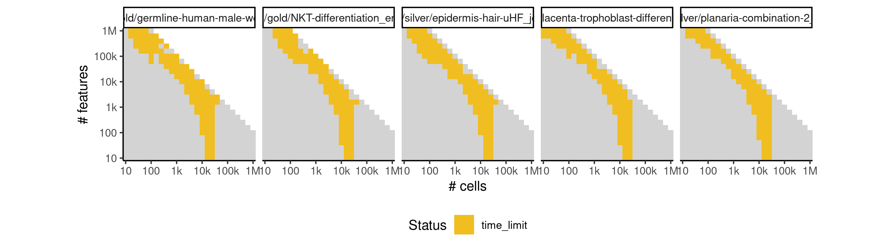

# celltrails


## ERROR STATUS METHOD_ERROR

### ERROR CLUSTER METHOD_ERROR -- 1


 * Number of instances: 64
 * Dataset ids: scaling_0001, scaling_0002, scaling_0003, scaling_0004, scaling_0006, scaling_0008, scaling_0010, scaling_0012, scaling_0016, scaling_0019, scaling_0022, scaling_0025, scaling_0041, scaling_0043, scaling_0045, scaling_0047, scaling_0051, scaling_0056, scaling_0061, scaling_0066, scaling_0076, scaling_0082, scaling_0088, scaling_0094, scaling_0113, scaling_0127, scaling_0157, scaling_0163, scaling_0169, scaling_0188, scaling_0195, scaling_0202, scaling_0232, scaling_0244, scaling_0287, scaling_0309, scaling_0351, scaling_0371, scaling_0404, scaling_0430, scaling_0466, scaling_0486, scaling_0565, scaling_0583, scaling_0617, scaling_0649, scaling_0698, scaling_0732, scaling_0784, scaling_0820, scaling_0867, scaling_0889, scaling_0995, scaling_1023, scaling_1070, scaling_1108, scaling_1182, scaling_1214, scaling_1297, scaling_1339, scaling_1453, scaling_1477, scaling_1550, scaling_1648

Last 10 lines of scaling_0001:
```
Warning message:
Removed 91 rows containing missing values (geom_point). 
Calculating approximation of CellTrails manifold for 2D visualization...
Used tSNE perplexity: 2
Initialized 3 clusters with a minimum size of 1 samples each.
Performing post-hoc test ...
Found 1 states.
Error in `[.data.frame`(dt, , 3) : undefined columns selected
Calls: <Anonymous> ... .connectStates_def -> [ -> [.data.frame -> order -> [ -> [.data.frame
Execution halted
```

### ERROR CLUSTER METHOD_ERROR -- 2


 * Number of instances: 37
 * Dataset ids: scaling_0106, scaling_0151, scaling_0181, scaling_0226, scaling_0238, scaling_0276, scaling_0298, scaling_0341, scaling_0361, scaling_0391, scaling_0417, scaling_0456, scaling_0476, scaling_0556, scaling_0574, scaling_0601, scaling_0633, scaling_0681, scaling_0715, scaling_0766, scaling_0802, scaling_0856, scaling_0878, scaling_0981, scaling_1009, scaling_1051, scaling_1089, scaling_1166, scaling_1198, scaling_1276, scaling_1318, scaling_1441, scaling_1465, scaling_1531, scaling_1569, scaling_1626, scaling_1670

Last 10 lines of scaling_0106:
```
Computing spectral embedding ...
Warning message:
Removed 91 rows containing missing values (geom_point). 
Calculating approximation of CellTrails manifold for 2D visualization...
Used tSNE perplexity: 2
Initialized 0 clusters with a minimum size of 1 samples each.
Error in .findStates_def(X = X, ordi = ordi, link.method = "ward.D2",  : 
  No maximal defragmentation found. Choose smaller min_size.
Calls: %>% ... <Anonymous> -> <Anonymous> -> <Anonymous> -> .findStates_def
Execution halted
```

### ERROR CLUSTER METHOD_ERROR -- 3


 * Number of instances: 1
 * Dataset ids: scaling_0120

Last 10 lines of scaling_0120:
```
The following objects are masked from ‘package:base’:
    aperm, apply
Computing adjacency matrix ...
Computing spectral embedding ...
Error in rep("red", x$n - 1) : invalid 'times' argument
Calls: <Anonymous> ... .findSpectrum_def -> .plotSpectrum_def -> geom_point -> layer
In addition: Warning message:
In min(which(diff(which(h > fit$y)) > 1)) :
  no non-missing arguments to min; returning Inf
Execution halted
```

### ERROR CLUSTER METHOD_ERROR -- 4


 * Number of instances: 6
 * Dataset ids: scaling_0359, scaling_0572, scaling_0631, scaling_1201, scaling_1322, scaling_1457

Last 10 lines of scaling_0359:
```
Calculating approximation of CellTrails manifold for 2D visualization...
Used tSNE perplexity: 30
Initialized 40 clusters with a minimum size of 10 samples each.
Performing post-hoc test ...
Found 2 states.
Calculating layout of state trajectory graph component 1...
Error in apply(ordi[v, ], 1L, function(x) { : 
  dim(X) must have a positive length
Calls: map ... .fitTrajectory_def -> .connect_ordi -> factor -> apply
Execution halted
```

### ERROR CLUSTER METHOD_ERROR -- 5


 * Number of instances: 7
 * Dataset ids: scaling_0535, scaling_0794, scaling_1324, scaling_1346, scaling_1445, scaling_1676, scaling_1679

Last 10 lines of scaling_0535:
```
Calculating approximation of CellTrails manifold for 2D visualization...
Used tSNE perplexity: 30
Initialized 27 clusters with a minimum size of 6 samples each.
Performing post-hoc test ...
Found 9 states.
Calculating layout of state trajectory graph component 1...
output saved in /data/tmp//RtmpzH1HRv/file3c567a742680/ti/output: 
	output.rds
all(pg_check >= 0 & pg_check < (1 + 1e-06)) isn't true.
Sum of progressions per cell_id should be exactly one
```

## ERROR STATUS TIME_LIMIT

### ERROR CLUSTER TIME_LIMIT -- 1


 * Number of instances: 182
 * Dataset ids: scaling_0697, scaling_0714, scaling_0731, scaling_0748, scaling_0765, scaling_0782, scaling_0783, scaling_0800, scaling_0801, scaling_0818, scaling_0819, scaling_0836, scaling_0837, scaling_0854, scaling_0855, scaling_0865, scaling_0875, scaling_0876, scaling_0887, scaling_0897, scaling_0898, scaling_0909, scaling_0918, scaling_0926, scaling_0934, scaling_0942, scaling_0950, scaling_0961, scaling_0973, scaling_0979, scaling_0992, scaling_0993, scaling_1006, scaling_1007, scaling_1020, scaling_1021, scaling_1034, scaling_1035, scaling_1048, scaling_1049, scaling_1065, scaling_1066, scaling_1067, scaling_1084, scaling_1085, scaling_1086, scaling_1103, scaling_1104, scaling_1105, scaling_1122, scaling_1123, scaling_1124, scaling_1141, scaling_1142, scaling_1143, scaling_1177, scaling_1178, scaling_1179, scaling_1193, scaling_1194, scaling_1195, scaling_1209, scaling_1210, scaling_1211, scaling_1225, scaling_1226, scaling_1227, scaling_1241, scaling_1242, scaling_1243, scaling_1290, scaling_1291, scaling_1292, scaling_1311, scaling_1312, scaling_1313, scaling_1332, scaling_1333, scaling_1334, scaling_1353, scaling_1354, scaling_1355, scaling_1374, scaling_1375, scaling_1376, scaling_1388, scaling_1389, scaling_1400, scaling_1401, scaling_1412, scaling_1413, scaling_1424, scaling_1425, scaling_1436, scaling_1437, scaling_1448, scaling_1449, scaling_1460, scaling_1461, scaling_1472, scaling_1473, scaling_1484, scaling_1485, scaling_1496, scaling_1497, scaling_1504, scaling_1510, scaling_1513, scaling_1516, scaling_1522, scaling_1528, scaling_1533, scaling_1534, scaling_1535, scaling_1541, scaling_1542, scaling_1543, scaling_1544, scaling_1560, scaling_1561, scaling_1562, scaling_1563, scaling_1572, scaling_1573, scaling_1579, scaling_1580, scaling_1581, scaling_1582, scaling_1588, scaling_1598, scaling_1599, scaling_1600, scaling_1601, scaling_1617, scaling_1618, scaling_1619, scaling_1620, scaling_1627, scaling_1628, scaling_1629, scaling_1630, scaling_1636, scaling_1637, scaling_1638, scaling_1639, scaling_1640, scaling_1641, scaling_1650, scaling_1651, scaling_1652, scaling_1658, scaling_1659, scaling_1660, scaling_1661, scaling_1662, scaling_1663, scaling_1671, scaling_1672, scaling_1673, scaling_1674, scaling_1677, scaling_1680, scaling_1681, scaling_1682, scaling_1683, scaling_1684, scaling_1685, scaling_1692, scaling_1693, scaling_1694, scaling_1696, scaling_1702, scaling_1703, scaling_1704, scaling_1705, scaling_1706, scaling_1707, scaling_1725, scaling_1726, scaling_1727, scaling_1728, scaling_1729

Last 10 lines of scaling_0697:
```
File: /home/rcannood/Workspace/dynverse/dynbenchmark//derived/05-scaling/suite/celltrails/Cat2/r2gridengine/20181008_215045_celltrails_Cat2_7gEkzpaoME/log/log.17.e.txt
```

## ERROR STATUS MEMORY_LIMIT

### ERROR CLUSTER MEMORY_LIMIT -- 1


 * Number of instances: 170
 * Dataset ids: scaling_0866, scaling_0877, scaling_0888, scaling_0899, scaling_0910, scaling_0956, scaling_0962, scaling_0968, scaling_0974, scaling_0980, scaling_0994, scaling_1008, scaling_1022, scaling_1036, scaling_1050, scaling_1068, scaling_1069, scaling_1087, scaling_1088, scaling_1106, scaling_1107, scaling_1125, scaling_1126, scaling_1144, scaling_1145, scaling_1147, scaling_1149, scaling_1151, scaling_1153, scaling_1155, scaling_1157, scaling_1159, scaling_1161, scaling_1163, scaling_1165, scaling_1180, scaling_1181, scaling_1196, scaling_1197, scaling_1212, scaling_1213, scaling_1228, scaling_1229, scaling_1244, scaling_1245, scaling_1249, scaling_1253, scaling_1257, scaling_1261, scaling_1265, scaling_1267, scaling_1269, scaling_1271, scaling_1273, scaling_1275, scaling_1293, scaling_1294, scaling_1295, scaling_1296, scaling_1314, scaling_1315, scaling_1316, scaling_1317, scaling_1335, scaling_1336, scaling_1337, scaling_1338, scaling_1356, scaling_1357, scaling_1358, scaling_1359, scaling_1377, scaling_1378, scaling_1379, scaling_1380, scaling_1390, scaling_1391, scaling_1392, scaling_1402, scaling_1403, scaling_1404, scaling_1414, scaling_1415, scaling_1416, scaling_1426, scaling_1427, scaling_1428, scaling_1438, scaling_1439, scaling_1440, scaling_1450, scaling_1451, scaling_1452, scaling_1462, scaling_1463, scaling_1464, scaling_1474, scaling_1475, scaling_1476, scaling_1486, scaling_1487, scaling_1488, scaling_1498, scaling_1499, scaling_1500, scaling_1505, scaling_1506, scaling_1511, scaling_1512, scaling_1517, scaling_1518, scaling_1523, scaling_1524, scaling_1529, scaling_1530, scaling_1545, scaling_1546, scaling_1547, scaling_1548, scaling_1549, scaling_1564, scaling_1565, scaling_1566, scaling_1567, scaling_1568, scaling_1583, scaling_1584, scaling_1585, scaling_1586, scaling_1587, scaling_1602, scaling_1603, scaling_1604, scaling_1605, scaling_1606, scaling_1621, scaling_1622, scaling_1623, scaling_1624, scaling_1625, scaling_1642, scaling_1643, scaling_1644, scaling_1645, scaling_1646, scaling_1647, scaling_1664, scaling_1665, scaling_1666, scaling_1667, scaling_1668, scaling_1669, scaling_1686, scaling_1687, scaling_1688, scaling_1689, scaling_1690, scaling_1691, scaling_1708, scaling_1709, scaling_1710, scaling_1711, scaling_1712, scaling_1713, scaling_1730, scaling_1731, scaling_1732, scaling_1733, scaling_1734, scaling_1735

Last 10 lines of scaling_0866:
```
    colMaxs, colMins, colRanges, rowMaxs, rowMins, rowRanges
The following object is masked from ‘package:igraph’:
    simplify
The following object is masked from ‘package:purrr’:
    simplify
The following objects are masked from ‘package:base’:
    aperm, apply
Computing adjacency matrix ...
Error: cannot allocate vector of size 11.8 Gb
Execution halted
```


