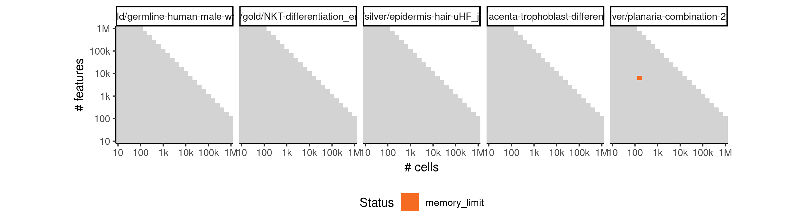

# celltree_gibbs


## ERROR STATUS METHOD_ERROR

### ERROR CLUSTER METHOD_ERROR -- 1


 * Number of instances: 7
 * Dataset ids: scaling_0001, scaling_0002, scaling_0016, scaling_0082, scaling_0188, scaling_0238, scaling_0287

Last 10 lines of scaling_0001:
```
Using root vertex: 5
Adding branch #1:
[1]  8  9  7  6  4  3 10  1
Using branch width: 0.82 (width.scale.factor: 1.5)
Outliers: 0
Total number of branches: 1 (forks: 0)
Error in apply(dists[backbone, -backbone], 2, which.min) : 
  dim(X) must have a positive length
Calls: <Anonymous> -> apply
Execution halted
```

### ERROR CLUSTER METHOD_ERROR -- 2


 * Number of instances: 36
 * Dataset ids: scaling_0105, scaling_0140, scaling_0180, scaling_0215, scaling_0225, scaling_0254, scaling_0255, scaling_0329, scaling_0330, scaling_0389, scaling_0390, scaling_0453, scaling_0454, scaling_0455, scaling_0504, scaling_0505, scaling_0525, scaling_0555, scaling_0599, scaling_0600, scaling_0678, scaling_0679, scaling_0680, scaling_0763, scaling_0764, scaling_0765, scaling_0853, scaling_0854, scaling_0855, scaling_0909, scaling_0910, scaling_0950, scaling_0980, scaling_1049, scaling_1050, scaling_1144

Last 10 lines of scaling_0105:
```
Iteration 200 ...
Iteration 210 ...
Iteration 220 ...
Iteration 230 ...
Gibbs sampling completed!
Model fit for k = 4 topics
Error in options(expressions = length(cell.names) * 5) : 
  'expressions' parameter invalid, allowed 25...500000
Calls: <Anonymous> -> options
Execution halted
```

## ERROR STATUS TIME_LIMIT

### ERROR CLUSTER TIME_LIMIT -- 1


 * Number of instances: 118
 * Dataset ids: scaling_0783, scaling_0800, scaling_0801, scaling_0819, scaling_0837, scaling_0866, scaling_0867, scaling_0868, scaling_0869, scaling_0870, scaling_0871, scaling_0872, scaling_0873, scaling_0874, scaling_0875, scaling_0876, scaling_0877, scaling_0888, scaling_0899, scaling_0918, scaling_0919, scaling_0920, scaling_0921, scaling_0922, scaling_0923, scaling_0924, scaling_0925, scaling_0926, scaling_0934, scaling_0942, scaling_0951, scaling_0956, scaling_0957, scaling_0958, scaling_0959, scaling_0960, scaling_0961, scaling_0962, scaling_0963, scaling_0968, scaling_0974, scaling_0981, scaling_0992, scaling_0993, scaling_0994, scaling_0995, scaling_0996, scaling_0997, scaling_0998, scaling_0999, scaling_1000, scaling_1001, scaling_1002, scaling_1003, scaling_1004, scaling_1005, scaling_1006, scaling_1007, scaling_1008, scaling_1009, scaling_1021, scaling_1022, scaling_1023, scaling_1035, scaling_1036, scaling_1051, scaling_1052, scaling_1053, scaling_1054, scaling_1055, scaling_1056, scaling_1057, scaling_1058, scaling_1066, scaling_1067, scaling_1068, scaling_1069, scaling_1070, scaling_1071, scaling_1072, scaling_1073, scaling_1074, scaling_1075, scaling_1076, scaling_1077, scaling_1078, scaling_1079, scaling_1080, scaling_1081, scaling_1082, scaling_1083, scaling_1084, scaling_1085, scaling_1086, scaling_1087, scaling_1088, scaling_1089, scaling_1090, scaling_1091, scaling_1092, scaling_1093, scaling_1094, scaling_1095, scaling_1096, scaling_1104, scaling_1105, scaling_1106, scaling_1107, scaling_1108, scaling_1109, scaling_1110, scaling_1124, scaling_1125, scaling_1126, scaling_1128, scaling_1129, scaling_1143, scaling_1145

Last 10 lines of scaling_0783:
```
File: /home/rcannood/Workspace/dynverse/dynbenchmark//derived/05-scaling/suite/celltree_gibbs/Cat2/r2gridengine/20181008_215100_celltree_gibbs_Cat2_oNOUqM1YbO/log/log.103.e.txt
```

## ERROR STATUS MEMORY_LIMIT

### ERROR CLUSTER MEMORY_LIMIT -- 1


 * Number of instances: 15
 * Dataset ids: scaling_0697, scaling_0714, scaling_0731, scaling_0748, scaling_0782, scaling_0818, scaling_0836, scaling_0865, scaling_0887, scaling_0898, scaling_1020, scaling_1034, scaling_1048, scaling_1123, scaling_1142

Last 10 lines of scaling_0697:
```
Iteration 210 ...
Iteration 220 ...
Iteration 230 ...
Gibbs sampling completed!
Model fit for k = 4 topics
Using rooting method: longest.path
Error in minimum.spanning.tree(g) : 
  At heap.c:565 : d_indheap reserve failed, Out of memory
Calls: <Anonymous> -> minimum.spanning.tree
Execution halted
```

### ERROR CLUSTER MEMORY_LIMIT -- 2


 * Number of instances: 1
 * Dataset ids: scaling_1132

Last 10 lines of scaling_1132:
```
 [1] 148 142  22 117  68 108  76  19  62  63   4 116  83  96  54  21 125  53  99
[20] 111 102 114  12  37  16  13 109 110 139 137  34  26  39 140  40  23
Using branch width: 0.469 (width.scale.factor: 1.5)
Outliers: 4
Total number of branches: 1 (forks: 0)
Backbone fork merge (width: 0.469): 37 ->  37 
Ranking all cells...
Error in saveRDS(x, con) : error writing to connection
Calls: write_rds -> saveRDS
Execution halted
```


