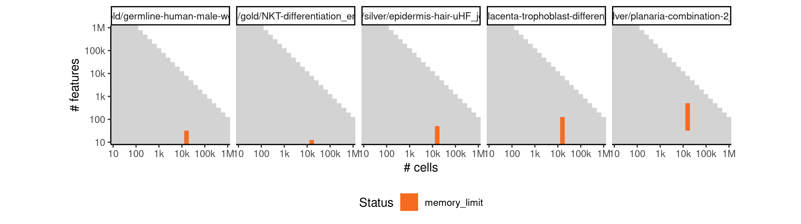

# celltree_gibbs


## ERROR STATUS METHOD_ERROR

### ERROR CLUSTER METHOD_ERROR -- 1


 * Number of instances: 20
 * Dataset ids: scaling_0002, scaling_0012, scaling_0016, scaling_0025, scaling_0047, scaling_0082, scaling_0088, scaling_0188, scaling_0195, scaling_0476, scaling_0002, scaling_0012, scaling_0016, scaling_0025, scaling_0047, scaling_0082, scaling_0088, scaling_0188, scaling_0195, scaling_0476

Last 10 lines of scaling_0002:
```
Using root vertex: 7
Adding branch #1:
[1]  4  3  9  8  6  5 10  1
Using branch width: 1.2 (width.scale.factor: 1.5)
Outliers: 0
Total number of branches: 1 (forks: 0)
Error in apply(dists[backbone, -backbone], 2, which.min) : 
  dim(X) must have a positive length
Calls: <Anonymous> -> apply
Execution halted
```

### ERROR CLUSTER METHOD_ERROR -- 2


 * Number of instances: 70
 * Dataset ids: scaling_0105, scaling_0140, scaling_0180, scaling_0215, scaling_0225, scaling_0254, scaling_0255, scaling_0329, scaling_0330, scaling_0389, scaling_0390, scaling_0453, scaling_0454, scaling_0455, scaling_0504, scaling_0505, scaling_0525, scaling_0555, scaling_0599, scaling_0600, scaling_0678, scaling_0679, scaling_0680, scaling_0763, scaling_0764, scaling_0765, scaling_0853, scaling_0854, scaling_0855, scaling_0909, scaling_0910, scaling_0950, scaling_0980, scaling_1049, scaling_1050, scaling_0105, scaling_0140, scaling_0180, scaling_0215, scaling_0225, scaling_0254, scaling_0255, scaling_0329, scaling_0330, scaling_0389, scaling_0390, scaling_0453, scaling_0454, scaling_0455, scaling_0504, scaling_0505, scaling_0525, scaling_0555, scaling_0599, scaling_0600, scaling_0678, scaling_0679, scaling_0680, scaling_0763, scaling_0764, scaling_0765, scaling_0853, scaling_0854, scaling_0855, scaling_0909, scaling_0910, scaling_0950, scaling_0980, scaling_1049, scaling_1050

Last 10 lines of scaling_0105:
```
Iteration 200 ...
Iteration 210 ...
Iteration 220 ...
Iteration 230 ...
Gibbs sampling completed!
Model fit for k = 4 topics
Error in options(expressions = length(cell.names) * 5) : 
  'expressions' parameter invalid, allowed 25...500000
Calls: <Anonymous> -> options
Execution halted
```

## ERROR STATUS TIME_LIMIT

### ERROR CLUSTER TIME_LIMIT -- 1


 * Number of instances: 154
 * Dataset ids: scaling_0714, scaling_0783, scaling_0784, scaling_0785, scaling_0798, scaling_0799, scaling_0800, scaling_0801, scaling_0819, scaling_0837, scaling_0865, scaling_0866, scaling_0867, scaling_0868, scaling_0869, scaling_0870, scaling_0871, scaling_0872, scaling_0873, scaling_0874, scaling_0875, scaling_0876, scaling_0877, scaling_0887, scaling_0888, scaling_0899, scaling_0918, scaling_0919, scaling_0920, scaling_0921, scaling_0922, scaling_0923, scaling_0924, scaling_0925, scaling_0926, scaling_0934, scaling_0942, scaling_0951, scaling_0956, scaling_0957, scaling_0958, scaling_0959, scaling_0960, scaling_0961, scaling_0962, scaling_0963, scaling_0968, scaling_0969, scaling_0974, scaling_0975, scaling_0981, scaling_0982, scaling_0992, scaling_0993, scaling_0994, scaling_0995, scaling_0996, scaling_0997, scaling_0998, scaling_0999, scaling_1000, scaling_1001, scaling_1002, scaling_1003, scaling_1004, scaling_1005, scaling_1006, scaling_1007, scaling_1008, scaling_1009, scaling_1010, scaling_1020, scaling_1021, scaling_1022, scaling_1023, scaling_1035, scaling_1036, scaling_0714, scaling_0783, scaling_0784, scaling_0785, scaling_0798, scaling_0799, scaling_0800, scaling_0801, scaling_0819, scaling_0837, scaling_0865, scaling_0866, scaling_0867, scaling_0868, scaling_0869, scaling_0870, scaling_0871, scaling_0872, scaling_0873, scaling_0874, scaling_0875, scaling_0876, scaling_0877, scaling_0887, scaling_0888, scaling_0899, scaling_0918, scaling_0919, scaling_0920, scaling_0921, scaling_0922, scaling_0923, scaling_0924, scaling_0925, scaling_0926, scaling_0934, scaling_0942, scaling_0951, scaling_0956, scaling_0957, scaling_0958, scaling_0959, scaling_0960, scaling_0961, scaling_0962, scaling_0963, scaling_0968, scaling_0969, scaling_0974, scaling_0975, scaling_0981, scaling_0982, scaling_0992, scaling_0993, scaling_0994, scaling_0995, scaling_0996, scaling_0997, scaling_0998, scaling_0999, scaling_1000, scaling_1001, scaling_1002, scaling_1003, scaling_1004, scaling_1005, scaling_1006, scaling_1007, scaling_1008, scaling_1009, scaling_1010, scaling_1020, scaling_1021, scaling_1022, scaling_1023, scaling_1035, scaling_1036

Last 10 lines of scaling_0714:
```
File: /home/rcannood/Workspace/dynverse/dynbenchmark//derived/05-scaling/suite/celltree_gibbs/10/r2gridengine/20180924_185107_celltree_gibbs_10_QKvJYlya7o/log/log.714.e.txt
```

## ERROR STATUS MEMORY_LIMIT

### ERROR CLUSTER MEMORY_LIMIT -- 1


 * Number of instances: 18
 * Dataset ids: scaling_0697, scaling_0731, scaling_0748, scaling_0782, scaling_0818, scaling_0836, scaling_0898, scaling_1034, scaling_1048, scaling_0697, scaling_0731, scaling_0748, scaling_0782, scaling_0818, scaling_0836, scaling_0898, scaling_1034, scaling_1048

Last 10 lines of scaling_0697:
```
Iteration 210 ...
Iteration 220 ...
Iteration 230 ...
Gibbs sampling completed!
Model fit for k = 4 topics
Using rooting method: longest.path
Error in graph.adjacency.dense(adjmatrix, mode = mode, weighted = weighted,  : 
  At vector.pmt:442 : cannot reserve space for vector, Out of memory
Calls: <Anonymous> -> graph.adjacency -> graph.adjacency.dense
Execution halted
```


