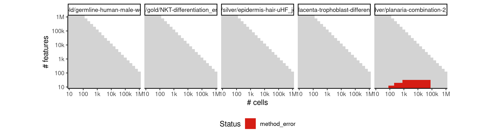
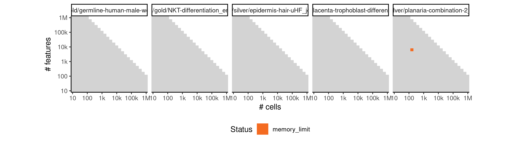

# celltree_gibbs


## ERROR STATUS METHOD_ERROR

### ERROR CLUSTER METHOD_ERROR -- 1


 * Number of instances: 7
 * Dataset ids: scaling_0001, scaling_0002, scaling_0016, scaling_0082, scaling_0188, scaling_0238, scaling_0287

Last 10 lines of scaling_0001:
```
Using root vertex: 5
Adding branch #1:
[1]  8  9  7  6  4  3 10  1
Using branch width: 0.82 (width.scale.factor: 1.5)
Outliers: 0
Total number of branches: 1 (forks: 0)
Error in apply(dists[backbone, -backbone], 2, which.min) : 
  dim(X) must have a positive length
Calls: <Anonymous> -> apply
Execution halted
```

### ERROR CLUSTER METHOD_ERROR -- 2


 * Number of instances: 38
 * Dataset ids: scaling_0105, scaling_0140, scaling_0180, scaling_0215, scaling_0225, scaling_0254, scaling_0255, scaling_0329, scaling_0330, scaling_0389, scaling_0390, scaling_0453, scaling_0454, scaling_0455, scaling_0504, scaling_0505, scaling_0525, scaling_0555, scaling_0599, scaling_0600, scaling_0678, scaling_0679, scaling_0680, scaling_0763, scaling_0764, scaling_0765, scaling_0853, scaling_0854, scaling_0855, scaling_0909, scaling_0910, scaling_0950, scaling_0980, scaling_1049, scaling_1050, scaling_1144, scaling_1155, scaling_1265

Last 10 lines of scaling_0105:
```
Iteration 200 ...
Iteration 210 ...
Iteration 220 ...
Iteration 230 ...
Gibbs sampling completed!
Model fit for k = 4 topics
Error in options(expressions = length(cell.names) * 5) : 
  'expressions' parameter invalid, allowed 25...500000
Calls: <Anonymous> -> options
Execution halted
```

## ERROR STATUS TIME_LIMIT

### ERROR CLUSTER TIME_LIMIT -- 1


 * Number of instances: 540
 * Dataset ids: scaling_0783, scaling_0800, scaling_0801, scaling_0819, scaling_0837, scaling_0866, scaling_0867, scaling_0868, scaling_0869, scaling_0870, scaling_0871, scaling_0872, scaling_0873, scaling_0874, scaling_0875, scaling_0876, scaling_0877, scaling_0888, scaling_0899, scaling_0918, scaling_0919, scaling_0920, scaling_0921, scaling_0922, scaling_0923, scaling_0924, scaling_0925, scaling_0926, scaling_0934, scaling_0942, scaling_0951, scaling_0956, scaling_0957, scaling_0958, scaling_0959, scaling_0960, scaling_0961, scaling_0962, scaling_0963, scaling_0968, scaling_0974, scaling_0981, scaling_0992, scaling_0993, scaling_0994, scaling_0995, scaling_0996, scaling_0997, scaling_0998, scaling_0999, scaling_1000, scaling_1001, scaling_1002, scaling_1003, scaling_1004, scaling_1005, scaling_1006, scaling_1007, scaling_1008, scaling_1009, scaling_1021, scaling_1022, scaling_1023, scaling_1035, scaling_1036, scaling_1051, scaling_1052, scaling_1053, scaling_1054, scaling_1055, scaling_1056, scaling_1057, scaling_1058, scaling_1066, scaling_1067, scaling_1068, scaling_1069, scaling_1070, scaling_1071, scaling_1072, scaling_1073, scaling_1074, scaling_1075, scaling_1076, scaling_1077, scaling_1078, scaling_1079, scaling_1080, scaling_1081, scaling_1082, scaling_1083, scaling_1084, scaling_1085, scaling_1086, scaling_1087, scaling_1088, scaling_1089, scaling_1090, scaling_1091, scaling_1092, scaling_1093, scaling_1094, scaling_1095, scaling_1096, scaling_1104, scaling_1105, scaling_1106, scaling_1107, scaling_1108, scaling_1109, scaling_1110, scaling_1124, scaling_1125, scaling_1126, scaling_1128, scaling_1129, scaling_1143, scaling_1145, scaling_1146, scaling_1147, scaling_1148, scaling_1149, scaling_1150, scaling_1151, scaling_1152, scaling_1153, scaling_1154, scaling_1156, scaling_1157, scaling_1158, scaling_1159, scaling_1160, scaling_1161, scaling_1162, scaling_1163, scaling_1164, scaling_1165, scaling_1166, scaling_1167, scaling_1168, scaling_1169, scaling_1170, scaling_1171, scaling_1172, scaling_1173, scaling_1174, scaling_1175, scaling_1176, scaling_1177, scaling_1178, scaling_1179, scaling_1180, scaling_1181, scaling_1182, scaling_1183, scaling_1184, scaling_1185, scaling_1186, scaling_1187, scaling_1188, scaling_1189, scaling_1190, scaling_1191, scaling_1192, scaling_1193, scaling_1194, scaling_1195, scaling_1196, scaling_1197, scaling_1198, scaling_1199, scaling_1200, scaling_1201, scaling_1202, scaling_1203, scaling_1204, scaling_1205, scaling_1206, scaling_1207, scaling_1208, scaling_1209, scaling_1210, scaling_1211, scaling_1212, scaling_1213, scaling_1214, scaling_1215, scaling_1216, scaling_1217, scaling_1218, scaling_1219, scaling_1227, scaling_1228, scaling_1229, scaling_1231, scaling_1232, scaling_1233, scaling_1234, scaling_1235, scaling_1243, scaling_1244, scaling_1245, scaling_1246, scaling_1247, scaling_1248, scaling_1249, scaling_1250, scaling_1251, scaling_1252, scaling_1253, scaling_1254, scaling_1255, scaling_1256, scaling_1257, scaling_1258, scaling_1259, scaling_1261, scaling_1262, scaling_1263, scaling_1266, scaling_1267, scaling_1268, scaling_1269, scaling_1270, scaling_1271, scaling_1272, scaling_1273, scaling_1274, scaling_1275, scaling_1276, scaling_1277, scaling_1278, scaling_1279, scaling_1280, scaling_1281, scaling_1282, scaling_1283, scaling_1284, scaling_1285, scaling_1286, scaling_1287, scaling_1288, scaling_1289, scaling_1290, scaling_1291, scaling_1292, scaling_1293, scaling_1294, scaling_1295, scaling_1296, scaling_1298, scaling_1299, scaling_1300, scaling_1301, scaling_1302, scaling_1303, scaling_1304, scaling_1305, scaling_1306, scaling_1307, scaling_1308, scaling_1309, scaling_1310, scaling_1311, scaling_1312, scaling_1313, scaling_1314, scaling_1315, scaling_1316, scaling_1317, scaling_1318, scaling_1319, scaling_1320, scaling_1321, scaling_1322, scaling_1323, scaling_1324, scaling_1325, scaling_1326, scaling_1327, scaling_1328, scaling_1329, scaling_1330, scaling_1331, scaling_1332, scaling_1333, scaling_1334, scaling_1335, scaling_1336, scaling_1337, scaling_1338, scaling_1339, scaling_1340, scaling_1341, scaling_1342, scaling_1343, scaling_1344, scaling_1345, scaling_1346, scaling_1347, scaling_1348, scaling_1354, scaling_1355, scaling_1356, scaling_1357, scaling_1358, scaling_1359, scaling_1361, scaling_1362, scaling_1363, scaling_1364, scaling_1365, scaling_1366, scaling_1367, scaling_1376, scaling_1377, scaling_1378, scaling_1379, scaling_1380, scaling_1381, scaling_1382, scaling_1383, scaling_1384, scaling_1385, scaling_1386, scaling_1387, scaling_1388, scaling_1389, scaling_1390, scaling_1391, scaling_1392, scaling_1405, scaling_1406, scaling_1407, scaling_1408, scaling_1409, scaling_1410, scaling_1411, scaling_1412, scaling_1413, scaling_1414, scaling_1415, scaling_1416, scaling_1417, scaling_1418, scaling_1419, scaling_1420, scaling_1421, scaling_1422, scaling_1423, scaling_1424, scaling_1425, scaling_1426, scaling_1427, scaling_1428, scaling_1429, scaling_1430, scaling_1431, scaling_1432, scaling_1433, scaling_1438, scaling_1439, scaling_1440, scaling_1441, scaling_1442, scaling_1443, scaling_1444, scaling_1445, scaling_1446, scaling_1447, scaling_1448, scaling_1449, scaling_1450, scaling_1451, scaling_1452, scaling_1465, scaling_1466, scaling_1467, scaling_1468, scaling_1469, scaling_1470, scaling_1471, scaling_1472, scaling_1473, scaling_1474, scaling_1475, scaling_1476, scaling_1477, scaling_1478, scaling_1479, scaling_1480, scaling_1481, scaling_1482, scaling_1483, scaling_1484, scaling_1485, scaling_1486, scaling_1487, scaling_1488, scaling_1490, scaling_1491, scaling_1492, scaling_1493, scaling_1497, scaling_1498, scaling_1499, scaling_1500, scaling_1501, scaling_1502, scaling_1503, scaling_1504, scaling_1505, scaling_1506, scaling_1513, scaling_1514, scaling_1515, scaling_1516, scaling_1517, scaling_1518, scaling_1519, scaling_1520, scaling_1521, scaling_1522, scaling_1523, scaling_1524, scaling_1525, scaling_1526, scaling_1527, scaling_1529, scaling_1530, scaling_1533, scaling_1534, scaling_1535, scaling_1536, scaling_1537, scaling_1538, scaling_1539, scaling_1540, scaling_1541, scaling_1542, scaling_1543, scaling_1544, scaling_1545, scaling_1546, scaling_1547, scaling_1548, scaling_1571, scaling_1572, scaling_1573, scaling_1574, scaling_1575, scaling_1576, scaling_1577, scaling_1578, scaling_1579, scaling_1580, scaling_1581, scaling_1582, scaling_1583, scaling_1584, scaling_1585, scaling_1586, scaling_1590, scaling_1591, scaling_1592, scaling_1593, scaling_1594, scaling_1595, scaling_1596, scaling_1597, scaling_1598, scaling_1599, scaling_1600, scaling_1601, scaling_1602, scaling_1603, scaling_1604, scaling_1605, scaling_1609, scaling_1610, scaling_1611, scaling_1612, scaling_1613, scaling_1620, scaling_1621, scaling_1622, scaling_1623, scaling_1624, scaling_1625, scaling_1634, scaling_1635, scaling_1636, scaling_1637, scaling_1638, scaling_1639, scaling_1640, scaling_1641, scaling_1642, scaling_1643, scaling_1644, scaling_1678, scaling_1679, scaling_1680, scaling_1681, scaling_1682, scaling_1683, scaling_1684, scaling_1685, scaling_1686, scaling_1687, scaling_1688, scaling_1697, scaling_1698, scaling_1699, scaling_1700, scaling_1701, scaling_1702, scaling_1703, scaling_1704, scaling_1705, scaling_1706, scaling_1707, scaling_1708, scaling_1709, scaling_1710, scaling_1711, scaling_1712, scaling_1717, scaling_1718, scaling_1719, scaling_1720, scaling_1721, scaling_1722, scaling_1728, scaling_1729, scaling_1730, scaling_1731, scaling_1732, scaling_1733, scaling_1734

Last 10 lines of scaling_0783:
```
File: /home/rcannood/Workspace/dynverse/dynbenchmark//derived/05-scaling/suite/celltree_gibbs/Cat2/r2gridengine/20181008_215100_celltree_gibbs_Cat2_oNOUqM1YbO/log/log.103.e.txt
```

## ERROR STATUS MEMORY_LIMIT

### ERROR CLUSTER MEMORY_LIMIT -- 1


 * Number of instances: 20
 * Dataset ids: scaling_0697, scaling_0714, scaling_0731, scaling_0748, scaling_0782, scaling_0818, scaling_0836, scaling_0865, scaling_0887, scaling_0898, scaling_1020, scaling_1034, scaling_1048, scaling_1123, scaling_1142, scaling_1226, scaling_1242, scaling_1375, scaling_1496, scaling_1619

Last 10 lines of scaling_0697:
```
Iteration 210 ...
Iteration 220 ...
Iteration 230 ...
Gibbs sampling completed!
Model fit for k = 4 topics
Using rooting method: longest.path
Error in minimum.spanning.tree(g) : 
  At heap.c:565 : d_indheap reserve failed, Out of memory
Calls: <Anonymous> -> minimum.spanning.tree
Execution halted
```

### ERROR CLUSTER MEMORY_LIMIT -- 2


 * Number of instances: 1
 * Dataset ids: scaling_1132

Last 10 lines of scaling_1132:
```
 [1] 148 142  22 117  68 108  76  19  62  63   4 116  83  96  54  21 125  53  99
[20] 111 102 114  12  37  16  13 109 110 139 137  34  26  39 140  40  23
Using branch width: 0.469 (width.scale.factor: 1.5)
Outliers: 4
Total number of branches: 1 (forks: 0)
Backbone fork merge (width: 0.469): 37 ->  37 
Ranking all cells...
Error in saveRDS(x, con) : error writing to connection
Calls: write_rds -> saveRDS
Execution halted
```

### ERROR CLUSTER MEMORY_LIMIT -- 3


 * Number of instances: 113
 * Dataset ids: scaling_1297, scaling_1393, scaling_1394, scaling_1395, scaling_1396, scaling_1397, scaling_1398, scaling_1399, scaling_1400, scaling_1401, scaling_1402, scaling_1403, scaling_1404, scaling_1453, scaling_1454, scaling_1455, scaling_1456, scaling_1457, scaling_1458, scaling_1459, scaling_1460, scaling_1461, scaling_1462, scaling_1463, scaling_1464, scaling_1507, scaling_1508, scaling_1509, scaling_1510, scaling_1511, scaling_1512, scaling_1531, scaling_1532, scaling_1549, scaling_1550, scaling_1551, scaling_1552, scaling_1553, scaling_1554, scaling_1555, scaling_1556, scaling_1557, scaling_1558, scaling_1559, scaling_1560, scaling_1561, scaling_1562, scaling_1563, scaling_1564, scaling_1565, scaling_1566, scaling_1567, scaling_1568, scaling_1569, scaling_1570, scaling_1587, scaling_1588, scaling_1589, scaling_1606, scaling_1608, scaling_1626, scaling_1627, scaling_1628, scaling_1629, scaling_1630, scaling_1631, scaling_1632, scaling_1633, scaling_1645, scaling_1646, scaling_1647, scaling_1648, scaling_1649, scaling_1650, scaling_1651, scaling_1652, scaling_1653, scaling_1654, scaling_1655, scaling_1656, scaling_1657, scaling_1658, scaling_1659, scaling_1660, scaling_1661, scaling_1662, scaling_1663, scaling_1664, scaling_1665, scaling_1666, scaling_1667, scaling_1668, scaling_1669, scaling_1670, scaling_1671, scaling_1672, scaling_1673, scaling_1674, scaling_1675, scaling_1676, scaling_1677, scaling_1689, scaling_1690, scaling_1691, scaling_1692, scaling_1693, scaling_1694, scaling_1695, scaling_1696, scaling_1713, scaling_1715, scaling_1716, scaling_1735

Last 10 lines of scaling_1297:
```
Attaching package: ‘purrr’
The following object is masked from ‘package:jsonlite’:
    flatten
Loading required namespace: cellTree
Computing LDA model using: Gibbs
Filtering out rows with standard deviation < 0.5 (251189 -> 251188)...
Loading required namespace: topicmodels
K = 4; V = 251188; M = 10
terminate called after throwing an instance of 'std::bad_alloc'
  what():  std::bad_alloc
```


