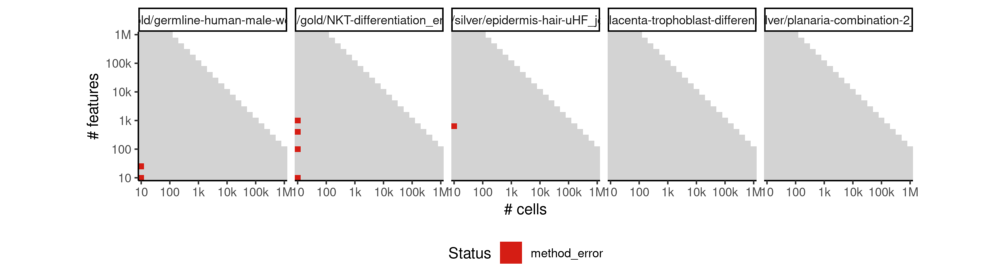
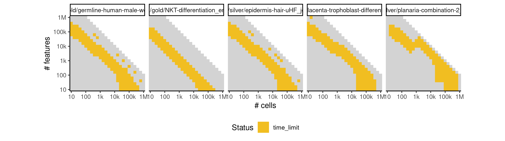

# celltree_gibbs


## ERROR STATUS METHOD_ERROR

### ERROR CLUSTER METHOD_ERROR -- 1


 * Number of instances: 12
 * Dataset ids: scaling_0016, scaling_0019, scaling_0037, scaling_0043, scaling_0061, scaling_0120, scaling_0169, scaling_0391, scaling_0617, scaling_0649, scaling_0732, scaling_0766

Last 10 lines of scaling_0016:
```
Using root vertex: 4
Adding branch #1:
[1]  5  9  2  3  6  8 10  1
Using branch width: 0.879 (width.scale.factor: 1.5)
Outliers: 0
Total number of branches: 1 (forks: 0)
Error in apply(dists[backbone, -backbone], 2, which.min) : 
  dim(X) must have a positive length
Calls: <Anonymous> -> apply
Execution halted
```

### ERROR CLUSTER METHOD_ERROR -- 2


 * Number of instances: 50
 * Dataset ids: scaling_0093, scaling_0105, scaling_0126, scaling_0140, scaling_0168, scaling_0180, scaling_0201, scaling_0215, scaling_0225, scaling_0243, scaling_0254, scaling_0255, scaling_0308, scaling_0329, scaling_0330, scaling_0370, scaling_0389, scaling_0390, scaling_0429, scaling_0453, scaling_0454, scaling_0455, scaling_0485, scaling_0504, scaling_0505, scaling_0525, scaling_0555, scaling_0582, scaling_0599, scaling_0600, scaling_0648, scaling_0678, scaling_0679, scaling_0680, scaling_0731, scaling_0763, scaling_0764, scaling_0765, scaling_0819, scaling_0853, scaling_0854, scaling_0855, scaling_0888, scaling_0909, scaling_0910, scaling_0950, scaling_0980, scaling_1022, scaling_1049, scaling_1050

Last 10 lines of scaling_0093:
```
Iteration 200 ...
Iteration 210 ...
Iteration 220 ...
Iteration 230 ...
Gibbs sampling completed!
Model fit for k = 4 topics
Error in options(expressions = length(cell.names) * 5) : 
  'expressions' parameter invalid, allowed 25...500000
Calls: <Anonymous> -> options
Execution halted
```

## ERROR STATUS TIME_LIMIT

### ERROR CLUSTER TIME_LIMIT -- 1


 * Number of instances: 89
 * Dataset ids: scaling_0748, scaling_0783, scaling_0800, scaling_0801, scaling_0835, scaling_0836, scaling_0837, scaling_0865, scaling_0866, scaling_0867, scaling_0868, scaling_0869, scaling_0876, scaling_0877, scaling_0889, scaling_0890, scaling_0891, scaling_0892, scaling_0893, scaling_0894, scaling_0895, scaling_0896, scaling_0897, scaling_0898, scaling_0899, scaling_0918, scaling_0919, scaling_0926, scaling_0934, scaling_0935, scaling_0936, scaling_0937, scaling_0938, scaling_0939, scaling_0940, scaling_0941, scaling_0942, scaling_0951, scaling_0956, scaling_0957, scaling_0958, scaling_0959, scaling_0960, scaling_0961, scaling_0962, scaling_0963, scaling_0968, scaling_0969, scaling_0970, scaling_0971, scaling_0972, scaling_0973, scaling_0974, scaling_0975, scaling_0981, scaling_0982, scaling_0992, scaling_0993, scaling_0994, scaling_0995, scaling_0996, scaling_0997, scaling_0998, scaling_0999, scaling_1000, scaling_1001, scaling_1002, scaling_1003, scaling_1004, scaling_1005, scaling_1006, scaling_1007, scaling_1008, scaling_1009, scaling_1021, scaling_1023, scaling_1024, scaling_1025, scaling_1026, scaling_1027, scaling_1028, scaling_1029, scaling_1030, scaling_1031, scaling_1032, scaling_1033, scaling_1034, scaling_1035, scaling_1036

Last 10 lines of scaling_0748:
```
File: /home/rcannood/Workspace/dynverse/dynbenchmark//derived/05-scaling/suite/celltree_gibbs/10/r2gridengine/20180825_051137_celltree_gibbs_10_gliwU3k92n/log/log.748.e.txt
```

## ERROR STATUS MEMORY_LIMIT

### ERROR CLUSTER MEMORY_LIMIT -- 1


 * Number of instances: 10
 * Dataset ids: scaling_0616, scaling_0632, scaling_0696, scaling_0730, scaling_0781, scaling_0817, scaling_0886, scaling_0908, scaling_0967, scaling_0979

Last 10 lines of scaling_0616:
```
Iteration 210 ...
Iteration 220 ...
Iteration 230 ...
Gibbs sampling completed!
Model fit for k = 4 topics
Using rooting method: longest.path
Error in minimum.spanning.tree(g) : 
  At heap.c:560 : d_indheap reserve failed, Out of memory
Calls: <Anonymous> -> minimum.spanning.tree
Execution halted
```

### ERROR CLUSTER MEMORY_LIMIT -- 2


 * Number of instances: 7
 * Dataset ids: scaling_0664, scaling_0713, scaling_0747, scaling_0799, scaling_0864, scaling_0875, scaling_0955

Last 10 lines of scaling_0664:
```
Iteration 210 ...
Iteration 220 ...
Iteration 230 ...
Gibbs sampling completed!
Model fit for k = 4 topics
Using rooting method: longest.path
Error in graph.adjacency.dense(adjmatrix, mode = mode, weighted = weighted,  : 
  At type_indexededgelist.c:309 : cannot add edges, Out of memory
Calls: <Anonymous> -> graph.adjacency -> graph.adjacency.dense
Execution halted
```

### ERROR CLUSTER MEMORY_LIMIT -- 3


 * Number of instances: 6
 * Dataset ids: scaling_0697, scaling_0714, scaling_0818, scaling_0887, scaling_1020, scaling_1048

Last 10 lines of scaling_0697:
```
Iteration 210 ...
Iteration 220 ...
Iteration 230 ...
Gibbs sampling completed!
Model fit for k = 4 topics
Using rooting method: longest.path
Error in graph.adjacency.dense(adjmatrix, mode = mode, weighted = weighted,  : 
  At vector.pmt:442 : cannot reserve space for vector, Out of memory
Calls: <Anonymous> -> graph.adjacency -> graph.adjacency.dense
Execution halted
```

### ERROR CLUSTER MEMORY_LIMIT -- 4


 * Number of instances: 1
 * Dataset ids: scaling_0782

Last 10 lines of scaling_0782:
```
Iteration 190 ...
Iteration 200 ...
Iteration 210 ...
Iteration 220 ...
Iteration 230 ...
Gibbs sampling completed!
Model fit for k = 4 topics
Using rooting method: longest.path
Error: cannot allocate vector of size 1.9 Gb
Execution halted
```


