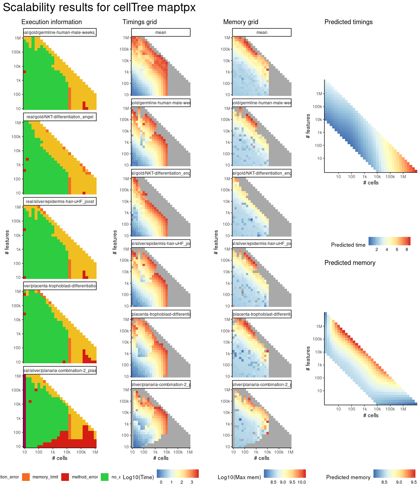
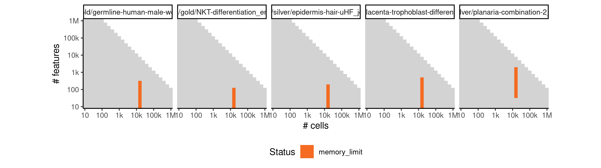
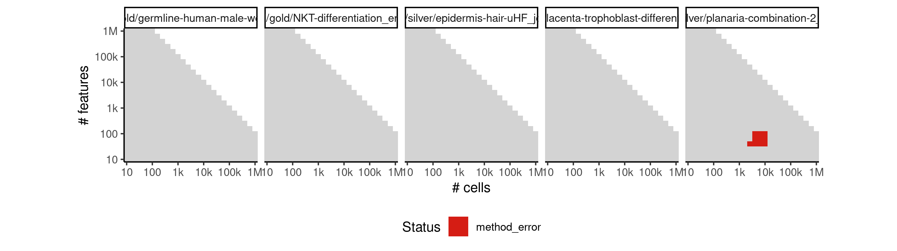

# celltree_maptpx


## ERROR STATUS MEMORY_LIMIT

### ERROR CLUSTER MEMORY_LIMIT -- 1


 * Number of instances: 22
 * Dataset ids: scaling_0697, scaling_0714, scaling_0731, scaling_0748, scaling_0782, scaling_0800, scaling_0818, scaling_0836, scaling_0865, scaling_0876, scaling_0887, scaling_0898, scaling_0992, scaling_1006, scaling_1020, scaling_1034, scaling_1048, scaling_1066, scaling_1085, scaling_1104, scaling_1123, scaling_1142

Last 10 lines of scaling_0697:
```
log posterior increase: 1193.45, 20.41, 10.77, done.
log BF( 14 ) = 706523.78
log posterior increase: 1108.02, 17.63, 8.51, done.
log BF( 15 ) = 370064.33
Selected k = 14 topics
Using rooting method: longest.path
Error in graph.adjacency.dense(adjmatrix, mode = mode, weighted = weighted,  : 
  At type_indexededgelist.c:309 : cannot add edges, Out of memory
Calls: <Anonymous> -> graph.adjacency -> graph.adjacency.dense
Execution halted
```

## ERROR STATUS METHOD_ERROR

### ERROR CLUSTER METHOD_ERROR -- 1


 * Number of instances: 7
 * Dataset ids: scaling_0003, scaling_0188, scaling_0456, scaling_0510, scaling_0802, scaling_0820, scaling_0901

Last 10 lines of scaling_0003:
```
Using root vertex: 1
Adding branch #1:
[1] 10  2  4  6  9  7  8  5
Using branch width: 0.666 (width.scale.factor: 1.5)
Outliers: 0
Total number of branches: 1 (forks: 0)
Error in apply(dists[backbone, -backbone], 2, which.min) : 
  dim(X) must have a positive length
Calls: <Anonymous> -> apply
Execution halted
```

### ERROR CLUSTER METHOD_ERROR -- 2


 * Number of instances: 37
 * Dataset ids: scaling_0105, scaling_0140, scaling_0180, scaling_0215, scaling_0225, scaling_0254, scaling_0255, scaling_0329, scaling_0330, scaling_0389, scaling_0390, scaling_0453, scaling_0454, scaling_0455, scaling_0504, scaling_0505, scaling_0525, scaling_0555, scaling_0599, scaling_0600, scaling_0678, scaling_0679, scaling_0680, scaling_0763, scaling_0764, scaling_0765, scaling_0853, scaling_0854, scaling_0855, scaling_0909, scaling_0910, scaling_0950, scaling_0980, scaling_1049, scaling_1050, scaling_1144, scaling_1145

Last 10 lines of scaling_0105:
```
log BF( 13 ) = 4454.16
log posterior increase: 0.02, done.
log BF( 14 ) = 4857.87
log posterior increase: 0.02, done.
log BF( 15 ) = 5265.25
Selected k = 15 topics
Error in options(expressions = length(cell.names) * 5) : 
  'expressions' parameter invalid, allowed 25...500000
Calls: <Anonymous> -> options
Execution halted
```

### ERROR CLUSTER METHOD_ERROR -- 3


 * Number of instances: 1
 * Dataset ids: scaling_0591

Last 10 lines of scaling_0591:
```
[1261] 6258 2459 2852 4770 3964  219 5630 6075 4329 3294 5903 1490 4246 6006
[1275]  599  411 6081 3652 5527 2361 4581 3128 1903 2624 6257 2427 6270 1358
[1289]    7 1151 4153 3609 5180  769  426  814  341  402 1107  348 2538 3744
[1303] 1691  139 4528 5539 3622 5456 1057 2379 4109 1488 4192 1480 1633 4042
[1317] 5792 6233 4598 2383 2790 5946 1186 1956 3145 3182 1844 5383 2793   18
[1331]  478 5925  505 6188 2634 1177 5125 3832 2222 2747 3602 5634 2480
Outliers: 254
Total number of branches: 4 (forks: 3)
Backbone fork merge (width: 0.132): 4870Error: node stack overflow
Execution halted
```

### ERROR CLUSTER METHOD_ERROR -- 4


 * Number of instances: 10
 * Dataset ids: scaling_0677, scaling_0762, scaling_0851, scaling_0852, scaling_0907, scaling_0908, scaling_0949, scaling_0979, scaling_1047, scaling_1141

Last 10 lines of scaling_0677:
```
[2479] 1333 2027  576 1935   18  678 2299 1476  704 1303  206   73 1261 1878
[2493]  742 1625  391 2432  637 2499 1689 1021 2187 1490 1948 2221 1238 1203
[2507] 1821  202 2096  512  533
Using branch width: 0.346 (width.scale.factor: 1.5)
Outliers: 0
Total number of branches: 1 (forks: 0)
Backbone fork merge (width: 0.346): 2512Error in doTryCatch(return(expr), name, parentenv, handler) : 
  node stack overflow
Calls: <Anonymous> ... tryCatch -> tryCatchList -> tryCatchOne -> doTryCatch
Execution halted
```

## ERROR STATUS TIME_LIMIT

### ERROR CLUSTER TIME_LIMIT -- 1


 * Number of instances: 37
 * Dataset ids: scaling_0783, scaling_0801, scaling_0819, scaling_0837, scaling_0866, scaling_0877, scaling_0888, scaling_0899, scaling_0918, scaling_0926, scaling_0934, scaling_0942, scaling_0956, scaling_0962, scaling_0968, scaling_0974, scaling_0993, scaling_0994, scaling_1007, scaling_1008, scaling_1021, scaling_1022, scaling_1035, scaling_1036, scaling_1067, scaling_1068, scaling_1069, scaling_1086, scaling_1087, scaling_1088, scaling_1105, scaling_1106, scaling_1107, scaling_1124, scaling_1125, scaling_1126, scaling_1143

Last 10 lines of scaling_0783:
```
File: /home/rcannood/Workspace/dynverse/dynbenchmark//derived/05-scaling/suite/celltree_maptpx/Cat2/r2gridengine/20181008_215051_celltree_maptpx_Cat2_krI8brZvzw/log/log.103.e.txt
```


