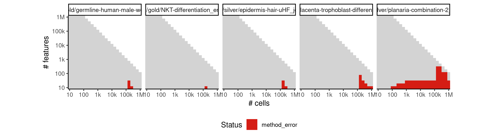

# celltree_maptpx


## ERROR STATUS METHOD_ERROR

### ERROR CLUSTER METHOD_ERROR -- 1


 * Number of instances: 9
 * Dataset ids: scaling_0003, scaling_0188, scaling_0456, scaling_0510, scaling_0802, scaling_0820, scaling_0901, scaling_1525, scaling_1588

Last 10 lines of scaling_0003:
```
Using root vertex: 1
Adding branch #1:
[1] 10  2  4  6  9  7  8  5
Using branch width: 0.666 (width.scale.factor: 1.5)
Outliers: 0
Total number of branches: 1 (forks: 0)
Error in apply(dists[backbone, -backbone], 2, which.min) : 
  dim(X) must have a positive length
Calls: <Anonymous> -> apply
Execution halted
```

### ERROR CLUSTER METHOD_ERROR -- 2


 * Number of instances: 93
 * Dataset ids: scaling_0105, scaling_0140, scaling_0180, scaling_0215, scaling_0225, scaling_0254, scaling_0255, scaling_0329, scaling_0330, scaling_0389, scaling_0390, scaling_0453, scaling_0454, scaling_0455, scaling_0504, scaling_0505, scaling_0525, scaling_0555, scaling_0599, scaling_0600, scaling_0678, scaling_0679, scaling_0680, scaling_0763, scaling_0764, scaling_0765, scaling_0853, scaling_0854, scaling_0855, scaling_0909, scaling_0910, scaling_0950, scaling_0980, scaling_1049, scaling_1050, scaling_1144, scaling_1145, scaling_1155, scaling_1181, scaling_1197, scaling_1213, scaling_1229, scaling_1244, scaling_1245, scaling_1265, scaling_1295, scaling_1296, scaling_1337, scaling_1338, scaling_1358, scaling_1359, scaling_1378, scaling_1379, scaling_1380, scaling_1392, scaling_1416, scaling_1428, scaling_1440, scaling_1487, scaling_1488, scaling_1499, scaling_1500, scaling_1603, scaling_1604, scaling_1605, scaling_1606, scaling_1622, scaling_1623, scaling_1624, scaling_1625, scaling_1710, scaling_1713, scaling_1732, scaling_1733, scaling_1734, scaling_1735, scaling_1755, scaling_1838, scaling_1839, scaling_1840, scaling_1879, scaling_1880, scaling_1996, scaling_1997, scaling_1998, scaling_1999, scaling_2000, scaling_2112, scaling_2113, scaling_2114, scaling_2115, scaling_2223, scaling_2225

Last 10 lines of scaling_0105:
```
log BF( 13 ) = 4454.16
log posterior increase: 0.02, done.
log BF( 14 ) = 4857.87
log posterior increase: 0.02, done.
log BF( 15 ) = 5265.25
Selected k = 15 topics
Error in options(expressions = length(cell.names) * 5) : 
  'expressions' parameter invalid, allowed 25...500000
Calls: <Anonymous> -> options
Execution halted
```

### ERROR CLUSTER METHOD_ERROR -- 3


 * Number of instances: 1
 * Dataset ids: scaling_0591

Last 10 lines of scaling_0591:
```
[1261] 6258 2459 2852 4770 3964  219 5630 6075 4329 3294 5903 1490 4246 6006
[1275]  599  411 6081 3652 5527 2361 4581 3128 1903 2624 6257 2427 6270 1358
[1289]    7 1151 4153 3609 5180  769  426  814  341  402 1107  348 2538 3744
[1303] 1691  139 4528 5539 3622 5456 1057 2379 4109 1488 4192 1480 1633 4042
[1317] 5792 6233 4598 2383 2790 5946 1186 1956 3145 3182 1844 5383 2793   18
[1331]  478 5925  505 6188 2634 1177 5125 3832 2222 2747 3602 5634 2480
Outliers: 254
Total number of branches: 4 (forks: 3)
Backbone fork merge (width: 0.132): 4870Error: node stack overflow
Execution halted
```

### ERROR CLUSTER METHOD_ERROR -- 4


 * Number of instances: 10
 * Dataset ids: scaling_0677, scaling_0762, scaling_0851, scaling_0852, scaling_0907, scaling_0908, scaling_0949, scaling_0979, scaling_1047, scaling_1141

Last 10 lines of scaling_0677:
```
[2479] 1333 2027  576 1935   18  678 2299 1476  704 1303  206   73 1261 1878
[2493]  742 1625  391 2432  637 2499 1689 1021 2187 1490 1948 2221 1238 1203
[2507] 1821  202 2096  512  533
Using branch width: 0.346 (width.scale.factor: 1.5)
Outliers: 0
Total number of branches: 1 (forks: 0)
Backbone fork merge (width: 0.346): 2512Error in doTryCatch(return(expr), name, parentenv, handler) : 
  node stack overflow
Calls: <Anonymous> ... tryCatch -> tryCatchList -> tryCatchOne -> doTryCatch
Execution halted
```

## ERROR STATUS TIME_LIMIT

### ERROR CLUSTER TIME_LIMIT -- 1


 * Number of instances: 670
 * Dataset ids: scaling_0783, scaling_0801, scaling_0819, scaling_0837, scaling_0866, scaling_0877, scaling_0888, scaling_0899, scaling_0918, scaling_0926, scaling_0934, scaling_0942, scaling_0956, scaling_0962, scaling_0968, scaling_0974, scaling_0993, scaling_0994, scaling_1007, scaling_1008, scaling_1021, scaling_1022, scaling_1035, scaling_1036, scaling_1067, scaling_1068, scaling_1069, scaling_1086, scaling_1087, scaling_1088, scaling_1105, scaling_1106, scaling_1107, scaling_1124, scaling_1125, scaling_1126, scaling_1143, scaling_1147, scaling_1149, scaling_1151, scaling_1153, scaling_1157, scaling_1159, scaling_1161, scaling_1163, scaling_1165, scaling_1179, scaling_1180, scaling_1195, scaling_1196, scaling_1211, scaling_1212, scaling_1227, scaling_1228, scaling_1243, scaling_1249, scaling_1253, scaling_1257, scaling_1261, scaling_1267, scaling_1269, scaling_1271, scaling_1273, scaling_1275, scaling_1292, scaling_1293, scaling_1294, scaling_1312, scaling_1313, scaling_1314, scaling_1315, scaling_1316, scaling_1317, scaling_1334, scaling_1335, scaling_1336, scaling_1355, scaling_1356, scaling_1357, scaling_1376, scaling_1377, scaling_1390, scaling_1391, scaling_1396, scaling_1397, scaling_1398, scaling_1399, scaling_1400, scaling_1401, scaling_1402, scaling_1403, scaling_1404, scaling_1414, scaling_1415, scaling_1426, scaling_1427, scaling_1438, scaling_1439, scaling_1449, scaling_1450, scaling_1451, scaling_1452, scaling_1456, scaling_1457, scaling_1458, scaling_1459, scaling_1460, scaling_1461, scaling_1462, scaling_1463, scaling_1464, scaling_1472, scaling_1473, scaling_1474, scaling_1475, scaling_1476, scaling_1485, scaling_1486, scaling_1497, scaling_1498, scaling_1505, scaling_1506, scaling_1507, scaling_1509, scaling_1510, scaling_1511, scaling_1512, scaling_1517, scaling_1518, scaling_1523, scaling_1524, scaling_1529, scaling_1530, scaling_1533, scaling_1543, scaling_1544, scaling_1545, scaling_1546, scaling_1547, scaling_1548, scaling_1549, scaling_1555, scaling_1556, scaling_1557, scaling_1558, scaling_1559, scaling_1560, scaling_1561, scaling_1562, scaling_1563, scaling_1564, scaling_1565, scaling_1566, scaling_1567, scaling_1568, scaling_1571, scaling_1581, scaling_1582, scaling_1583, scaling_1584, scaling_1585, scaling_1586, scaling_1587, scaling_1601, scaling_1602, scaling_1620, scaling_1621, scaling_1626, scaling_1627, scaling_1629, scaling_1634, scaling_1635, scaling_1639, scaling_1640, scaling_1641, scaling_1642, scaling_1643, scaling_1644, scaling_1645, scaling_1646, scaling_1647, scaling_1651, scaling_1652, scaling_1653, scaling_1654, scaling_1655, scaling_1656, scaling_1657, scaling_1658, scaling_1659, scaling_1660, scaling_1661, scaling_1662, scaling_1663, scaling_1664, scaling_1665, scaling_1666, scaling_1667, scaling_1668, scaling_1669, scaling_1670, scaling_1671, scaling_1673, scaling_1678, scaling_1683, scaling_1684, scaling_1685, scaling_1686, scaling_1687, scaling_1688, scaling_1689, scaling_1690, scaling_1691, scaling_1706, scaling_1707, scaling_1708, scaling_1709, scaling_1711, scaling_1712, scaling_1717, scaling_1729, scaling_1730, scaling_1731, scaling_1736, scaling_1738, scaling_1739, scaling_1741, scaling_1742, scaling_1743, scaling_1744, scaling_1746, scaling_1747, scaling_1748, scaling_1750, scaling_1751, scaling_1754, scaling_1757, scaling_1758, scaling_1759, scaling_1761, scaling_1763, scaling_1765, scaling_1766, scaling_1767, scaling_1772, scaling_1773, scaling_1774, scaling_1775, scaling_1776, scaling_1777, scaling_1778, scaling_1779, scaling_1780, scaling_1782, scaling_1783, scaling_1784, scaling_1785, scaling_1786, scaling_1787, scaling_1788, scaling_1789, scaling_1790, scaling_1791, scaling_1792, scaling_1793, scaling_1794, scaling_1795, scaling_1796, scaling_1797, scaling_1802, scaling_1803, scaling_1804, scaling_1805, scaling_1806, scaling_1807, scaling_1808, scaling_1809, scaling_1810, scaling_1811, scaling_1820, scaling_1821, scaling_1822, scaling_1823, scaling_1824, scaling_1825, scaling_1826, scaling_1827, scaling_1836, scaling_1837, scaling_1841, scaling_1844, scaling_1845, scaling_1846, scaling_1847, scaling_1848, scaling_1850, scaling_1851, scaling_1852, scaling_1853, scaling_1854, scaling_1855, scaling_1856, scaling_1857, scaling_1860, scaling_1861, scaling_1862, scaling_1863, scaling_1864, scaling_1870, scaling_1871, scaling_1872, scaling_1874, scaling_1878, scaling_1882, scaling_1883, scaling_1884, scaling_1886, scaling_1888, scaling_1890, scaling_1891, scaling_1893, scaling_1894, scaling_1899, scaling_1900, scaling_1901, scaling_1902, scaling_1903, scaling_1904, scaling_1905, scaling_1906, scaling_1907, scaling_1908, scaling_1909, scaling_1910, scaling_1911, scaling_1912, scaling_1913, scaling_1914, scaling_1915, scaling_1916, scaling_1917, scaling_1918, scaling_1919, scaling_1920, scaling_1921, scaling_1922, scaling_1923, scaling_1924, scaling_1925, scaling_1926, scaling_1927, scaling_1928, scaling_1929, scaling_1930, scaling_1931, scaling_1932, scaling_1933, scaling_1934, scaling_1935, scaling_1937, scaling_1943, scaling_1944, scaling_1945, scaling_1946, scaling_1947, scaling_1948, scaling_1949, scaling_1950, scaling_1951, scaling_1952, scaling_1953, scaling_1954, scaling_1955, scaling_1956, scaling_1965, scaling_1966, scaling_1968, scaling_1969, scaling_1970, scaling_1971, scaling_1972, scaling_1973, scaling_1974, scaling_1975, scaling_1976, scaling_1977, scaling_1978, scaling_1979, scaling_1980, scaling_1981, scaling_1983, scaling_1993, scaling_1994, scaling_1995, scaling_2004, scaling_2005, scaling_2006, scaling_2007, scaling_2008, scaling_2009, scaling_2010, scaling_2011, scaling_2012, scaling_2013, scaling_2014, scaling_2015, scaling_2016, scaling_2017, scaling_2020, scaling_2021, scaling_2022, scaling_2023, scaling_2024, scaling_2027, scaling_2028, scaling_2029, scaling_2030, scaling_2031, scaling_2032, scaling_2033, scaling_2034, scaling_2035, scaling_2038, scaling_2039, scaling_2040, scaling_2041, scaling_2042, scaling_2046, scaling_2047, scaling_2048, scaling_2049, scaling_2050, scaling_2051, scaling_2052, scaling_2053, scaling_2054, scaling_2055, scaling_2056, scaling_2057, scaling_2058, scaling_2059, scaling_2060, scaling_2061, scaling_2062, scaling_2063, scaling_2064, scaling_2065, scaling_2066, scaling_2067, scaling_2068, scaling_2069, scaling_2070, scaling_2071, scaling_2076, scaling_2077, scaling_2078, scaling_2079, scaling_2080, scaling_2081, scaling_2082, scaling_2083, scaling_2084, scaling_2085, scaling_2091, scaling_2092, scaling_2093, scaling_2094, scaling_2095, scaling_2096, scaling_2097, scaling_2098, scaling_2099, scaling_2100, scaling_2101, scaling_2102, scaling_2103, scaling_2105, scaling_2109, scaling_2110, scaling_2111, scaling_2116, scaling_2117, scaling_2118, scaling_2119, scaling_2120, scaling_2121, scaling_2122, scaling_2123, scaling_2124, scaling_2125, scaling_2126, scaling_2127, scaling_2128, scaling_2129, scaling_2130, scaling_2131, scaling_2132, scaling_2133, scaling_2134, scaling_2135, scaling_2136, scaling_2137, scaling_2138, scaling_2139, scaling_2140, scaling_2141, scaling_2142, scaling_2143, scaling_2144, scaling_2145, scaling_2146, scaling_2147, scaling_2148, scaling_2149, scaling_2150, scaling_2151, scaling_2152, scaling_2153, scaling_2154, scaling_2155, scaling_2156, scaling_2157, scaling_2158, scaling_2159, scaling_2160, scaling_2161, scaling_2162, scaling_2163, scaling_2164, scaling_2165, scaling_2166, scaling_2167, scaling_2168, scaling_2169, scaling_2170, scaling_2171, scaling_2172, scaling_2173, scaling_2176, scaling_2177, scaling_2178, scaling_2179, scaling_2180, scaling_2181, scaling_2182, scaling_2183, scaling_2184, scaling_2185, scaling_2186, scaling_2187, scaling_2188, scaling_2189, scaling_2190, scaling_2191, scaling_2192, scaling_2193, scaling_2197, scaling_2198, scaling_2199, scaling_2200, scaling_2201, scaling_2202, scaling_2203, scaling_2204, scaling_2205, scaling_2206, scaling_2207, scaling_2208, scaling_2209, scaling_2210, scaling_2211, scaling_2212, scaling_2213, scaling_2214, scaling_2219, scaling_2220, scaling_2221, scaling_2222, scaling_2224, scaling_2226, scaling_2227, scaling_2228, scaling_2229, scaling_2230, scaling_2231, scaling_2232, scaling_2233, scaling_2234, scaling_2235, scaling_2236, scaling_2237, scaling_2238, scaling_2239, scaling_2240, scaling_2241, scaling_2242, scaling_2243, scaling_2244, scaling_2245, scaling_2246, scaling_2247, scaling_2248, scaling_2249, scaling_2251, scaling_2252, scaling_2253, scaling_2254, scaling_2255, scaling_2257, scaling_2259, scaling_2260, scaling_2261, scaling_2264, scaling_2266, scaling_2267, scaling_2271, scaling_2272, scaling_2273, scaling_2274, scaling_2275, scaling_2276, scaling_2277, scaling_2278, scaling_2279, scaling_2280, scaling_2281, scaling_2282, scaling_2283, scaling_2284, scaling_2285, scaling_2286, scaling_2287, scaling_2288, scaling_2292, scaling_2294, scaling_2295, scaling_2296, scaling_2297, scaling_2298, scaling_2299, scaling_2300, scaling_2301, scaling_2302, scaling_2303, scaling_2304, scaling_2305, scaling_2306, scaling_2307, scaling_2308, scaling_2309, scaling_2310, scaling_2311, scaling_2313, scaling_2314, scaling_2315, scaling_2316, scaling_2317, scaling_2318, scaling_2319, scaling_2320, scaling_2321, scaling_2322, scaling_2323, scaling_2324, scaling_2325, scaling_2326, scaling_2327, scaling_2328, scaling_2329, scaling_2330

Last 10 lines of scaling_0783:
```
File: /home/rcannood/Workspace/dynverse/dynbenchmark//derived/05-scaling/suite/celltree_maptpx/Cat2/r2gridengine/20181008_215051_celltree_maptpx_Cat2_krI8brZvzw/log/log.103.e.txt
```

## ERROR STATUS MEMORY_LIMIT

### ERROR CLUSTER MEMORY_LIMIT -- 1


 * Number of instances: 39
 * Dataset ids: scaling_0697, scaling_0714, scaling_0731, scaling_0748, scaling_0782, scaling_0800, scaling_0818, scaling_0836, scaling_0865, scaling_0876, scaling_0887, scaling_0898, scaling_0992, scaling_1006, scaling_1020, scaling_1034, scaling_1048, scaling_1066, scaling_1085, scaling_1104, scaling_1123, scaling_1142, scaling_1178, scaling_1194, scaling_1210, scaling_1226, scaling_1242, scaling_1291, scaling_1333, scaling_1354, scaling_1375, scaling_1448, scaling_1484, scaling_1496, scaling_1600, scaling_1619, scaling_1728, scaling_1835, scaling_1992

Last 10 lines of scaling_0697:
```
log posterior increase: 1193.45, 20.41, 10.77, done.
log BF( 14 ) = 706523.78
log posterior increase: 1108.02, 17.63, 8.51, done.
log BF( 15 ) = 370064.33
Selected k = 14 topics
Using rooting method: longest.path
Error in graph.adjacency.dense(adjmatrix, mode = mode, weighted = weighted,  : 
  At type_indexededgelist.c:309 : cannot add edges, Out of memory
Calls: <Anonymous> -> graph.adjacency -> graph.adjacency.dense
Execution halted
```

### ERROR CLUSTER MEMORY_LIMIT -- 2


 * Number of instances: 2
 * Dataset ids: scaling_2174, scaling_2175

Last 10 lines of scaling_2174:
```
log posterior increase: 29930.34, 1607486.16, done.
log BF( 2 ) = 12934334.64
log posterior increase: 804402.94, 57293.23, done.
log BF( 3 ) = 14471904.72
log posterior increase: 448756.46, 28514.54, done.
log BF( 4 ) = 15176503.26
Error in order(X$i) : 
  Failed to allocate working memory for xtmp. Requested 26083328 * 8 bytes
Calls: <Anonymous> -> <Anonymous> -> tpxSelect -> tpxfit -> order
Execution halted
```

### ERROR CLUSTER MEMORY_LIMIT -- 3


 * Number of instances: 14
 * Dataset ids: scaling_2250, scaling_2256, scaling_2258, scaling_2262, scaling_2263, scaling_2265, scaling_2268, scaling_2269, scaling_2270, scaling_2289, scaling_2290, scaling_2291, scaling_2293, scaling_2312

Last 10 lines of scaling_2250:
```
Loading required namespace: cellTree
Computing LDA model using: maptpx
Filtering out rows with standard deviation < 0.5 (251189 -> 251189)...
Loading required namespace: maptpx
Estimating on a 398 document collection.
Fit and Bayes Factor Estimation for K = 2 ... 15
log posterior increase: 5798649.08, done.
log BF( 2 ) = 18939793.74
Error: cannot allocate vector of size 762.7 Mb
Execution halted
```


