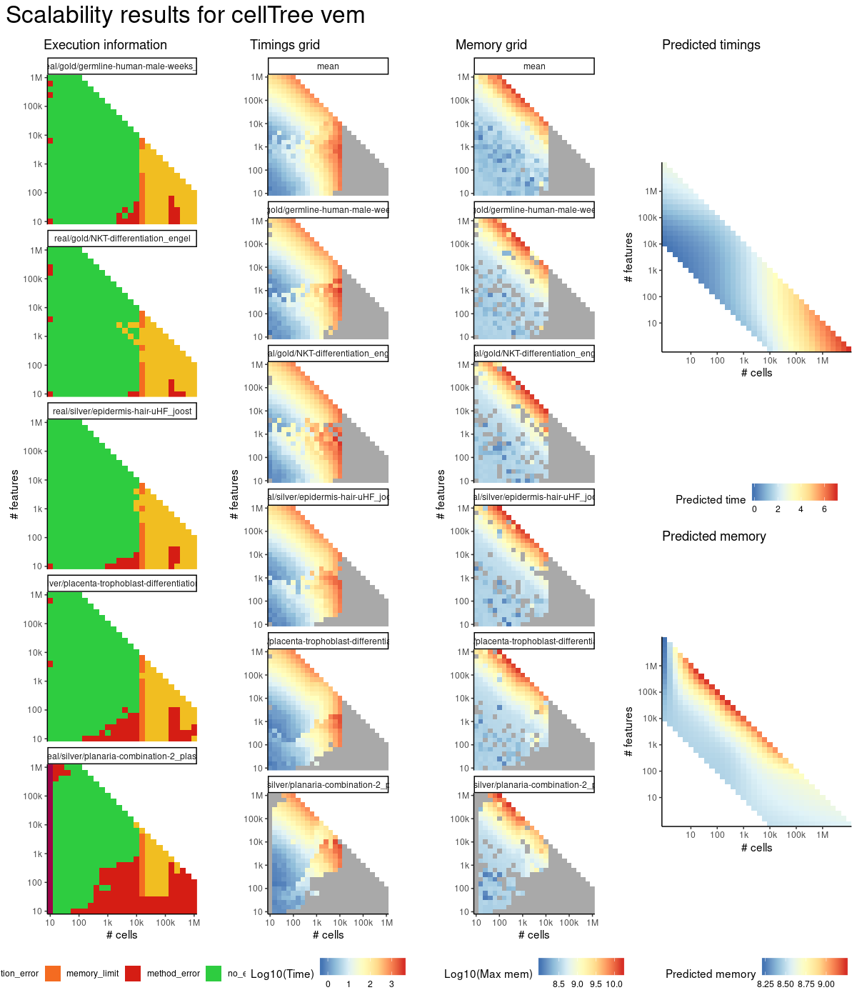
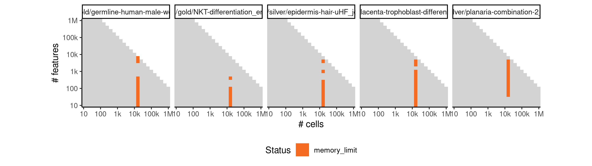
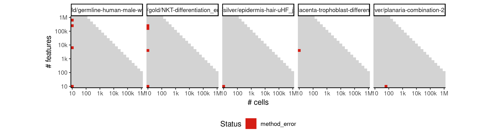
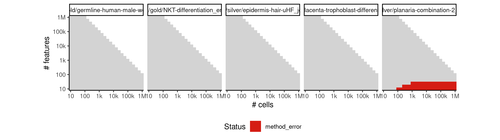
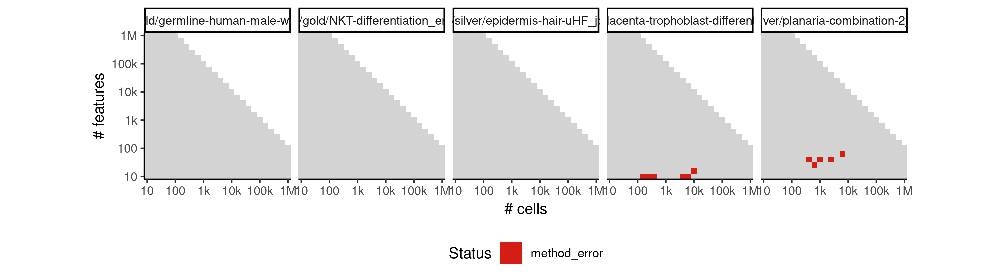
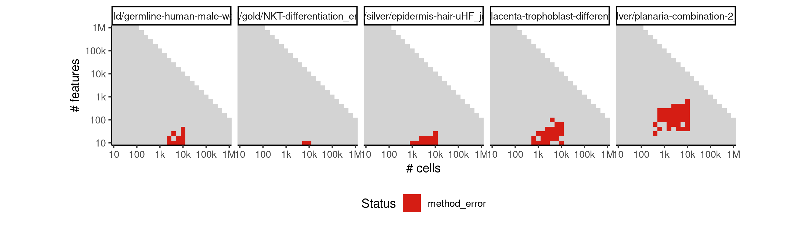
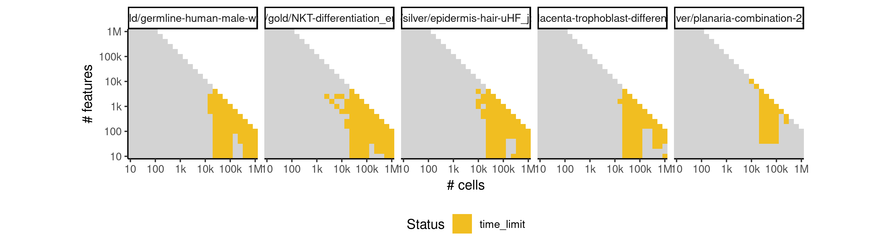

# celltree_vem


## ERROR STATUS MEMORY_LIMIT

### ERROR CLUSTER MEMORY_LIMIT -- 1


 * Number of instances: 22
 * Dataset ids: scaling_0697, scaling_0714, scaling_0731, scaling_0748, scaling_0782, scaling_0800, scaling_0818, scaling_0836, scaling_0865, scaling_0876, scaling_0887, scaling_0898, scaling_0992, scaling_1006, scaling_1020, scaling_1034, scaling_1048, scaling_1066, scaling_1085, scaling_1104, scaling_1123, scaling_1142

Last 10 lines of scaling_0697:
```
**** em iteration 70 ****
document 15849
new alpha = 2.06094
final e step document 15849
Model fit for k = 4 topics
Using rooting method: longest.path
Error in minimum.spanning.tree(g) : 
  At heap.c:565 : d_indheap reserve failed, Out of memory
Calls: <Anonymous> -> minimum.spanning.tree
Execution halted
```

## ERROR STATUS METHOD_ERROR

### ERROR CLUSTER METHOD_ERROR -- 1


 * Number of instances: 7
 * Dataset ids: scaling_0001, scaling_0002, scaling_0003, scaling_0075, scaling_0466, scaling_0486, scaling_0556

Last 10 lines of scaling_0001:
```
Using root vertex: 1
Adding branch #1:
[1] 10  4  6  2  7  9  8  5
Using branch width: 1.12 (width.scale.factor: 1.5)
Outliers: 0
Total number of branches: 1 (forks: 0)
Error in apply(dists[backbone, -backbone], 2, which.min) : 
  dim(X) must have a positive length
Calls: <Anonymous> -> apply
Execution halted
```

### ERROR CLUSTER METHOD_ERROR -- 2


 * Number of instances: 37
 * Dataset ids: scaling_0105, scaling_0140, scaling_0180, scaling_0215, scaling_0225, scaling_0254, scaling_0255, scaling_0329, scaling_0330, scaling_0389, scaling_0390, scaling_0453, scaling_0454, scaling_0455, scaling_0504, scaling_0505, scaling_0525, scaling_0555, scaling_0599, scaling_0600, scaling_0678, scaling_0679, scaling_0680, scaling_0763, scaling_0764, scaling_0765, scaling_0853, scaling_0854, scaling_0855, scaling_0909, scaling_0910, scaling_0950, scaling_0980, scaling_1049, scaling_1050, scaling_1144, scaling_1145

Last 10 lines of scaling_0105:
```
    filter, lag
The following objects are masked from ‘package:base’:
    intersect, setdiff, setequal, union
Attaching package: ‘purrr’
The following object is masked from ‘package:jsonlite’:
    flatten
Loading required namespace: cellTree
Computing LDA model using: VEM
Filtering out rows with standard deviation < 0.5 (10 -> 1)...
Loading required namespace: topicmodels
```

### ERROR CLUSTER METHOD_ERROR -- 3


 * Number of instances: 11
 * Dataset ids: scaling_0133, scaling_0174, scaling_0208, scaling_0340, scaling_0388, scaling_0495, scaling_0503, scaling_0591, scaling_0677, scaling_0747, scaling_0949

Last 10 lines of scaling_0133:
```
Model fit for k = 4 topics
Using rooting method: longest.path
Using root vertex: 1
Outliers: 158
Total number of branches: 0 (forks: -1)
Error in apply(dists[backbone, -backbone], 2, which.min) : 
  dim(X) must have a positive length
Calls: <Anonymous> -> apply
In addition: There were 50 or more warnings (use warnings() to see the first 50)
Execution halted
```

### ERROR CLUSTER METHOD_ERROR -- 4


 * Number of instances: 76
 * Dataset ids: scaling_0249, scaling_0308, scaling_0318, scaling_0319, scaling_0328, scaling_0370, scaling_0380, scaling_0403, scaling_0429, scaling_0440, scaling_0441, scaling_0442, scaling_0451, scaling_0452, scaling_0465, scaling_0485, scaling_0494, scaling_0509, scaling_0517, scaling_0521, scaling_0543, scaling_0549, scaling_0553, scaling_0564, scaling_0573, scaling_0582, scaling_0590, scaling_0598, scaling_0614, scaling_0615, scaling_0616, scaling_0632, scaling_0647, scaling_0648, scaling_0661, scaling_0662, scaling_0663, scaling_0664, scaling_0674, scaling_0675, scaling_0676, scaling_0696, scaling_0730, scaling_0745, scaling_0746, scaling_0758, scaling_0759, scaling_0760, scaling_0761, scaling_0762, scaling_0781, scaling_0817, scaling_0834, scaling_0835, scaling_0848, scaling_0849, scaling_0850, scaling_0851, scaling_0852, scaling_0864, scaling_0896, scaling_0897, scaling_0907, scaling_0908, scaling_0941, scaling_0947, scaling_0948, scaling_0973, scaling_0979, scaling_1045, scaling_1046, scaling_1047, scaling_1138, scaling_1139, scaling_1140, scaling_1141

Last 10 lines of scaling_0249:
```
[96] 383 282 209
Using branch width: 1.37 (width.scale.factor: 1.5)
Outliers: 0
Total number of branches: 1 (forks: 0)
Backbone fork merge (width: 1.37): 99 ->  99 
Ranking all cells...
output saved in /data/tmp//Rtmp0p6xpr/file1169565095a98/ti/output: 
	output.rds
sort(unique(c(cell_graph$from, cell_graph$to))) not equal to sort(names(to_keep)).
Lengths differ: 630 is not 631
```

## ERROR STATUS TIME_LIMIT

### ERROR CLUSTER TIME_LIMIT -- 1


 * Number of instances: 37
 * Dataset ids: scaling_0783, scaling_0801, scaling_0819, scaling_0837, scaling_0866, scaling_0877, scaling_0888, scaling_0899, scaling_0918, scaling_0926, scaling_0934, scaling_0942, scaling_0956, scaling_0962, scaling_0968, scaling_0974, scaling_0993, scaling_0994, scaling_1007, scaling_1008, scaling_1021, scaling_1022, scaling_1035, scaling_1036, scaling_1067, scaling_1068, scaling_1069, scaling_1086, scaling_1087, scaling_1088, scaling_1105, scaling_1106, scaling_1107, scaling_1124, scaling_1125, scaling_1126, scaling_1143

Last 10 lines of scaling_0783:
```
File: /home/rcannood/Workspace/dynverse/dynbenchmark//derived/05-scaling/suite/celltree_vem/Cat2/r2gridengine/20181008_215039_celltree_vem_Cat2_92GINtjF3q/log/log.103.e.txt
```


