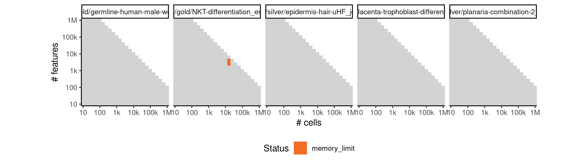

# celltree_vem


## ERROR STATUS METHOD_ERROR

### ERROR CLUSTER METHOD_ERROR -- 1


 * Number of instances: 7
 * Dataset ids: scaling_0002, scaling_0003, scaling_0019, scaling_0061, scaling_0430, scaling_0698, scaling_0820

Last 10 lines of scaling_0002:
```
Using root vertex: 7
Adding branch #1:
[1]  8  1  5  4  3  6  2 10
Using branch width: 1.57 (width.scale.factor: 1.5)
Outliers: 0
Total number of branches: 1 (forks: 0)
Error in apply(dists[backbone, -backbone], 2, which.min) : 
  dim(X) must have a positive length
Calls: <Anonymous> -> apply
Execution halted
```

### ERROR CLUSTER METHOD_ERROR -- 2


 * Number of instances: 50
 * Dataset ids: scaling_0093, scaling_0105, scaling_0126, scaling_0140, scaling_0168, scaling_0180, scaling_0201, scaling_0215, scaling_0225, scaling_0243, scaling_0254, scaling_0255, scaling_0308, scaling_0329, scaling_0330, scaling_0370, scaling_0389, scaling_0390, scaling_0429, scaling_0453, scaling_0454, scaling_0455, scaling_0485, scaling_0504, scaling_0505, scaling_0525, scaling_0555, scaling_0582, scaling_0599, scaling_0600, scaling_0648, scaling_0678, scaling_0679, scaling_0680, scaling_0731, scaling_0763, scaling_0764, scaling_0765, scaling_0819, scaling_0853, scaling_0854, scaling_0855, scaling_0888, scaling_0909, scaling_0910, scaling_0950, scaling_0980, scaling_1022, scaling_1049, scaling_1050

Last 10 lines of scaling_0093:
```
    filter, lag
The following objects are masked from 'package:base':
    intersect, setdiff, setequal, union
Attaching package: 'purrr'
The following object is masked from 'package:jsonlite':
    flatten
Loading required namespace: cellTree
Computing LDA model using: VEM
Filtering out rows with standard deviation < 0.5 (10 -> 1)...
Loading required namespace: topicmodels
```

### ERROR CLUSTER METHOD_ERROR -- 3


 * Number of instances: 66
 * Dataset ids: scaling_0162, scaling_0221, scaling_0237, scaling_0286, scaling_0297, scaling_0327, scaling_0328, scaling_0340, scaling_0350, scaling_0360, scaling_0388, scaling_0403, scaling_0416, scaling_0427, scaling_0428, scaling_0441, scaling_0452, scaling_0475, scaling_0481, scaling_0484, scaling_0503, scaling_0517, scaling_0531, scaling_0537, scaling_0564, scaling_0573, scaling_0580, scaling_0581, scaling_0591, scaling_0598, scaling_0615, scaling_0631, scaling_0644, scaling_0645, scaling_0674, scaling_0675, scaling_0677, scaling_0694, scaling_0727, scaling_0728, scaling_0729, scaling_0758, scaling_0759, scaling_0760, scaling_0761, scaling_0762, scaling_0813, scaling_0814, scaling_0815, scaling_0816, scaling_0848, scaling_0849, scaling_0850, scaling_0852, scaling_0885, scaling_0907, scaling_0933, scaling_0947, scaling_0948, scaling_0949, scaling_0991, scaling_1018, scaling_1019, scaling_1045, scaling_1046, scaling_1047

Last 10 lines of scaling_0162:
```
[58] 190  99  18  52  98 128 167
Using branch width: 0.487 (width.scale.factor: 1.5)
Outliers: 11
Total number of branches: 1 (forks: 0)
Backbone fork merge (width: 0.487): 65 ->  65 
Ranking all cells...
output saved in /data/tmp//RtmpvVKmy5/file14c285ce95afa/ti/output: 
	output.rds
sort(unique(c(cell_graph$from, cell_graph$to))) not equal to sort(names(to_keep)).
Lengths differ: 250 is not 251
```

### ERROR CLUSTER METHOD_ERROR -- 4


 * Number of instances: 12
 * Dataset ids: scaling_0267, scaling_0307, scaling_0336, scaling_0369, scaling_0502, scaling_0543, scaling_0554, scaling_0646, scaling_0647, scaling_0676, scaling_0851, scaling_0979

Last 10 lines of scaling_0267:
```
Model fit for k = 4 topics
Using rooting method: longest.path
Using root vertex: 1
Outliers: 251
Total number of branches: 0 (forks: -1)
Error in apply(dists[backbone, -backbone], 2, which.min) : 
  dim(X) must have a positive length
Calls: <Anonymous> -> apply
In addition: There were 50 or more warnings (use warnings() to see the first 50)
Execution halted
```

## ERROR STATUS TIME_LIMIT

### ERROR CLUSTER TIME_LIMIT -- 1


 * Number of instances: 25
 * Dataset ids: scaling_0783, scaling_0801, scaling_0837, scaling_0866, scaling_0877, scaling_0898, scaling_0899, scaling_0918, scaling_0926, scaling_0934, scaling_0942, scaling_0956, scaling_0962, scaling_0968, scaling_0974, scaling_0992, scaling_0993, scaling_0994, scaling_1006, scaling_1007, scaling_1008, scaling_1021, scaling_1034, scaling_1035, scaling_1036

Last 10 lines of scaling_0783:
```
File: /home/rcannood/Workspace/dynverse/dynbenchmark//derived/05-scaling/suite/celltree_vem/10/r2gridengine/20180825_051113_celltree_vem_10_tqOdQzFVMo/log/log.783.e.txt
```

## ERROR STATUS MEMORY_LIMIT

### ERROR CLUSTER MEMORY_LIMIT -- 1


 * Number of instances: 20
 * Dataset ids: scaling_0616, scaling_0632, scaling_0664, scaling_0696, scaling_0713, scaling_0730, scaling_0747, scaling_0781, scaling_0799, scaling_0817, scaling_0835, scaling_0864, scaling_0875, scaling_0886, scaling_0897, scaling_0908, scaling_0955, scaling_0961, scaling_0967, scaling_0973

Last 10 lines of scaling_0616:
```
**** em iteration 80 ****
document 10000
new alpha = 2.62158
final e step document 10000
Model fit for k = 4 topics
Using rooting method: longest.path
Error in minimum.spanning.tree(g) : 
  At heap.c:565 : d_indheap reserve failed, Out of memory
Calls: <Anonymous> -> minimum.spanning.tree
Execution halted
```

### ERROR CLUSTER MEMORY_LIMIT -- 2


 * Number of instances: 12
 * Dataset ids: scaling_0697, scaling_0714, scaling_0748, scaling_0782, scaling_0800, scaling_0818, scaling_0836, scaling_0865, scaling_0876, scaling_0887, scaling_1020, scaling_1048

Last 10 lines of scaling_0697:
```
**** em iteration 40 ****
document 15849
new alpha = 1.60100
final e step document 15849
Model fit for k = 4 topics
Using rooting method: longest.path
Error in graph.adjacency.dense(adjmatrix, mode = mode, weighted = weighted,  : 
  At vector.pmt:442 : cannot reserve space for vector, Out of memory
Calls: <Anonymous> -> graph.adjacency -> graph.adjacency.dense
Execution halted
```


