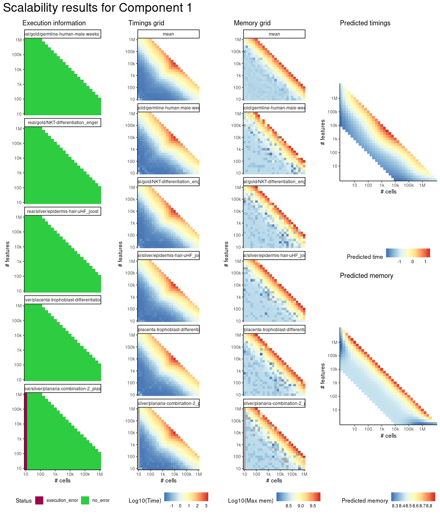
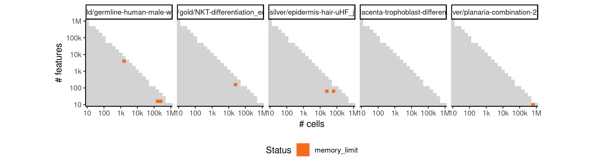
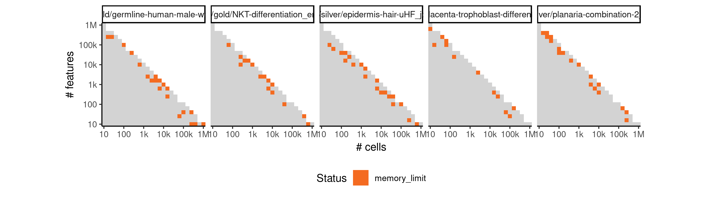

# comp1


## ERROR STATUS MEMORY_LIMIT

### ERROR CLUSTER MEMORY_LIMIT -- 1


 * Number of instances: 7
 * Dataset ids: scaling_1211, scaling_1295, scaling_1451, scaling_1461, scaling_1474, scaling_1539, scaling_1625

Last 10 lines of scaling_1211:
```
    filter, lag
The following objects are masked from ‘package:base’:
    intersect, setdiff, setequal, union
Attaching package: ‘purrr’
The following object is masked from ‘package:jsonlite’:
    flatten
Loading required package: dynutils
Error in saveRDS(x, con) : error writing to connection
Calls: write_rds -> saveRDS
Execution halted
```

### ERROR CLUSTER MEMORY_LIMIT -- 2


 * Number of instances: 85
 * Dataset ids: scaling_1215, scaling_1249, scaling_1296, scaling_1303, scaling_1320, scaling_1321, scaling_1323, scaling_1356, scaling_1357, scaling_1388, scaling_1391, scaling_1400, scaling_1401, scaling_1402, scaling_1407, scaling_1408, scaling_1412, scaling_1413, scaling_1414, scaling_1431, scaling_1435, scaling_1436, scaling_1437, scaling_1442, scaling_1446, scaling_1447, scaling_1448, scaling_1452, scaling_1470, scaling_1475, scaling_1480, scaling_1499, scaling_1503, scaling_1507, scaling_1514, scaling_1519, scaling_1526, scaling_1533, scaling_1541, scaling_1555, scaling_1556, scaling_1559, scaling_1568, scaling_1574, scaling_1581, scaling_1582, scaling_1587, scaling_1588, scaling_1600, scaling_1601, scaling_1608, scaling_1609, scaling_1610, scaling_1611, scaling_1613, scaling_1630, scaling_1631, scaling_1637, scaling_1638, scaling_1639, scaling_1640, scaling_1645, scaling_1647, scaling_1655, scaling_1656, scaling_1659, scaling_1660, scaling_1661, scaling_1668, scaling_1678, scaling_1679, scaling_1682, scaling_1686, scaling_1687, scaling_1694, scaling_1695, scaling_1702, scaling_1710, scaling_1715, scaling_1716, scaling_1722, scaling_1725, scaling_1727, scaling_1732, scaling_1733

Last 10 lines of scaling_1215:
```
error writing to connection
```


