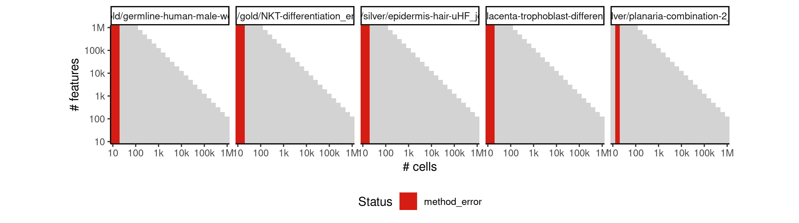
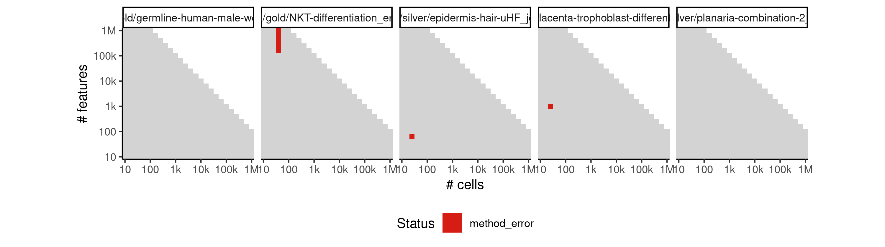
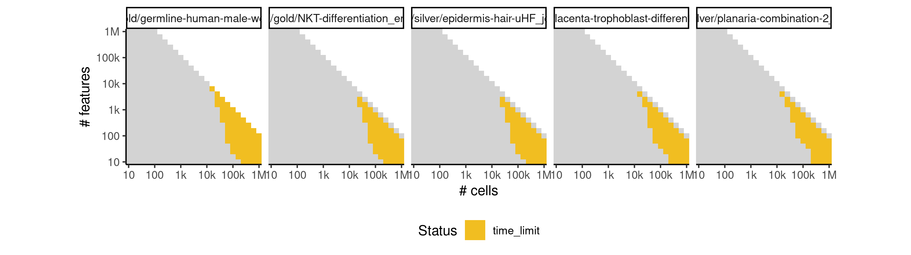
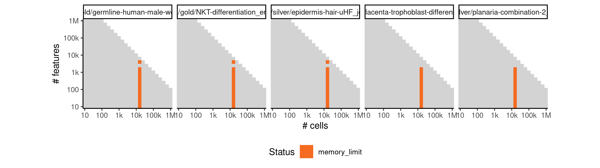
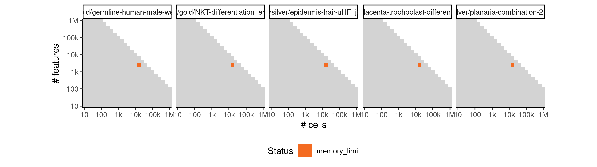

# dpt


## ERROR STATUS METHOD_ERROR

### ERROR CLUSTER METHOD_ERROR -- 1


 * Number of instances: 234
 * Dataset ids: scaling_0001, scaling_0002, scaling_0003, scaling_0004, scaling_0006, scaling_0007, scaling_0008, scaling_0009, scaling_0010, scaling_0011, scaling_0012, scaling_0013, scaling_0015, scaling_0016, scaling_0017, scaling_0019, scaling_0020, scaling_0022, scaling_0023, scaling_0025, scaling_0026, scaling_0029, scaling_0031, scaling_0033, scaling_0035, scaling_0037, scaling_0039, scaling_0041, scaling_0043, scaling_0045, scaling_0047, scaling_0051, scaling_0052, scaling_0056, scaling_0057, scaling_0061, scaling_0062, scaling_0066, scaling_0067, scaling_0072, scaling_0076, scaling_0077, scaling_0082, scaling_0083, scaling_0088, scaling_0089, scaling_0094, scaling_0095, scaling_0101, scaling_0106, scaling_0107, scaling_0113, scaling_0114, scaling_0120, scaling_0121, scaling_0127, scaling_0128, scaling_0135, scaling_0151, scaling_0152, scaling_0157, scaling_0158, scaling_0163, scaling_0164, scaling_0169, scaling_0170, scaling_0176, scaling_0181, scaling_0188, scaling_0195, scaling_0202, scaling_0216, scaling_0218, scaling_0220, scaling_0222, scaling_0224, scaling_0226, scaling_0227, scaling_0232, scaling_0233, scaling_0238, scaling_0239, scaling_0244, scaling_0245, scaling_0251, scaling_0276, scaling_0277, scaling_0287, scaling_0288, scaling_0298, scaling_0299, scaling_0309, scaling_0310, scaling_0321, scaling_0341, scaling_0342, scaling_0351, scaling_0352, scaling_0361, scaling_0362, scaling_0371, scaling_0372, scaling_0382, scaling_0391, scaling_0392, scaling_0404, scaling_0405, scaling_0417, scaling_0418, scaling_0430, scaling_0431, scaling_0444, scaling_0456, scaling_0466, scaling_0476, scaling_0486, scaling_0506, scaling_0510, scaling_0514, scaling_0518, scaling_0522, scaling_0526, scaling_0532, scaling_0538, scaling_0544, scaling_0550, scaling_0556, scaling_0565, scaling_0574, scaling_0583, scaling_0601, scaling_0602, scaling_0617, scaling_0618, scaling_0633, scaling_0634, scaling_0649, scaling_0650, scaling_0666, scaling_0681, scaling_0682, scaling_0698, scaling_0699, scaling_0715, scaling_0716, scaling_0732, scaling_0733, scaling_0750, scaling_0766, scaling_0767, scaling_0784, scaling_0785, scaling_0802, scaling_0803, scaling_0820, scaling_0821, scaling_0839, scaling_0856, scaling_0867, scaling_0878, scaling_0889, scaling_0911, scaling_0919, scaling_0927, scaling_0935, scaling_0943, scaling_0951, scaling_0957, scaling_0963, scaling_0969, scaling_0975, scaling_0981, scaling_0995, scaling_1009, scaling_1023, scaling_1051, scaling_1070, scaling_1089, scaling_1108, scaling_1146, scaling_1148, scaling_1150, scaling_1152, scaling_1154, scaling_1166, scaling_1167, scaling_1182, scaling_1183, scaling_1198, scaling_1199, scaling_1214, scaling_1215, scaling_1231, scaling_1276, scaling_1277, scaling_1297, scaling_1298, scaling_1318, scaling_1319, scaling_1339, scaling_1340, scaling_1361, scaling_1441, scaling_1442, scaling_1453, scaling_1454, scaling_1465, scaling_1466, scaling_1477, scaling_1478, scaling_1490, scaling_1531, scaling_1532, scaling_1550, scaling_1551, scaling_1569, scaling_1570, scaling_1588, scaling_1589, scaling_1608, scaling_1626, scaling_1648, scaling_1670, scaling_1692, scaling_1736, scaling_1740, scaling_1744, scaling_1748, scaling_1752, scaling_1766, scaling_1781, scaling_1796, scaling_1811, scaling_1826

Last 10 lines of scaling_0001:
```
The following objects are masked from ‘package:stats’:
    filter, lag
The following objects are masked from ‘package:base’:
    intersect, setdiff, setequal, union
Attaching package: ‘purrr’
The following object is masked from ‘package:jsonlite’:
    flatten
Error in destiny::DiffusionMap(data = expression, sigma = params$sigma,  : 
  Eigen decomposition not possible if n ≤ n_eigs+1 (And 10 ≤ 21)
Execution halted
```

### ERROR CLUSTER METHOD_ERROR -- 2


 * Number of instances: 93
 * Dataset ids: scaling_0058, scaling_0084, scaling_0115, scaling_0143, scaling_0159, scaling_0160, scaling_0189, scaling_0191, scaling_0234, scaling_0235, scaling_0260, scaling_0261, scaling_0291, scaling_0354, scaling_0355, scaling_0406, scaling_0410, scaling_0467, scaling_0512, scaling_0566, scaling_0568, scaling_0569, scaling_0570, scaling_0619, scaling_0623, scaling_0624, scaling_0625, scaling_0680, scaling_0700, scaling_0703, scaling_0704, scaling_0786, scaling_0789, scaling_0790, scaling_0791, scaling_0868, scaling_0870, scaling_0921, scaling_0922, scaling_0996, scaling_0998, scaling_0999, scaling_1000, scaling_1071, scaling_1074, scaling_1075, scaling_1185, scaling_1186, scaling_1187, scaling_1193, scaling_1250, scaling_1251, scaling_1299, scaling_1301, scaling_1302, scaling_1303, scaling_1304, scaling_1311, scaling_1393, scaling_1395, scaling_1396, scaling_1456, scaling_1457, scaling_1508, scaling_1552, scaling_1554, scaling_1555, scaling_1556, scaling_1649, scaling_1652, scaling_1653, scaling_1654, scaling_1741, scaling_1783, scaling_1784, scaling_1849, scaling_1851, scaling_1913, scaling_1916, scaling_1917, scaling_1918, scaling_1919, scaling_2010, scaling_2057, scaling_2058, scaling_2059, scaling_2162, scaling_2163, scaling_2164, scaling_2165, scaling_2247, scaling_2248, scaling_2249

Last 10 lines of scaling_0058:
```
    filter, lag
The following objects are masked from ‘package:base’:
    intersect, setdiff, setequal, union
Attaching package: ‘purrr’
The following object is masked from ‘package:jsonlite’:
    flatten
Error in auto_branch(dpt, all_cells, stats, w_width) : 
  stats$g >= gmin is not TRUE
Calls: <Anonymous> -> auto_branch -> stopifnot
Execution halted
```

### ERROR CLUSTER METHOD_ERROR -- 3


 * Number of instances: 7
 * Dataset ids: scaling_0122, scaling_0432, scaling_1553, scaling_1650, scaling_1850, scaling_1914, scaling_2009

Last 10 lines of scaling_0122:
```
    intersect, setdiff, setequal, union
Attaching package: ‘purrr’
The following object is masked from ‘package:jsonlite’:
    flatten
Processing Tip1
Processing Tip2
Processing Tip3
output saved in /data/tmp//Rtmp2bEm4H/file1f8774a9007c3/ti/output: 
	output.rds
all(milestone_network$from %in% milestone_ids) isn't true.
```

## ERROR STATUS TIME_LIMIT

### ERROR CLUSTER TIME_LIMIT -- 1


 * Number of instances: 281
 * Dataset ids: scaling_1294, scaling_1295, scaling_1296, scaling_1315, scaling_1316, scaling_1317, scaling_1336, scaling_1337, scaling_1338, scaling_1359, scaling_1380, scaling_1391, scaling_1392, scaling_1403, scaling_1404, scaling_1415, scaling_1416, scaling_1427, scaling_1428, scaling_1450, scaling_1451, scaling_1452, scaling_1462, scaling_1463, scaling_1464, scaling_1474, scaling_1475, scaling_1476, scaling_1486, scaling_1487, scaling_1488, scaling_1499, scaling_1500, scaling_1506, scaling_1512, scaling_1518, scaling_1524, scaling_1530, scaling_1545, scaling_1546, scaling_1547, scaling_1548, scaling_1549, scaling_1564, scaling_1565, scaling_1566, scaling_1567, scaling_1568, scaling_1583, scaling_1584, scaling_1585, scaling_1586, scaling_1587, scaling_1602, scaling_1603, scaling_1604, scaling_1605, scaling_1606, scaling_1621, scaling_1622, scaling_1623, scaling_1624, scaling_1625, scaling_1643, scaling_1644, scaling_1645, scaling_1646, scaling_1647, scaling_1665, scaling_1666, scaling_1667, scaling_1668, scaling_1669, scaling_1687, scaling_1688, scaling_1689, scaling_1690, scaling_1691, scaling_1708, scaling_1709, scaling_1710, scaling_1711, scaling_1712, scaling_1713, scaling_1731, scaling_1732, scaling_1733, scaling_1734, scaling_1735, scaling_1738, scaling_1739, scaling_1742, scaling_1743, scaling_1746, scaling_1747, scaling_1750, scaling_1751, scaling_1754, scaling_1755, scaling_1757, scaling_1759, scaling_1761, scaling_1763, scaling_1765, scaling_1777, scaling_1778, scaling_1779, scaling_1780, scaling_1792, scaling_1793, scaling_1794, scaling_1795, scaling_1807, scaling_1808, scaling_1809, scaling_1810, scaling_1822, scaling_1823, scaling_1824, scaling_1825, scaling_1837, scaling_1838, scaling_1839, scaling_1840, scaling_1846, scaling_1847, scaling_1848, scaling_1854, scaling_1855, scaling_1856, scaling_1862, scaling_1863, scaling_1864, scaling_1870, scaling_1871, scaling_1872, scaling_1878, scaling_1879, scaling_1880, scaling_1882, scaling_1884, scaling_1886, scaling_1888, scaling_1890, scaling_1906, scaling_1907, scaling_1908, scaling_1909, scaling_1910, scaling_1911, scaling_1912, scaling_1928, scaling_1929, scaling_1930, scaling_1931, scaling_1932, scaling_1933, scaling_1934, scaling_1950, scaling_1951, scaling_1952, scaling_1953, scaling_1954, scaling_1955, scaling_1956, scaling_1972, scaling_1973, scaling_1974, scaling_1975, scaling_1976, scaling_1977, scaling_1978, scaling_1994, scaling_1995, scaling_1996, scaling_1997, scaling_1998, scaling_1999, scaling_2000, scaling_2006, scaling_2007, scaling_2008, scaling_2014, scaling_2015, scaling_2016, scaling_2022, scaling_2023, scaling_2024, scaling_2030, scaling_2031, scaling_2032, scaling_2038, scaling_2039, scaling_2040, scaling_2050, scaling_2051, scaling_2052, scaling_2053, scaling_2054, scaling_2055, scaling_2065, scaling_2066, scaling_2067, scaling_2068, scaling_2069, scaling_2070, scaling_2080, scaling_2081, scaling_2082, scaling_2083, scaling_2084, scaling_2085, scaling_2095, scaling_2096, scaling_2097, scaling_2098, scaling_2099, scaling_2100, scaling_2110, scaling_2111, scaling_2112, scaling_2113, scaling_2114, scaling_2115, scaling_2119, scaling_2120, scaling_2121, scaling_2125, scaling_2126, scaling_2127, scaling_2131, scaling_2132, scaling_2133, scaling_2137, scaling_2138, scaling_2139, scaling_2143, scaling_2144, scaling_2145, scaling_2156, scaling_2157, scaling_2158, scaling_2159, scaling_2160, scaling_2161, scaling_2172, scaling_2173, scaling_2174, scaling_2175, scaling_2176, scaling_2177, scaling_2188, scaling_2189, scaling_2190, scaling_2191, scaling_2192, scaling_2193, scaling_2203, scaling_2204, scaling_2205, scaling_2206, scaling_2207, scaling_2208, scaling_2209, scaling_2219, scaling_2220, scaling_2221, scaling_2222, scaling_2223, scaling_2224, scaling_2225, scaling_2237, scaling_2238, scaling_2239, scaling_2240, scaling_2241, scaling_2242, scaling_2243, scaling_2244, scaling_2245, scaling_2246

Last 10 lines of scaling_1294:
```
File: /home/rcannood/Workspace/dynverse/dynbenchmark//derived/05-scaling/suite/dpt/Cat3/r2gridengine/20181010_160952_dpt_Cat3_Pj8PBpXRHR/log/log.149.e.txt
```

## ERROR STATUS MEMORY_LIMIT

### ERROR CLUSTER MEMORY_LIMIT -- 1


 * Number of instances: 63
 * Dataset ids: scaling_0697, scaling_0714, scaling_0731, scaling_0748, scaling_0765, scaling_0782, scaling_0800, scaling_0818, scaling_0836, scaling_0854, scaling_0865, scaling_0876, scaling_0887, scaling_0898, scaling_0909, scaling_0992, scaling_1006, scaling_1020, scaling_1034, scaling_1048, scaling_1066, scaling_1085, scaling_1104, scaling_1123, scaling_1142, scaling_1178, scaling_1194, scaling_1210, scaling_1226, scaling_1242, scaling_1291, scaling_1312, scaling_1333, scaling_1354, scaling_1375, scaling_1448, scaling_1460, scaling_1472, scaling_1484, scaling_1496, scaling_1543, scaling_1562, scaling_1581, scaling_1600, scaling_1619, scaling_1640, scaling_1662, scaling_1684, scaling_1706, scaling_1728, scaling_1775, scaling_1790, scaling_1805, scaling_1820, scaling_1835, scaling_1904, scaling_1926, scaling_1948, scaling_1970, scaling_1992, scaling_2155, scaling_2171, scaling_2187

Last 10 lines of scaling_0697:
```
    filter, lag
The following objects are masked from ‘package:base’:
    intersect, setdiff, setequal, union
Attaching package: ‘purrr’
The following object is masked from ‘package:jsonlite’:
    flatten
Error in asMethod(object) : 
  Cholmod error 'out of memory' at file ../Core/cholmod_memory.c, line 147
Calls: <Anonymous> ... [ -> as -> asMethod -> as -> .class1 -> as -> asMethod
Execution halted
```

### ERROR CLUSTER MEMORY_LIMIT -- 2


 * Number of instances: 136
 * Dataset ids: scaling_0783, scaling_0801, scaling_0819, scaling_0837, scaling_0855, scaling_0866, scaling_0877, scaling_0888, scaling_0899, scaling_0910, scaling_0918, scaling_0926, scaling_0934, scaling_0942, scaling_0950, scaling_0956, scaling_0962, scaling_0968, scaling_0974, scaling_0980, scaling_0993, scaling_0994, scaling_1007, scaling_1008, scaling_1021, scaling_1022, scaling_1035, scaling_1036, scaling_1049, scaling_1050, scaling_1067, scaling_1068, scaling_1069, scaling_1086, scaling_1087, scaling_1088, scaling_1105, scaling_1106, scaling_1107, scaling_1124, scaling_1125, scaling_1126, scaling_1143, scaling_1144, scaling_1145, scaling_1147, scaling_1149, scaling_1151, scaling_1153, scaling_1155, scaling_1157, scaling_1159, scaling_1161, scaling_1163, scaling_1165, scaling_1179, scaling_1180, scaling_1181, scaling_1195, scaling_1196, scaling_1197, scaling_1211, scaling_1212, scaling_1213, scaling_1227, scaling_1228, scaling_1229, scaling_1243, scaling_1244, scaling_1245, scaling_1249, scaling_1253, scaling_1257, scaling_1261, scaling_1265, scaling_1267, scaling_1269, scaling_1271, scaling_1273, scaling_1275, scaling_1292, scaling_1293, scaling_1313, scaling_1314, scaling_1334, scaling_1335, scaling_1355, scaling_1356, scaling_1357, scaling_1358, scaling_1376, scaling_1377, scaling_1378, scaling_1379, scaling_1390, scaling_1402, scaling_1414, scaling_1426, scaling_1438, scaling_1439, scaling_1440, scaling_1449, scaling_1461, scaling_1473, scaling_1485, scaling_1497, scaling_1498, scaling_1505, scaling_1511, scaling_1517, scaling_1523, scaling_1529, scaling_1544, scaling_1563, scaling_1582, scaling_1601, scaling_1620, scaling_1641, scaling_1642, scaling_1663, scaling_1664, scaling_1685, scaling_1686, scaling_1707, scaling_1729, scaling_1730, scaling_1776, scaling_1791, scaling_1806, scaling_1821, scaling_1836, scaling_1905, scaling_1927, scaling_1949, scaling_1971, scaling_1993

Last 10 lines of scaling_0783:
```
Attaching package: ‘dplyr’
The following objects are masked from ‘package:stats’:
    filter, lag
The following objects are masked from ‘package:base’:
    intersect, setdiff, setequal, union
Attaching package: ‘purrr’
The following object is masked from ‘package:jsonlite’:
    flatten
Error: cannot allocate vector of size 2.4 Gb
Execution halted
```

### ERROR CLUSTER MEMORY_LIMIT -- 3


 * Number of instances: 5
 * Dataset ids: scaling_2049, scaling_2064, scaling_2079, scaling_2094, scaling_2109

Last 10 lines of scaling_2049:
```
    filter, lag
The following objects are masked from ‘package:base’:
    intersect, setdiff, setequal, union
Attaching package: ‘purrr’
The following object is masked from ‘package:jsonlite’:
    flatten
Error in .T2Cmat(dsy2T(from), isTri = FALSE) : 
  Cholmod error 'out of memory' at file ../Core/cholmod_memory.c, line 147
Calls: <Anonymous> ... suppressMessages -> withCallingHandlers -> as -> asMethod -> .T2Cmat
Execution halted
```


