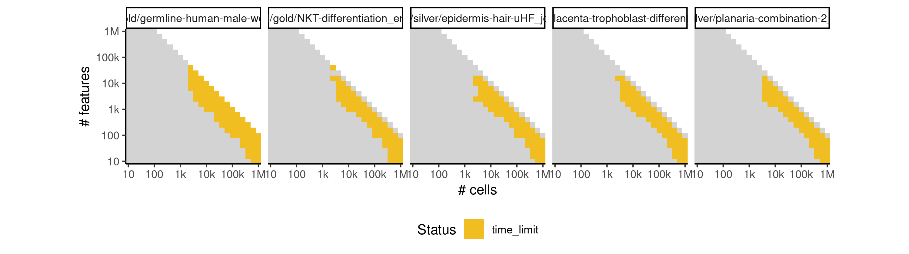

# elpigraph


## ERROR STATUS EXECUTION_ERROR

### ERROR CLUSTER EXECUTION_ERROR -- 1


 * Number of instances: 477
 * Dataset ids: scaling_0001, scaling_0002, scaling_0003, scaling_0004, scaling_0006, scaling_0007, scaling_0008, scaling_0009, scaling_0010, scaling_0011, scaling_0012, scaling_0013, scaling_0015, scaling_0016, scaling_0018, scaling_0019, scaling_0020, scaling_0021, scaling_0022, scaling_0023, scaling_0024, scaling_0025, scaling_0026, scaling_0027, scaling_0029, scaling_0031, scaling_0032, scaling_0033, scaling_0034, scaling_0036, scaling_0037, scaling_0038, scaling_0041, scaling_0042, scaling_0043, scaling_0044, scaling_0045, scaling_0046, scaling_0047, scaling_0048, scaling_0050, scaling_0051, scaling_0053, scaling_0054, scaling_0055, scaling_0056, scaling_0057, scaling_0058, scaling_0059, scaling_0060, scaling_0062, scaling_0063, scaling_0064, scaling_0066, scaling_0067, scaling_0068, scaling_0069, scaling_0072, scaling_0073, scaling_0074, scaling_0075, scaling_0077, scaling_0078, scaling_0080, scaling_0082, scaling_0083, scaling_0084, scaling_0085, scaling_0086, scaling_0087, scaling_0088, scaling_0092, scaling_0094, scaling_0095, scaling_0096, scaling_0101, scaling_0103, scaling_0104, scaling_0105, scaling_0107, scaling_0108, scaling_0110, scaling_0111, scaling_0113, scaling_0114, scaling_0115, scaling_0116, scaling_0117, scaling_0118, scaling_0119, scaling_0120, scaling_0121, scaling_0124, scaling_0127, scaling_0128, scaling_0129, scaling_0130, scaling_0136, scaling_0143, scaling_0145, scaling_0146, scaling_0147, scaling_0149, scaling_0150, scaling_0152, scaling_0154, scaling_0156, scaling_0157, scaling_0158, scaling_0159, scaling_0160, scaling_0161, scaling_0163, scaling_0164, scaling_0165, scaling_0166, scaling_0167, scaling_0168, scaling_0169, scaling_0170, scaling_0171, scaling_0174, scaling_0177, scaling_0180, scaling_0181, scaling_0182, scaling_0183, scaling_0184, scaling_0186, scaling_0187, scaling_0188, scaling_0190, scaling_0192, scaling_0193, scaling_0194, scaling_0195, scaling_0196, scaling_0198, scaling_0199, scaling_0201, scaling_0202, scaling_0203, scaling_0204, scaling_0205, scaling_0211, scaling_0215, scaling_0216, scaling_0218, scaling_0219, scaling_0220, scaling_0221, scaling_0222, scaling_0225, scaling_0226, scaling_0230, scaling_0231, scaling_0232, scaling_0233, scaling_0234, scaling_0235, scaling_0236, scaling_0237, scaling_0238, scaling_0241, scaling_0242, scaling_0243, scaling_0244, scaling_0245, scaling_0246, scaling_0247, scaling_0251, scaling_0252, scaling_0254, scaling_0255, scaling_0256, scaling_0257, scaling_0260, scaling_0261, scaling_0265, scaling_0268, scaling_0269, scaling_0273, scaling_0276, scaling_0277, scaling_0278, scaling_0279, scaling_0280, scaling_0282, scaling_0283, scaling_0284, scaling_0286, scaling_0287, scaling_0288, scaling_0289, scaling_0290, scaling_0291, scaling_0294, scaling_0295, scaling_0296, scaling_0297, scaling_0299, scaling_0301, scaling_0302, scaling_0306, scaling_0309, scaling_0310, scaling_0311, scaling_0312, scaling_0314, scaling_0316, scaling_0324, scaling_0326, scaling_0332, scaling_0333, scaling_0337, scaling_0340, scaling_0343, scaling_0348, scaling_0351, scaling_0352, scaling_0353, scaling_0354, scaling_0357, scaling_0358, scaling_0359, scaling_0360, scaling_0363, scaling_0364, scaling_0365, scaling_0366, scaling_0368, scaling_0369, scaling_0371, scaling_0372, scaling_0378, scaling_0384, scaling_0385, scaling_0387, scaling_0388, scaling_0389, scaling_0391, scaling_0393, scaling_0398, scaling_0401, scaling_0403, scaling_0404, scaling_0406, scaling_0407, scaling_0413, scaling_0415, scaling_0416, scaling_0420, scaling_0424, scaling_0425, scaling_0426, scaling_0428, scaling_0430, scaling_0431, scaling_0432, scaling_0433, scaling_0434, scaling_0435, scaling_0438, scaling_0446, scaling_0450, scaling_0451, scaling_0452, scaling_0453, scaling_0454, scaling_0456, scaling_0458, scaling_0465, scaling_0466, scaling_0467, scaling_0468, scaling_0469, scaling_0471, scaling_0472, scaling_0474, scaling_0475, scaling_0477, scaling_0479, scaling_0483, scaling_0485, scaling_0486, scaling_0487, scaling_0488, scaling_0493, scaling_0497, scaling_0499, scaling_0502, scaling_0504, scaling_0505, scaling_0506, scaling_0510, scaling_0511, scaling_0513, scaling_0515, scaling_0517, scaling_0518, scaling_0525, scaling_0528, scaling_0529, scaling_0530, scaling_0531, scaling_0532, scaling_0533, scaling_0535, scaling_0537, scaling_0538, scaling_0543, scaling_0544, scaling_0549, scaling_0551, scaling_0552, scaling_0555, scaling_0556, scaling_0557, scaling_0562, scaling_0564, scaling_0565, scaling_0566, scaling_0567, scaling_0568, scaling_0571, scaling_0573, scaling_0579, scaling_0580, scaling_0583, scaling_0584, scaling_0585, scaling_0598, scaling_0599, scaling_0600, scaling_0601, scaling_0603, scaling_0611, scaling_0613, scaling_0614, scaling_0615, scaling_0616, scaling_0617, scaling_0618, scaling_0619, scaling_0625, scaling_0627, scaling_0628, scaling_0630, scaling_0631, scaling_0632, scaling_0633, scaling_0634, scaling_0636, scaling_0639, scaling_0640, scaling_0645, scaling_0646, scaling_0650, scaling_0651, scaling_0652, scaling_0655, scaling_0662, scaling_0667, scaling_0669, scaling_0670, scaling_0673, scaling_0676, scaling_0678, scaling_0680, scaling_0683, scaling_0684, scaling_0686, scaling_0688, scaling_0692, scaling_0694, scaling_0696, scaling_0697, scaling_0699, scaling_0700, scaling_0701, scaling_0702, scaling_0703, scaling_0704, scaling_0708, scaling_0709, scaling_0712, scaling_0713, scaling_0714, scaling_0715, scaling_0718, scaling_0719, scaling_0721, scaling_0723, scaling_0726, scaling_0727, scaling_0728, scaling_0729, scaling_0731, scaling_0732, scaling_0733, scaling_0734, scaling_0735, scaling_0736, scaling_0744, scaling_0751, scaling_0752, scaling_0762, scaling_0771, scaling_0772, scaling_0773, scaling_0777, scaling_0779, scaling_0780, scaling_0781, scaling_0782, scaling_0783, scaling_0784, scaling_0785, scaling_0786, scaling_0787, scaling_0788, scaling_0789, scaling_0790, scaling_0797, scaling_0798, scaling_0801, scaling_0804, scaling_0806, scaling_0807, scaling_0817, scaling_0820, scaling_0821, scaling_0823, scaling_0824, scaling_0825, scaling_0834, scaling_0842, scaling_0852, scaling_0853, scaling_0854, scaling_0855, scaling_0858, scaling_0859, scaling_0864, scaling_0865, scaling_0867, scaling_0869, scaling_0875, scaling_0878, scaling_0881, scaling_0886, scaling_0889, scaling_0890, scaling_0903, scaling_0908, scaling_0912, scaling_0919, scaling_0920, scaling_0928, scaling_0935, scaling_0944, scaling_0951, scaling_0964, scaling_0969, scaling_0970, scaling_0976, scaling_0981, scaling_0983, scaling_0984, scaling_0995, scaling_0996, scaling_0997, scaling_1010, scaling_1024, scaling_1038, scaling_1040, scaling_1041

Last 10 lines of scaling_0001:
```
File: /home/rcannood/Workspace/dynverse/dynbenchmark//derived/05-scaling/suite/elpigraph/10/r2gridengine/20180825_051143_elpigraph_10_58aq8kSkMN/log/log.1.e.txt
All progressions (from, to) edges need to be part of the milestone network
Execution halted
```

## ERROR STATUS TIME_LIMIT

### ERROR CLUSTER TIME_LIMIT -- 1


 * Number of instances: 173
 * Dataset ids: scaling_0689, scaling_0690, scaling_0691, scaling_0705, scaling_0706, scaling_0707, scaling_0738, scaling_0739, scaling_0740, scaling_0741, scaling_0742, scaling_0743, scaling_0755, scaling_0756, scaling_0757, scaling_0758, scaling_0759, scaling_0774, scaling_0775, scaling_0776, scaling_0791, scaling_0792, scaling_0793, scaling_0794, scaling_0795, scaling_0809, scaling_0810, scaling_0811, scaling_0812, scaling_0813, scaling_0814, scaling_0819, scaling_0826, scaling_0827, scaling_0828, scaling_0829, scaling_0830, scaling_0831, scaling_0832, scaling_0833, scaling_0837, scaling_0844, scaling_0845, scaling_0846, scaling_0847, scaling_0848, scaling_0849, scaling_0860, scaling_0861, scaling_0862, scaling_0863, scaling_0866, scaling_0871, scaling_0872, scaling_0873, scaling_0874, scaling_0876, scaling_0877, scaling_0882, scaling_0883, scaling_0884, scaling_0885, scaling_0887, scaling_0888, scaling_0893, scaling_0894, scaling_0895, scaling_0896, scaling_0897, scaling_0898, scaling_0899, scaling_0904, scaling_0905, scaling_0906, scaling_0907, scaling_0909, scaling_0910, scaling_0913, scaling_0914, scaling_0915, scaling_0916, scaling_0917, scaling_0918, scaling_0921, scaling_0922, scaling_0923, scaling_0924, scaling_0925, scaling_0926, scaling_0929, scaling_0930, scaling_0931, scaling_0932, scaling_0933, scaling_0934, scaling_0937, scaling_0938, scaling_0939, scaling_0940, scaling_0941, scaling_0942, scaling_0946, scaling_0947, scaling_0948, scaling_0949, scaling_0950, scaling_0953, scaling_0954, scaling_0955, scaling_0956, scaling_0959, scaling_0960, scaling_0961, scaling_0962, scaling_0965, scaling_0966, scaling_0967, scaling_0968, scaling_0971, scaling_0972, scaling_0973, scaling_0974, scaling_0977, scaling_0978, scaling_0979, scaling_0980, scaling_0985, scaling_0986, scaling_0987, scaling_0988, scaling_0989, scaling_0990, scaling_0991, scaling_0992, scaling_0993, scaling_0994, scaling_1000, scaling_1001, scaling_1002, scaling_1003, scaling_1004, scaling_1005, scaling_1006, scaling_1007, scaling_1008, scaling_1013, scaling_1014, scaling_1015, scaling_1016, scaling_1017, scaling_1018, scaling_1019, scaling_1020, scaling_1021, scaling_1022, scaling_1028, scaling_1029, scaling_1030, scaling_1031, scaling_1032, scaling_1033, scaling_1034, scaling_1035, scaling_1036, scaling_1042, scaling_1043, scaling_1044, scaling_1045, scaling_1046, scaling_1047, scaling_1048, scaling_1049, scaling_1050

Last 10 lines of scaling_0689:
```
File: /home/rcannood/Workspace/dynverse/dynbenchmark//derived/05-scaling/suite/elpigraph/10/r2gridengine/20180825_051143_elpigraph_10_58aq8kSkMN/log/log.689.e.txt
```


