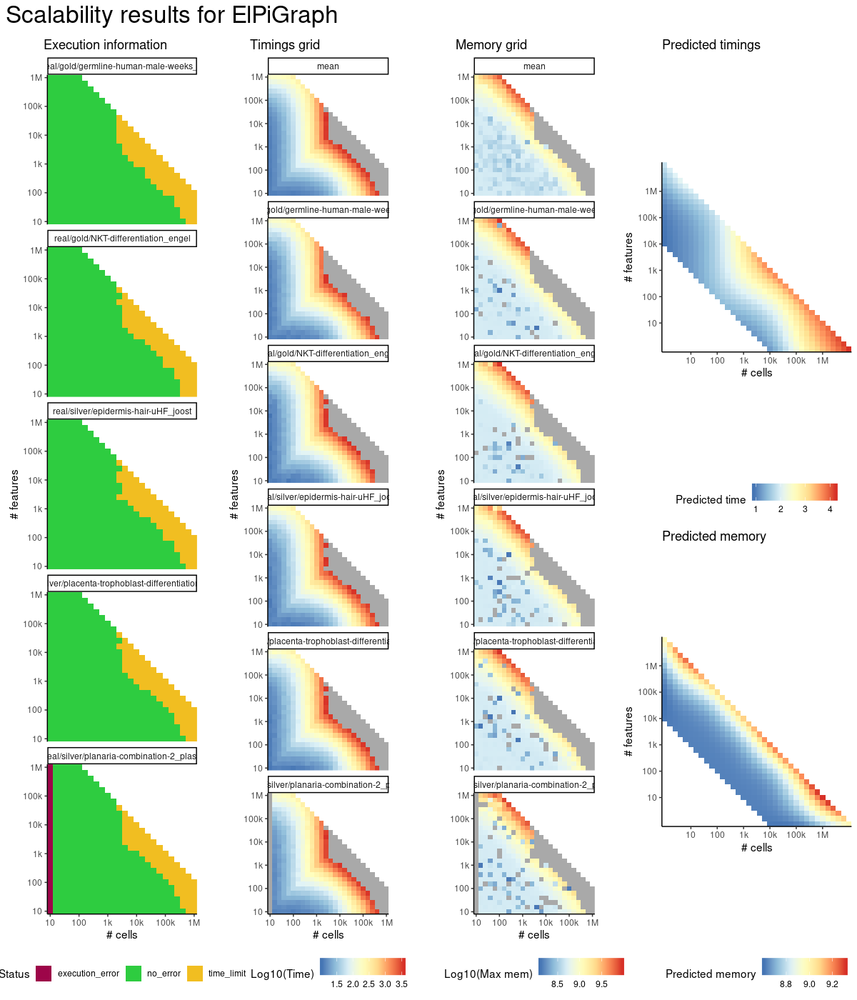

# elpigraph


## ERROR STATUS TIME_LIMIT

### ERROR CLUSTER TIME_LIMIT -- 1


 * Number of instances: 392
 * Dataset ids: scaling_1464, scaling_1548, scaling_1549, scaling_1567, scaling_1568, scaling_1578, scaling_1586, scaling_1587, scaling_1605, scaling_1606, scaling_1624, scaling_1625, scaling_1637, scaling_1638, scaling_1639, scaling_1641, scaling_1642, scaling_1643, scaling_1645, scaling_1646, scaling_1647, scaling_1659, scaling_1660, scaling_1661, scaling_1665, scaling_1667, scaling_1668, scaling_1669, scaling_1681, scaling_1682, scaling_1683, scaling_1684, scaling_1687, scaling_1689, scaling_1690, scaling_1691, scaling_1703, scaling_1704, scaling_1705, scaling_1706, scaling_1711, scaling_1712, scaling_1713, scaling_1725, scaling_1726, scaling_1733, scaling_1734, scaling_1735, scaling_1738, scaling_1739, scaling_1743, scaling_1747, scaling_1751, scaling_1755, scaling_1757, scaling_1759, scaling_1761, scaling_1763, scaling_1765, scaling_1773, scaling_1774, scaling_1775, scaling_1776, scaling_1777, scaling_1778, scaling_1779, scaling_1780, scaling_1788, scaling_1789, scaling_1790, scaling_1791, scaling_1792, scaling_1793, scaling_1794, scaling_1795, scaling_1803, scaling_1804, scaling_1805, scaling_1806, scaling_1807, scaling_1808, scaling_1809, scaling_1810, scaling_1818, scaling_1819, scaling_1820, scaling_1821, scaling_1822, scaling_1823, scaling_1824, scaling_1825, scaling_1833, scaling_1834, scaling_1835, scaling_1836, scaling_1837, scaling_1838, scaling_1839, scaling_1840, scaling_1844, scaling_1845, scaling_1846, scaling_1847, scaling_1848, scaling_1853, scaling_1854, scaling_1855, scaling_1856, scaling_1861, scaling_1862, scaling_1863, scaling_1864, scaling_1869, scaling_1870, scaling_1871, scaling_1872, scaling_1877, scaling_1878, scaling_1879, scaling_1880, scaling_1882, scaling_1884, scaling_1886, scaling_1888, scaling_1890, scaling_1900, scaling_1901, scaling_1902, scaling_1903, scaling_1904, scaling_1905, scaling_1906, scaling_1907, scaling_1908, scaling_1909, scaling_1910, scaling_1911, scaling_1912, scaling_1923, scaling_1924, scaling_1925, scaling_1926, scaling_1927, scaling_1928, scaling_1929, scaling_1930, scaling_1931, scaling_1932, scaling_1933, scaling_1934, scaling_1944, scaling_1945, scaling_1946, scaling_1947, scaling_1948, scaling_1949, scaling_1950, scaling_1951, scaling_1952, scaling_1953, scaling_1954, scaling_1955, scaling_1956, scaling_1967, scaling_1968, scaling_1969, scaling_1970, scaling_1971, scaling_1972, scaling_1973, scaling_1974, scaling_1975, scaling_1976, scaling_1977, scaling_1978, scaling_1989, scaling_1990, scaling_1991, scaling_1992, scaling_1993, scaling_1994, scaling_1995, scaling_1996, scaling_1997, scaling_1998, scaling_1999, scaling_2000, scaling_2004, scaling_2005, scaling_2006, scaling_2007, scaling_2008, scaling_2012, scaling_2013, scaling_2014, scaling_2015, scaling_2016, scaling_2020, scaling_2021, scaling_2022, scaling_2023, scaling_2024, scaling_2028, scaling_2029, scaling_2030, scaling_2031, scaling_2032, scaling_2036, scaling_2037, scaling_2038, scaling_2039, scaling_2040, scaling_2047, scaling_2048, scaling_2049, scaling_2050, scaling_2051, scaling_2052, scaling_2053, scaling_2054, scaling_2055, scaling_2062, scaling_2063, scaling_2064, scaling_2065, scaling_2066, scaling_2067, scaling_2068, scaling_2069, scaling_2070, scaling_2077, scaling_2078, scaling_2079, scaling_2080, scaling_2081, scaling_2082, scaling_2083, scaling_2084, scaling_2085, scaling_2092, scaling_2093, scaling_2094, scaling_2095, scaling_2096, scaling_2097, scaling_2098, scaling_2099, scaling_2100, scaling_2108, scaling_2109, scaling_2110, scaling_2111, scaling_2112, scaling_2113, scaling_2114, scaling_2115, scaling_2119, scaling_2120, scaling_2121, scaling_2125, scaling_2126, scaling_2127, scaling_2131, scaling_2132, scaling_2133, scaling_2137, scaling_2138, scaling_2139, scaling_2143, scaling_2144, scaling_2145, scaling_2151, scaling_2152, scaling_2153, scaling_2154, scaling_2155, scaling_2156, scaling_2157, scaling_2158, scaling_2159, scaling_2160, scaling_2161, scaling_2168, scaling_2169, scaling_2170, scaling_2171, scaling_2172, scaling_2173, scaling_2174, scaling_2175, scaling_2176, scaling_2177, scaling_2184, scaling_2185, scaling_2186, scaling_2187, scaling_2188, scaling_2189, scaling_2190, scaling_2191, scaling_2192, scaling_2193, scaling_2200, scaling_2201, scaling_2202, scaling_2203, scaling_2204, scaling_2205, scaling_2206, scaling_2207, scaling_2208, scaling_2209, scaling_2216, scaling_2217, scaling_2218, scaling_2219, scaling_2220, scaling_2221, scaling_2222, scaling_2223, scaling_2224, scaling_2225, scaling_2233, scaling_2234, scaling_2235, scaling_2236, scaling_2237, scaling_2238, scaling_2239, scaling_2240, scaling_2241, scaling_2242, scaling_2243, scaling_2244, scaling_2245, scaling_2246, scaling_2254, scaling_2255, scaling_2256, scaling_2257, scaling_2258, scaling_2259, scaling_2260, scaling_2261, scaling_2262, scaling_2263, scaling_2264, scaling_2265, scaling_2266, scaling_2267, scaling_2275, scaling_2276, scaling_2277, scaling_2278, scaling_2279, scaling_2280, scaling_2281, scaling_2282, scaling_2283, scaling_2284, scaling_2285, scaling_2286, scaling_2287, scaling_2288, scaling_2296, scaling_2297, scaling_2298, scaling_2299, scaling_2300, scaling_2301, scaling_2302, scaling_2303, scaling_2304, scaling_2305, scaling_2306, scaling_2307, scaling_2308, scaling_2309, scaling_2317, scaling_2318, scaling_2319, scaling_2320, scaling_2321, scaling_2322, scaling_2323, scaling_2324, scaling_2325, scaling_2326, scaling_2327, scaling_2328, scaling_2329, scaling_2330

Last 10 lines of scaling_1464:
```
File: /home/rcannood/Workspace/dynverse/dynbenchmark//derived/05-scaling/suite/elpigraph/Cat3/r2gridengine/20181010_161101_elpigraph_Cat3_pmrBGBOpAP/log/log.319.e.txt
```


