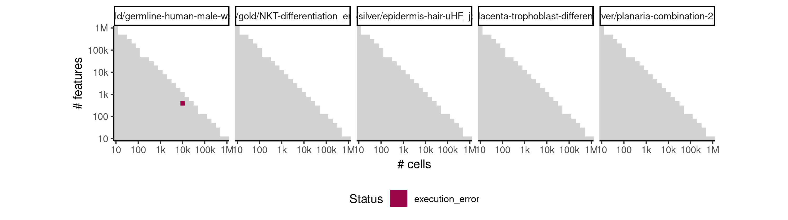
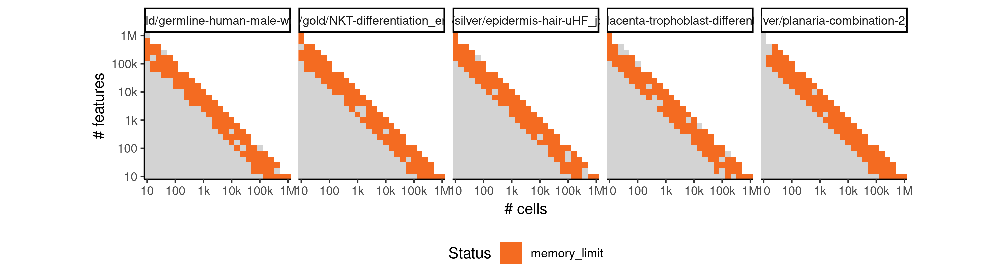

# elpilinear


## ERROR STATUS EXECUTION_ERROR

### ERROR CLUSTER EXECUTION_ERROR -- 1


 * Number of instances: 484
 * Dataset ids: scaling_0002, scaling_0003, scaling_0006, scaling_0008, scaling_0011, scaling_0012, scaling_0016, scaling_0019, scaling_0021, scaling_0022, scaling_0030, scaling_0031, scaling_0032, scaling_0036, scaling_0037, scaling_0038, scaling_0041, scaling_0042, scaling_0043, scaling_0044, scaling_0045, scaling_0046, scaling_0047, scaling_0048, scaling_0050, scaling_0051, scaling_0054, scaling_0056, scaling_0057, scaling_0058, scaling_0060, scaling_0064, scaling_0066, scaling_0067, scaling_0069, scaling_0070, scaling_0072, scaling_0074, scaling_0076, scaling_0077, scaling_0079, scaling_0080, scaling_0081, scaling_0082, scaling_0083, scaling_0084, scaling_0085, scaling_0086, scaling_0087, scaling_0088, scaling_0090, scaling_0091, scaling_0093, scaling_0094, scaling_0095, scaling_0099, scaling_0105, scaling_0108, scaling_0109, scaling_0111, scaling_0114, scaling_0118, scaling_0119, scaling_0121, scaling_0124, scaling_0127, scaling_0128, scaling_0132, scaling_0135, scaling_0136, scaling_0137, scaling_0140, scaling_0142, scaling_0145, scaling_0146, scaling_0150, scaling_0159, scaling_0163, scaling_0165, scaling_0166, scaling_0170, scaling_0172, scaling_0173, scaling_0174, scaling_0178, scaling_0185, scaling_0186, scaling_0188, scaling_0189, scaling_0197, scaling_0198, scaling_0200, scaling_0204, scaling_0205, scaling_0206, scaling_0210, scaling_0211, scaling_0213, scaling_0215, scaling_0218, scaling_0220, scaling_0224, scaling_0226, scaling_0228, scaling_0231, scaling_0232, scaling_0233, scaling_0234, scaling_0237, scaling_0239, scaling_0240, scaling_0241, scaling_0245, scaling_0246, scaling_0247, scaling_0251, scaling_0252, scaling_0255, scaling_0258, scaling_0260, scaling_0261, scaling_0265, scaling_0268, scaling_0269, scaling_0271, scaling_0272, scaling_0273, scaling_0274, scaling_0276, scaling_0281, scaling_0285, scaling_0286, scaling_0287, scaling_0288, scaling_0291, scaling_0293, scaling_0295, scaling_0296, scaling_0298, scaling_0299, scaling_0300, scaling_0301, scaling_0302, scaling_0303, scaling_0304, scaling_0305, scaling_0308, scaling_0309, scaling_0311, scaling_0316, scaling_0318, scaling_0323, scaling_0325, scaling_0326, scaling_0327, scaling_0331, scaling_0334, scaling_0337, scaling_0338, scaling_0343, scaling_0345, scaling_0346, scaling_0348, scaling_0349, scaling_0353, scaling_0355, scaling_0360, scaling_0362, scaling_0364, scaling_0365, scaling_0367, scaling_0369, scaling_0372, scaling_0373, scaling_0374, scaling_0376, scaling_0378, scaling_0382, scaling_0386, scaling_0389, scaling_0393, scaling_0396, scaling_0397, scaling_0398, scaling_0401, scaling_0402, scaling_0406, scaling_0421, scaling_0423, scaling_0426, scaling_0427, scaling_0428, scaling_0430, scaling_0435, scaling_0438, scaling_0439, scaling_0444, scaling_0446, scaling_0447, scaling_0449, scaling_0454, scaling_0456, scaling_0458, scaling_0459, scaling_0461, scaling_0463, scaling_0466, scaling_0471, scaling_0472, scaling_0473, scaling_0474, scaling_0475, scaling_0477, scaling_0480, scaling_0484, scaling_0486, scaling_0487, scaling_0491, scaling_0493, scaling_0494, scaling_0499, scaling_0501, scaling_0503, scaling_0504, scaling_0509, scaling_0510, scaling_0511, scaling_0513, scaling_0515, scaling_0518, scaling_0521, scaling_0522, scaling_0524, scaling_0525, scaling_0527, scaling_0528, scaling_0531, scaling_0532, scaling_0533, scaling_0534, scaling_0537, scaling_0538, scaling_0539, scaling_0541, scaling_0543, scaling_0544, scaling_0546, scaling_0548, scaling_0549, scaling_0550, scaling_0551, scaling_0553, scaling_0554, scaling_0555, scaling_0556, scaling_0559, scaling_0560, scaling_0561, scaling_0563, scaling_0565, scaling_0566, scaling_0567, scaling_0569, scaling_0576, scaling_0577, scaling_0579, scaling_0580, scaling_0581, scaling_0582, scaling_0584, scaling_0586, scaling_0588, scaling_0593, scaling_0594, scaling_0596, scaling_0597, scaling_0601, scaling_0602, scaling_0607, scaling_0609, scaling_0610, scaling_0615, scaling_0616, scaling_0620, scaling_0622, scaling_0624, scaling_0625, scaling_0626, scaling_0628, scaling_0629, scaling_0630, scaling_0633, scaling_0638, scaling_0639, scaling_0640, scaling_0644, scaling_0645, scaling_0649, scaling_0650, scaling_0652, scaling_0654, scaling_0655, scaling_0656, scaling_0659, scaling_0660, scaling_0661, scaling_0666, scaling_0668, scaling_0671, scaling_0672, scaling_0677, scaling_0681, scaling_0683, scaling_0684, scaling_0686, scaling_0687, scaling_0688, scaling_0695, scaling_0696, scaling_0698, scaling_0699, scaling_0701, scaling_0703, scaling_0704, scaling_0705, scaling_0706, scaling_0707, scaling_0708, scaling_0709, scaling_0710, scaling_0711, scaling_0712, scaling_0717, scaling_0718, scaling_0728, scaling_0730, scaling_0731, scaling_0734, scaling_0735, scaling_0738, scaling_0740, scaling_0741, scaling_0743, scaling_0744, scaling_0745, scaling_0746, scaling_0758, scaling_0761, scaling_0763, scaling_0766, scaling_0767, scaling_0771, scaling_0774, scaling_0777, scaling_0779, scaling_0780, scaling_0781, scaling_0782, scaling_0783, scaling_0784, scaling_0785, scaling_0786, scaling_0788, scaling_0789, scaling_0791, scaling_0792, scaling_0793, scaling_0794, scaling_0797, scaling_0798, scaling_0800, scaling_0802, scaling_0803, scaling_0805, scaling_0810, scaling_0813, scaling_0814, scaling_0815, scaling_0816, scaling_0821, scaling_0822, scaling_0825, scaling_0827, scaling_0828, scaling_0829, scaling_0832, scaling_0833, scaling_0836, scaling_0837, scaling_0839, scaling_0840, scaling_0841, scaling_0842, scaling_0843, scaling_0846, scaling_0847, scaling_0850, scaling_0854, scaling_0859, scaling_0860, scaling_0862, scaling_0868, scaling_0870, scaling_0876, scaling_0880, scaling_0881, scaling_0884, scaling_0885, scaling_0889, scaling_0890, scaling_0891, scaling_0892, scaling_0895, scaling_0896, scaling_0899, scaling_0903, scaling_0907, scaling_0908, scaling_0911, scaling_0913, scaling_0915, scaling_0917, scaling_0918, scaling_0919, scaling_0920, scaling_0922, scaling_0923, scaling_0925, scaling_0927, scaling_0932, scaling_0933, scaling_0934, scaling_0935, scaling_0937, scaling_0938, scaling_0941, scaling_0942, scaling_0944, scaling_0949, scaling_0956, scaling_0958, scaling_0960, scaling_0961, scaling_0963, scaling_0966, scaling_0967, scaling_0969, scaling_0971, scaling_0973, scaling_0974, scaling_0975, scaling_0979, scaling_0982, scaling_0984, scaling_0985, scaling_0989, scaling_0994, scaling_0995, scaling_0997, scaling_0998, scaling_1000, scaling_1002, scaling_1004, scaling_1006, scaling_1010, scaling_1011, scaling_1013, scaling_1018, scaling_1019, scaling_1020, scaling_1022, scaling_1023, scaling_1024, scaling_1025, scaling_1027, scaling_1028, scaling_1029, scaling_1030, scaling_1031, scaling_1032, scaling_1033, scaling_1038, scaling_1045, scaling_1049

Last 10 lines of scaling_0002:
```
File: /home/rcannood/Workspace/dynverse/dynbenchmark//derived/05-scaling/suite/elpilinear/10/r2gridengine/20180825_051124_elpilinear_10_zyKrPKq4So/log/log.2.e.txt
All progressions (from, to) edges need to be part of the milestone network
Execution halted
```

## ERROR STATUS MEMORY_LIMIT

### ERROR CLUSTER MEMORY_LIMIT -- 1


 * Number of instances: 1
 * Dataset ids: scaling_0377

Last 10 lines of scaling_0377:
```
12: lapply(X = X, FUN = FUN, ...)
13: parallel::mclapply(seq_len(nrow(dataset)), mc.cores = mc_cores,     function(i) {        dataseti <- dynutils::extract_row_to_list(dataset, i)        model <- method_outputs$model[[i]]        if (!is.null(model)) {            time0 <- Sys.time()            model <- model %>% dynwrap::add_cell_waypoints(num_cells_selected = length(dataseti$waypoint_cells))            time1 <- Sys.time()            time_cellwaypoints <- as.numeric(difftime(time1,                 time0, units = "sec"))            df_cellwaypoints <- data_frame(time_cellwaypoints)        }        else {            df_cellwaypoints <- NULL        }        metrics_summary <- calculate_metrics(dataseti, model,             metrics)        summary <- bind_cols(method_outputs$summary[[i]], df_cellwaypoints,             metrics_summary)        if (!output_model && !is.null(model)) {            model <- TRUE        }        lst(summary, model)    })
14: evaluate_ti_method(dataset = dataset, method = method, parameters = params,     metrics = metrics, give_priors = priors, output_model = output_models,     mc_cores = 1, verbose = verbose)
15: benchmark_run_evaluation(i = i, subdesign = subdesign, metrics = metrics,     verbose = verbose, error_mode = FALSE, output_models = output_models)
16: (function (i) {    benchmark_run_evaluation(i = i, subdesign = subdesign, metrics = metrics,         verbose = verbose, error_mode = FALSE, output_models = output_models)})(377L)
17: do.call(PitSoL_params$FUN, c(list(PitSoL_params$X[[PitSoL_data]]),     PitSoL_params$DOTPARAMS))
18: FUN(X[[i]], ...)
19: lapply(seq(PitSoL_params$QSUB_START[[PitSoL_index]], PitSoL_params$QSUB_STOP[[PitSoL_index]]),     function(PitSoL_data) {        do.call(PitSoL_params$FUN, c(list(PitSoL_params$X[[PitSoL_data]]),             PitSoL_params$DOTPARAMS))    })
An irrecoverable exception occurred. R is aborting now ...
/var/spool/sge/prismcls05/job_scripts/8673: line 11: 89968 Segmentation fault      (core dumped) Rscript --default-packages=methods,stats,utils,graphics,grDevices script.R $SGE_TASK_ID
```


