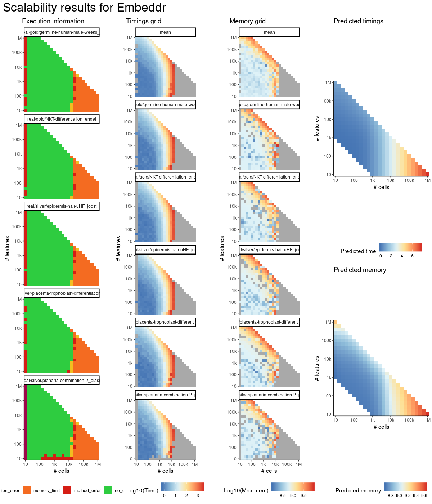
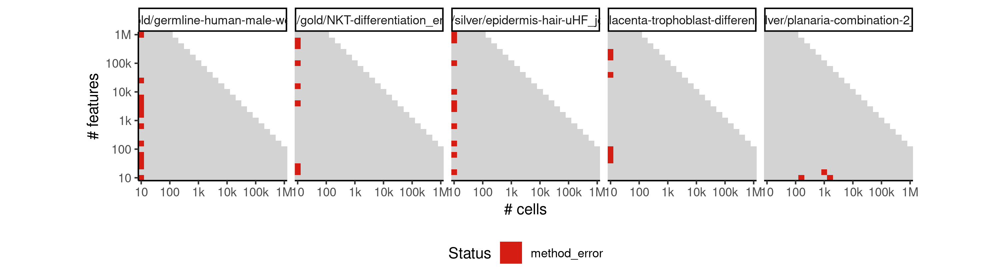
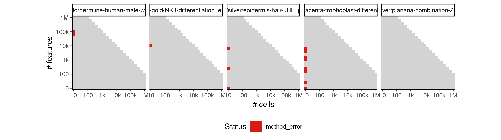
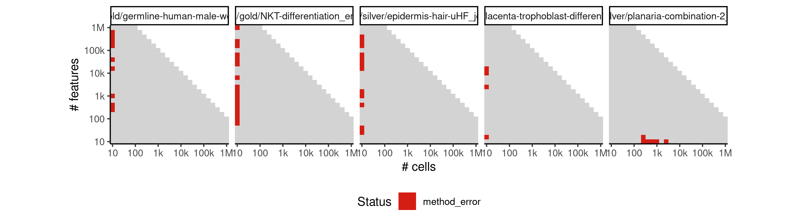
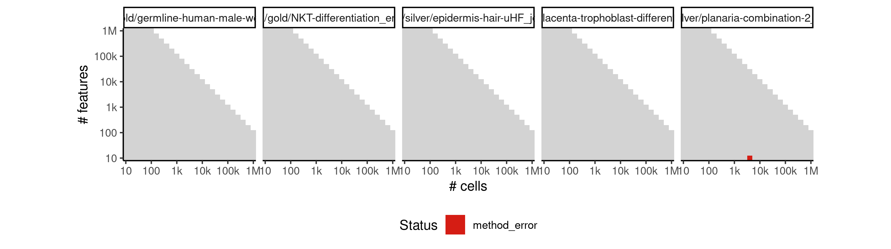
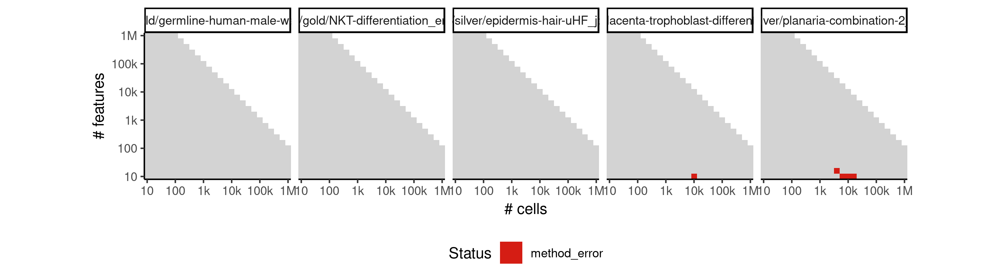
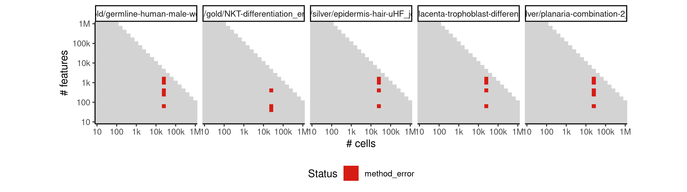
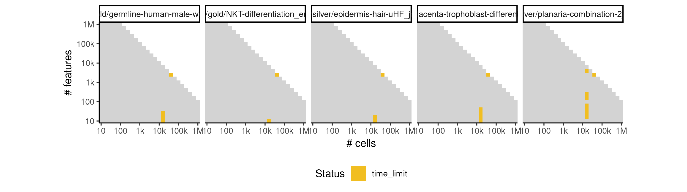
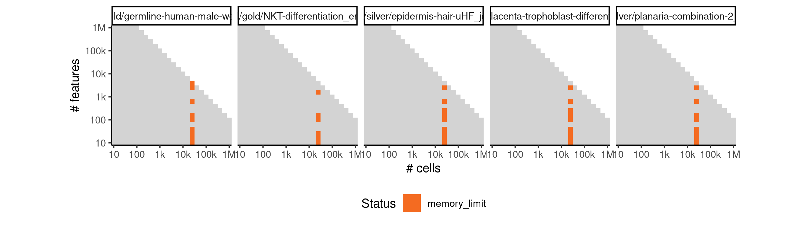
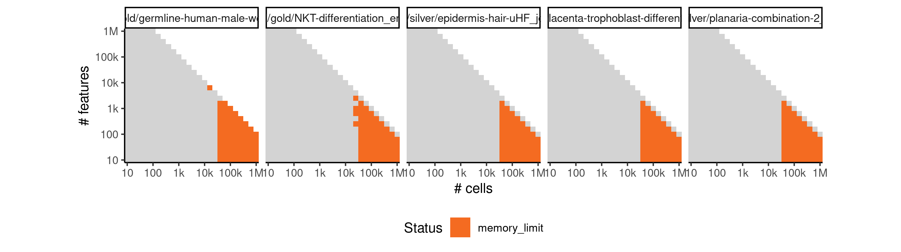

# embeddr


## ERROR STATUS METHOD_ERROR

### ERROR CLUSTER METHOD_ERROR -- 1


 * Number of instances: 38
 * Dataset ids: scaling_0001, scaling_0008, scaling_0010, scaling_0016, scaling_0019, scaling_0041, scaling_0047, scaling_0051, scaling_0061, scaling_0066, scaling_0094, scaling_0106, scaling_0120, scaling_0140, scaling_0226, scaling_0238, scaling_0341, scaling_0389, scaling_0390, scaling_0391, scaling_0417, scaling_0456, scaling_0466, scaling_0476, scaling_0556, scaling_0633, scaling_0698, scaling_0766, scaling_0889, scaling_1070, scaling_1089, scaling_1214, scaling_1339, scaling_1453, scaling_1550, scaling_1569, scaling_1626, scaling_1670

Last 10 lines of scaling_0001:
```
    intersect, setdiff, setequal, union
Attaching package: ‘purrr’
The following object is masked from ‘package:jsonlite’:
    flatten
Loading required namespace: scaterlegacy
Loading required namespace: embeddr
Error in stats::smooth.spline(lambda, xj, ..., df = df, keep.data = FALSE) : 
  smoothing parameter value too small
Calls: <Anonymous> ... principal_curve -> smoother_function -> <Anonymous>
Execution halted
```

### ERROR CLUSTER METHOD_ERROR -- 2


 * Number of instances: 14
 * Dataset ids: scaling_0003, scaling_0004, scaling_0025, scaling_0127, scaling_0163, scaling_0169, scaling_0309, scaling_0371, scaling_0486, scaling_0574, scaling_0583, scaling_0617, scaling_0981, scaling_1051

Last 10 lines of scaling_0003:
```
Loading required namespace: embeddr
Error in stats::smooth.spline(lambda, xj, ..., df = df, keep.data = FALSE) : 
  'tol' must be strictly positive and finite
Calls: <Anonymous> ... principal_curve -> smoother_function -> <Anonymous>
In addition: Warning messages:
1: In stats::smooth.spline(lambda, xj, ..., df = df, keep.data = FALSE) :
  not using invalid df; must have 1 < df <= n := #{unique x} = 4
2: In stats::smooth.spline(lambda, xj, ..., df = df, keep.data = FALSE) :
  not using invalid df; must have 1 < df <= n := #{unique x} = 4
Execution halted
```

### ERROR CLUSTER METHOD_ERROR -- 3


 * Number of instances: 47
 * Dataset ids: scaling_0012, scaling_0022, scaling_0045, scaling_0056, scaling_0082, scaling_0113, scaling_0151, scaling_0157, scaling_0180, scaling_0181, scaling_0188, scaling_0195, scaling_0215, scaling_0225, scaling_0232, scaling_0255, scaling_0276, scaling_0287, scaling_0298, scaling_0330, scaling_0351, scaling_0361, scaling_0404, scaling_0430, scaling_0455, scaling_0565, scaling_0649, scaling_0681, scaling_0715, scaling_0732, scaling_0784, scaling_0802, scaling_0856, scaling_0867, scaling_0878, scaling_0995, scaling_1009, scaling_1166, scaling_1182, scaling_1198, scaling_1276, scaling_1297, scaling_1318, scaling_1441, scaling_1465, scaling_1531, scaling_1648

Last 10 lines of scaling_0012:
```
    intersect, setdiff, setequal, union
Attaching package: ‘purrr’
The following object is masked from ‘package:jsonlite’:
    flatten
Loading required namespace: scaterlegacy
Loading required namespace: embeddr
Error in stats::smooth.spline(lambda, xj, ..., df = df, keep.data = FALSE) : 
  'tol' must be strictly positive and finite
Calls: <Anonymous> ... principal_curve -> smoother_function -> <Anonymous>
Execution halted
```

### ERROR CLUSTER METHOD_ERROR -- 4


 * Number of instances: 1
 * Dataset ids: scaling_0505

Last 10 lines of scaling_0505:
```
Input saved to /data/tmp//RtmpjTGyxa/file1dce5268a832d/ti/input: 
	data.rds
	params.json
Running /bin/singularity run --pwd /ti/workspace -B \
  '/data/tmp//RtmpjTGyxa/file1dce5268a832d/ti:/ti,/data/tmp//RtmpjTGyxa/file1dce5609ff3a0/tmp:/tmp2' \
  /group/irc/shared/dynverse/dynbenchmark/derived/singularity_images/dynverse/ti_embeddr.simg
ERROR  : Home directory is not owned by calling user: /home/robrechtc
ABORT  : Retval = 255

```

### ERROR CLUSTER METHOD_ERROR -- 5


 * Number of instances: 5
 * Dataset ids: scaling_0555, scaling_0600, scaling_0664, scaling_0680, scaling_0765

Last 10 lines of scaling_0555:
```
    flatten
Loading required namespace: scaterlegacy
Loading required namespace: embeddr
Warning message:
In laplacian_eigenmap(W, measure_type = measure_type, p = p) :
  More than one non-zero eigenvalue - disjoint clusters.
Error in stats::smooth.spline(lambda, xj, ..., df = df, keep.data = FALSE) : 
  smoothing parameter value too small
Calls: <Anonymous> ... principal_curve -> smoother_function -> <Anonymous>
Execution halted
```

### ERROR CLUSTER METHOD_ERROR -- 6


 * Number of instances: 21
 * Dataset ids: scaling_1086, scaling_1179, scaling_1195, scaling_1211, scaling_1227, scaling_1243, scaling_1544, scaling_1620, scaling_1641, scaling_1663, scaling_1685, scaling_1707, scaling_1729, scaling_1905, scaling_1949, scaling_1971, scaling_1993, scaling_2050, scaling_2080, scaling_2095, scaling_2110

Last 10 lines of scaling_1086:
```
    intersect, setdiff, setequal, union
Attaching package: ‘purrr’
The following object is masked from ‘package:jsonlite’:
    flatten
Loading required namespace: scaterlegacy
Loading required namespace: embeddr
Error in order(r, decreasing = TRUE) : 
  Failed to realloc working memory 25118*8bytes (xsub in dradix), radix=7
Calls: <Anonymous> -> weighted_graph -> apply -> FUN -> order
Execution halted
```

## ERROR STATUS TIME_LIMIT

### ERROR CLUSTER TIME_LIMIT -- 1


 * Number of instances: 18
 * Dataset ids: scaling_0697, scaling_0714, scaling_0731, scaling_0748, scaling_0782, scaling_0818, scaling_0836, scaling_0854, scaling_0865, scaling_0898, scaling_0909, scaling_1034, scaling_1048, scaling_1142, scaling_1375, scaling_1496, scaling_2219, scaling_2239

Last 10 lines of scaling_0697:
```
File: /home/rcannood/Workspace/dynverse/dynbenchmark//derived/05-scaling/suite/embeddr/Cat2/r2gridengine/20181008_214533_embeddr_Cat2_LGkeTDqpI2/log/log.17.e.txt
```

## ERROR STATUS MEMORY_LIMIT

### ERROR CLUSTER MEMORY_LIMIT -- 1


 * Number of instances: 41
 * Dataset ids: scaling_0783, scaling_0801, scaling_0819, scaling_0837, scaling_0855, scaling_0918, scaling_0926, scaling_0934, scaling_0942, scaling_0950, scaling_0993, scaling_1007, scaling_1021, scaling_1035, scaling_1049, scaling_1067, scaling_1105, scaling_1124, scaling_1143, scaling_1292, scaling_1313, scaling_1334, scaling_1355, scaling_1376, scaling_1449, scaling_1461, scaling_1473, scaling_1485, scaling_1497, scaling_1582, scaling_1601, scaling_1776, scaling_1806, scaling_1821, scaling_1836, scaling_2065, scaling_2156, scaling_2188, scaling_2204, scaling_2220, scaling_2238

Last 10 lines of scaling_0783:
```
    intersect, setdiff, setequal, union
Attaching package: ‘purrr’
The following object is masked from ‘package:jsonlite’:
    flatten
Loading required namespace: scaterlegacy
Loading required namespace: embeddr
Error in order(r, decreasing = TRUE) : 
  Failed to allocate working memory for xtmp. Requested 25118 * 8 bytes
Calls: <Anonymous> -> weighted_graph -> apply -> FUN -> order
Execution halted
```

### ERROR CLUSTER MEMORY_LIMIT -- 2


 * Number of instances: 352
 * Dataset ids: scaling_0866, scaling_0877, scaling_0888, scaling_0899, scaling_0910, scaling_0956, scaling_0962, scaling_0968, scaling_0974, scaling_0980, scaling_0994, scaling_1008, scaling_1022, scaling_1036, scaling_1050, scaling_1068, scaling_1069, scaling_1087, scaling_1088, scaling_1106, scaling_1107, scaling_1125, scaling_1126, scaling_1144, scaling_1145, scaling_1147, scaling_1149, scaling_1151, scaling_1153, scaling_1155, scaling_1157, scaling_1159, scaling_1161, scaling_1163, scaling_1165, scaling_1180, scaling_1181, scaling_1196, scaling_1197, scaling_1212, scaling_1213, scaling_1228, scaling_1229, scaling_1244, scaling_1245, scaling_1249, scaling_1253, scaling_1257, scaling_1261, scaling_1265, scaling_1267, scaling_1269, scaling_1271, scaling_1273, scaling_1275, scaling_1293, scaling_1294, scaling_1295, scaling_1296, scaling_1314, scaling_1315, scaling_1316, scaling_1317, scaling_1335, scaling_1336, scaling_1337, scaling_1338, scaling_1356, scaling_1357, scaling_1358, scaling_1359, scaling_1377, scaling_1378, scaling_1379, scaling_1380, scaling_1390, scaling_1391, scaling_1392, scaling_1402, scaling_1403, scaling_1404, scaling_1414, scaling_1415, scaling_1416, scaling_1426, scaling_1427, scaling_1428, scaling_1438, scaling_1439, scaling_1440, scaling_1450, scaling_1451, scaling_1452, scaling_1462, scaling_1463, scaling_1464, scaling_1474, scaling_1475, scaling_1476, scaling_1486, scaling_1487, scaling_1488, scaling_1498, scaling_1499, scaling_1500, scaling_1505, scaling_1506, scaling_1511, scaling_1512, scaling_1517, scaling_1518, scaling_1523, scaling_1524, scaling_1529, scaling_1530, scaling_1545, scaling_1546, scaling_1547, scaling_1548, scaling_1549, scaling_1563, scaling_1564, scaling_1565, scaling_1566, scaling_1567, scaling_1568, scaling_1583, scaling_1584, scaling_1585, scaling_1586, scaling_1587, scaling_1602, scaling_1603, scaling_1604, scaling_1605, scaling_1606, scaling_1621, scaling_1622, scaling_1623, scaling_1624, scaling_1625, scaling_1642, scaling_1643, scaling_1644, scaling_1645, scaling_1646, scaling_1647, scaling_1664, scaling_1665, scaling_1666, scaling_1667, scaling_1668, scaling_1669, scaling_1686, scaling_1687, scaling_1688, scaling_1689, scaling_1690, scaling_1691, scaling_1708, scaling_1709, scaling_1710, scaling_1711, scaling_1712, scaling_1713, scaling_1730, scaling_1731, scaling_1732, scaling_1733, scaling_1734, scaling_1735, scaling_1738, scaling_1739, scaling_1742, scaling_1743, scaling_1746, scaling_1747, scaling_1750, scaling_1751, scaling_1754, scaling_1755, scaling_1757, scaling_1759, scaling_1761, scaling_1763, scaling_1765, scaling_1777, scaling_1778, scaling_1779, scaling_1780, scaling_1791, scaling_1792, scaling_1793, scaling_1794, scaling_1795, scaling_1807, scaling_1808, scaling_1809, scaling_1810, scaling_1822, scaling_1823, scaling_1824, scaling_1825, scaling_1837, scaling_1838, scaling_1839, scaling_1840, scaling_1846, scaling_1847, scaling_1848, scaling_1854, scaling_1855, scaling_1856, scaling_1862, scaling_1863, scaling_1864, scaling_1870, scaling_1871, scaling_1872, scaling_1878, scaling_1879, scaling_1880, scaling_1882, scaling_1884, scaling_1886, scaling_1888, scaling_1890, scaling_1906, scaling_1907, scaling_1908, scaling_1909, scaling_1910, scaling_1911, scaling_1912, scaling_1927, scaling_1928, scaling_1929, scaling_1930, scaling_1931, scaling_1932, scaling_1933, scaling_1934, scaling_1950, scaling_1951, scaling_1952, scaling_1953, scaling_1954, scaling_1955, scaling_1956, scaling_1972, scaling_1973, scaling_1974, scaling_1975, scaling_1976, scaling_1977, scaling_1978, scaling_1994, scaling_1995, scaling_1996, scaling_1997, scaling_1998, scaling_1999, scaling_2000, scaling_2006, scaling_2007, scaling_2008, scaling_2014, scaling_2015, scaling_2016, scaling_2022, scaling_2023, scaling_2024, scaling_2030, scaling_2031, scaling_2032, scaling_2038, scaling_2039, scaling_2040, scaling_2051, scaling_2052, scaling_2053, scaling_2054, scaling_2055, scaling_2066, scaling_2067, scaling_2068, scaling_2069, scaling_2070, scaling_2081, scaling_2082, scaling_2083, scaling_2084, scaling_2085, scaling_2096, scaling_2097, scaling_2098, scaling_2099, scaling_2100, scaling_2111, scaling_2112, scaling_2113, scaling_2114, scaling_2115, scaling_2119, scaling_2120, scaling_2121, scaling_2125, scaling_2126, scaling_2127, scaling_2131, scaling_2132, scaling_2133, scaling_2137, scaling_2138, scaling_2139, scaling_2143, scaling_2144, scaling_2145, scaling_2157, scaling_2158, scaling_2159, scaling_2160, scaling_2161, scaling_2172, scaling_2173, scaling_2174, scaling_2175, scaling_2176, scaling_2177, scaling_2189, scaling_2190, scaling_2191, scaling_2192, scaling_2193, scaling_2205, scaling_2206, scaling_2207, scaling_2208, scaling_2209, scaling_2221, scaling_2222, scaling_2223, scaling_2224, scaling_2225, scaling_2237, scaling_2240, scaling_2241, scaling_2242, scaling_2243, scaling_2244, scaling_2245, scaling_2246

Last 10 lines of scaling_0866:
```
    filter, lag
The following objects are masked from ‘package:base’:
    intersect, setdiff, setequal, union
Attaching package: ‘purrr’
The following object is masked from ‘package:jsonlite’:
    flatten
Loading required namespace: scaterlegacy
Loading required namespace: embeddr
Error: cannot allocate vector of size 11.8 Gb
Execution halted
```


