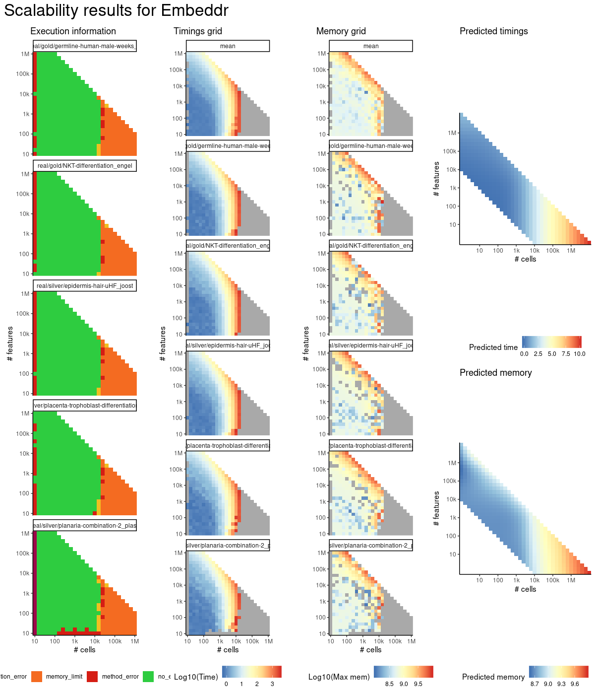
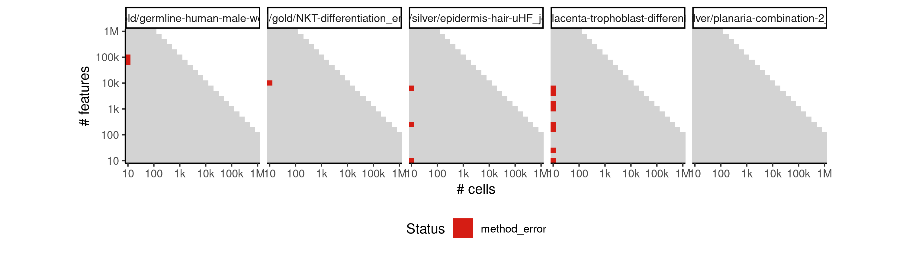
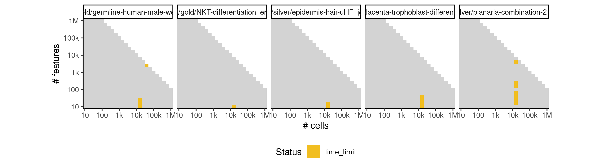

# embeddr


## ERROR STATUS METHOD_ERROR

### ERROR CLUSTER METHOD_ERROR -- 1


 * Number of instances: 29
 * Dataset ids: scaling_0001, scaling_0008, scaling_0010, scaling_0016, scaling_0019, scaling_0041, scaling_0047, scaling_0051, scaling_0061, scaling_0066, scaling_0094, scaling_0106, scaling_0120, scaling_0140, scaling_0226, scaling_0238, scaling_0341, scaling_0389, scaling_0390, scaling_0391, scaling_0417, scaling_0456, scaling_0466, scaling_0476, scaling_0556, scaling_0633, scaling_0698, scaling_0766, scaling_0889

Last 10 lines of scaling_0001:
```
    intersect, setdiff, setequal, union
Attaching package: ‘purrr’
The following object is masked from ‘package:jsonlite’:
    flatten
Loading required namespace: scaterlegacy
Loading required namespace: embeddr
Error in stats::smooth.spline(lambda, xj, ..., df = df, keep.data = FALSE) : 
  smoothing parameter value too small
Calls: <Anonymous> ... principal_curve -> smoother_function -> <Anonymous>
Execution halted
```

### ERROR CLUSTER METHOD_ERROR -- 2


 * Number of instances: 13
 * Dataset ids: scaling_0003, scaling_0004, scaling_0025, scaling_0127, scaling_0163, scaling_0169, scaling_0309, scaling_0371, scaling_0486, scaling_0574, scaling_0583, scaling_0617, scaling_0981

Last 10 lines of scaling_0003:
```
Loading required namespace: embeddr
Error in stats::smooth.spline(lambda, xj, ..., df = df, keep.data = FALSE) : 
  'tol' must be strictly positive and finite
Calls: <Anonymous> ... principal_curve -> smoother_function -> <Anonymous>
In addition: Warning messages:
1: In stats::smooth.spline(lambda, xj, ..., df = df, keep.data = FALSE) :
  not using invalid df; must have 1 < df <= n := #{unique x} = 4
2: In stats::smooth.spline(lambda, xj, ..., df = df, keep.data = FALSE) :
  not using invalid df; must have 1 < df <= n := #{unique x} = 4
Execution halted
```

### ERROR CLUSTER METHOD_ERROR -- 3


 * Number of instances: 37
 * Dataset ids: scaling_0012, scaling_0022, scaling_0045, scaling_0056, scaling_0082, scaling_0113, scaling_0151, scaling_0157, scaling_0180, scaling_0181, scaling_0188, scaling_0195, scaling_0215, scaling_0225, scaling_0232, scaling_0255, scaling_0276, scaling_0287, scaling_0298, scaling_0330, scaling_0351, scaling_0361, scaling_0404, scaling_0430, scaling_0455, scaling_0565, scaling_0649, scaling_0681, scaling_0715, scaling_0732, scaling_0784, scaling_0802, scaling_0856, scaling_0867, scaling_0878, scaling_0995, scaling_1009

Last 10 lines of scaling_0012:
```
    intersect, setdiff, setequal, union
Attaching package: ‘purrr’
The following object is masked from ‘package:jsonlite’:
    flatten
Loading required namespace: scaterlegacy
Loading required namespace: embeddr
Error in stats::smooth.spline(lambda, xj, ..., df = df, keep.data = FALSE) : 
  'tol' must be strictly positive and finite
Calls: <Anonymous> ... principal_curve -> smoother_function -> <Anonymous>
Execution halted
```

### ERROR CLUSTER METHOD_ERROR -- 4


 * Number of instances: 5
 * Dataset ids: scaling_0505, scaling_0555, scaling_0600, scaling_0664, scaling_0680

Last 10 lines of scaling_0505:
```
    flatten
Loading required namespace: scaterlegacy
Loading required namespace: embeddr
Warning message:
In laplacian_eigenmap(W, measure_type = measure_type, p = p) :
  More than one non-zero eigenvalue - disjoint clusters.
Error in stats::smooth.spline(lambda, xj, ..., df = df, keep.data = FALSE) : 
  smoothing parameter value too small
Calls: <Anonymous> ... principal_curve -> smoother_function -> <Anonymous>
Execution halted
```

## ERROR STATUS TIME_LIMIT

### ERROR CLUSTER TIME_LIMIT -- 1


 * Number of instances: 1
 * Dataset ids: scaling_0897

Last 10 lines of scaling_0897:
```
File: /home/rcannood/Workspace/dynverse/dynbenchmark//derived/05-scaling/suite/embeddr/10/r2gridengine/20180924_184948_embeddr_10_DUJy8ajACr/log/log.897.e.txt
```

## ERROR STATUS MEMORY_LIMIT

### ERROR CLUSTER MEMORY_LIMIT -- 1


 * Number of instances: 50
 * Dataset ids: scaling_0697, scaling_0714, scaling_0731, scaling_0748, scaling_0765, scaling_0782, scaling_0783, scaling_0800, scaling_0801, scaling_0818, scaling_0819, scaling_0836, scaling_0837, scaling_0854, scaling_0855, scaling_0865, scaling_0866, scaling_0876, scaling_0877, scaling_0887, scaling_0888, scaling_0898, scaling_0899, scaling_0909, scaling_0910, scaling_0918, scaling_0926, scaling_0934, scaling_0942, scaling_0950, scaling_0956, scaling_0962, scaling_0968, scaling_0974, scaling_0980, scaling_0992, scaling_0993, scaling_0994, scaling_1006, scaling_1007, scaling_1008, scaling_1020, scaling_1021, scaling_1022, scaling_1034, scaling_1035, scaling_1036, scaling_1048, scaling_1049, scaling_1050

Last 10 lines of scaling_0697:
```
    filter, lag
The following objects are masked from ‘package:base’:
    intersect, setdiff, setequal, union
Attaching package: ‘purrr’
The following object is masked from ‘package:jsonlite’:
    flatten
Loading required namespace: scaterlegacy
Loading required namespace: embeddr
Error: cannot allocate vector of size 1.9 Gb
Execution halted
```


