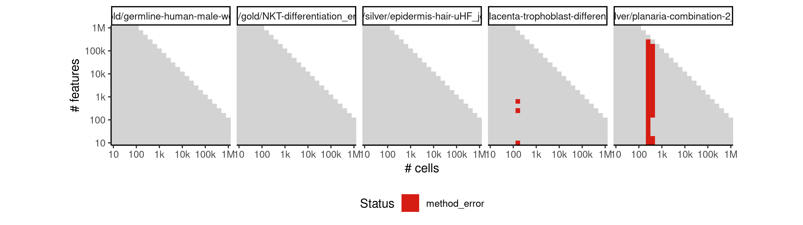
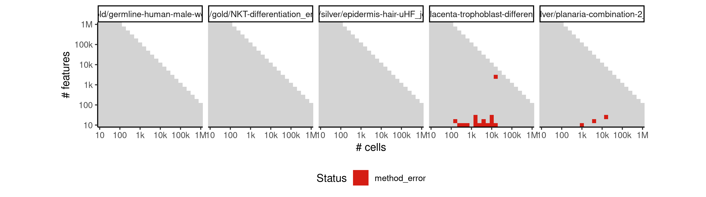
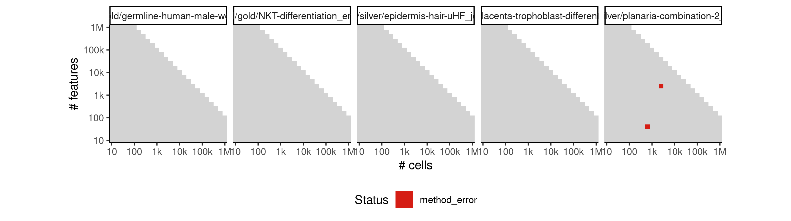
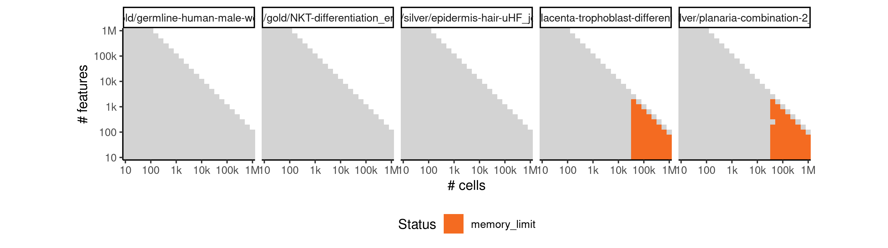
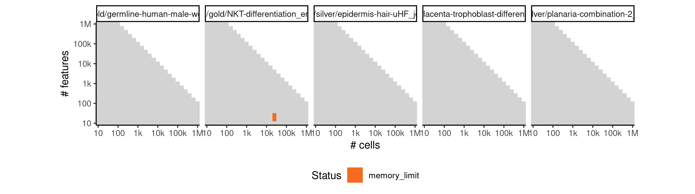

# fateid


## ERROR STATUS METHOD_ERROR

### ERROR CLUSTER METHOD_ERROR -- 1


 * Number of instances: 255
 * Dataset ids: scaling_0002, scaling_0003, scaling_0008, scaling_0009, scaling_0011, scaling_0015, scaling_0019, scaling_0020, scaling_0021, scaling_0023, scaling_0024, scaling_0029, scaling_0030, scaling_0033, scaling_0035, scaling_0039, scaling_0040, scaling_0043, scaling_0046, scaling_0050, scaling_0056, scaling_0057, scaling_0058, scaling_0061, scaling_0062, scaling_0063, scaling_0064, scaling_0065, scaling_0073, scaling_0074, scaling_0075, scaling_0082, scaling_0083, scaling_0084, scaling_0088, scaling_0089, scaling_0090, scaling_0091, scaling_0092, scaling_0093, scaling_0101, scaling_0102, scaling_0103, scaling_0105, scaling_0113, scaling_0114, scaling_0115, scaling_0120, scaling_0121, scaling_0122, scaling_0123, scaling_0124, scaling_0126, scaling_0136, scaling_0137, scaling_0138, scaling_0139, scaling_0140, scaling_0143, scaling_0145, scaling_0146, scaling_0149, scaling_0150, scaling_0157, scaling_0158, scaling_0163, scaling_0164, scaling_0166, scaling_0177, scaling_0178, scaling_0179, scaling_0188, scaling_0189, scaling_0195, scaling_0196, scaling_0197, scaling_0198, scaling_0199, scaling_0200, scaling_0210, scaling_0211, scaling_0212, scaling_0213, scaling_0214, scaling_0218, scaling_0220, scaling_0224, scaling_0232, scaling_0233, scaling_0238, scaling_0239, scaling_0240, scaling_0241, scaling_0252, scaling_0253, scaling_0260, scaling_0264, scaling_0265, scaling_0272, scaling_0273, scaling_0274, scaling_0287, scaling_0288, scaling_0289, scaling_0298, scaling_0299, scaling_0300, scaling_0301, scaling_0302, scaling_0303, scaling_0321, scaling_0322, scaling_0323, scaling_0324, scaling_0325, scaling_0326, scaling_0333, scaling_0335, scaling_0339, scaling_0351, scaling_0352, scaling_0361, scaling_0362, scaling_0363, scaling_0364, scaling_0365, scaling_0383, scaling_0385, scaling_0386, scaling_0404, scaling_0405, scaling_0406, scaling_0417, scaling_0418, scaling_0419, scaling_0420, scaling_0421, scaling_0422, scaling_0423, scaling_0445, scaling_0446, scaling_0447, scaling_0448, scaling_0449, scaling_0466, scaling_0467, scaling_0476, scaling_0477, scaling_0478, scaling_0479, scaling_0480, scaling_0497, scaling_0498, scaling_0499, scaling_0500, scaling_0510, scaling_0514, scaling_0515, scaling_0523, scaling_0532, scaling_0538, scaling_0539, scaling_0540, scaling_0550, scaling_0551, scaling_0552, scaling_0565, scaling_0566, scaling_0574, scaling_0575, scaling_0576, scaling_0577, scaling_0593, scaling_0594, scaling_0595, scaling_0617, scaling_0618, scaling_0619, scaling_0633, scaling_0634, scaling_0635, scaling_0636, scaling_0637, scaling_0638, scaling_0639, scaling_0666, scaling_0667, scaling_0668, scaling_0669, scaling_0670, scaling_0671, scaling_0698, scaling_0699, scaling_0700, scaling_0715, scaling_0716, scaling_0717, scaling_0718, scaling_0719, scaling_0720, scaling_0721, scaling_0750, scaling_0751, scaling_0752, scaling_0753, scaling_0754, scaling_0755, scaling_0784, scaling_0785, scaling_0786, scaling_0802, scaling_0803, scaling_0804, scaling_0805, scaling_0806, scaling_0807, scaling_0808, scaling_0839, scaling_0840, scaling_0841, scaling_0842, scaling_0843, scaling_0844, scaling_0867, scaling_0868, scaling_0878, scaling_0879, scaling_0880, scaling_0881, scaling_0901, scaling_0902, scaling_0903, scaling_0919, scaling_0927, scaling_0928, scaling_0929, scaling_0943, scaling_0944, scaling_0945, scaling_0957, scaling_0963, scaling_0964, scaling_0975, scaling_0976, scaling_0995, scaling_0996, scaling_1009, scaling_1010, scaling_1011, scaling_1012, scaling_1013, scaling_1038, scaling_1039, scaling_1040, scaling_1041

Last 10 lines of scaling_0002:
```
    flatten
Warning messages:
1: In rgl.init(initValue, onlyNULL) : RGL: unable to open X11 display
2: 'rgl_init' failed, running with rgl.useNULL = TRUE 
minnr: 5 
minnrh: 10 
test set size iteration 1 : 5 5 
Error in apply(u, 2, min) : dim(X) must have a positive length
Calls: fateBias -> apply
Execution halted
```

### ERROR CLUSTER METHOD_ERROR -- 2


 * Number of instances: 19
 * Dataset ids: scaling_0010, scaling_0022, scaling_0036, scaling_0045, scaling_0072, scaling_0104, scaling_0125, scaling_0135, scaling_0165, scaling_0167, scaling_0176, scaling_0251, scaling_0266, scaling_0304, scaling_0366, scaling_0382, scaling_0384, scaling_0444, scaling_0522

Last 10 lines of scaling_0010:
```
1: In rgl.init(initValue, onlyNULL) : RGL: unable to open X11 display
2: 'rgl_init' failed, running with rgl.useNULL = TRUE 
minnr: 5 
minnrh: 10 
test set size iteration 1 : 5 5 5 5 5 
Error in apply(u, 2, min) : dim(X) must have a positive length
Calls: fateBias -> apply
In addition: Warning message:
In cor(x) : the standard deviation is zero
Execution halted
```

### ERROR CLUSTER METHOD_ERROR -- 3


 * Number of instances: 1
 * Dataset ids: scaling_0034

Last 10 lines of scaling_0034:
```
Error in randomForest.default(xr, as.factor(pr), xt, nbtree = nbtree,  : 
  NAs in foreign function call (arg 6)
Calls: fateBias -> randomForest -> randomForest.default
In addition: Warning messages:
1: In randomForest.default(xr, as.factor(pr), xt, nbtree = nbtree,  :
  invalid mtry: reset to within valid range
2: In max(ncat) : no non-missing arguments to max; returning -Inf
3: In randomForest.default(xr, as.factor(pr), xt, nbtree = nbtree,  :
  NAs introduced by coercion to integer range
Execution halted
```

### ERROR CLUSTER METHOD_ERROR -- 4


 * Number of instances: 33
 * Dataset ids: scaling_0044, scaling_0059, scaling_0060, scaling_0085, scaling_0086, scaling_0116, scaling_0117, scaling_0159, scaling_0160, scaling_0190, scaling_0191, scaling_0234, scaling_0261, scaling_0290, scaling_0291, scaling_0353, scaling_0354, scaling_0407, scaling_0408, scaling_0468, scaling_0469, scaling_0533, scaling_0567, scaling_0620, scaling_0621, scaling_0701, scaling_0702, scaling_0787, scaling_0788, scaling_0869, scaling_0920, scaling_0958, scaling_0997

Last 10 lines of scaling_0044:
```
test set size iteration 2 : 0.8333333 5 
randomforest iteration 2 of 6 cells
test set size iteration 3 : 2.5 5 
randomforest iteration 3 of 7 cells
test set size iteration 4 : 0.8333333 5 
randomforest iteration 4 of 6 cells
Error in Rtsne.default(X, ..., is_distance = is_distance) : 
  Perplexity is too large.
Calls: compdr ... as.data.frame -> Rtsne -> Rtsne.dist -> Rtsne -> Rtsne.default
Execution halted
```

### ERROR CLUSTER METHOD_ERROR -- 5


 * Number of instances: 17
 * Dataset ids: scaling_0162, scaling_0201, scaling_0221, scaling_0306, scaling_0308, scaling_0428, scaling_0454, scaling_0484, scaling_0485, scaling_0543, scaling_0582, scaling_0647, scaling_0648, scaling_0729, scaling_0730, scaling_0817, scaling_0886

Last 10 lines of scaling_0162:
```
address 0x55cc30281790, cause 'memory not mapped'
Traceback:
 1: Rtsne_cpp(X, dims, perplexity, theta, verbose, max_iter, is_distance,     Y_init, init, stop_lying_iter, mom_switch_iter, momentum,     final_momentum, eta, exaggeration_factor)
 2: Rtsne.default(X, ..., is_distance = is_distance)
 3: Rtsne(X, ..., is_distance = is_distance)
 4: Rtsne.dist(as.dist(di), dims = j, initial_config = cmdscale(di,     k = j), perplexity = tsne.perplexity)
 5: Rtsne(as.dist(di), dims = j, initial_config = cmdscale(di, k = j),     perplexity = tsne.perplexity)
 6: as.data.frame(Rtsne(as.dist(di), dims = j, initial_config = cmdscale(di,     k = j), perplexity = tsne.perplexity)$Y)
 7: compdr(x, z = NULL, m = params$m, k = params$k)
An irrecoverable exception occurred. R is aborting now ...
```

### ERROR CLUSTER METHOD_ERROR -- 6


 * Number of instances: 50
 * Dataset ids: scaling_0168, scaling_0180, scaling_0215, scaling_0225, scaling_0242, scaling_0243, scaling_0254, scaling_0267, scaling_0275, scaling_0305, scaling_0327, scaling_0336, scaling_0367, scaling_0368, scaling_0387, scaling_0424, scaling_0425, scaling_0481, scaling_0482, scaling_0516, scaling_0524, scaling_0541, scaling_0578, scaling_0579, scaling_0596, scaling_0597, scaling_0640, scaling_0641, scaling_0642, scaling_0672, scaling_0673, scaling_0722, scaling_0724, scaling_0756, scaling_0757, scaling_0809, scaling_0810, scaling_0811, scaling_0845, scaling_0846, scaling_0882, scaling_0883, scaling_0904, scaling_0930, scaling_0946, scaling_0965, scaling_1014, scaling_1015, scaling_1042, scaling_1043

Last 10 lines of scaling_0168:
```
test set size iteration 11 : 1 1 5 1 1 
randomforest iteration 11 of 5 cells
test set size iteration 12 : 5 5 5 5 5 
randomforest iteration 12 of 5 cells
test set size iteration 13 : 5 5 5 5 5 
randomforest iteration 13 of 1 cells
Error in stats::smooth.spline(lambda, xj, ..., df = df, keep.data = FALSE) : 
  need at least four unique 'x' values
Calls: prcurve ... principal_curve -> smoother_function -> <Anonymous>
Execution halted
```

### ERROR CLUSTER METHOD_ERROR -- 7


 * Number of instances: 2
 * Dataset ids: scaling_0307, scaling_0426

Last 10 lines of scaling_0307:
```
test set size iteration 34 : 5 5 5 5 5 
randomforest iteration 34 of 1 cells
Warning message:
In cor(x) : the standard deviation is zero
Warning message:
In cor(x) : the standard deviation is zero
Error in stats::smooth.spline(lambda, xj, ..., df = df, keep.data = FALSE) : 
  need at least four unique 'x' values
Calls: prcurve ... principal_curve -> smoother_function -> <Anonymous>
Execution halted
```

### ERROR CLUSTER METHOD_ERROR -- 8


 * Number of instances: 1
 * Dataset ids: scaling_0450

Last 10 lines of scaling_0450:
```
1: In stats::smooth.spline(lambda, xj, ..., df = df, keep.data = FALSE) :
  smoothing parameter value too large
setting df = 1  __use with care!__
2: In stats::smooth.spline(lambda, xj, ..., df = df, keep.data = FALSE) :
  smoothing parameter value too large
setting df = 1  __use with care!__
3: In stats::smooth.spline(lambda, xj, ..., df = df, keep.data = FALSE) :
  smoothing parameter value too large
setting df = 1  __use with care!__
Execution halted
```

## ERROR STATUS TIME_LIMIT

### ERROR CLUSTER TIME_LIMIT -- 1


 * Number of instances: 29
 * Dataset ids: scaling_0616, scaling_0632, scaling_0664, scaling_0680, scaling_0696, scaling_0713, scaling_0714, scaling_0731, scaling_0747, scaling_0748, scaling_0764, scaling_0765, scaling_0781, scaling_0799, scaling_0835, scaling_0836, scaling_0865, scaling_0875, scaling_0876, scaling_0897, scaling_0898, scaling_0908, scaling_0909, scaling_0955, scaling_0961, scaling_0973, scaling_0992, scaling_1006, scaling_1034

Last 10 lines of scaling_0616:
```
File: /home/rcannood/Workspace/dynverse/dynbenchmark//derived/05-scaling/suite/fateid/10/r2gridengine/20180825_051052_fateid_10_nd6jaQc058/log/log.616.e.txt
```

## ERROR STATUS MEMORY_LIMIT

### ERROR CLUSTER MEMORY_LIMIT -- 1


 * Number of instances: 1
 * Dataset ids: scaling_0119

Last 10 lines of scaling_0119:
```
21: lapply(X = X, FUN = FUN, ...)
22: parallel::mclapply(seq_len(nrow(dataset)), mc.cores = mc_cores,     function(i) {        dataseti <- dynutils::extract_row_to_list(dataset, i)        model <- method_outputs$model[[i]]        if (!is.null(model)) {            time0 <- Sys.time()            model <- model %>% dynwrap::add_cell_waypoints(num_cells_selected = length(dataseti$waypoint_cells))            time1 <- Sys.time()            time_cellwaypoints <- as.numeric(difftime(time1,                 time0, units = "sec"))            df_cellwaypoints <- data_frame(time_cellwaypoints)        }        else {            df_cellwaypoints <- NULL        }        metrics_summary <- calculate_metrics(dataseti, model,             metrics)        summary <- bind_cols(method_outputs$summary[[i]], df_cellwaypoints,             metrics_summary)        if (!output_model && !is.null(model)) {            model <- TRUE        }        lst(summary, model)    })
23: evaluate_ti_method(dataset = dataset, method = method, parameters = params,     metrics = metrics, give_priors = priors, output_model = output_models,     mc_cores = 1, verbose = verbose)
24: benchmark_run_evaluation(i = i, subdesign = subdesign, metrics = metrics,     verbose = verbose, error_mode = FALSE, output_models = output_models)
25: (function (i) {    benchmark_run_evaluation(i = i, subdesign = subdesign, metrics = metrics,         verbose = verbose, error_mode = FALSE, output_models = output_models)})(119L)
26: do.call(PitSoL_params$FUN, c(list(PitSoL_params$X[[PitSoL_data]]),     PitSoL_params$DOTPARAMS))
27: FUN(X[[i]], ...)
28: lapply(seq(PitSoL_params$QSUB_START[[PitSoL_index]], PitSoL_params$QSUB_STOP[[PitSoL_index]]),     function(PitSoL_data) {        do.call(PitSoL_params$FUN, c(list(PitSoL_params$X[[PitSoL_data]]),             PitSoL_params$DOTPARAMS))    })
An irrecoverable exception occurred. R is aborting now ...
/var/spool/sge/prismcls02/job_scripts/8661: line 11:  5039 Segmentation fault      (core dumped) Rscript --default-packages=methods,stats,utils,graphics,grDevices script.R $SGE_TASK_ID
```

### ERROR CLUSTER MEMORY_LIMIT -- 2


 * Number of instances: 5
 * Dataset ids: scaling_0697, scaling_0782, scaling_0818, scaling_0887, scaling_1020

Last 10 lines of scaling_0697:
```
test set size iteration 341 : 1.428571 5 
randomforest iteration 341 of 5 cells
test set size iteration 342 : 3.75 5 
randomforest iteration 342 of 2 cells
Warning message:
In cor(x) : the standard deviation is zero
Error: cannot allocate vector of size 958.2 Mb
In addition: Warning message:
In cor(x) : the standard deviation is zero
Execution halted
```

### ERROR CLUSTER MEMORY_LIMIT -- 3


 * Number of instances: 12
 * Dataset ids: scaling_0783, scaling_0837, scaling_0866, scaling_0899, scaling_0918, scaling_0942, scaling_0956, scaling_0974, scaling_0993, scaling_0994, scaling_1035, scaling_1036

Last 10 lines of scaling_0783:
```
The following object is masked from 'package:jsonlite':
    flatten
Warning messages:
1: In rgl.init(initValue, onlyNULL) : RGL: unable to open X11 display
2: 'rgl_init' failed, running with rgl.useNULL = TRUE 
Warning message:
FateID requires at least two end cell populations, but according to the prior information there are only 1 end populations!
Forced to invent some end populations in order to at least generate a trajectory 
Error: cannot allocate vector of size 196 Kb
Execution halted
```

### ERROR CLUSTER MEMORY_LIMIT -- 4


 * Number of instances: 3
 * Dataset ids: scaling_0800, scaling_0854, scaling_1048

Last 10 lines of scaling_0800:
```
test set size iteration 549 : 5 0.8333333 
randomforest iteration 549 of 5 cells
test set size iteration 550 : 5 3.75 
randomforest iteration 550 of 5 cells
test set size iteration 551 : 3.75 5 
randomforest iteration 551 of 5 cells
test set size iteration 552 : 5 5 
randomforest iteration 552 of 2 cells
Error: cannot allocate vector of size 958.2 Mb
Execution halted
```

### ERROR CLUSTER MEMORY_LIMIT -- 5


 * Number of instances: 18
 * Dataset ids: scaling_0801, scaling_0819, scaling_0855, scaling_0877, scaling_0888, scaling_0910, scaling_0926, scaling_0934, scaling_0950, scaling_0962, scaling_0968, scaling_0980, scaling_1007, scaling_1008, scaling_1021, scaling_1022, scaling_1049, scaling_1050

Last 10 lines of scaling_0801:
```
The following objects are masked from 'package:base':
    intersect, setdiff, setequal, union
Attaching package: 'purrr'
The following object is masked from 'package:jsonlite':
    flatten
Warning messages:
1: In rgl.init(initValue, onlyNULL) : RGL: unable to open X11 display
2: 'rgl_init' failed, running with rgl.useNULL = TRUE 
Error: cannot allocate vector of size 196 Kb
Execution halted
```

## ERROR STATUS MISSING_PRIOR

### ERROR CLUSTER MISSING_PRIOR -- 1


 * Number of instances: 105
 * Dataset ids: scaling_0001, scaling_0004, scaling_0006, scaling_0012, scaling_0013, scaling_0018, scaling_0025, scaling_0026, scaling_0037, scaling_0047, scaling_0051, scaling_0052, scaling_0055, scaling_0066, scaling_0076, scaling_0077, scaling_0078, scaling_0094, scaling_0095, scaling_0107, scaling_0127, scaling_0128, scaling_0129, scaling_0141, scaling_0147, scaling_0151, scaling_0152, scaling_0153, scaling_0169, scaling_0170, scaling_0171, scaling_0181, scaling_0182, scaling_0183, scaling_0202, scaling_0203, scaling_0216, scaling_0222, scaling_0226, scaling_0244, scaling_0245, scaling_0256, scaling_0257, scaling_0269, scaling_0276, scaling_0277, scaling_0278, scaling_0309, scaling_0310, scaling_0337, scaling_0342, scaling_0344, scaling_0371, scaling_0372, scaling_0391, scaling_0393, scaling_0394, scaling_0430, scaling_0431, scaling_0456, scaling_0457, scaling_0458, scaling_0459, scaling_0486, scaling_0487, scaling_0506, scaling_0518, scaling_0526, scaling_0544, scaling_0556, scaling_0557, scaling_0558, scaling_0583, scaling_0585, scaling_0601, scaling_0602, scaling_0603, scaling_0649, scaling_0650, scaling_0651, scaling_0652, scaling_0681, scaling_0682, scaling_0683, scaling_0732, scaling_0733, scaling_0734, scaling_0766, scaling_0768, scaling_0769, scaling_0820, scaling_0821, scaling_0822, scaling_0823, scaling_0857, scaling_0889, scaling_0891, scaling_0911, scaling_0912, scaling_0935, scaling_0951, scaling_0969, scaling_0981, scaling_0982, scaling_1023

Last 10 lines of scaling_0001:
```
2: 'rgl_init' failed, running with rgl.useNULL = TRUE 
Warning message:
FateID requires at least two end cell populations, but according to the prior information there are only 1 end populations!
Forced to invent some end populations in order to at least generate a trajectory 
minnr: 5 
minnrh: 10 
test set size iteration 1 : 5 5 
Error in apply(u, 2, min) : dim(X) must have a positive length
Calls: fateBias -> apply
Execution halted
```

### ERROR CLUSTER MISSING_PRIOR -- 2


 * Number of instances: 57
 * Dataset ids: scaling_0007, scaling_0016, scaling_0027, scaling_0031, scaling_0038, scaling_0041, scaling_0067, scaling_0068, scaling_0069, scaling_0079, scaling_0096, scaling_0097, scaling_0106, scaling_0108, scaling_0109, scaling_0130, scaling_0131, scaling_0172, scaling_0204, scaling_0205, scaling_0228, scaling_0246, scaling_0268, scaling_0279, scaling_0280, scaling_0311, scaling_0312, scaling_0313, scaling_0343, scaling_0373, scaling_0374, scaling_0392, scaling_0432, scaling_0433, scaling_0434, scaling_0488, scaling_0489, scaling_0527, scaling_0545, scaling_0584, scaling_0604, scaling_0653, scaling_0685, scaling_0735, scaling_0736, scaling_0767, scaling_0770, scaling_0824, scaling_0856, scaling_0858, scaling_0890, scaling_0936, scaling_0952, scaling_0970, scaling_0983, scaling_1024, scaling_1025

Last 10 lines of scaling_0007:
```
minnr: 5 
minnrh: 10 
test set size iteration 1 : 5 5 
randomforest iteration 1 of 8 cells
test set size iteration 2 : 5 2.5 
randomforest iteration 2 of 3 cells
Error in Rtsne.default(X, ..., is_distance = is_distance) : 
  Perplexity is too large.
Calls: compdr ... as.data.frame -> Rtsne -> Rtsne.dist -> Rtsne -> Rtsne.default
Execution halted
```

### ERROR CLUSTER MISSING_PRIOR -- 3


 * Number of instances: 2
 * Dataset ids: scaling_0017, scaling_0053

Last 10 lines of scaling_0017:
```
Error in randomForest.default(xr, as.factor(pr), xt, nbtree = nbtree,  : 
  NAs in foreign function call (arg 6)
Calls: fateBias -> randomForest -> randomForest.default
In addition: Warning messages:
1: In randomForest.default(xr, as.factor(pr), xt, nbtree = nbtree,  :
  invalid mtry: reset to within valid range
2: In max(ncat) : no non-missing arguments to max; returning -Inf
3: In randomForest.default(xr, as.factor(pr), xt, nbtree = nbtree,  :
  NAs introduced by coercion to integer range
Execution halted
```

### ERROR CLUSTER MISSING_PRIOR -- 4


 * Number of instances: 8
 * Dataset ids: scaling_0032, scaling_0048, scaling_0054, scaling_0070, scaling_0080, scaling_0098, scaling_0227, scaling_0341

Last 10 lines of scaling_0032:
```
test set size iteration 3 : 5 0.8333333 
randomforest iteration 3 of 5 cells
Warning message:
In cor(x) : the standard deviation is zero
Error in Rtsne.default(X, ..., is_distance = is_distance) : 
  Perplexity is too large.
Calls: compdr ... as.data.frame -> Rtsne -> Rtsne.dist -> Rtsne -> Rtsne.default
In addition: Warning message:
In cor(x) : the standard deviation is zero
Execution halted
```

### ERROR CLUSTER MISSING_PRIOR -- 5


 * Number of instances: 8
 * Dataset ids: scaling_0042, scaling_0110, scaling_0154, scaling_0184, scaling_0331, scaling_0395, scaling_0605, scaling_0684

Last 10 lines of scaling_0042:
```
FateID requires at least two end cell populations, but according to the prior information there are only 1 end populations!
Forced to invent some end populations in order to at least generate a trajectory 
minnr: 5 
minnrh: 10 
test set size iteration 1 : 5 5 
Error in apply(u, 2, min) : dim(X) must have a positive length
Calls: fateBias -> apply
In addition: Warning message:
In cor(x) : the standard deviation is zero
Execution halted
```

### ERROR CLUSTER MISSING_PRIOR -- 6


 * Number of instances: 9
 * Dataset ids: scaling_0099, scaling_0111, scaling_0132, scaling_0148, scaling_0155, scaling_0173, scaling_0186, scaling_0217, scaling_0464

Last 10 lines of scaling_0099:
```
address 0x5596cbcb5000, cause 'memory not mapped'
Traceback:
 1: Rtsne_cpp(X, dims, perplexity, theta, verbose, max_iter, is_distance,     Y_init, init, stop_lying_iter, mom_switch_iter, momentum,     final_momentum, eta, exaggeration_factor)
 2: Rtsne.default(X, ..., is_distance = is_distance)
 3: Rtsne(X, ..., is_distance = is_distance)
 4: Rtsne.dist(as.dist(di), dims = j, initial_config = cmdscale(di,     k = j), perplexity = tsne.perplexity)
 5: Rtsne(as.dist(di), dims = j, initial_config = cmdscale(di, k = j),     perplexity = tsne.perplexity)
 6: as.data.frame(Rtsne(as.dist(di), dims = j, initial_config = cmdscale(di,     k = j), perplexity = tsne.perplexity)$Y)
 7: compdr(x, z = NULL, m = params$m, k = params$k)
An irrecoverable exception occurred. R is aborting now ...
```


