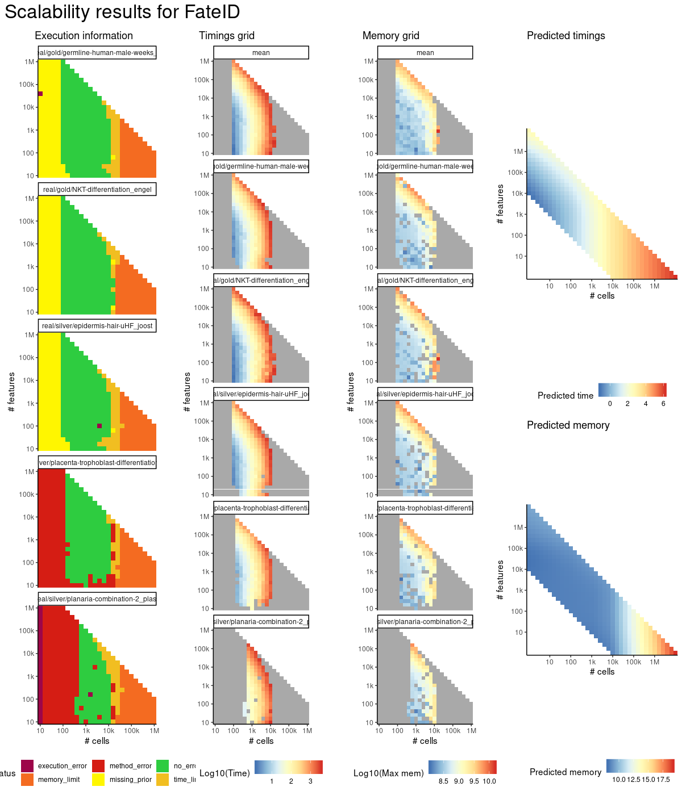
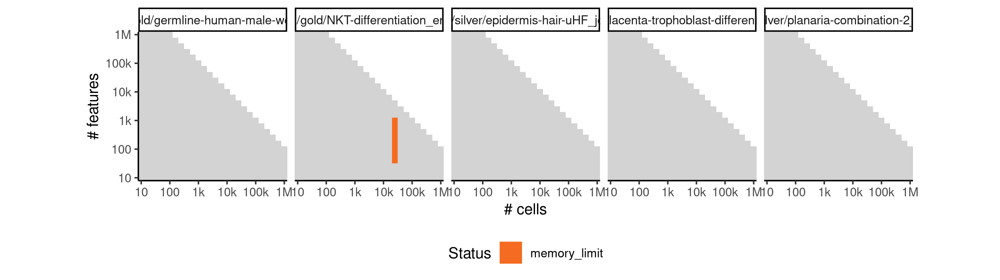
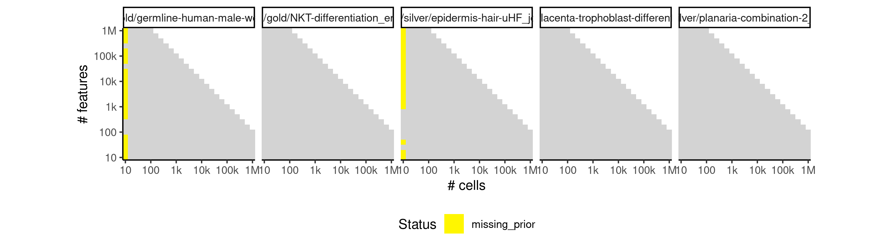
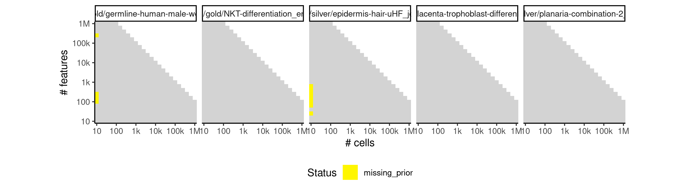

# fateid


## ERROR STATUS METHOD_ERROR

### ERROR CLUSTER METHOD_ERROR -- 1


 * Number of instances: 182
 * Dataset ids: scaling_0004, scaling_0012, scaling_0013, scaling_0015, scaling_0025, scaling_0027, scaling_0029, scaling_0030, scaling_0038, scaling_0039, scaling_0040, scaling_0048, scaling_0050, scaling_0067, scaling_0068, scaling_0069, scaling_0072, scaling_0073, scaling_0074, scaling_0095, scaling_0096, scaling_0097, scaling_0099, scaling_0101, scaling_0102, scaling_0103, scaling_0104, scaling_0105, scaling_0127, scaling_0128, scaling_0129, scaling_0132, scaling_0135, scaling_0136, scaling_0137, scaling_0138, scaling_0139, scaling_0140, scaling_0147, scaling_0149, scaling_0150, scaling_0169, scaling_0170, scaling_0171, scaling_0176, scaling_0177, scaling_0179, scaling_0202, scaling_0203, scaling_0204, scaling_0205, scaling_0206, scaling_0210, scaling_0211, scaling_0212, scaling_0213, scaling_0214, scaling_0222, scaling_0224, scaling_0244, scaling_0245, scaling_0246, scaling_0247, scaling_0252, scaling_0253, scaling_0268, scaling_0269, scaling_0272, scaling_0273, scaling_0274, scaling_0309, scaling_0310, scaling_0311, scaling_0312, scaling_0313, scaling_0314, scaling_0322, scaling_0323, scaling_0324, scaling_0325, scaling_0326, scaling_0337, scaling_0339, scaling_0371, scaling_0372, scaling_0373, scaling_0374, scaling_0375, scaling_0383, scaling_0384, scaling_0385, scaling_0386, scaling_0430, scaling_0431, scaling_0432, scaling_0433, scaling_0434, scaling_0435, scaling_0445, scaling_0446, scaling_0447, scaling_0448, scaling_0449, scaling_0487, scaling_0488, scaling_0489, scaling_0490, scaling_0497, scaling_0498, scaling_0499, scaling_0500, scaling_0518, scaling_0522, scaling_0523, scaling_0544, scaling_0545, scaling_0546, scaling_0551, scaling_0552, scaling_0583, scaling_0584, scaling_0585, scaling_0593, scaling_0594, scaling_0595, scaling_0649, scaling_0650, scaling_0651, scaling_0652, scaling_0653, scaling_0654, scaling_0667, scaling_0668, scaling_0669, scaling_0670, scaling_0671, scaling_0733, scaling_0734, scaling_0735, scaling_0736, scaling_0737, scaling_0750, scaling_0751, scaling_0752, scaling_0753, scaling_0754, scaling_0755, scaling_0820, scaling_0821, scaling_0822, scaling_0823, scaling_0824, scaling_0825, scaling_0840, scaling_0841, scaling_0842, scaling_0843, scaling_0844, scaling_0889, scaling_0890, scaling_0891, scaling_0892, scaling_0901, scaling_0902, scaling_0903, scaling_0935, scaling_0936, scaling_0943, scaling_0944, scaling_0945, scaling_0969, scaling_0970, scaling_0975, scaling_0976, scaling_1023, scaling_1024, scaling_1025, scaling_1026, scaling_1038, scaling_1039, scaling_1040, scaling_1041

Last 10 lines of scaling_0004:
```
    flatten
Warning messages:
1: In rgl.init(initValue, onlyNULL) : RGL: unable to open X11 display
2: 'rgl_init' failed, running with rgl.useNULL = TRUE 
minnr: 5 
minnrh: 10 
test set size iteration 1 : 5 5 5 
Error in apply(u, 2, min) : dim(X) must have a positive length
Calls: fateBias -> apply
Execution halted
```

### ERROR CLUSTER METHOD_ERROR -- 2


 * Number of instances: 22
 * Dataset ids: scaling_0026, scaling_0037, scaling_0047, scaling_0066, scaling_0070, scaling_0075, scaling_0094, scaling_0098, scaling_0130, scaling_0131, scaling_0148, scaling_0172, scaling_0178, scaling_0251, scaling_0321, scaling_0382, scaling_0444, scaling_0486, scaling_0550, scaling_0666, scaling_0732, scaling_0839

Last 10 lines of scaling_0026:
```
1: In rgl.init(initValue, onlyNULL) : RGL: unable to open X11 display
2: 'rgl_init' failed, running with rgl.useNULL = TRUE 
minnr: 5 
minnrh: 10 
test set size iteration 1 : 5 5 5 
Error in apply(u, 2, min) : dim(X) must have a positive length
Calls: fateBias -> apply
In addition: Warning message:
In cor(x) : the standard deviation is zero
Execution halted
```

### ERROR CLUSTER METHOD_ERROR -- 3


 * Number of instances: 26
 * Dataset ids: scaling_0133, scaling_0180, scaling_0215, scaling_0225, scaling_0254, scaling_0275, scaling_0327, scaling_0387, scaling_0436, scaling_0450, scaling_0519, scaling_0524, scaling_0586, scaling_0596, scaling_0597, scaling_0655, scaling_0672, scaling_0673, scaling_0756, scaling_0757, scaling_0845, scaling_0846, scaling_0904, scaling_0946, scaling_1042, scaling_1043

Last 10 lines of scaling_0133:
```
test set size iteration 5 : 5 3.75 1.25 
randomforest iteration 5 of 6 cells
test set size iteration 6 : 3.333333 5 1.666667 
randomforest iteration 6 of 5 cells
test set size iteration 7 : 5 1.25 1.25 
randomforest iteration 7 of 5 cells
Error in stats::smooth.spline(lambda, xj, ..., df = df, keep.data = FALSE) : 
  need at least four unique 'x' values
Calls: prcurve ... principal_curve -> smoother_function -> <Anonymous>
Execution halted
```

### ERROR CLUSTER METHOD_ERROR -- 4


 * Number of instances: 19
 * Dataset ids: scaling_0173, scaling_0174, scaling_0207, scaling_0208, scaling_0249, scaling_0380, scaling_0389, scaling_0441, scaling_0442, scaling_0494, scaling_0495, scaling_0521, scaling_0549, scaling_0591, scaling_0600, scaling_0664, scaling_0747, scaling_0835, scaling_0908

Last 10 lines of scaling_0173:
```
address 0x5576d149e750, cause 'memory not mapped'
Traceback:
 1: Rtsne_cpp(X, dims, perplexity, theta, verbose, max_iter, is_distance,     Y_init, init, stop_lying_iter, mom_switch_iter, momentum,     final_momentum, eta, exaggeration_factor)
 2: Rtsne.default(X, ..., is_distance = is_distance)
 3: Rtsne(X, ..., is_distance = is_distance)
 4: Rtsne.dist(as.dist(di), dims = j, initial_config = cmdscale(di,     k = j), perplexity = tsne.perplexity)
 5: Rtsne(as.dist(di), dims = j, initial_config = cmdscale(di, k = j),     perplexity = tsne.perplexity)
 6: as.data.frame(Rtsne(as.dist(di), dims = j, initial_config = cmdscale(di,     k = j), perplexity = tsne.perplexity)$Y)
 7: compdr(x, z = NULL, m = params$m, k = params$k)
An irrecoverable exception occurred. R is aborting now ...
```

## ERROR STATUS MEMORY_LIMIT

### ERROR CLUSTER MEMORY_LIMIT -- 1


 * Number of instances: 6
 * Dataset ids: scaling_0714, scaling_0748, scaling_0836, scaling_0854, scaling_0898, scaling_0909

Last 10 lines of scaling_0714:
```
test set size iteration 10 : 5 1.666667 
randomforest iteration 10 of 6 cells
test set size iteration 11 : 5 2 
randomforest iteration 11 of 1 cells
Warning message:
In cor(x) : the standard deviation is zero
Error: cannot allocate vector of size 958.2 Mb
In addition: Warning message:
In cor(x) : the standard deviation is zero
Execution halted
```

### ERROR CLUSTER MEMORY_LIMIT -- 2


 * Number of instances: 18
 * Dataset ids: scaling_0783, scaling_0801, scaling_0819, scaling_0866, scaling_0877, scaling_0888, scaling_0918, scaling_0926, scaling_0934, scaling_0956, scaling_0962, scaling_0968, scaling_0993, scaling_0994, scaling_1007, scaling_1008, scaling_1021, scaling_1022

Last 10 lines of scaling_0783:
```
The following object is masked from ‘package:jsonlite’:
    flatten
Warning messages:
1: In rgl.init(initValue, onlyNULL) : RGL: unable to open X11 display
2: 'rgl_init' failed, running with rgl.useNULL = TRUE 
Warning message:
FateID requires at least two end cell populations, but according to the prior information there are only 1 end populations!
Forced to invent some end populations in order to at least generate a trajectory 
Error: cannot allocate vector of size 196 Kb
Execution halted
```

### ERROR CLUSTER MEMORY_LIMIT -- 3


 * Number of instances: 3
 * Dataset ids: scaling_0800, scaling_0876, scaling_1048

Last 10 lines of scaling_0800:
```
test set size iteration 7 : 5 1.666667 
randomforest iteration 7 of 7 cells
test set size iteration 8 : 5 3 
randomforest iteration 8 of 5 cells
test set size iteration 9 : 5 5 
randomforest iteration 9 of 8 cells
test set size iteration 10 : 5 1.25 
randomforest iteration 10 of 4 cells
Error: cannot allocate vector of size 958.2 Mb
Execution halted
```

### ERROR CLUSTER MEMORY_LIMIT -- 4


 * Number of instances: 12
 * Dataset ids: scaling_0837, scaling_0855, scaling_0899, scaling_0910, scaling_0942, scaling_0950, scaling_0974, scaling_0980, scaling_1035, scaling_1036, scaling_1049, scaling_1050

Last 10 lines of scaling_0837:
```
The following objects are masked from ‘package:base’:
    intersect, setdiff, setequal, union
Attaching package: ‘purrr’
The following object is masked from ‘package:jsonlite’:
    flatten
Warning messages:
1: In rgl.init(initValue, onlyNULL) : RGL: unable to open X11 display
2: 'rgl_init' failed, running with rgl.useNULL = TRUE 
Error: cannot allocate vector of size 196 Kb
Execution halted
```

### ERROR CLUSTER MEMORY_LIMIT -- 5


 * Number of instances: 1
 * Dataset ids: scaling_1006

Last 10 lines of scaling_1006:
```
2: 'rgl_init' failed, running with rgl.useNULL = TRUE 
Warning message:
FateID requires at least two end cell populations, but according to the prior information there are only 1 end populations!
Forced to invent some end populations in order to at least generate a trajectory 
minnr: 5 
minnrh: 10 
test set size iteration 1 : 5 5 
randomforest iteration 1 of 5 cells
Error: cannot allocate vector of size 958.2 Mb
Execution halted
```

## ERROR STATUS TIME_LIMIT

### ERROR CLUSTER TIME_LIMIT -- 1


 * Number of instances: 19
 * Dataset ids: scaling_0429, scaling_0531, scaling_0582, scaling_0616, scaling_0695, scaling_0696, scaling_0697, scaling_0730, scaling_0731, scaling_0765, scaling_0781, scaling_0782, scaling_0817, scaling_0818, scaling_0865, scaling_0887, scaling_0992, scaling_1020, scaling_1034

Last 10 lines of scaling_0429:
```
File: /home/rcannood/Workspace/dynverse/dynbenchmark//derived/05-scaling/suite/fateid/10/r2gridengine/20180924_185009_fateid_10_qJrI5OSa0G/log/log.429.e.txt
```

## ERROR STATUS MISSING_PRIOR

### ERROR CLUSTER MISSING_PRIOR -- 1


 * Number of instances: 28
 * Dataset ids: scaling_0001, scaling_0003, scaling_0006, scaling_0010, scaling_0045, scaling_0051, scaling_0061, scaling_0181, scaling_0276, scaling_0298, scaling_0341, scaling_0361, scaling_0391, scaling_0417, scaling_0456, scaling_0476, scaling_0556, scaling_0574, scaling_0601, scaling_0633, scaling_0681, scaling_0715, scaling_0766, scaling_0802, scaling_0856, scaling_0878, scaling_0981, scaling_1009

Last 10 lines of scaling_0001:
```
2: 'rgl_init' failed, running with rgl.useNULL = TRUE 
Warning message:
FateID requires at least two end cell populations, but according to the prior information there are only 1 end populations!
Forced to invent some end populations in order to at least generate a trajectory 
minnr: 5 
minnrh: 10 
test set size iteration 1 : 5 5 
Error in apply(u, 2, min) : dim(X) must have a positive length
Calls: fateBias -> apply
Execution halted
```

### ERROR CLUSTER MISSING_PRIOR -- 2


 * Number of instances: 213
 * Dataset ids: scaling_0002, scaling_0008, scaling_0009, scaling_0019, scaling_0020, scaling_0021, scaling_0031, scaling_0033, scaling_0034, scaling_0035, scaling_0043, scaling_0044, scaling_0052, scaling_0053, scaling_0056, scaling_0057, scaling_0058, scaling_0059, scaling_0060, scaling_0062, scaling_0063, scaling_0077, scaling_0078, scaling_0079, scaling_0080, scaling_0082, scaling_0083, scaling_0084, scaling_0085, scaling_0086, scaling_0089, scaling_0090, scaling_0091, scaling_0092, scaling_0107, scaling_0108, scaling_0113, scaling_0114, scaling_0115, scaling_0116, scaling_0117, scaling_0121, scaling_0122, scaling_0123, scaling_0141, scaling_0143, scaling_0145, scaling_0152, scaling_0153, scaling_0154, scaling_0157, scaling_0158, scaling_0159, scaling_0160, scaling_0164, scaling_0165, scaling_0166, scaling_0182, scaling_0183, scaling_0184, scaling_0188, scaling_0189, scaling_0190, scaling_0191, scaling_0196, scaling_0197, scaling_0198, scaling_0216, scaling_0218, scaling_0220, scaling_0227, scaling_0228, scaling_0232, scaling_0233, scaling_0234, scaling_0239, scaling_0240, scaling_0256, scaling_0257, scaling_0260, scaling_0261, scaling_0264, scaling_0265, scaling_0277, scaling_0278, scaling_0279, scaling_0280, scaling_0287, scaling_0288, scaling_0289, scaling_0290, scaling_0291, scaling_0299, scaling_0300, scaling_0301, scaling_0302, scaling_0331, scaling_0333, scaling_0335, scaling_0342, scaling_0343, scaling_0344, scaling_0351, scaling_0352, scaling_0353, scaling_0354, scaling_0362, scaling_0363, scaling_0364, scaling_0392, scaling_0393, scaling_0394, scaling_0395, scaling_0404, scaling_0405, scaling_0406, scaling_0407, scaling_0408, scaling_0418, scaling_0419, scaling_0420, scaling_0421, scaling_0457, scaling_0458, scaling_0459, scaling_0466, scaling_0467, scaling_0468, scaling_0469, scaling_0477, scaling_0478, scaling_0479, scaling_0506, scaling_0510, scaling_0514, scaling_0526, scaling_0527, scaling_0532, scaling_0533, scaling_0538, scaling_0539, scaling_0557, scaling_0558, scaling_0565, scaling_0566, scaling_0567, scaling_0575, scaling_0576, scaling_0602, scaling_0603, scaling_0604, scaling_0605, scaling_0617, scaling_0618, scaling_0619, scaling_0620, scaling_0621, scaling_0634, scaling_0635, scaling_0636, scaling_0637, scaling_0682, scaling_0683, scaling_0684, scaling_0685, scaling_0698, scaling_0699, scaling_0700, scaling_0701, scaling_0702, scaling_0716, scaling_0717, scaling_0718, scaling_0719, scaling_0767, scaling_0768, scaling_0769, scaling_0770, scaling_0784, scaling_0785, scaling_0786, scaling_0787, scaling_0788, scaling_0803, scaling_0804, scaling_0805, scaling_0806, scaling_0857, scaling_0858, scaling_0867, scaling_0868, scaling_0869, scaling_0879, scaling_0880, scaling_0911, scaling_0912, scaling_0919, scaling_0920, scaling_0927, scaling_0928, scaling_0951, scaling_0952, scaling_0957, scaling_0958, scaling_0963, scaling_0964, scaling_0982, scaling_0983, scaling_0995, scaling_0996, scaling_0997, scaling_1010, scaling_1011

Last 10 lines of scaling_0002:
```
FateID requires at least two end cell populations, but according to the prior information there are only 1 end populations!
Forced to invent some end populations in order to at least generate a trajectory 
minnr: 5 
minnrh: 10 
test set size iteration 1 : 5 5 
randomforest iteration 1 of 1 cells
Error in Rtsne.default(X, ..., is_distance = is_distance) : 
  Perplexity is too large.
Calls: compdr ... as.data.frame -> Rtsne -> Rtsne.dist -> Rtsne -> Rtsne.default
Execution halted
```

### ERROR CLUSTER MISSING_PRIOR -- 3


 * Number of instances: 17
 * Dataset ids: scaling_0007, scaling_0011, scaling_0017, scaling_0018, scaling_0023, scaling_0024, scaling_0032, scaling_0036, scaling_0042, scaling_0046, scaling_0054, scaling_0055, scaling_0064, scaling_0065, scaling_0109, scaling_0110, scaling_0124

Last 10 lines of scaling_0007:
```
test set size iteration 2 : 5 2.5 
randomforest iteration 2 of 1 cells
Warning message:
In cor(x) : the standard deviation is zero
Error in Rtsne.default(X, ..., is_distance = is_distance) : 
  Perplexity is too large.
Calls: compdr ... as.data.frame -> Rtsne -> Rtsne.dist -> Rtsne -> Rtsne.default
In addition: Warning message:
In cor(x) : the standard deviation is zero
Execution halted
```

### ERROR CLUSTER MISSING_PRIOR -- 4


 * Number of instances: 12
 * Dataset ids: scaling_0016, scaling_0022, scaling_0041, scaling_0076, scaling_0088, scaling_0106, scaling_0120, scaling_0151, scaling_0163, scaling_0195, scaling_0226, scaling_0238

Last 10 lines of scaling_0016:
```
Error in randomForest.default(xr, as.factor(pr), xt, nbtree = nbtree,  : 
  NAs in foreign function call (arg 6)
Calls: fateBias -> randomForest -> randomForest.default
In addition: Warning messages:
1: In randomForest.default(xr, as.factor(pr), xt, nbtree = nbtree,  :
  invalid mtry: reset to within valid range
2: In max(ncat) : no non-missing arguments to max; returning -Inf
3: In randomForest.default(xr, as.factor(pr), xt, nbtree = nbtree,  :
  NAs introduced by coercion to integer range
Execution halted
```

### ERROR CLUSTER MISSING_PRIOR -- 5


 * Number of instances: 9
 * Dataset ids: scaling_0081, scaling_0093, scaling_0111, scaling_0112, scaling_0125, scaling_0126, scaling_0142, scaling_0155, scaling_0167

Last 10 lines of scaling_0081:
```
address 0x556d4e31cb2c, cause 'memory not mapped'
Traceback:
 1: Rtsne_cpp(X, dims, perplexity, theta, verbose, max_iter, is_distance,     Y_init, init, stop_lying_iter, mom_switch_iter, momentum,     final_momentum, eta, exaggeration_factor)
 2: Rtsne.default(X, ..., is_distance = is_distance)
 3: Rtsne(X, ..., is_distance = is_distance)
 4: Rtsne.dist(as.dist(di), dims = j, initial_config = cmdscale(di,     k = j), perplexity = tsne.perplexity)
 5: Rtsne(as.dist(di), dims = j, initial_config = cmdscale(di, k = j),     perplexity = tsne.perplexity)
 6: as.data.frame(Rtsne(as.dist(di), dims = j, initial_config = cmdscale(di,     k = j), perplexity = tsne.perplexity)$Y)
 7: compdr(x, z = NULL, m = params$m, k = params$k)
An irrecoverable exception occurred. R is aborting now ...
```


