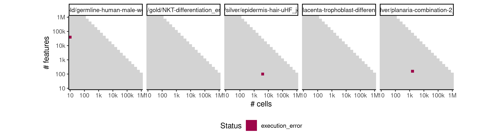
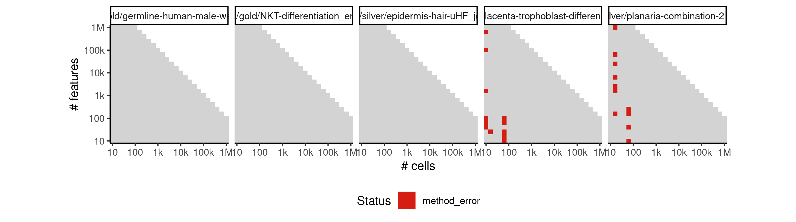
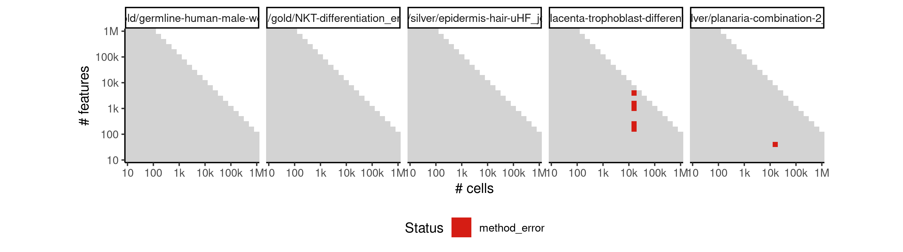
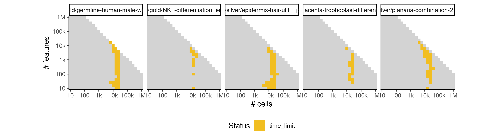
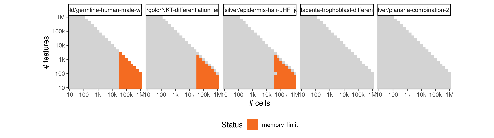
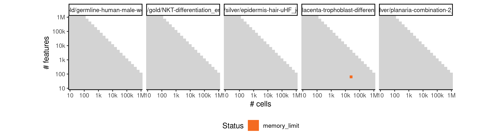

# fateid


## ERROR STATUS EXECUTION_ERROR

### ERROR CLUSTER EXECUTION_ERROR -- 1


 * Number of instances: 3
 * Dataset ids: scaling_0849, scaling_0856, scaling_0885

Last 10 lines of scaling_0849:
```
File: /home/rcannood/Workspace/dynverse/dynbenchmark//derived/05-scaling/suite/fateid/Cat2/r2gridengine/20181008_214922_fateid_Cat2_UYe0XuXZWD/log/log.169.e.txt
Execution halted
```

## ERROR STATUS METHOD_ERROR

### ERROR CLUSTER METHOD_ERROR -- 1


 * Number of instances: 288
 * Dataset ids: scaling_0004, scaling_0012, scaling_0013, scaling_0015, scaling_0025, scaling_0026, scaling_0027, scaling_0029, scaling_0030, scaling_0038, scaling_0039, scaling_0040, scaling_0048, scaling_0050, scaling_0067, scaling_0068, scaling_0069, scaling_0072, scaling_0073, scaling_0074, scaling_0095, scaling_0096, scaling_0097, scaling_0099, scaling_0101, scaling_0102, scaling_0103, scaling_0104, scaling_0105, scaling_0127, scaling_0128, scaling_0129, scaling_0130, scaling_0132, scaling_0135, scaling_0136, scaling_0137, scaling_0138, scaling_0139, scaling_0140, scaling_0147, scaling_0148, scaling_0149, scaling_0150, scaling_0169, scaling_0170, scaling_0171, scaling_0172, scaling_0177, scaling_0179, scaling_0202, scaling_0203, scaling_0204, scaling_0206, scaling_0210, scaling_0211, scaling_0212, scaling_0213, scaling_0214, scaling_0222, scaling_0224, scaling_0244, scaling_0245, scaling_0247, scaling_0251, scaling_0252, scaling_0253, scaling_0268, scaling_0269, scaling_0272, scaling_0273, scaling_0274, scaling_0309, scaling_0310, scaling_0311, scaling_0312, scaling_0313, scaling_0314, scaling_0321, scaling_0322, scaling_0323, scaling_0325, scaling_0326, scaling_0337, scaling_0339, scaling_0372, scaling_0373, scaling_0374, scaling_0375, scaling_0382, scaling_0383, scaling_0385, scaling_0386, scaling_0430, scaling_0431, scaling_0432, scaling_0433, scaling_0434, scaling_0435, scaling_0445, scaling_0446, scaling_0447, scaling_0448, scaling_0449, scaling_0486, scaling_0487, scaling_0488, scaling_0489, scaling_0490, scaling_0497, scaling_0498, scaling_0499, scaling_0500, scaling_0518, scaling_0523, scaling_0544, scaling_0545, scaling_0546, scaling_0550, scaling_0551, scaling_0552, scaling_0583, scaling_0584, scaling_0585, scaling_0593, scaling_0594, scaling_0595, scaling_0649, scaling_0650, scaling_0651, scaling_0652, scaling_0653, scaling_0654, scaling_0667, scaling_0668, scaling_0669, scaling_0670, scaling_0671, scaling_0732, scaling_0733, scaling_0734, scaling_0735, scaling_0736, scaling_0737, scaling_0750, scaling_0751, scaling_0752, scaling_0753, scaling_0754, scaling_0755, scaling_0820, scaling_0821, scaling_0822, scaling_0823, scaling_0824, scaling_0825, scaling_0839, scaling_0840, scaling_0841, scaling_0842, scaling_0843, scaling_0844, scaling_0889, scaling_0890, scaling_0891, scaling_0892, scaling_0901, scaling_0902, scaling_0903, scaling_0935, scaling_0936, scaling_0944, scaling_0945, scaling_0969, scaling_0970, scaling_0975, scaling_0976, scaling_1023, scaling_1024, scaling_1025, scaling_1026, scaling_1038, scaling_1039, scaling_1040, scaling_1041, scaling_1109, scaling_1110, scaling_1111, scaling_1112, scaling_1128, scaling_1129, scaling_1130, scaling_1131, scaling_1132, scaling_1152, scaling_1162, scaling_1164, scaling_1214, scaling_1215, scaling_1216, scaling_1217, scaling_1231, scaling_1232, scaling_1233, scaling_1234, scaling_1258, scaling_1262, scaling_1272, scaling_1274, scaling_1339, scaling_1340, scaling_1341, scaling_1342, scaling_1343, scaling_1361, scaling_1362, scaling_1363, scaling_1364, scaling_1365, scaling_1417, scaling_1418, scaling_1419, scaling_1429, scaling_1430, scaling_1431, scaling_1477, scaling_1478, scaling_1479, scaling_1490, scaling_1491, scaling_1492, scaling_1519, scaling_1525, scaling_1526, scaling_1589, scaling_1590, scaling_1591, scaling_1592, scaling_1608, scaling_1609, scaling_1610, scaling_1611, scaling_1692, scaling_1693, scaling_1694, scaling_1695, scaling_1696, scaling_1715, scaling_1716, scaling_1717, scaling_1718, scaling_1748, scaling_1752, scaling_1753, scaling_1811, scaling_1812, scaling_1813, scaling_1827, scaling_1828, scaling_1829, scaling_1865, scaling_1866, scaling_1873, scaling_1874, scaling_1957, scaling_1958, scaling_1959, scaling_1960, scaling_1979, scaling_1980, scaling_1981, scaling_1982, scaling_1983, scaling_2025, scaling_2033, scaling_2086, scaling_2087, scaling_2101, scaling_2102, scaling_2103, scaling_2134, scaling_2140, scaling_2194, scaling_2210, scaling_2211, scaling_2289, scaling_2310, scaling_2311

Last 10 lines of scaling_0004:
```
    flatten
Warning messages:
1: In rgl.init(initValue, onlyNULL) : RGL: unable to open X11 display
2: 'rgl_init' failed, running with rgl.useNULL = TRUE 
minnr: 5 
minnrh: 10 
test set size iteration 1 : 5 5 5 
Error in apply(u, 2, min) : dim(X) must have a positive length
Calls: fateBias -> apply
Execution halted
```

### ERROR CLUSTER METHOD_ERROR -- 2


 * Number of instances: 23
 * Dataset ids: scaling_0037, scaling_0047, scaling_0066, scaling_0070, scaling_0075, scaling_0094, scaling_0098, scaling_0131, scaling_0176, scaling_0178, scaling_0205, scaling_0246, scaling_0324, scaling_0371, scaling_0384, scaling_0444, scaling_0522, scaling_0666, scaling_0943, scaling_1108, scaling_1154, scaling_1588, scaling_1826

Last 10 lines of scaling_0037:
```
1: In rgl.init(initValue, onlyNULL) : RGL: unable to open X11 display
2: 'rgl_init' failed, running with rgl.useNULL = TRUE 
minnr: 5 
minnrh: 10 
test set size iteration 1 : 5 5 5 
Error in apply(u, 2, min) : dim(X) must have a positive length
Calls: fateBias -> apply
In addition: Warning message:
In cor(x) : the standard deviation is zero
Execution halted
```

### ERROR CLUSTER METHOD_ERROR -- 3


 * Number of instances: 46
 * Dataset ids: scaling_0133, scaling_0180, scaling_0215, scaling_0225, scaling_0254, scaling_0275, scaling_0327, scaling_0387, scaling_0450, scaling_0519, scaling_0524, scaling_0596, scaling_0597, scaling_0655, scaling_0672, scaling_0673, scaling_0756, scaling_0757, scaling_0845, scaling_0846, scaling_0904, scaling_0946, scaling_1042, scaling_1043, scaling_1133, scaling_1134, scaling_1235, scaling_1263, scaling_1366, scaling_1367, scaling_1432, scaling_1493, scaling_1612, scaling_1613, scaling_1719, scaling_1720, scaling_1764, scaling_1875, scaling_1984, scaling_1985, scaling_2034, scaling_2104, scaling_2212, scaling_2213, scaling_2312, scaling_2313

Last 10 lines of scaling_0133:
```
test set size iteration 6 : 5 1 1 
randomforest iteration 6 of 5 cells
test set size iteration 7 : 5 1.666667 1.666667 
randomforest iteration 7 of 6 cells
test set size iteration 8 : 5 1 1 
randomforest iteration 8 of 4 cells
Error in stats::smooth.spline(lambda, xj, ..., df = df, keep.data = FALSE) : 
  need at least four unique 'x' values
Calls: prcurve ... principal_curve -> smoother_function -> <Anonymous>
Execution halted
```

### ERROR CLUSTER METHOD_ERROR -- 4


 * Number of instances: 19
 * Dataset ids: scaling_0173, scaling_0174, scaling_0208, scaling_0249, scaling_0330, scaling_0380, scaling_0441, scaling_0442, scaling_0494, scaling_0495, scaling_0549, scaling_0555, scaling_0591, scaling_0664, scaling_0747, scaling_0748, scaling_0835, scaling_0909, scaling_2094

Last 10 lines of scaling_0173:
```
address 0x55df61890000, cause 'memory not mapped'
Traceback:
 1: Rtsne_cpp(X, dims, perplexity, theta, verbose, max_iter, is_distance,     Y_init, init, stop_lying_iter, mom_switch_iter, momentum,     final_momentum, eta, exaggeration_factor)
 2: Rtsne.default(X, ..., is_distance = is_distance)
 3: Rtsne(X, ..., is_distance = is_distance)
 4: Rtsne.dist(as.dist(di), dims = j, initial_config = cmdscale(di,     k = j), perplexity = tsne.perplexity)
 5: Rtsne(as.dist(di), dims = j, initial_config = cmdscale(di, k = j),     perplexity = tsne.perplexity)
 6: as.data.frame(Rtsne(as.dist(di), dims = j, initial_config = cmdscale(di,     k = j), perplexity = tsne.perplexity)$Y)
 7: compdr(x, z = NULL, m = params$m, k = params$k)
An irrecoverable exception occurred. R is aborting now ...
```

### ERROR CLUSTER METHOD_ERROR -- 5


 * Number of instances: 2
 * Dataset ids: scaling_0452, scaling_1616

Last 10 lines of scaling_0452:
```
1: In stats::smooth.spline(lambda, xj, ..., df = df, keep.data = FALSE) :
  smoothing parameter value too large
setting df = 1  __use with care!__
2: In stats::smooth.spline(lambda, xj, ..., df = df, keep.data = FALSE) :
  smoothing parameter value too large
setting df = 1  __use with care!__
3: In stats::smooth.spline(lambda, xj, ..., df = df, keep.data = FALSE) :
  smoothing parameter value too large
setting df = 1  __use with care!__
Execution halted
```

### ERROR CLUSTER METHOD_ERROR -- 6


 * Number of instances: 5
 * Dataset ids: scaling_0836, scaling_0854, scaling_0898, scaling_1496, scaling_1619

Last 10 lines of scaling_0836:
```
test set size iteration 258 : 5 5 5 
randomforest iteration 258 of 4 cells
Warning message:
In cor(x) : the standard deviation is zero
Error in Rtsne_cpp(X, dims, perplexity, theta, verbose, max_iter, is_distance,  : 
  Memory allocation failed!
Calls: compdr ... Rtsne -> Rtsne.dist -> Rtsne -> Rtsne.default -> Rtsne_cpp
In addition: Warning message:
In cor(x) : the standard deviation is zero
Execution halted
```

### ERROR CLUSTER METHOD_ERROR -- 7


 * Number of instances: 6
 * Dataset ids: scaling_1048, scaling_1354, scaling_1484, scaling_1820, scaling_1970, scaling_2203

Last 10 lines of scaling_1048:
```
test set size iteration 177 : 2.5 5 2.5 2.5 2.5 2.5 5 2.5 2.5 2.5 
randomforest iteration 177 of 8 cells
test set size iteration 178 : 2.5 5 2.5 2.5 2.5 2.5 2.5 2.5 2.5 2.5 
randomforest iteration 178 of 5 cells
test set size iteration 179 : 5 5 5 5 5 5 5 5 5 5 
randomforest iteration 179 of 4 cells
Error in Rtsne_cpp(X, dims, perplexity, theta, verbose, max_iter, is_distance,  : 
  Memory allocation failed!
Calls: compdr ... Rtsne -> Rtsne.dist -> Rtsne -> Rtsne.default -> Rtsne_cpp
Execution halted
```

## ERROR STATUS TIME_LIMIT

### ERROR CLUSTER TIME_LIMIT -- 1


 * Number of instances: 144
 * Dataset ids: scaling_0543, scaling_0647, scaling_0648, scaling_0695, scaling_0696, scaling_0697, scaling_0714, scaling_0729, scaling_0730, scaling_0731, scaling_0765, scaling_0781, scaling_0782, scaling_0783, scaling_0817, scaling_0818, scaling_0819, scaling_0865, scaling_0887, scaling_0918, scaling_0934, scaling_0992, scaling_0993, scaling_1020, scaling_1021, scaling_1034, scaling_1035, scaling_1049, scaling_1067, scaling_1105, scaling_1123, scaling_1124, scaling_1142, scaling_1143, scaling_1178, scaling_1179, scaling_1194, scaling_1210, scaling_1211, scaling_1226, scaling_1242, scaling_1243, scaling_1291, scaling_1292, scaling_1333, scaling_1334, scaling_1355, scaling_1375, scaling_1376, scaling_1414, scaling_1448, scaling_1449, scaling_1472, scaling_1473, scaling_1485, scaling_1497, scaling_1543, scaling_1544, scaling_1562, scaling_1581, scaling_1582, scaling_1600, scaling_1601, scaling_1620, scaling_1640, scaling_1641, scaling_1662, scaling_1684, scaling_1685, scaling_1706, scaling_1707, scaling_1728, scaling_1729, scaling_1730, scaling_1775, scaling_1776, scaling_1790, scaling_1805, scaling_1806, scaling_1821, scaling_1834, scaling_1835, scaling_1836, scaling_1904, scaling_1905, scaling_1948, scaling_1949, scaling_1971, scaling_1991, scaling_1992, scaling_1993, scaling_2005, scaling_2013, scaling_2021, scaling_2037, scaling_2049, scaling_2050, scaling_2064, scaling_2065, scaling_2079, scaling_2080, scaling_2095, scaling_2108, scaling_2109, scaling_2110, scaling_2154, scaling_2155, scaling_2156, scaling_2170, scaling_2171, scaling_2172, scaling_2186, scaling_2187, scaling_2188, scaling_2202, scaling_2204, scaling_2216, scaling_2217, scaling_2218, scaling_2219, scaling_2220, scaling_2235, scaling_2236, scaling_2237, scaling_2238, scaling_2255, scaling_2256, scaling_2257, scaling_2258, scaling_2259, scaling_2276, scaling_2277, scaling_2278, scaling_2279, scaling_2280, scaling_2299, scaling_2300, scaling_2301, scaling_2317, scaling_2318, scaling_2319, scaling_2320, scaling_2321, scaling_2322

Last 10 lines of scaling_0543:
```
File: /home/rcannood/Workspace/dynverse/dynbenchmark//derived/05-scaling/suite/fateid/Cat1/r2gridengine/20181008_142022_fateid_Cat1_oyiNaQTDIV/log/log.543.e.txt
```

## ERROR STATUS MEMORY_LIMIT

### ERROR CLUSTER MEMORY_LIMIT -- 1


 * Number of instances: 5
 * Dataset ids: scaling_0801, scaling_0837, scaling_0855, scaling_0942, scaling_0950

Last 10 lines of scaling_0801:
```
test set size iteration 16 : 1.666667 5 
randomforest iteration 16 of 5 cells
test set size iteration 17 : 0.8333333 5 
randomforest iteration 17 of 3 cells
Warning message:
In cor(x) : the standard deviation is zero
Error: cannot allocate vector of size 2.4 Gb
In addition: Warning message:
In cor(x) : the standard deviation is zero
Execution halted
```

### ERROR CLUSTER MEMORY_LIMIT -- 2


 * Number of instances: 227
 * Dataset ids: scaling_0866, scaling_0877, scaling_0888, scaling_0956, scaling_0962, scaling_0968, scaling_0994, scaling_1008, scaling_1022, scaling_1068, scaling_1069, scaling_1087, scaling_1088, scaling_1106, scaling_1107, scaling_1147, scaling_1149, scaling_1151, scaling_1157, scaling_1159, scaling_1161, scaling_1180, scaling_1181, scaling_1196, scaling_1197, scaling_1212, scaling_1213, scaling_1249, scaling_1253, scaling_1257, scaling_1267, scaling_1269, scaling_1271, scaling_1293, scaling_1294, scaling_1295, scaling_1296, scaling_1314, scaling_1315, scaling_1316, scaling_1317, scaling_1335, scaling_1336, scaling_1337, scaling_1338, scaling_1390, scaling_1391, scaling_1392, scaling_1402, scaling_1403, scaling_1404, scaling_1415, scaling_1416, scaling_1450, scaling_1451, scaling_1452, scaling_1462, scaling_1463, scaling_1464, scaling_1474, scaling_1475, scaling_1476, scaling_1505, scaling_1506, scaling_1511, scaling_1512, scaling_1517, scaling_1518, scaling_1545, scaling_1546, scaling_1547, scaling_1548, scaling_1549, scaling_1564, scaling_1565, scaling_1566, scaling_1567, scaling_1568, scaling_1583, scaling_1584, scaling_1585, scaling_1586, scaling_1587, scaling_1642, scaling_1643, scaling_1644, scaling_1645, scaling_1646, scaling_1647, scaling_1664, scaling_1665, scaling_1666, scaling_1667, scaling_1668, scaling_1669, scaling_1686, scaling_1687, scaling_1688, scaling_1689, scaling_1690, scaling_1691, scaling_1738, scaling_1739, scaling_1742, scaling_1743, scaling_1746, scaling_1747, scaling_1757, scaling_1759, scaling_1761, scaling_1777, scaling_1778, scaling_1779, scaling_1780, scaling_1792, scaling_1793, scaling_1794, scaling_1795, scaling_1807, scaling_1808, scaling_1809, scaling_1810, scaling_1846, scaling_1847, scaling_1848, scaling_1854, scaling_1855, scaling_1856, scaling_1862, scaling_1863, scaling_1864, scaling_1882, scaling_1884, scaling_1886, scaling_1906, scaling_1907, scaling_1908, scaling_1909, scaling_1910, scaling_1911, scaling_1912, scaling_1928, scaling_1929, scaling_1930, scaling_1931, scaling_1932, scaling_1933, scaling_1934, scaling_1950, scaling_1951, scaling_1952, scaling_1953, scaling_1954, scaling_1955, scaling_1956, scaling_2006, scaling_2007, scaling_2008, scaling_2014, scaling_2015, scaling_2016, scaling_2022, scaling_2023, scaling_2024, scaling_2051, scaling_2052, scaling_2053, scaling_2054, scaling_2055, scaling_2066, scaling_2067, scaling_2068, scaling_2069, scaling_2070, scaling_2081, scaling_2082, scaling_2083, scaling_2084, scaling_2085, scaling_2119, scaling_2120, scaling_2121, scaling_2125, scaling_2126, scaling_2127, scaling_2131, scaling_2132, scaling_2133, scaling_2157, scaling_2158, scaling_2159, scaling_2160, scaling_2161, scaling_2173, scaling_2174, scaling_2175, scaling_2176, scaling_2177, scaling_2189, scaling_2190, scaling_2191, scaling_2192, scaling_2193, scaling_2239, scaling_2240, scaling_2241, scaling_2242, scaling_2243, scaling_2244, scaling_2245, scaling_2246, scaling_2260, scaling_2261, scaling_2262, scaling_2263, scaling_2264, scaling_2265, scaling_2266, scaling_2267, scaling_2281, scaling_2282, scaling_2283, scaling_2284, scaling_2285, scaling_2286, scaling_2287, scaling_2288

Last 10 lines of scaling_0866:
```
The following object is masked from ‘package:jsonlite’:
    flatten
Warning messages:
1: In rgl.init(initValue, onlyNULL) : RGL: unable to open X11 display
2: 'rgl_init' failed, running with rgl.useNULL = TRUE 
Warning message:
FateID requires at least two end cell populations, but according to the prior information there are only 1 end populations!
Forced to invent some end populations in order to at least generate a trajectory 
Error: cannot allocate vector of size 311 Kb
Execution halted
```

### ERROR CLUSTER MEMORY_LIMIT -- 3


 * Number of instances: 151
 * Dataset ids: scaling_0899, scaling_0910, scaling_0974, scaling_0980, scaling_1036, scaling_1050, scaling_1125, scaling_1126, scaling_1144, scaling_1145, scaling_1153, scaling_1155, scaling_1163, scaling_1165, scaling_1228, scaling_1229, scaling_1244, scaling_1245, scaling_1261, scaling_1265, scaling_1273, scaling_1275, scaling_1356, scaling_1357, scaling_1358, scaling_1359, scaling_1377, scaling_1378, scaling_1379, scaling_1380, scaling_1426, scaling_1427, scaling_1428, scaling_1438, scaling_1439, scaling_1440, scaling_1486, scaling_1487, scaling_1488, scaling_1498, scaling_1499, scaling_1500, scaling_1523, scaling_1524, scaling_1529, scaling_1530, scaling_1602, scaling_1603, scaling_1604, scaling_1605, scaling_1606, scaling_1621, scaling_1622, scaling_1623, scaling_1624, scaling_1625, scaling_1708, scaling_1709, scaling_1710, scaling_1711, scaling_1712, scaling_1713, scaling_1731, scaling_1732, scaling_1733, scaling_1734, scaling_1735, scaling_1750, scaling_1751, scaling_1754, scaling_1755, scaling_1763, scaling_1765, scaling_1822, scaling_1823, scaling_1824, scaling_1825, scaling_1837, scaling_1838, scaling_1839, scaling_1840, scaling_1870, scaling_1871, scaling_1872, scaling_1878, scaling_1879, scaling_1880, scaling_1888, scaling_1890, scaling_1972, scaling_1973, scaling_1974, scaling_1975, scaling_1976, scaling_1977, scaling_1978, scaling_1994, scaling_1995, scaling_1996, scaling_1997, scaling_1998, scaling_1999, scaling_2000, scaling_2030, scaling_2031, scaling_2032, scaling_2038, scaling_2039, scaling_2040, scaling_2096, scaling_2097, scaling_2098, scaling_2099, scaling_2100, scaling_2111, scaling_2112, scaling_2113, scaling_2114, scaling_2115, scaling_2137, scaling_2138, scaling_2139, scaling_2143, scaling_2144, scaling_2145, scaling_2205, scaling_2206, scaling_2207, scaling_2208, scaling_2209, scaling_2221, scaling_2222, scaling_2223, scaling_2224, scaling_2225, scaling_2302, scaling_2303, scaling_2304, scaling_2305, scaling_2306, scaling_2307, scaling_2308, scaling_2309, scaling_2323, scaling_2324, scaling_2325, scaling_2326, scaling_2327, scaling_2328, scaling_2329, scaling_2330

Last 10 lines of scaling_0899:
```
The following objects are masked from ‘package:base’:
    intersect, setdiff, setequal, union
Attaching package: ‘purrr’
The following object is masked from ‘package:jsonlite’:
    flatten
Warning messages:
1: In rgl.init(initValue, onlyNULL) : RGL: unable to open X11 display
2: 'rgl_init' failed, running with rgl.useNULL = TRUE 
Error: cannot allocate vector of size 311 Kb
Execution halted
```

### ERROR CLUSTER MEMORY_LIMIT -- 4


 * Number of instances: 2
 * Dataset ids: scaling_0926, scaling_1007

Last 10 lines of scaling_0926:
```
test set size iteration 12 : 1.666667 5 
randomforest iteration 12 of 6 cells
test set size iteration 13 : 1.666667 5 
randomforest iteration 13 of 7 cells
test set size iteration 14 : 1 5 
randomforest iteration 14 of 5 cells
test set size iteration 15 : 0.8333333 5 
randomforest iteration 15 of 5 cells
Error: cannot allocate vector of size 2.4 Gb
Execution halted
```

### ERROR CLUSTER MEMORY_LIMIT -- 5


 * Number of instances: 8
 * Dataset ids: scaling_1086, scaling_1195, scaling_1313, scaling_1461, scaling_1563, scaling_1663, scaling_1791, scaling_1927

Last 10 lines of scaling_1086:
```
2: 'rgl_init' failed, running with rgl.useNULL = TRUE 
Warning message:
FateID requires at least two end cell populations, but according to the prior information there are only 1 end populations!
Forced to invent some end populations in order to at least generate a trajectory 
minnr: 5 
minnrh: 10 
test set size iteration 1 : 5 5 
randomforest iteration 1 of 6 cells
Error: cannot allocate vector of size 2.4 Gb
Execution halted
```

### ERROR CLUSTER MEMORY_LIMIT -- 6


 * Number of instances: 1
 * Dataset ids: scaling_1227

Last 10 lines of scaling_1227:
```
randomforest iteration 238 of 6 cells
test set size iteration 239 : 1.666667 5 1.666667 
randomforest iteration 239 of 7 cells
test set size iteration 240 : 3.333333 5 1.666667 
randomforest iteration 240 of 8 cells
test set size iteration 241 : 5 5 5 
Error: cannot allocate vector of size 746.5 Mb
In addition: Warning message:
In cor(x) : the standard deviation is zero
Execution halted
```

## ERROR STATUS MISSING_PRIOR

### ERROR CLUSTER MISSING_PRIOR -- 1


 * Number of instances: 40
 * Dataset ids: scaling_0001, scaling_0003, scaling_0006, scaling_0010, scaling_0016, scaling_0041, scaling_0045, scaling_0051, scaling_0181, scaling_0226, scaling_0276, scaling_0298, scaling_0341, scaling_0361, scaling_0391, scaling_0417, scaling_0456, scaling_0476, scaling_0556, scaling_0574, scaling_0601, scaling_0633, scaling_0681, scaling_0715, scaling_0766, scaling_0802, scaling_0878, scaling_0981, scaling_1009, scaling_1051, scaling_1089, scaling_1166, scaling_1198, scaling_1318, scaling_1441, scaling_1465, scaling_1531, scaling_1569, scaling_1626, scaling_1670

Last 10 lines of scaling_0001:
```
2: 'rgl_init' failed, running with rgl.useNULL = TRUE 
Warning message:
FateID requires at least two end cell populations, but according to the prior information there are only 1 end populations!
Forced to invent some end populations in order to at least generate a trajectory 
minnr: 5 
minnrh: 10 
test set size iteration 1 : 5 5 
Error in apply(u, 2, min) : dim(X) must have a positive length
Calls: fateBias -> apply
Execution halted
```

### ERROR CLUSTER MISSING_PRIOR -- 2


 * Number of instances: 319
 * Dataset ids: scaling_0002, scaling_0008, scaling_0009, scaling_0019, scaling_0020, scaling_0021, scaling_0033, scaling_0034, scaling_0043, scaling_0044, scaling_0052, scaling_0053, scaling_0055, scaling_0056, scaling_0057, scaling_0058, scaling_0059, scaling_0060, scaling_0062, scaling_0063, scaling_0077, scaling_0078, scaling_0080, scaling_0082, scaling_0083, scaling_0084, scaling_0085, scaling_0086, scaling_0089, scaling_0090, scaling_0091, scaling_0092, scaling_0107, scaling_0108, scaling_0109, scaling_0113, scaling_0114, scaling_0115, scaling_0116, scaling_0117, scaling_0122, scaling_0123, scaling_0141, scaling_0143, scaling_0145, scaling_0152, scaling_0153, scaling_0154, scaling_0157, scaling_0158, scaling_0159, scaling_0160, scaling_0164, scaling_0165, scaling_0166, scaling_0182, scaling_0183, scaling_0184, scaling_0188, scaling_0189, scaling_0190, scaling_0191, scaling_0196, scaling_0197, scaling_0198, scaling_0216, scaling_0218, scaling_0220, scaling_0227, scaling_0228, scaling_0232, scaling_0233, scaling_0234, scaling_0239, scaling_0240, scaling_0256, scaling_0257, scaling_0260, scaling_0261, scaling_0264, scaling_0265, scaling_0277, scaling_0278, scaling_0279, scaling_0280, scaling_0287, scaling_0288, scaling_0289, scaling_0290, scaling_0291, scaling_0299, scaling_0300, scaling_0301, scaling_0302, scaling_0331, scaling_0333, scaling_0335, scaling_0342, scaling_0343, scaling_0344, scaling_0351, scaling_0352, scaling_0353, scaling_0354, scaling_0362, scaling_0363, scaling_0364, scaling_0392, scaling_0393, scaling_0394, scaling_0395, scaling_0404, scaling_0405, scaling_0406, scaling_0407, scaling_0408, scaling_0418, scaling_0419, scaling_0420, scaling_0421, scaling_0457, scaling_0458, scaling_0459, scaling_0466, scaling_0467, scaling_0468, scaling_0469, scaling_0477, scaling_0478, scaling_0479, scaling_0506, scaling_0510, scaling_0514, scaling_0526, scaling_0527, scaling_0532, scaling_0533, scaling_0538, scaling_0539, scaling_0557, scaling_0558, scaling_0565, scaling_0566, scaling_0567, scaling_0575, scaling_0576, scaling_0602, scaling_0603, scaling_0604, scaling_0605, scaling_0617, scaling_0618, scaling_0619, scaling_0620, scaling_0621, scaling_0634, scaling_0635, scaling_0636, scaling_0637, scaling_0682, scaling_0683, scaling_0684, scaling_0685, scaling_0698, scaling_0699, scaling_0700, scaling_0701, scaling_0702, scaling_0716, scaling_0717, scaling_0718, scaling_0719, scaling_0767, scaling_0768, scaling_0769, scaling_0770, scaling_0784, scaling_0785, scaling_0786, scaling_0787, scaling_0788, scaling_0803, scaling_0804, scaling_0805, scaling_0806, scaling_0857, scaling_0858, scaling_0867, scaling_0868, scaling_0869, scaling_0879, scaling_0880, scaling_0911, scaling_0912, scaling_0919, scaling_0920, scaling_0927, scaling_0928, scaling_0951, scaling_0952, scaling_0957, scaling_0958, scaling_0963, scaling_0964, scaling_0982, scaling_0983, scaling_0995, scaling_0996, scaling_0997, scaling_1010, scaling_1011, scaling_1052, scaling_1053, scaling_1054, scaling_1070, scaling_1071, scaling_1072, scaling_1073, scaling_1090, scaling_1091, scaling_1092, scaling_1146, scaling_1148, scaling_1150, scaling_1156, scaling_1158, scaling_1160, scaling_1167, scaling_1168, scaling_1182, scaling_1183, scaling_1184, scaling_1199, scaling_1200, scaling_1246, scaling_1250, scaling_1254, scaling_1266, scaling_1268, scaling_1270, scaling_1277, scaling_1278, scaling_1279, scaling_1297, scaling_1298, scaling_1299, scaling_1300, scaling_1319, scaling_1320, scaling_1321, scaling_1381, scaling_1382, scaling_1393, scaling_1394, scaling_1405, scaling_1406, scaling_1442, scaling_1443, scaling_1453, scaling_1454, scaling_1455, scaling_1466, scaling_1467, scaling_1501, scaling_1507, scaling_1513, scaling_1532, scaling_1533, scaling_1534, scaling_1550, scaling_1551, scaling_1552, scaling_1553, scaling_1570, scaling_1571, scaling_1572, scaling_1627, scaling_1628, scaling_1629, scaling_1648, scaling_1649, scaling_1650, scaling_1651, scaling_1671, scaling_1672, scaling_1673, scaling_1736, scaling_1740, scaling_1744, scaling_1766, scaling_1767, scaling_1781, scaling_1782, scaling_1796, scaling_1797, scaling_1841, scaling_1842, scaling_1849, scaling_1850, scaling_1857, scaling_1858, scaling_1891, scaling_1892, scaling_1893, scaling_1913, scaling_1914, scaling_1915, scaling_1935, scaling_1936, scaling_1937, scaling_2001, scaling_2009, scaling_2017, scaling_2041, scaling_2056, scaling_2071, scaling_2116, scaling_2122, scaling_2128

Last 10 lines of scaling_0002:
```
FateID requires at least two end cell populations, but according to the prior information there are only 1 end populations!
Forced to invent some end populations in order to at least generate a trajectory 
minnr: 5 
minnrh: 10 
test set size iteration 1 : 5 5 
randomforest iteration 1 of 1 cells
Error in Rtsne.default(X, ..., is_distance = is_distance) : 
  Perplexity is too large.
Calls: compdr ... as.data.frame -> Rtsne -> Rtsne.dist -> Rtsne -> Rtsne.default
Execution halted
```

### ERROR CLUSTER MISSING_PRIOR -- 3


 * Number of instances: 19
 * Dataset ids: scaling_0007, scaling_0011, scaling_0017, scaling_0018, scaling_0023, scaling_0024, scaling_0031, scaling_0032, scaling_0035, scaling_0036, scaling_0042, scaling_0046, scaling_0054, scaling_0064, scaling_0065, scaling_0079, scaling_0110, scaling_0121, scaling_0124

Last 10 lines of scaling_0007:
```
test set size iteration 2 : 5 2.5 
randomforest iteration 2 of 1 cells
Warning message:
In cor(x) : the standard deviation is zero
Error in Rtsne.default(X, ..., is_distance = is_distance) : 
  Perplexity is too large.
Calls: compdr ... as.data.frame -> Rtsne -> Rtsne.dist -> Rtsne -> Rtsne.default
In addition: Warning message:
In cor(x) : the standard deviation is zero
Execution halted
```

### ERROR CLUSTER MISSING_PRIOR -- 4


 * Number of instances: 11
 * Dataset ids: scaling_0022, scaling_0061, scaling_0076, scaling_0088, scaling_0106, scaling_0120, scaling_0151, scaling_0163, scaling_0195, scaling_0238, scaling_1276

Last 10 lines of scaling_0022:
```
Error in randomForest.default(xr, as.factor(pr), xt, nbtree = nbtree,  : 
  NAs in foreign function call (arg 6)
Calls: fateBias -> randomForest -> randomForest.default
In addition: Warning messages:
1: In randomForest.default(xr, as.factor(pr), xt, nbtree = nbtree,  :
  invalid mtry: reset to within valid range
2: In max(ncat) : no non-missing arguments to max; returning -Inf
3: In randomForest.default(xr, as.factor(pr), xt, nbtree = nbtree,  :
  NAs introduced by coercion to integer range
Execution halted
```

### ERROR CLUSTER MISSING_PRIOR -- 5


 * Number of instances: 10
 * Dataset ids: scaling_0081, scaling_0093, scaling_0111, scaling_0112, scaling_0125, scaling_0126, scaling_0142, scaling_0146, scaling_0167, scaling_0800

Last 10 lines of scaling_0081:
```
address 0x55bdf5072904, cause 'memory not mapped'
Traceback:
 1: Rtsne_cpp(X, dims, perplexity, theta, verbose, max_iter, is_distance,     Y_init, init, stop_lying_iter, mom_switch_iter, momentum,     final_momentum, eta, exaggeration_factor)
 2: Rtsne.default(X, ..., is_distance = is_distance)
 3: Rtsne(X, ..., is_distance = is_distance)
 4: Rtsne.dist(as.dist(di), dims = j, initial_config = cmdscale(di,     k = j), perplexity = tsne.perplexity)
 5: Rtsne(as.dist(di), dims = j, initial_config = cmdscale(di, k = j),     perplexity = tsne.perplexity)
 6: as.data.frame(Rtsne(as.dist(di), dims = j, initial_config = cmdscale(di,     k = j), perplexity = tsne.perplexity)$Y)
 7: compdr(x, z = NULL, m = params$m, k = params$k)
An irrecoverable exception occurred. R is aborting now ...
```

### ERROR CLUSTER MISSING_PRIOR -- 6


 * Number of instances: 3
 * Dataset ids: scaling_1066, scaling_1104, scaling_1926

Last 10 lines of scaling_1066:
```
test set size iteration 813 : 5 5 
randomforest iteration 813 of 7 cells
test set size iteration 814 : 5 1.666667 
randomforest iteration 814 of 5 cells
test set size iteration 815 : 5 5 
randomforest iteration 815 of 3 cells
Error in Rtsne_cpp(X, dims, perplexity, theta, verbose, max_iter, is_distance,  : 
  Memory allocation failed!
Calls: compdr ... Rtsne -> Rtsne.dist -> Rtsne -> Rtsne.default -> Rtsne_cpp
Execution halted
```


