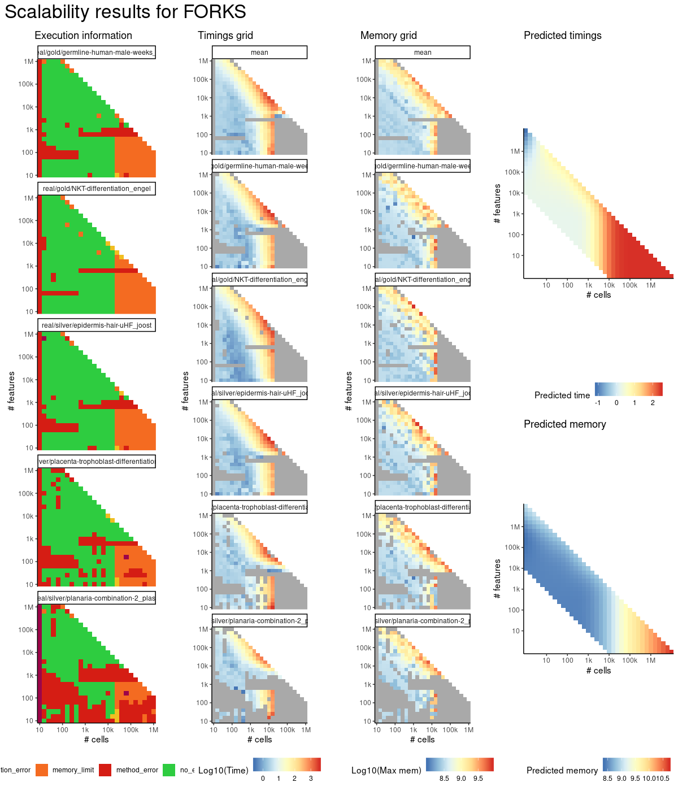
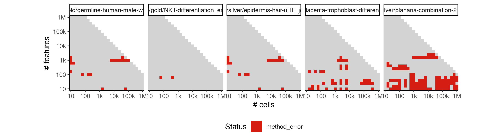
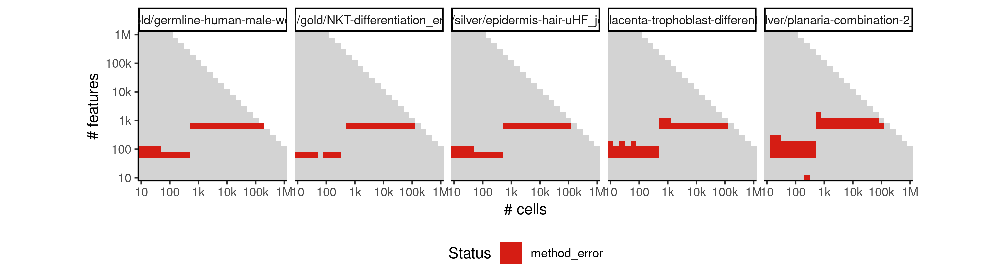
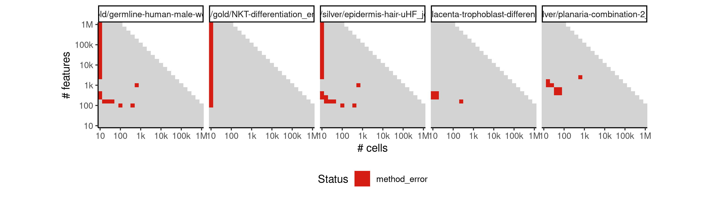
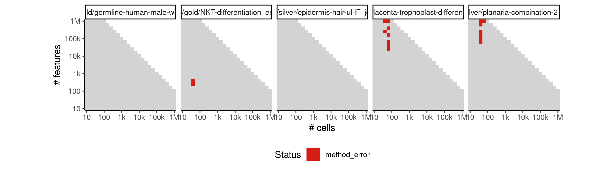

# forks


## ERROR STATUS METHOD_ERROR

### ERROR CLUSTER METHOD_ERROR -- 1


 * Number of instances: 60
 * Dataset ids: scaling_0001, scaling_0002, scaling_0003, scaling_0004, scaling_0006, scaling_0008, scaling_0010, scaling_0012, scaling_0016, scaling_0019, scaling_0022, scaling_0025, scaling_0041, scaling_0043, scaling_0045, scaling_0047, scaling_0216, scaling_0244, scaling_0268, scaling_0309, scaling_0371, scaling_0430, scaling_0486, scaling_0498, scaling_0583, scaling_0649, scaling_0732, scaling_0820, scaling_0889, scaling_1023, scaling_0001, scaling_0002, scaling_0003, scaling_0004, scaling_0006, scaling_0008, scaling_0010, scaling_0012, scaling_0016, scaling_0019, scaling_0022, scaling_0025, scaling_0041, scaling_0043, scaling_0045, scaling_0047, scaling_0216, scaling_0244, scaling_0268, scaling_0309, scaling_0371, scaling_0430, scaling_0486, scaling_0498, scaling_0583, scaling_0649, scaling_0732, scaling_0820, scaling_0889, scaling_1023

Last 10 lines of scaling_0001:
```
    self._fit_transform(X)
  File "/usr/local/lib/python3.6/site-packages/sklearn/manifold/isomap.py", line 116, in _fit_transform
    mode='distance', n_jobs=self.n_jobs)
  File "/usr/local/lib/python3.6/site-packages/sklearn/neighbors/graph.py", line 103, in kneighbors_graph
    return X.kneighbors_graph(X=query, n_neighbors=n_neighbors, mode=mode)
  File "/usr/local/lib/python3.6/site-packages/sklearn/neighbors/base.py", line 489, in kneighbors_graph
    X, n_neighbors, return_distance=True)
  File "/usr/local/lib/python3.6/site-packages/sklearn/neighbors/base.py", line 347, in kneighbors
    (train_size, n_neighbors)
ValueError: Expected n_neighbors <= n_samples,  but n_samples = 10, n_neighbors = 11
```

### ERROR CLUSTER METHOD_ERROR -- 2


 * Number of instances: 212
 * Dataset ids: scaling_0013, scaling_0027, scaling_0029, scaling_0030, scaling_0038, scaling_0039, scaling_0050, scaling_0070, scaling_0074, scaling_0075, scaling_0098, scaling_0102, scaling_0104, scaling_0105, scaling_0106, scaling_0120, scaling_0137, scaling_0139, scaling_0150, scaling_0170, scaling_0174, scaling_0178, scaling_0191, scaling_0207, scaling_0213, scaling_0225, scaling_0226, scaling_0228, scaling_0238, scaling_0240, scaling_0251, scaling_0255, scaling_0269, scaling_0275, scaling_0276, scaling_0277, scaling_0298, scaling_0299, scaling_0319, scaling_0321, scaling_0322, scaling_0323, scaling_0327, scaling_0329, scaling_0330, scaling_0338, scaling_0340, scaling_0341, scaling_0346, scaling_0350, scaling_0361, scaling_0366, scaling_0370, scaling_0375, scaling_0384, scaling_0389, scaling_0390, scaling_0398, scaling_0412, scaling_0424, scaling_0436, scaling_0439, scaling_0440, scaling_0442, scaling_0448, scaling_0452, scaling_0453, scaling_0454, scaling_0455, scaling_0500, scaling_0502, scaling_0503, scaling_0504, scaling_0505, scaling_0523, scaling_0525, scaling_0553, scaling_0554, scaling_0555, scaling_0590, scaling_0591, scaling_0595, scaling_0596, scaling_0599, scaling_0600, scaling_0661, scaling_0672, scaling_0673, scaling_0675, scaling_0677, scaling_0678, scaling_0679, scaling_0680, scaling_0746, scaling_0762, scaling_0763, scaling_0765, scaling_0834, scaling_0852, scaling_0910, scaling_0949, scaling_0980, scaling_0994, scaling_1022, scaling_1031, scaling_1050, scaling_0013, scaling_0027, scaling_0029, scaling_0030, scaling_0038, scaling_0039, scaling_0050, scaling_0070, scaling_0074, scaling_0075, scaling_0098, scaling_0102, scaling_0104, scaling_0105, scaling_0106, scaling_0120, scaling_0137, scaling_0139, scaling_0150, scaling_0170, scaling_0174, scaling_0178, scaling_0191, scaling_0207, scaling_0213, scaling_0225, scaling_0226, scaling_0228, scaling_0238, scaling_0240, scaling_0251, scaling_0255, scaling_0269, scaling_0275, scaling_0276, scaling_0277, scaling_0298, scaling_0299, scaling_0319, scaling_0321, scaling_0322, scaling_0323, scaling_0327, scaling_0329, scaling_0330, scaling_0338, scaling_0340, scaling_0341, scaling_0346, scaling_0350, scaling_0361, scaling_0366, scaling_0370, scaling_0375, scaling_0384, scaling_0389, scaling_0390, scaling_0398, scaling_0412, scaling_0424, scaling_0436, scaling_0439, scaling_0440, scaling_0442, scaling_0448, scaling_0452, scaling_0453, scaling_0454, scaling_0455, scaling_0500, scaling_0502, scaling_0503, scaling_0504, scaling_0505, scaling_0523, scaling_0525, scaling_0553, scaling_0554, scaling_0555, scaling_0590, scaling_0591, scaling_0595, scaling_0596, scaling_0599, scaling_0600, scaling_0661, scaling_0672, scaling_0673, scaling_0675, scaling_0677, scaling_0678, scaling_0679, scaling_0680, scaling_0746, scaling_0762, scaling_0763, scaling_0765, scaling_0834, scaling_0852, scaling_0910, scaling_0949, scaling_0980, scaling_0994, scaling_1022, scaling_1031, scaling_1050

Last 10 lines of scaling_0013:
```
    cluster_labels = clusterer.fit_predict(X)
  File "/usr/local/lib/python3.6/site-packages/sklearn/cluster/k_means_.py", line 917, in fit_predict
    return self.fit(X).labels_
  File "/usr/local/lib/python3.6/site-packages/sklearn/cluster/k_means_.py", line 887, in fit
    X = self._check_fit_data(X)
  File "/usr/local/lib/python3.6/site-packages/sklearn/cluster/k_means_.py", line 858, in _check_fit_data
    X = check_array(X, accept_sparse='csr', dtype=[np.float64, np.float32])
  File "/usr/local/lib/python3.6/site-packages/sklearn/utils/validation.py", line 470, in check_array
    context))
ValueError: Found array with 0 feature(s) (shape=(16, 0)) while a minimum of 1 is required.
```

### ERROR CLUSTER METHOD_ERROR -- 3


 * Number of instances: 186
 * Dataset ids: scaling_0051, scaling_0056, scaling_0061, scaling_0066, scaling_0076, scaling_0077, scaling_0083, scaling_0088, scaling_0089, scaling_0094, scaling_0095, scaling_0101, scaling_0107, scaling_0108, scaling_0115, scaling_0121, scaling_0122, scaling_0127, scaling_0128, scaling_0129, scaling_0135, scaling_0136, scaling_0141, scaling_0145, scaling_0147, scaling_0149, scaling_0153, scaling_0159, scaling_0165, scaling_0171, scaling_0176, scaling_0177, scaling_0180, scaling_0183, scaling_0184, scaling_0197, scaling_0198, scaling_0203, scaling_0204, scaling_0205, scaling_0210, scaling_0211, scaling_0212, scaling_0224, scaling_0229, scaling_0235, scaling_0241, scaling_0246, scaling_0247, scaling_0252, scaling_0253, scaling_0272, scaling_0273, scaling_0282, scaling_0293, scaling_0304, scaling_0313, scaling_0314, scaling_0315, scaling_0324, scaling_0325, scaling_0326, scaling_0347, scaling_0357, scaling_0367, scaling_0376, scaling_0377, scaling_0385, scaling_0386, scaling_0387, scaling_0399, scaling_0425, scaling_0437, scaling_0438, scaling_0449, scaling_0450, scaling_0451, scaling_0491, scaling_0501, scaling_0524, scaling_0597, scaling_0861, scaling_0872, scaling_0883, scaling_0894, scaling_0905, scaling_0954, scaling_0960, scaling_0966, scaling_0971, scaling_0972, scaling_0977, scaling_0978, scaling_0051, scaling_0056, scaling_0061, scaling_0066, scaling_0076, scaling_0077, scaling_0083, scaling_0088, scaling_0089, scaling_0094, scaling_0095, scaling_0101, scaling_0107, scaling_0108, scaling_0115, scaling_0121, scaling_0122, scaling_0127, scaling_0128, scaling_0129, scaling_0135, scaling_0136, scaling_0141, scaling_0145, scaling_0147, scaling_0149, scaling_0153, scaling_0159, scaling_0165, scaling_0171, scaling_0176, scaling_0177, scaling_0180, scaling_0183, scaling_0184, scaling_0197, scaling_0198, scaling_0203, scaling_0204, scaling_0205, scaling_0210, scaling_0211, scaling_0212, scaling_0224, scaling_0229, scaling_0235, scaling_0241, scaling_0246, scaling_0247, scaling_0252, scaling_0253, scaling_0272, scaling_0273, scaling_0282, scaling_0293, scaling_0304, scaling_0313, scaling_0314, scaling_0315, scaling_0324, scaling_0325, scaling_0326, scaling_0347, scaling_0357, scaling_0367, scaling_0376, scaling_0377, scaling_0385, scaling_0386, scaling_0387, scaling_0399, scaling_0425, scaling_0437, scaling_0438, scaling_0449, scaling_0450, scaling_0451, scaling_0491, scaling_0501, scaling_0524, scaling_0597, scaling_0861, scaling_0872, scaling_0883, scaling_0894, scaling_0905, scaling_0954, scaling_0960, scaling_0966, scaling_0971, scaling_0972, scaling_0977, scaling_0978

Last 10 lines of scaling_0051:
```
Traceback (most recent call last):
  File "/code/run.py", line 55, in <module>
    pca.fit(data1)
  File "/usr/local/lib/python3.6/site-packages/sklearn/decomposition/pca.py", line 329, in fit
    self._fit(X)
  File "/usr/local/lib/python3.6/site-packages/sklearn/decomposition/pca.py", line 370, in _fit
    copy=self.copy)
  File "/usr/local/lib/python3.6/site-packages/sklearn/utils/validation.py", line 470, in check_array
    context))
ValueError: Found array with 0 feature(s) (shape=(1, 0)) while a minimum of 1 is required.
```

### ERROR CLUSTER METHOD_ERROR -- 4


 * Number of instances: 120
 * Dataset ids: scaling_0082, scaling_0113, scaling_0151, scaling_0152, scaling_0157, scaling_0163, scaling_0164, scaling_0169, scaling_0181, scaling_0182, scaling_0188, scaling_0195, scaling_0196, scaling_0202, scaling_0220, scaling_0222, scaling_0232, scaling_0245, scaling_0257, scaling_0265, scaling_0281, scaling_0287, scaling_0303, scaling_0351, scaling_0382, scaling_0383, scaling_0391, scaling_0404, scaling_0417, scaling_0444, scaling_0445, scaling_0446, scaling_0447, scaling_0456, scaling_0461, scaling_0466, scaling_0476, scaling_0481, scaling_0499, scaling_0520, scaling_0556, scaling_0565, scaling_0574, scaling_0601, scaling_0617, scaling_0633, scaling_0681, scaling_0698, scaling_0715, scaling_0766, scaling_0784, scaling_0802, scaling_0856, scaling_0867, scaling_0878, scaling_0953, scaling_0965, scaling_0981, scaling_0995, scaling_1009, scaling_0082, scaling_0113, scaling_0151, scaling_0152, scaling_0157, scaling_0163, scaling_0164, scaling_0169, scaling_0181, scaling_0182, scaling_0188, scaling_0195, scaling_0196, scaling_0202, scaling_0220, scaling_0222, scaling_0232, scaling_0245, scaling_0257, scaling_0265, scaling_0281, scaling_0287, scaling_0303, scaling_0351, scaling_0382, scaling_0383, scaling_0391, scaling_0404, scaling_0417, scaling_0444, scaling_0445, scaling_0446, scaling_0447, scaling_0456, scaling_0461, scaling_0466, scaling_0476, scaling_0481, scaling_0499, scaling_0520, scaling_0556, scaling_0565, scaling_0574, scaling_0601, scaling_0617, scaling_0633, scaling_0681, scaling_0698, scaling_0715, scaling_0766, scaling_0784, scaling_0802, scaling_0856, scaling_0867, scaling_0878, scaling_0953, scaling_0965, scaling_0981, scaling_0995, scaling_1009

Last 10 lines of scaling_0082:
```
    n_clus,max_sil,sil_scores=find_nclusters(mappedData,range_clusters)
  File "/FORKS/deng_2014_python/forks_fcns.py", line 415, in find_nclusters
    silhouette_avg = silhouette_score(X, cluster_labels)
  File "/usr/local/lib/python3.6/site-packages/sklearn/metrics/cluster/unsupervised.py", line 101, in silhouette_score
    return np.mean(silhouette_samples(X, labels, metric=metric, **kwds))
  File "/usr/local/lib/python3.6/site-packages/sklearn/metrics/cluster/unsupervised.py", line 167, in silhouette_samples
    check_number_of_labels(len(le.classes_), X.shape[0])
  File "/usr/local/lib/python3.6/site-packages/sklearn/metrics/cluster/unsupervised.py", line 19, in check_number_of_labels
    "to n_samples - 1 (inclusive)" % n_labels)
ValueError: Number of labels is 9. Valid values are 2 to n_samples - 1 (inclusive)
```

### ERROR CLUSTER METHOD_ERROR -- 5


 * Number of instances: 4
 * Dataset ids: scaling_0290, scaling_0353, scaling_0290, scaling_0353

Last 10 lines of scaling_0290:
```
    kmeans = KMeans(n_clusters=M, random_state=0).fit(X_reduced)
  File "/usr/local/lib/python3.6/site-packages/sklearn/cluster/k_means_.py", line 887, in fit
    X = self._check_fit_data(X)
  File "/usr/local/lib/python3.6/site-packages/sklearn/cluster/k_means_.py", line 858, in _check_fit_data
    X = check_array(X, accept_sparse='csr', dtype=[np.float64, np.float32])
  File "/usr/local/lib/python3.6/site-packages/sklearn/utils/validation.py", line 453, in check_array
    _assert_all_finite(array)
  File "/usr/local/lib/python3.6/site-packages/sklearn/utils/validation.py", line 44, in _assert_all_finite
    " or a value too large for %r." % X.dtype)
ValueError: Input contains NaN, infinity or a value too large for dtype('float64').
```

### ERROR CLUSTER METHOD_ERROR -- 6


 * Number of instances: 22
 * Dataset ids: scaling_0311, scaling_0429, scaling_0506, scaling_0550, scaling_0576, scaling_0618, scaling_0699, scaling_0772, scaling_0785, scaling_0896, scaling_0935, scaling_0311, scaling_0429, scaling_0506, scaling_0550, scaling_0576, scaling_0618, scaling_0699, scaling_0772, scaling_0785, scaling_0896, scaling_0935

Last 10 lines of scaling_0311:
```
    r,cluster_assigned_to_temp=clusterassignment(connected_nodes_to_node,temp_nodes)
  File "/FORKS/deng_2014_python/forks_fcns.py", line 900, in clusterassignment
    nbrs = NearestNeighbors(n_neighbors=1, algorithm='ball_tree').fit(temp1)
  File "/usr/local/lib/python3.6/site-packages/sklearn/neighbors/base.py", line 803, in fit
    return self._fit(X)
  File "/usr/local/lib/python3.6/site-packages/sklearn/neighbors/base.py", line 204, in _fit
    X = check_array(X, accept_sparse='csr')
  File "/usr/local/lib/python3.6/site-packages/sklearn/utils/validation.py", line 462, in check_array
    context))
ValueError: Found array with 0 sample(s) (shape=(0, 6)) while a minimum of 1 is required.
```

### ERROR CLUSTER METHOD_ERROR -- 7


 * Number of instances: 2
 * Dataset ids: scaling_0339, scaling_0339

Last 10 lines of scaling_0339:
```
    n_clus,max_sil,sil_scores=find_nclusters(mappedData,range_clusters)
  File "/FORKS/deng_2014_python/forks_fcns.py", line 414, in find_nclusters
    cluster_labels = clusterer.fit_predict(X)
  File "/usr/local/lib/python3.6/site-packages/sklearn/cluster/k_means_.py", line 917, in fit_predict
    return self.fit(X).labels_
  File "/usr/local/lib/python3.6/site-packages/sklearn/cluster/k_means_.py", line 887, in fit
    X = self._check_fit_data(X)
  File "/usr/local/lib/python3.6/site-packages/sklearn/cluster/k_means_.py", line 861, in _check_fit_data
    X.shape[0], self.n_clusters))
ValueError: n_samples=3 should be >= n_clusters=4
```

## ERROR STATUS TIME_LIMIT

## ERROR STATUS MEMORY_LIMIT

### ERROR CLUSTER MEMORY_LIMIT -- 1


 * Number of instances: 36
 * Dataset ids: scaling_0697, scaling_0714, scaling_0731, scaling_0748, scaling_0782, scaling_0800, scaling_0818, scaling_0836, scaling_0865, scaling_0876, scaling_0887, scaling_0898, scaling_0909, scaling_0992, scaling_1006, scaling_1020, scaling_1034, scaling_1048, scaling_0697, scaling_0714, scaling_0731, scaling_0748, scaling_0782, scaling_0800, scaling_0818, scaling_0836, scaling_0865, scaling_0876, scaling_0887, scaling_0898, scaling_0909, scaling_0992, scaling_1006, scaling_1020, scaling_1034, scaling_1048

Last 10 lines of scaling_0697:
```
    self._fit_transform(K)
  File "/usr/local/lib/python3.6/site-packages/sklearn/decomposition/kernel_pca.py", line 171, in _fit_transform
    K = self._centerer.fit_transform(K)
  File "/usr/local/lib/python3.6/site-packages/sklearn/base.py", line 517, in fit_transform
    return self.fit(X, **fit_params).transform(X)
  File "/usr/local/lib/python3.6/site-packages/sklearn/preprocessing/data.py", line 1713, in transform
    K = check_array(K, copy=copy, dtype=FLOAT_DTYPES)
  File "/usr/local/lib/python3.6/site-packages/sklearn/utils/validation.py", line 444, in check_array
    array = np.array(array, dtype=dtype, order=order, copy=copy)
MemoryError
```

### ERROR CLUSTER MEMORY_LIMIT -- 2


 * Number of instances: 8
 * Dataset ids: scaling_0783, scaling_0819, scaling_1035, scaling_1049, scaling_0783, scaling_0819, scaling_1035, scaling_1049

Last 10 lines of scaling_0783:
```
Traceback (most recent call last):
  File "/code/run.py", line 65, in <module>
    n_clus,max_sil,sil_scores=find_nclusters(mappedData,range_clusters)
  File "/FORKS/deng_2014_python/forks_fcns.py", line 415, in find_nclusters
    silhouette_avg = silhouette_score(X, cluster_labels)
  File "/usr/local/lib/python3.6/site-packages/sklearn/metrics/cluster/unsupervised.py", line 101, in silhouette_score
    return np.mean(silhouette_samples(X, labels, metric=metric, **kwds))
  File "/usr/local/lib/python3.6/site-packages/sklearn/metrics/cluster/unsupervised.py", line 192, in silhouette_samples
    current_distances[:, mask], axis=1) / n_samples_curr_lab
MemoryError
```

### ERROR CLUSTER MEMORY_LIMIT -- 3


 * Number of instances: 14
 * Dataset ids: scaling_0801, scaling_0837, scaling_0855, scaling_0926, scaling_0942, scaling_0950, scaling_1007, scaling_0801, scaling_0837, scaling_0855, scaling_0926, scaling_0942, scaling_0950, scaling_1007

Last 10 lines of scaling_0801:
```
Traceback (most recent call last):
  File "/code/run.py", line 65, in <module>
    n_clus,max_sil,sil_scores=find_nclusters(mappedData,range_clusters)
  File "/FORKS/deng_2014_python/forks_fcns.py", line 415, in find_nclusters
    silhouette_avg = silhouette_score(X, cluster_labels)
  File "/usr/local/lib/python3.6/site-packages/sklearn/metrics/cluster/unsupervised.py", line 101, in silhouette_score
    return np.mean(silhouette_samples(X, labels, metric=metric, **kwds))
  File "/usr/local/lib/python3.6/site-packages/sklearn/metrics/cluster/unsupervised.py", line 186, in silhouette_samples
    current_distances = distances[mask]
MemoryError
```

### ERROR CLUSTER MEMORY_LIMIT -- 4


 * Number of instances: 20
 * Dataset ids: scaling_0866, scaling_0877, scaling_0888, scaling_0899, scaling_0956, scaling_0962, scaling_0968, scaling_0974, scaling_1008, scaling_1036, scaling_0866, scaling_0877, scaling_0888, scaling_0899, scaling_0956, scaling_0962, scaling_0968, scaling_0974, scaling_1008, scaling_1036

Last 10 lines of scaling_0866:
```
    distances = pairwise_distances(X, metric=metric, **kwds)
  File "/usr/local/lib/python3.6/site-packages/sklearn/metrics/pairwise.py", line 1247, in pairwise_distances
    return _parallel_pairwise(X, Y, func, n_jobs, **kwds)
  File "/usr/local/lib/python3.6/site-packages/sklearn/metrics/pairwise.py", line 1090, in _parallel_pairwise
    return func(X, Y, **kwds)
  File "/usr/local/lib/python3.6/site-packages/sklearn/metrics/pairwise.py", line 246, in euclidean_distances
    distances = safe_sparse_dot(X, Y.T, dense_output=True)
  File "/usr/local/lib/python3.6/site-packages/sklearn/utils/extmath.py", line 140, in safe_sparse_dot
    return np.dot(a, b)
MemoryError
```

### ERROR CLUSTER MEMORY_LIMIT -- 5


 * Number of instances: 8
 * Dataset ids: scaling_0918, scaling_0934, scaling_0993, scaling_1021, scaling_0918, scaling_0934, scaling_0993, scaling_1021

Last 10 lines of scaling_0918:
```
Traceback (most recent call last):
  File "/code/run.py", line 106, in <module>
    X_reduced=mapping(data2,actual_time2,mapping_params)
  File "/FORKS/deng_2014_python/forks_fcns.py", line 448, in mapping
    X_reduced = manifold.Isomap(n_neighbors, n_components).fit_transform(X)
  File "/usr/local/lib/python3.6/site-packages/sklearn/manifold/isomap.py", line 184, in fit_transform
    self._fit_transform(X)
  File "/usr/local/lib/python3.6/site-packages/sklearn/manifold/isomap.py", line 121, in _fit_transform
    G = self.dist_matrix_ ** 2
MemoryError
```


