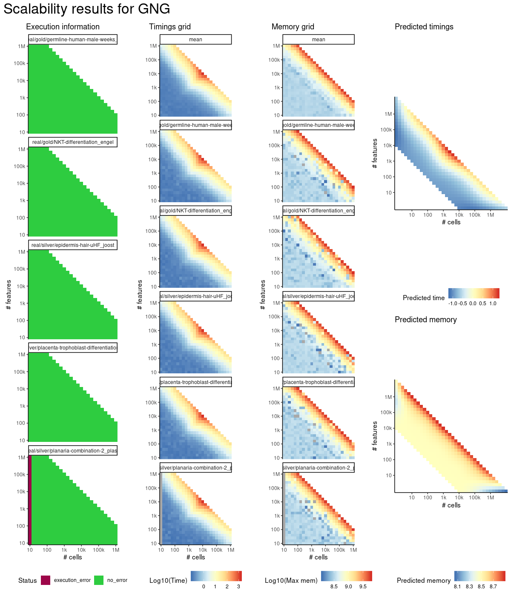
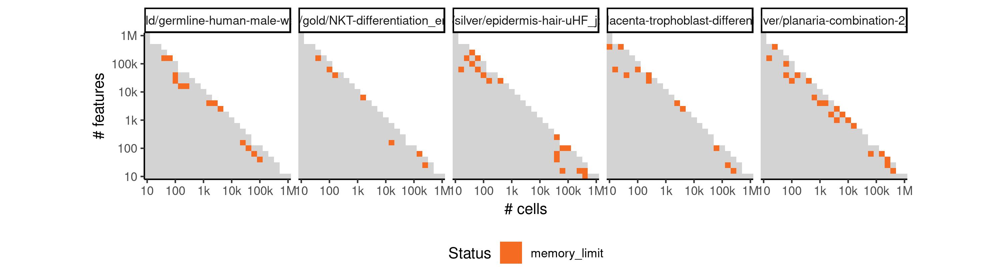
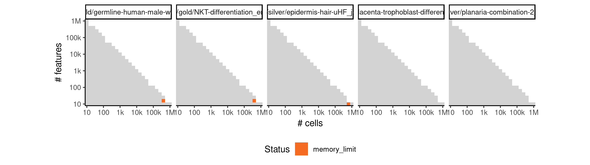

# gng


## ERROR STATUS MEMORY_LIMIT

### ERROR CLUSTER MEMORY_LIMIT -- 1


 * Number of instances: 71
 * Dataset ids: scaling_1150, scaling_1151, scaling_1152, scaling_1161, scaling_1162, scaling_1271, scaling_1274, scaling_1280, scaling_1281, scaling_1312, scaling_1361, scaling_1364, scaling_1383, scaling_1390, scaling_1391, scaling_1405, scaling_1406, scaling_1407, scaling_1428, scaling_1433, scaling_1434, scaling_1435, scaling_1445, scaling_1449, scaling_1450, scaling_1467, scaling_1468, scaling_1475, scaling_1476, scaling_1477, scaling_1487, scaling_1495, scaling_1498, scaling_1508, scaling_1525, scaling_1526, scaling_1534, scaling_1539, scaling_1553, scaling_1554, scaling_1566, scaling_1583, scaling_1586, scaling_1592, scaling_1593, scaling_1602, scaling_1615, scaling_1623, scaling_1624, scaling_1629, scaling_1636, scaling_1637, scaling_1657, scaling_1666, scaling_1672, scaling_1673, scaling_1676, scaling_1686, scaling_1687, scaling_1693, scaling_1697, scaling_1702, scaling_1703, scaling_1715, scaling_1720, scaling_1725, scaling_1726, scaling_1727, scaling_1728, scaling_1732, scaling_1733

Last 10 lines of scaling_1150:
```
error writing to connection
```

### ERROR CLUSTER MEMORY_LIMIT -- 2


 * Number of instances: 3
 * Dataset ids: scaling_1548, scaling_1567, scaling_1587

Last 10 lines of scaling_1548:
```
    decompose, spectrum
The following object is masked from ‘package:base’:
    union
Loading required package: dynutils
0%   10   20   30   40   50   60   70   80   90   100%
[----|----|----|----|----|----|----|----|----|----|
**************************************************|
Error in saveRDS(x, con) : error writing to connection
Calls: write_rds -> saveRDS
Execution halted
```


