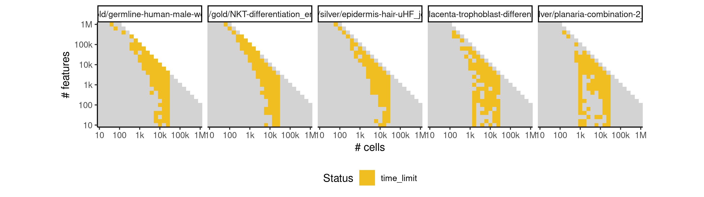

# gpfates


## ERROR STATUS METHOD_ERROR

### ERROR CLUSTER METHOD_ERROR -- 1


 * Number of instances: 127
 * Dataset ids: scaling_0215, scaling_0231, scaling_0296, scaling_0297, scaling_0319, scaling_0330, scaling_0334, scaling_0350, scaling_0369, scaling_0379, scaling_0390, scaling_0401, scaling_0403, scaling_0413, scaling_0414, scaling_0416, scaling_0425, scaling_0428, scaling_0429, scaling_0438, scaling_0441, scaling_0442, scaling_0453, scaling_0461, scaling_0463, scaling_0464, scaling_0474, scaling_0475, scaling_0481, scaling_0483, scaling_0485, scaling_0493, scaling_0494, scaling_0495, scaling_0501, scaling_0502, scaling_0505, scaling_0509, scaling_0521, scaling_0537, scaling_0543, scaling_0548, scaling_0549, scaling_0563, scaling_0564, scaling_0573, scaling_0580, scaling_0582, scaling_0589, scaling_0590, scaling_0615, scaling_0626, scaling_0628, scaling_0641, scaling_0643, scaling_0644, scaling_0646, scaling_0647, scaling_0648, scaling_0661, scaling_0663, scaling_0674, scaling_0675, scaling_0676, scaling_0677, scaling_0680, scaling_0691, scaling_0692, scaling_0693, scaling_0695, scaling_0696, scaling_0697, scaling_0708, scaling_0712, scaling_0726, scaling_0729, scaling_0731, scaling_0742, scaling_0745, scaling_0746, scaling_0748, scaling_0759, scaling_0760, scaling_0762, scaling_0763, scaling_0765, scaling_0776, scaling_0779, scaling_0780, scaling_0781, scaling_0794, scaling_0798, scaling_0810, scaling_0812, scaling_0814, scaling_0815, scaling_0817, scaling_0832, scaling_0835, scaling_0848, scaling_0849, scaling_0850, scaling_0851, scaling_0852, scaling_0853, scaling_0854, scaling_0873, scaling_0896, scaling_0916, scaling_0917, scaling_0923, scaling_0925, scaling_0932, scaling_0933, scaling_0947, scaling_0948, scaling_0949, scaling_0955, scaling_0979, scaling_1003, scaling_1016, scaling_1018, scaling_1019, scaling_1020, scaling_1030, scaling_1044, scaling_1047

Last 10 lines of scaling_0215:
```
    super(BayesianGPLVM,self).parameters_changed()
  File "/usr/local/lib/python3.6/site-packages/GPy/core/sparse_gp_mpi.py", line 122, in parameters_changed
    super(SparseGP_MPI,self).parameters_changed()
  File "/usr/local/lib/python3.6/site-packages/GPy/core/sparse_gp.py", line 80, in parameters_changed
    mean_function=self.mean_function)
  File "/usr/local/lib/python3.6/site-packages/GPy/inference/latent_function_inference/var_dtc.py", line 135, in inference
    LB = jitchol(B)
  File "/usr/local/lib/python3.6/site-packages/GPy/util/linalg.py", line 64, in jitchol
    raise linalg.LinAlgError("not pd: non-positive diagonal elements")
numpy.linalg.linalg.LinAlgError: not pd: non-positive diagonal elements
```

## ERROR STATUS MEMORY_LIMIT

### ERROR CLUSTER MEMORY_LIMIT -- 1


 * Number of instances: 7
 * Dataset ids: scaling_0632, scaling_0664, scaling_0747, scaling_0764, scaling_0897, scaling_0967, scaling_0973

Last 10 lines of scaling_0632:
```
    return cacher(*args, **kw)
  File "/usr/local/lib/python3.6/site-packages/paramz/caching.py", line 172, in __call__
    return self.operation(*args, **kw)
  File "/usr/local/lib/python3.6/site-packages/GPy/kern/src/stationary.py", line 123, in dK_dr_via_X
    return self.dK_dr(self._scaled_dist(X, X2))
  File "/usr/local/lib/python3.6/site-packages/GPy/kern/src/rbf.py", line 54, in dK_dr
    return -r*self.K_of_r(r)
  File "/usr/local/lib/python3.6/site-packages/GPy/kern/src/rbf.py", line 51, in K_of_r
    return self.variance * np.exp(-0.5 * r**2)
MemoryError
```

### ERROR CLUSTER MEMORY_LIMIT -- 2


 * Number of instances: 1
 * Dataset ids: scaling_0714

Last 10 lines of scaling_0714:
```
    self.parameters_changed()
  File "/usr/local/lib/python3.6/site-packages/GPclust/OMGP.py", line 38, in parameters_changed
    self.update_kern_grads()
  File "/usr/local/lib/python3.6/site-packages/GPclust/OMGP.py", line 71, in update_kern_grads
    Bi, LB, LBi, Blogdet = pdinv(K+B_inv)
  File "/usr/local/lib/python3.6/site-packages/GPy/util/linalg.py", line 207, in pdinv
    L = jitchol(A, *args)
  File "/usr/local/lib/python3.6/site-packages/GPy/util/linalg.py", line 58, in jitchol
    L, info = lapack.dpotrf(A, lower=1)
MemoryError
```

### ERROR CLUSTER MEMORY_LIMIT -- 3


 * Number of instances: 15
 * Dataset ids: scaling_0783, scaling_0801, scaling_0819, scaling_0837, scaling_0855, scaling_0918, scaling_0926, scaling_0934, scaling_0942, scaling_0950, scaling_0993, scaling_1007, scaling_1021, scaling_1035, scaling_1049

Last 10 lines of scaling_0783:
```
    super(BayesianGPLVM,self).parameters_changed()
  File "/usr/local/lib/python3.6/site-packages/GPy/core/sparse_gp_mpi.py", line 122, in parameters_changed
    super(SparseGP_MPI,self).parameters_changed()
  File "/usr/local/lib/python3.6/site-packages/GPy/core/sparse_gp.py", line 80, in parameters_changed
    mean_function=self.mean_function)
  File "/usr/local/lib/python3.6/site-packages/GPy/inference/latent_function_inference/var_dtc.py", line 146, in inference
    - np.eye(Y.shape[0]), VVT_factor)
  File "/usr/local/lib/python3.6/site-packages/numpy/lib/twodim_base.py", line 186, in eye
    m = zeros((N, M), dtype=dtype, order=order)
MemoryError
```

### ERROR CLUSTER MEMORY_LIMIT -- 4


 * Number of instances: 15
 * Dataset ids: scaling_0866, scaling_0877, scaling_0888, scaling_0899, scaling_0910, scaling_0956, scaling_0962, scaling_0968, scaling_0974, scaling_0980, scaling_0994, scaling_1008, scaling_1022, scaling_1036, scaling_1050

Last 10 lines of scaling_0866:
```
    self.parameters_changed()
  File "/usr/local/lib/python3.6/site-packages/GPy/models/bayesian_gplvm.py", line 85, in parameters_changed
    super(BayesianGPLVM,self).parameters_changed()
  File "/usr/local/lib/python3.6/site-packages/GPy/core/sparse_gp_mpi.py", line 122, in parameters_changed
    super(SparseGP_MPI,self).parameters_changed()
  File "/usr/local/lib/python3.6/site-packages/GPy/core/sparse_gp.py", line 80, in parameters_changed
    mean_function=self.mean_function)
  File "/usr/local/lib/python3.6/site-packages/GPy/inference/latent_function_inference/var_dtc.py", line 145, in inference
    dL_dm = -np.dot((_LBi_Lmi_psi1.T.dot(_LBi_Lmi_psi1))
MemoryError
```

## ERROR STATUS TIME_LIMIT

### ERROR CLUSTER TIME_LIMIT -- 1


 * Number of instances: 69
 * Dataset ids: scaling_0380, scaling_0389, scaling_0454, scaling_0455, scaling_0465, scaling_0503, scaling_0504, scaling_0525, scaling_0554, scaling_0555, scaling_0591, scaling_0598, scaling_0599, scaling_0600, scaling_0614, scaling_0616, scaling_0630, scaling_0631, scaling_0660, scaling_0662, scaling_0678, scaling_0679, scaling_0713, scaling_0730, scaling_0743, scaling_0744, scaling_0761, scaling_0782, scaling_0797, scaling_0799, scaling_0800, scaling_0816, scaling_0818, scaling_0831, scaling_0833, scaling_0834, scaling_0836, scaling_0863, scaling_0864, scaling_0865, scaling_0874, scaling_0875, scaling_0876, scaling_0885, scaling_0886, scaling_0887, scaling_0898, scaling_0906, scaling_0907, scaling_0908, scaling_0909, scaling_0939, scaling_0940, scaling_0941, scaling_0961, scaling_0978, scaling_0990, scaling_0991, scaling_0992, scaling_1004, scaling_1005, scaling_1006, scaling_1031, scaling_1032, scaling_1033, scaling_1034, scaling_1045, scaling_1046, scaling_1048

Last 10 lines of scaling_0380:
```
File: /home/rcannood/Workspace/dynverse/dynbenchmark//derived/05-scaling/suite/gpfates/10/r2gridengine/20180924_185040_gpfates_10_ZA2dkNAQPG/log/log.380.e.txt
```


