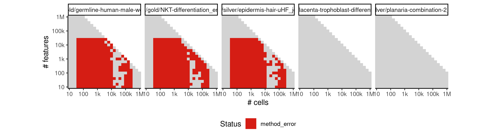
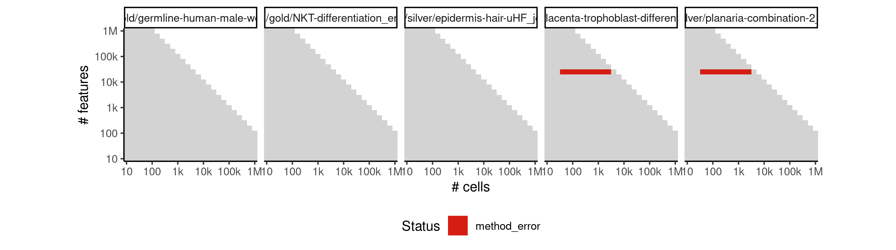
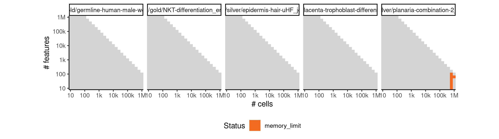

# grandprix


## ERROR STATUS METHOD_ERROR

### ERROR CLUSTER METHOD_ERROR -- 1


 * Number of instances: 252
 * Dataset ids: scaling_0001, scaling_0002, scaling_0003, scaling_0004, scaling_0006, scaling_0007, scaling_0008, scaling_0009, scaling_0010, scaling_0011, scaling_0012, scaling_0013, scaling_0015, scaling_0016, scaling_0017, scaling_0018, scaling_0019, scaling_0020, scaling_0021, scaling_0022, scaling_0023, scaling_0024, scaling_0025, scaling_0026, scaling_0027, scaling_0029, scaling_0030, scaling_0031, scaling_0032, scaling_0033, scaling_0034, scaling_0035, scaling_0036, scaling_0037, scaling_0038, scaling_0039, scaling_0040, scaling_0041, scaling_0043, scaling_0045, scaling_0047, scaling_0051, scaling_0052, scaling_0053, scaling_0056, scaling_0057, scaling_0058, scaling_0061, scaling_0062, scaling_0063, scaling_0066, scaling_0067, scaling_0068, scaling_0072, scaling_0073, scaling_0076, scaling_0077, scaling_0078, scaling_0082, scaling_0083, scaling_0084, scaling_0088, scaling_0089, scaling_0090, scaling_0094, scaling_0095, scaling_0096, scaling_0101, scaling_0102, scaling_0106, scaling_0107, scaling_0108, scaling_0113, scaling_0114, scaling_0115, scaling_0120, scaling_0121, scaling_0122, scaling_0127, scaling_0128, scaling_0129, scaling_0135, scaling_0136, scaling_0141, scaling_0143, scaling_0145, scaling_0147, scaling_0149, scaling_0151, scaling_0152, scaling_0157, scaling_0158, scaling_0163, scaling_0164, scaling_0169, scaling_0170, scaling_0176, scaling_0181, scaling_0182, scaling_0188, scaling_0189, scaling_0195, scaling_0196, scaling_0202, scaling_0203, scaling_0210, scaling_0216, scaling_0218, scaling_0220, scaling_0222, scaling_0224, scaling_0226, scaling_0227, scaling_0232, scaling_0233, scaling_0238, scaling_0239, scaling_0244, scaling_0245, scaling_0251, scaling_0256, scaling_0260, scaling_0264, scaling_0268, scaling_0272, scaling_0276, scaling_0277, scaling_0278, scaling_0287, scaling_0288, scaling_0289, scaling_0298, scaling_0299, scaling_0300, scaling_0309, scaling_0310, scaling_0311, scaling_0321, scaling_0322, scaling_0331, scaling_0333, scaling_0335, scaling_0337, scaling_0339, scaling_0341, scaling_0342, scaling_0351, scaling_0352, scaling_0361, scaling_0362, scaling_0371, scaling_0372, scaling_0382, scaling_0391, scaling_0392, scaling_0393, scaling_0404, scaling_0405, scaling_0406, scaling_0417, scaling_0418, scaling_0419, scaling_0430, scaling_0431, scaling_0432, scaling_0444, scaling_0445, scaling_0456, scaling_0457, scaling_0466, scaling_0467, scaling_0476, scaling_0477, scaling_0486, scaling_0487, scaling_0497, scaling_0506, scaling_0510, scaling_0514, scaling_0518, scaling_0522, scaling_0526, scaling_0532, scaling_0538, scaling_0544, scaling_0550, scaling_0556, scaling_0557, scaling_0565, scaling_0566, scaling_0574, scaling_0575, scaling_0583, scaling_0584, scaling_0593, scaling_0601, scaling_0602, scaling_0603, scaling_0617, scaling_0618, scaling_0619, scaling_0633, scaling_0634, scaling_0635, scaling_0649, scaling_0650, scaling_0651, scaling_0666, scaling_0667, scaling_0681, scaling_0682, scaling_0683, scaling_0698, scaling_0699, scaling_0700, scaling_0715, scaling_0716, scaling_0717, scaling_0732, scaling_0733, scaling_0734, scaling_0750, scaling_0751, scaling_0766, scaling_0767, scaling_0768, scaling_0784, scaling_0785, scaling_0786, scaling_0802, scaling_0803, scaling_0804, scaling_0820, scaling_0821, scaling_0822, scaling_0839, scaling_0840, scaling_0857, scaling_0868, scaling_0879, scaling_0890, scaling_0901, scaling_0911, scaling_0919, scaling_0927, scaling_0935, scaling_0943, scaling_0982, scaling_0996, scaling_1010, scaling_1024, scaling_1038

Last 10 lines of scaling_0001:
```
    latent_prior_mean, latent_prior_var, latent_mean, latent_var, inducing_inputs, dtype)  File "/usr/local/lib/python3.6/site-packages/GrandPrix/GrandPrixModel.py", line 89, in __init__
    self.m.likelihood.variance = 0.01  File "/usr/local/lib/python3.6/site-packages/GrandPrix/GrandPrixModel.py", line 213, in set_kern
    self.kern = k  File "/usr/local/lib/python3.6/site-packages/gpflow/core/compilable.py", line 91, in __init__
    self.initialize(force=True)  File "/usr/local/lib/python3.6/site-packages/gpflow/core/node.py", line 156, in build
    self._build()  File "/usr/local/lib/python3.6/site-packages/gpflow/params/parameterized.py", line 302, in _build
    self._prior_tensor = self._build_prior(priors)  File "/usr/local/lib/python3.6/site-packages/gpflow/core/node.py", line 156, in build
    self._build()  File "/usr/local/lib/python3.6/site-packages/gpflow/params/parameter.py", line 370, in _build
    self._prior_tensor = prior  File "/usr/local/lib/python3.6/site-packages/tensorflow/python/util/tf_should_use.py", line 189, in wrapped
    return _add_should_use_warning(fn(*args, **kwargs))
==================================
```

### ERROR CLUSTER METHOD_ERROR -- 2


 * Number of instances: 679
 * Dataset ids: scaling_0042, scaling_0044, scaling_0046, scaling_0054, scaling_0055, scaling_0059, scaling_0060, scaling_0064, scaling_0065, scaling_0079, scaling_0080, scaling_0081, scaling_0085, scaling_0086, scaling_0087, scaling_0091, scaling_0092, scaling_0093, scaling_0109, scaling_0110, scaling_0111, scaling_0112, scaling_0116, scaling_0117, scaling_0118, scaling_0119, scaling_0123, scaling_0124, scaling_0125, scaling_0126, scaling_0142, scaling_0144, scaling_0146, scaling_0153, scaling_0154, scaling_0155, scaling_0156, scaling_0159, scaling_0160, scaling_0161, scaling_0162, scaling_0165, scaling_0166, scaling_0167, scaling_0168, scaling_0183, scaling_0184, scaling_0185, scaling_0186, scaling_0187, scaling_0190, scaling_0191, scaling_0192, scaling_0193, scaling_0194, scaling_0197, scaling_0198, scaling_0199, scaling_0200, scaling_0201, scaling_0217, scaling_0219, scaling_0221, scaling_0228, scaling_0229, scaling_0230, scaling_0231, scaling_0234, scaling_0235, scaling_0236, scaling_0237, scaling_0240, scaling_0241, scaling_0242, scaling_0243, scaling_0257, scaling_0258, scaling_0259, scaling_0261, scaling_0262, scaling_0263, scaling_0265, scaling_0266, scaling_0267, scaling_0279, scaling_0280, scaling_0281, scaling_0282, scaling_0283, scaling_0284, scaling_0285, scaling_0286, scaling_0290, scaling_0291, scaling_0292, scaling_0293, scaling_0294, scaling_0295, scaling_0296, scaling_0297, scaling_0301, scaling_0302, scaling_0303, scaling_0304, scaling_0305, scaling_0306, scaling_0307, scaling_0308, scaling_0332, scaling_0334, scaling_0336, scaling_0343, scaling_0344, scaling_0345, scaling_0346, scaling_0347, scaling_0348, scaling_0349, scaling_0350, scaling_0353, scaling_0354, scaling_0355, scaling_0356, scaling_0357, scaling_0358, scaling_0359, scaling_0360, scaling_0363, scaling_0364, scaling_0365, scaling_0366, scaling_0367, scaling_0368, scaling_0369, scaling_0370, scaling_0394, scaling_0395, scaling_0396, scaling_0397, scaling_0398, scaling_0399, scaling_0400, scaling_0401, scaling_0402, scaling_0403, scaling_0407, scaling_0408, scaling_0409, scaling_0410, scaling_0411, scaling_0412, scaling_0413, scaling_0414, scaling_0415, scaling_0416, scaling_0420, scaling_0421, scaling_0422, scaling_0423, scaling_0424, scaling_0425, scaling_0426, scaling_0427, scaling_0428, scaling_0429, scaling_0458, scaling_0459, scaling_0460, scaling_0461, scaling_0462, scaling_0463, scaling_0464, scaling_0465, scaling_0468, scaling_0469, scaling_0470, scaling_0471, scaling_0472, scaling_0473, scaling_0474, scaling_0475, scaling_0478, scaling_0479, scaling_0480, scaling_0481, scaling_0482, scaling_0483, scaling_0484, scaling_0485, scaling_0507, scaling_0508, scaling_0509, scaling_0511, scaling_0512, scaling_0513, scaling_0515, scaling_0516, scaling_0517, scaling_0527, scaling_0528, scaling_0529, scaling_0530, scaling_0531, scaling_0533, scaling_0534, scaling_0535, scaling_0536, scaling_0537, scaling_0539, scaling_0540, scaling_0541, scaling_0542, scaling_0543, scaling_0558, scaling_0559, scaling_0560, scaling_0561, scaling_0562, scaling_0563, scaling_0564, scaling_0567, scaling_0568, scaling_0569, scaling_0570, scaling_0571, scaling_0572, scaling_0573, scaling_0576, scaling_0577, scaling_0578, scaling_0579, scaling_0580, scaling_0581, scaling_0582, scaling_0604, scaling_0605, scaling_0606, scaling_0607, scaling_0608, scaling_0609, scaling_0610, scaling_0611, scaling_0612, scaling_0613, scaling_0614, scaling_0615, scaling_0616, scaling_0620, scaling_0621, scaling_0622, scaling_0623, scaling_0624, scaling_0625, scaling_0626, scaling_0627, scaling_0628, scaling_0629, scaling_0630, scaling_0631, scaling_0632, scaling_0636, scaling_0637, scaling_0638, scaling_0639, scaling_0640, scaling_0641, scaling_0642, scaling_0643, scaling_0644, scaling_0645, scaling_0646, scaling_0647, scaling_0648, scaling_0684, scaling_0685, scaling_0686, scaling_0687, scaling_0688, scaling_0689, scaling_0690, scaling_0691, scaling_0692, scaling_0693, scaling_0694, scaling_0695, scaling_0696, scaling_0697, scaling_0701, scaling_0702, scaling_0703, scaling_0704, scaling_0705, scaling_0706, scaling_0707, scaling_0708, scaling_0709, scaling_0710, scaling_0711, scaling_0712, scaling_0713, scaling_0718, scaling_0719, scaling_0720, scaling_0721, scaling_0722, scaling_0723, scaling_0724, scaling_0725, scaling_0726, scaling_0727, scaling_0728, scaling_0729, scaling_0730, scaling_0769, scaling_0770, scaling_0771, scaling_0772, scaling_0773, scaling_0774, scaling_0775, scaling_0776, scaling_0777, scaling_0778, scaling_0779, scaling_0780, scaling_0781, scaling_0787, scaling_0788, scaling_0789, scaling_0790, scaling_0791, scaling_0792, scaling_0793, scaling_0794, scaling_0795, scaling_0796, scaling_0797, scaling_0798, scaling_0799, scaling_0800, scaling_0805, scaling_0806, scaling_0807, scaling_0808, scaling_0809, scaling_0810, scaling_0811, scaling_0812, scaling_0813, scaling_0814, scaling_0815, scaling_0816, scaling_0817, scaling_0858, scaling_0859, scaling_0860, scaling_0861, scaling_0862, scaling_0863, scaling_0864, scaling_0869, scaling_0870, scaling_0871, scaling_0872, scaling_0873, scaling_0874, scaling_0875, scaling_0880, scaling_0881, scaling_0882, scaling_0883, scaling_0884, scaling_0885, scaling_0886, scaling_0912, scaling_0913, scaling_0914, scaling_0915, scaling_0916, scaling_0917, scaling_0918, scaling_0920, scaling_0921, scaling_0922, scaling_0923, scaling_0924, scaling_0925, scaling_0928, scaling_0929, scaling_0930, scaling_0931, scaling_0932, scaling_0933, scaling_0952, scaling_0953, scaling_0954, scaling_0955, scaling_0958, scaling_0959, scaling_0960, scaling_0961, scaling_0964, scaling_0965, scaling_0966, scaling_0967, scaling_0983, scaling_0984, scaling_0985, scaling_0986, scaling_0987, scaling_0988, scaling_0989, scaling_0990, scaling_0991, scaling_0992, scaling_0994, scaling_0997, scaling_0998, scaling_0999, scaling_1000, scaling_1001, scaling_1002, scaling_1003, scaling_1004, scaling_1005, scaling_1011, scaling_1012, scaling_1013, scaling_1014, scaling_1015, scaling_1016, scaling_1017, scaling_1018, scaling_1019, scaling_1022, scaling_1053, scaling_1054, scaling_1055, scaling_1056, scaling_1057, scaling_1058, scaling_1059, scaling_1060, scaling_1061, scaling_1062, scaling_1063, scaling_1064, scaling_1065, scaling_1069, scaling_1072, scaling_1073, scaling_1074, scaling_1075, scaling_1076, scaling_1077, scaling_1078, scaling_1079, scaling_1080, scaling_1081, scaling_1082, scaling_1083, scaling_1084, scaling_1086, scaling_1088, scaling_1091, scaling_1092, scaling_1093, scaling_1094, scaling_1095, scaling_1096, scaling_1097, scaling_1098, scaling_1099, scaling_1100, scaling_1101, scaling_1102, scaling_1103, scaling_1107, scaling_1157, scaling_1168, scaling_1169, scaling_1170, scaling_1171, scaling_1172, scaling_1173, scaling_1174, scaling_1175, scaling_1176, scaling_1177, scaling_1180, scaling_1181, scaling_1184, scaling_1185, scaling_1186, scaling_1187, scaling_1188, scaling_1189, scaling_1190, scaling_1191, scaling_1192, scaling_1193, scaling_1196, scaling_1197, scaling_1200, scaling_1201, scaling_1202, scaling_1203, scaling_1204, scaling_1205, scaling_1206, scaling_1207, scaling_1208, scaling_1209, scaling_1211, scaling_1212, scaling_1213, scaling_1247, scaling_1248, scaling_1251, scaling_1252, scaling_1255, scaling_1256, scaling_1280, scaling_1281, scaling_1282, scaling_1283, scaling_1284, scaling_1285, scaling_1286, scaling_1287, scaling_1288, scaling_1289, scaling_1290, scaling_1294, scaling_1295, scaling_1296, scaling_1301, scaling_1302, scaling_1303, scaling_1304, scaling_1305, scaling_1306, scaling_1307, scaling_1308, scaling_1309, scaling_1310, scaling_1311, scaling_1313, scaling_1314, scaling_1316, scaling_1317, scaling_1322, scaling_1323, scaling_1324, scaling_1325, scaling_1326, scaling_1327, scaling_1328, scaling_1329, scaling_1330, scaling_1331, scaling_1332, scaling_1335, scaling_1336, scaling_1337, scaling_1338, scaling_1384, scaling_1385, scaling_1386, scaling_1387, scaling_1388, scaling_1389, scaling_1391, scaling_1392, scaling_1396, scaling_1397, scaling_1398, scaling_1399, scaling_1400, scaling_1401, scaling_1402, scaling_1403, scaling_1404, scaling_1408, scaling_1409, scaling_1410, scaling_1411, scaling_1412, scaling_1413, scaling_1414, scaling_1416, scaling_1444, scaling_1445, scaling_1446, scaling_1447, scaling_1451, scaling_1456, scaling_1457, scaling_1458, scaling_1459, scaling_1461, scaling_1463, scaling_1468, scaling_1469, scaling_1470, scaling_1471, scaling_1475, scaling_1503, scaling_1504, scaling_1505, scaling_1506, scaling_1509, scaling_1510, scaling_1511, scaling_1512, scaling_1515, scaling_1516, scaling_1518, scaling_1536, scaling_1537, scaling_1538, scaling_1539, scaling_1540, scaling_1541, scaling_1542, scaling_1546, scaling_1547, scaling_1555, scaling_1556, scaling_1557, scaling_1558, scaling_1559, scaling_1560, scaling_1561, scaling_1565, scaling_1566, scaling_1574, scaling_1575, scaling_1576, scaling_1577, scaling_1578, scaling_1579, scaling_1580, scaling_1581, scaling_1583, scaling_1584, scaling_1585, scaling_1632, scaling_1633, scaling_1634, scaling_1635, scaling_1636, scaling_1637, scaling_1638, scaling_1642, scaling_1644, scaling_1645, scaling_1654, scaling_1655, scaling_1656, scaling_1657, scaling_1658, scaling_1659, scaling_1660, scaling_1664, scaling_1665, scaling_1666, scaling_1667, scaling_1676, scaling_1677, scaling_1678, scaling_1679, scaling_1680, scaling_1681, scaling_1682, scaling_1685, scaling_1687, scaling_1688, scaling_1689

Last 10 lines of scaling_0042:
```
	params.json
Running /bin/singularity run --pwd /ti/workspace -B \
  '/data/tmp//Rtmp1ikMAJ/filee00c6eabc3ba/ti:/ti,/data/tmp//Rtmp1ikMAJ/filee00c37841a73/tmp:/tmp2' \
  /group/irc/shared/dynverse/dynbenchmark/derived/singularity_images/dynverse/ti_grandprix.simg
output saved in /data/tmp//Rtmp1ikMAJ/filee00c6eabc3ba/ti/output: 
	cell_ids.csv
	end_state_probabilities.csv
	pseudotime.csv
	timings.json
"cell_id" %in% colnames(end_state_probabilities) isn't true.
```

### ERROR CLUSTER METHOD_ERROR -- 3


 * Number of instances: 12
 * Dataset ids: scaling_1110, scaling_1129, scaling_1216, scaling_1232, scaling_1343, scaling_1364, scaling_1480, scaling_1492, scaling_1593, scaling_1612, scaling_1698, scaling_1720

Last 10 lines of scaling_1110:
```
Warning: The model terminates abnormally...
/usr/local/lib/python3.6/site-packages/GrandPrix/GrandPrixModel.py:19: RuntimeWarning: invalid value encountered in true_divide
  return (y.copy() - y.min(0)) / (y.max(0) - y.min(0))
output saved in /data/tmp//RtmpYsWJPD/file11a6b4dbc5306/ti/output: 
	cell_ids.csv
	end_state_probabilities.csv
	pseudotime.csv
	timings.json
all(pg_check >= 0 & pg_check < (1 + 1e-06)) isn't true.
Sum of progressions per cell_id should be exactly one
```

## ERROR STATUS TIME_LIMIT

### ERROR CLUSTER TIME_LIMIT -- 1


 * Number of instances: 148
 * Dataset ids: scaling_0714, scaling_0731, scaling_0782, scaling_0783, scaling_0801, scaling_0818, scaling_0819, scaling_0836, scaling_0865, scaling_0866, scaling_0876, scaling_0877, scaling_0887, scaling_0888, scaling_0910, scaling_0926, scaling_0934, scaling_0942, scaling_0956, scaling_0962, scaling_0968, scaling_0980, scaling_0993, scaling_1006, scaling_1007, scaling_1008, scaling_1020, scaling_1021, scaling_1034, scaling_1048, scaling_1049, scaling_1050, scaling_1066, scaling_1067, scaling_1068, scaling_1085, scaling_1087, scaling_1104, scaling_1105, scaling_1106, scaling_1143, scaling_1144, scaling_1147, scaling_1149, scaling_1151, scaling_1159, scaling_1161, scaling_1165, scaling_1178, scaling_1179, scaling_1194, scaling_1195, scaling_1210, scaling_1242, scaling_1243, scaling_1244, scaling_1249, scaling_1253, scaling_1257, scaling_1265, scaling_1267, scaling_1269, scaling_1271, scaling_1275, scaling_1291, scaling_1292, scaling_1293, scaling_1312, scaling_1315, scaling_1333, scaling_1334, scaling_1357, scaling_1359, scaling_1374, scaling_1375, scaling_1376, scaling_1377, scaling_1378, scaling_1380, scaling_1390, scaling_1415, scaling_1428, scaling_1438, scaling_1439, scaling_1448, scaling_1449, scaling_1450, scaling_1460, scaling_1462, scaling_1472, scaling_1473, scaling_1474, scaling_1485, scaling_1487, scaling_1488, scaling_1496, scaling_1497, scaling_1498, scaling_1499, scaling_1500, scaling_1517, scaling_1523, scaling_1529, scaling_1530, scaling_1543, scaling_1544, scaling_1545, scaling_1562, scaling_1563, scaling_1564, scaling_1582, scaling_1600, scaling_1601, scaling_1603, scaling_1604, scaling_1605, scaling_1606, scaling_1618, scaling_1619, scaling_1620, scaling_1621, scaling_1622, scaling_1623, scaling_1624, scaling_1639, scaling_1640, scaling_1641, scaling_1643, scaling_1661, scaling_1662, scaling_1663, scaling_1683, scaling_1684, scaling_1686, scaling_1710, scaling_1711, scaling_1712, scaling_1713, scaling_1721, scaling_1726, scaling_1728, scaling_1729, scaling_1730, scaling_1731, scaling_1732, scaling_1733, scaling_1734, scaling_1735

Last 10 lines of scaling_0714:
```
File: /home/rcannood/Workspace/dynverse/dynbenchmark//derived/05-scaling/suite/grandprix/Cat2/r2gridengine/20181008_215019_grandprix_Cat2_Tu18wFNWVu/log/log.34.e.txt
```

## ERROR STATUS MEMORY_LIMIT

### ERROR CLUSTER MEMORY_LIMIT -- 1


 * Number of instances: 162
 * Dataset ids: scaling_0856, scaling_0867, scaling_0878, scaling_0889, scaling_0951, scaling_0957, scaling_0963, scaling_0969, scaling_0975, scaling_0981, scaling_0995, scaling_1009, scaling_1023, scaling_1051, scaling_1052, scaling_1070, scaling_1071, scaling_1089, scaling_1090, scaling_1108, scaling_1109, scaling_1128, scaling_1146, scaling_1148, scaling_1150, scaling_1152, scaling_1154, scaling_1156, scaling_1158, scaling_1160, scaling_1162, scaling_1164, scaling_1166, scaling_1167, scaling_1182, scaling_1183, scaling_1198, scaling_1199, scaling_1214, scaling_1215, scaling_1231, scaling_1246, scaling_1250, scaling_1254, scaling_1258, scaling_1262, scaling_1266, scaling_1268, scaling_1270, scaling_1272, scaling_1274, scaling_1276, scaling_1277, scaling_1278, scaling_1279, scaling_1297, scaling_1298, scaling_1299, scaling_1300, scaling_1318, scaling_1319, scaling_1320, scaling_1321, scaling_1339, scaling_1340, scaling_1341, scaling_1342, scaling_1361, scaling_1362, scaling_1363, scaling_1381, scaling_1382, scaling_1383, scaling_1393, scaling_1394, scaling_1395, scaling_1405, scaling_1406, scaling_1407, scaling_1417, scaling_1418, scaling_1419, scaling_1429, scaling_1430, scaling_1431, scaling_1441, scaling_1442, scaling_1443, scaling_1453, scaling_1454, scaling_1455, scaling_1465, scaling_1466, scaling_1467, scaling_1477, scaling_1478, scaling_1479, scaling_1490, scaling_1491, scaling_1501, scaling_1502, scaling_1507, scaling_1508, scaling_1513, scaling_1514, scaling_1519, scaling_1520, scaling_1525, scaling_1526, scaling_1531, scaling_1532, scaling_1533, scaling_1534, scaling_1535, scaling_1550, scaling_1551, scaling_1552, scaling_1553, scaling_1554, scaling_1569, scaling_1570, scaling_1571, scaling_1572, scaling_1573, scaling_1588, scaling_1589, scaling_1590, scaling_1591, scaling_1592, scaling_1608, scaling_1609, scaling_1610, scaling_1611, scaling_1626, scaling_1627, scaling_1628, scaling_1629, scaling_1630, scaling_1631, scaling_1648, scaling_1649, scaling_1650, scaling_1651, scaling_1652, scaling_1653, scaling_1670, scaling_1671, scaling_1672, scaling_1673, scaling_1674, scaling_1675, scaling_1692, scaling_1693, scaling_1694, scaling_1695, scaling_1696, scaling_1697, scaling_1715, scaling_1716, scaling_1717, scaling_1718, scaling_1719

Last 10 lines of scaling_0856:
```
    latent_prior_mean, latent_prior_var, latent_mean, latent_var, inducing_inputs, dtype)  File "/usr/local/lib/python3.6/site-packages/GrandPrix/GrandPrixModel.py", line 79, in __init__
    self.set_X_mean(latent_mean)  File "/usr/local/lib/python3.6/site-packages/GrandPrix/GrandPrixModel.py", line 213, in set_kern
    self.kern = k  File "/usr/local/lib/python3.6/site-packages/gpflow/core/compilable.py", line 91, in __init__
    self.initialize(force=True)  File "/usr/local/lib/python3.6/site-packages/gpflow/core/node.py", line 156, in build
    self._build()  File "/usr/local/lib/python3.6/site-packages/gpflow/params/parameterized.py", line 302, in _build
    self._prior_tensor = self._build_prior(priors)  File "/usr/local/lib/python3.6/site-packages/gpflow/core/node.py", line 156, in build
    self._build()  File "/usr/local/lib/python3.6/site-packages/gpflow/params/parameter.py", line 370, in _build
    self._prior_tensor = prior  File "/usr/local/lib/python3.6/site-packages/tensorflow/python/util/tf_should_use.py", line 189, in wrapped
    return _add_should_use_warning(fn(*args, **kwargs))
==================================
```

### ERROR CLUSTER MEMORY_LIMIT -- 2


 * Number of instances: 15
 * Dataset ids: scaling_1452, scaling_1464, scaling_1476, scaling_1548, scaling_1549, scaling_1567, scaling_1568, scaling_1586, scaling_1587, scaling_1646, scaling_1647, scaling_1668, scaling_1669, scaling_1690, scaling_1691

Last 10 lines of scaling_1452:
```
  '/data/tmp//RtmpEkuRxc/filea7345a267659/ti:/ti,/data/tmp//RtmpEkuRxc/filea7347c91e76a/tmp:/tmp2' \
  /group/irc/shared/dynverse/dynbenchmark/derived/singularity_images/dynverse/ti_grandprix.simg
2018-10-12 05:08:30.428253: W tensorflow/core/framework/op_kernel.cc:1273] OP_REQUIRES failed at cwise_ops_common.cc:70 : Resource exhausted: OOM when allocating tensor with shape[398107,40,40] and type double on /job:localhost/replica:0/task:0/device:CPU:0 by allocator cpu
Warning: The model terminates abnormally...
output saved in /data/tmp//RtmpEkuRxc/filea7345a267659/ti/output: 
	cell_ids.csv
	end_state_probabilities.csv
	pseudotime.csv
	timings.json
"cell_id" %in% colnames(end_state_probabilities) isn't true.
```

### ERROR CLUSTER MEMORY_LIMIT -- 3


 * Number of instances: 1
 * Dataset ids: scaling_1625

Last 10 lines of scaling_1625:
```
Input saved to /data/tmp//RtmpDdV7hM/file681e2ead5e4a/ti/input: 
	end_n.json
	expression.csv
	params.json
Running /bin/singularity run --pwd /ti/workspace -B \
  '/data/tmp//RtmpDdV7hM/file681e2ead5e4a/ti:/ti,/data/tmp//RtmpDdV7hM/file681e4324abf4/tmp:/tmp2' \
  /group/irc/shared/dynverse/dynbenchmark/derived/singularity_images/dynverse/ti_grandprix.simg
2018-10-12 05:31:44.309638: W tensorflow/core/framework/op_kernel.cc:1273] OP_REQUIRES failed at linalg_ops_common.cc:211 : Resource exhausted: OOM when allocating tensor with shape[630957,10,40] and type double on /job:localhost/replica:0/task:0/device:CPU:0 by allocator cpu
2018-10-12 05:31:44.311034: E tensorflow/core/framework/types.cc:102] Unrecognized DataType enum value 27
2018-10-12 05:31:44.311123: F tensorflow/core/framework/tensor.cc:626] Check failed: dtype() == expected_dtype (127 vs. 2) double expected, got unknown dtype enum (27)_ref
```


