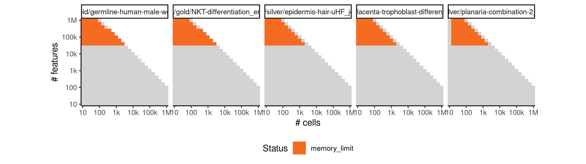

# grandprix


## ERROR STATUS METHOD_ERROR

### ERROR CLUSTER METHOD_ERROR -- 1


 * Number of instances: 476
 * Dataset ids: scaling_0001, scaling_0002, scaling_0003, scaling_0004, scaling_0006, scaling_0007, scaling_0008, scaling_0009, scaling_0010, scaling_0011, scaling_0012, scaling_0013, scaling_0015, scaling_0016, scaling_0017, scaling_0018, scaling_0019, scaling_0020, scaling_0021, scaling_0022, scaling_0023, scaling_0024, scaling_0025, scaling_0026, scaling_0027, scaling_0029, scaling_0030, scaling_0031, scaling_0032, scaling_0033, scaling_0034, scaling_0035, scaling_0036, scaling_0037, scaling_0038, scaling_0039, scaling_0040, scaling_0041, scaling_0043, scaling_0045, scaling_0047, scaling_0051, scaling_0052, scaling_0053, scaling_0056, scaling_0057, scaling_0058, scaling_0061, scaling_0062, scaling_0063, scaling_0066, scaling_0067, scaling_0068, scaling_0072, scaling_0073, scaling_0076, scaling_0077, scaling_0078, scaling_0082, scaling_0083, scaling_0084, scaling_0088, scaling_0089, scaling_0090, scaling_0094, scaling_0095, scaling_0096, scaling_0101, scaling_0102, scaling_0106, scaling_0107, scaling_0108, scaling_0113, scaling_0114, scaling_0115, scaling_0120, scaling_0121, scaling_0122, scaling_0127, scaling_0128, scaling_0129, scaling_0135, scaling_0136, scaling_0141, scaling_0143, scaling_0145, scaling_0147, scaling_0149, scaling_0151, scaling_0152, scaling_0157, scaling_0158, scaling_0163, scaling_0164, scaling_0169, scaling_0170, scaling_0176, scaling_0181, scaling_0182, scaling_0188, scaling_0189, scaling_0195, scaling_0196, scaling_0202, scaling_0203, scaling_0210, scaling_0216, scaling_0218, scaling_0220, scaling_0222, scaling_0224, scaling_0226, scaling_0227, scaling_0232, scaling_0233, scaling_0238, scaling_0239, scaling_0244, scaling_0245, scaling_0251, scaling_0256, scaling_0260, scaling_0264, scaling_0268, scaling_0272, scaling_0276, scaling_0277, scaling_0278, scaling_0287, scaling_0288, scaling_0289, scaling_0298, scaling_0299, scaling_0300, scaling_0309, scaling_0310, scaling_0311, scaling_0321, scaling_0322, scaling_0331, scaling_0333, scaling_0335, scaling_0337, scaling_0339, scaling_0341, scaling_0342, scaling_0351, scaling_0352, scaling_0361, scaling_0362, scaling_0371, scaling_0372, scaling_0382, scaling_0391, scaling_0392, scaling_0393, scaling_0404, scaling_0405, scaling_0406, scaling_0417, scaling_0418, scaling_0419, scaling_0430, scaling_0431, scaling_0432, scaling_0444, scaling_0445, scaling_0456, scaling_0457, scaling_0466, scaling_0467, scaling_0476, scaling_0477, scaling_0486, scaling_0487, scaling_0497, scaling_0506, scaling_0510, scaling_0514, scaling_0518, scaling_0522, scaling_0526, scaling_0532, scaling_0538, scaling_0544, scaling_0550, scaling_0556, scaling_0557, scaling_0565, scaling_0566, scaling_0574, scaling_0575, scaling_0583, scaling_0584, scaling_0593, scaling_0601, scaling_0602, scaling_0603, scaling_0617, scaling_0618, scaling_0619, scaling_0633, scaling_0634, scaling_0635, scaling_0649, scaling_0650, scaling_0651, scaling_0666, scaling_0667, scaling_0681, scaling_0682, scaling_0683, scaling_0698, scaling_0699, scaling_0700, scaling_0715, scaling_0716, scaling_0717, scaling_0732, scaling_0733, scaling_0734, scaling_0750, scaling_0751, scaling_0767, scaling_0768, scaling_0785, scaling_0786, scaling_0803, scaling_0804, scaling_0821, scaling_0822, scaling_0839, scaling_0840, scaling_0857, scaling_0868, scaling_0879, scaling_0890, scaling_0901, scaling_0001, scaling_0002, scaling_0003, scaling_0004, scaling_0006, scaling_0007, scaling_0008, scaling_0009, scaling_0010, scaling_0011, scaling_0012, scaling_0013, scaling_0015, scaling_0016, scaling_0017, scaling_0018, scaling_0019, scaling_0020, scaling_0021, scaling_0022, scaling_0023, scaling_0024, scaling_0025, scaling_0026, scaling_0027, scaling_0029, scaling_0030, scaling_0031, scaling_0032, scaling_0033, scaling_0034, scaling_0035, scaling_0036, scaling_0037, scaling_0038, scaling_0039, scaling_0040, scaling_0041, scaling_0043, scaling_0045, scaling_0047, scaling_0051, scaling_0052, scaling_0053, scaling_0056, scaling_0057, scaling_0058, scaling_0061, scaling_0062, scaling_0063, scaling_0066, scaling_0067, scaling_0068, scaling_0072, scaling_0073, scaling_0076, scaling_0077, scaling_0078, scaling_0082, scaling_0083, scaling_0084, scaling_0088, scaling_0089, scaling_0090, scaling_0094, scaling_0095, scaling_0096, scaling_0101, scaling_0102, scaling_0106, scaling_0107, scaling_0108, scaling_0113, scaling_0114, scaling_0115, scaling_0120, scaling_0121, scaling_0122, scaling_0127, scaling_0128, scaling_0129, scaling_0135, scaling_0136, scaling_0141, scaling_0143, scaling_0145, scaling_0147, scaling_0149, scaling_0151, scaling_0152, scaling_0157, scaling_0158, scaling_0163, scaling_0164, scaling_0169, scaling_0170, scaling_0176, scaling_0181, scaling_0182, scaling_0188, scaling_0189, scaling_0195, scaling_0196, scaling_0202, scaling_0203, scaling_0210, scaling_0216, scaling_0218, scaling_0220, scaling_0222, scaling_0224, scaling_0226, scaling_0227, scaling_0232, scaling_0233, scaling_0238, scaling_0239, scaling_0244, scaling_0245, scaling_0251, scaling_0256, scaling_0260, scaling_0264, scaling_0268, scaling_0272, scaling_0276, scaling_0277, scaling_0278, scaling_0287, scaling_0288, scaling_0289, scaling_0298, scaling_0299, scaling_0300, scaling_0309, scaling_0310, scaling_0311, scaling_0321, scaling_0322, scaling_0331, scaling_0333, scaling_0335, scaling_0337, scaling_0339, scaling_0341, scaling_0342, scaling_0351, scaling_0352, scaling_0361, scaling_0362, scaling_0371, scaling_0372, scaling_0382, scaling_0391, scaling_0392, scaling_0393, scaling_0404, scaling_0405, scaling_0406, scaling_0417, scaling_0418, scaling_0419, scaling_0430, scaling_0431, scaling_0432, scaling_0444, scaling_0445, scaling_0456, scaling_0457, scaling_0466, scaling_0467, scaling_0476, scaling_0477, scaling_0486, scaling_0487, scaling_0497, scaling_0506, scaling_0510, scaling_0514, scaling_0518, scaling_0522, scaling_0526, scaling_0532, scaling_0538, scaling_0544, scaling_0550, scaling_0556, scaling_0557, scaling_0565, scaling_0566, scaling_0574, scaling_0575, scaling_0583, scaling_0584, scaling_0593, scaling_0601, scaling_0602, scaling_0603, scaling_0617, scaling_0618, scaling_0619, scaling_0633, scaling_0634, scaling_0635, scaling_0649, scaling_0650, scaling_0651, scaling_0666, scaling_0667, scaling_0681, scaling_0682, scaling_0683, scaling_0698, scaling_0699, scaling_0700, scaling_0715, scaling_0716, scaling_0717, scaling_0732, scaling_0733, scaling_0734, scaling_0750, scaling_0751, scaling_0767, scaling_0768, scaling_0785, scaling_0786, scaling_0803, scaling_0804, scaling_0821, scaling_0822, scaling_0839, scaling_0840, scaling_0857, scaling_0868, scaling_0879, scaling_0890, scaling_0901

Last 10 lines of scaling_0001:
```
    latent_var = params["latent_var"]
  File "/usr/local/lib/python3.6/site-packages/GrandPrix/GrandPrix.py", line 27, in fit_model
    latent_prior_mean, latent_prior_var, latent_mean, latent_var, inducing_inputs, dtype)
  File "/usr/local/lib/python3.6/site-packages/GrandPrix/GrandPrixModel.py", line 88, in __init__
    X_mean=self.X_mean.copy(), X_var=self.X_var.copy(), Z=self.Z.copy(), M=self.M)
  File "/usr/local/lib/python3.6/site-packages/gpflow/core/compilable.py", line 86, in __init__
    origin_init(self, *args, **kwargs)
  File "/usr/local/lib/python3.6/site-packages/gpflow/models/gplvm.py", line 105, in __init__
    assert len(self.feature) == M
AssertionError
```

### ERROR CLUSTER METHOD_ERROR -- 2


 * Number of instances: 10
 * Dataset ids: scaling_0983, scaling_0997, scaling_1011, scaling_1025, scaling_1039, scaling_0983, scaling_0997, scaling_1011, scaling_1025, scaling_1039

Last 10 lines of scaling_0983:
```
/usr/local/lib/python3.6/site-packages/GrandPrix/GrandPrixModel.py:19: RuntimeWarning: invalid value encountered in true_divide
  return (y.copy() - y.min(0)) / (y.max(0) - y.min(0))
Warning: The model terminates abnormally...
output saved in /data/tmp//Rtmps4Nn8h/file428e72706051/ti/output: 
	cell_ids.csv
	end_state_probabilities.csv
	pseudotime.csv
	timings.json
all(pg_check >= 0 & pg_check < (1 + 1e-06)) isn't true.
Sum of progressions per cell_id should be exactly one
```

## ERROR STATUS TIME_LIMIT

### ERROR CLUSTER TIME_LIMIT -- 1


 * Number of instances: 76
 * Dataset ids: scaling_0632, scaling_0648, scaling_0696, scaling_0697, scaling_0714, scaling_0731, scaling_0748, scaling_0782, scaling_0783, scaling_0800, scaling_0801, scaling_0818, scaling_0819, scaling_0836, scaling_0837, scaling_0865, scaling_0866, scaling_0876, scaling_0877, scaling_0887, scaling_0888, scaling_0898, scaling_0918, scaling_0926, scaling_0934, scaling_0956, scaling_0962, scaling_0968, scaling_0992, scaling_0993, scaling_0994, scaling_1006, scaling_1007, scaling_1008, scaling_1020, scaling_1021, scaling_1022, scaling_1034, scaling_0632, scaling_0648, scaling_0696, scaling_0697, scaling_0714, scaling_0731, scaling_0748, scaling_0782, scaling_0783, scaling_0800, scaling_0801, scaling_0818, scaling_0819, scaling_0836, scaling_0837, scaling_0865, scaling_0866, scaling_0876, scaling_0877, scaling_0887, scaling_0888, scaling_0898, scaling_0918, scaling_0926, scaling_0934, scaling_0956, scaling_0962, scaling_0968, scaling_0992, scaling_0993, scaling_0994, scaling_1006, scaling_1007, scaling_1008, scaling_1020, scaling_1021, scaling_1022, scaling_1034

Last 10 lines of scaling_0632:
```
File: /home/rcannood/Workspace/dynverse/dynbenchmark//derived/05-scaling/suite/grandprix/10/r2gridengine/20180924_185043_grandprix_10_Fs2YfrFcmU/log/log.632.e.txt
```

## ERROR STATUS MEMORY_LIMIT

### ERROR CLUSTER MEMORY_LIMIT -- 1


 * Number of instances: 28
 * Dataset ids: scaling_0766, scaling_0784, scaling_0802, scaling_0820, scaling_0911, scaling_0919, scaling_0927, scaling_0935, scaling_0943, scaling_0982, scaling_0996, scaling_1010, scaling_1024, scaling_1038, scaling_0766, scaling_0784, scaling_0802, scaling_0820, scaling_0911, scaling_0919, scaling_0927, scaling_0935, scaling_0943, scaling_0982, scaling_0996, scaling_1010, scaling_1024, scaling_1038

Last 10 lines of scaling_0766:
```
    latent_prior_mean, latent_prior_var, latent_mean, latent_var, inducing_inputs, dtype)
  File "/usr/local/lib/python3.6/site-packages/GrandPrix/GrandPrixModel.py", line 79, in __init__
    self.set_X_mean(latent_mean)
  File "/usr/local/lib/python3.6/site-packages/GrandPrix/GrandPrixModel.py", line 242, in set_X_mean
    self.X_mean = MapTo01(gpflow.models.PCA_reduce(self.Y, self.Q))
  File "/usr/local/lib/python3.6/site-packages/gpflow/models/gplvm.py", line 218, in PCA_reduce
    evals, evecs = np.linalg.eigh(np.cov(X.T))
  File "/usr/local/lib/python3.6/site-packages/numpy/linalg/linalg.py", line 1291, in eigh
    w, vt = gufunc(a, signature=signature, extobj=extobj)
MemoryError
```

### ERROR CLUSTER MEMORY_LIMIT -- 2


 * Number of instances: 26
 * Dataset ids: scaling_0856, scaling_0867, scaling_0878, scaling_0889, scaling_0951, scaling_0957, scaling_0963, scaling_0969, scaling_0975, scaling_0981, scaling_0995, scaling_1009, scaling_1023, scaling_0856, scaling_0867, scaling_0878, scaling_0889, scaling_0951, scaling_0957, scaling_0963, scaling_0969, scaling_0975, scaling_0981, scaling_0995, scaling_1009, scaling_1023

Last 10 lines of scaling_0856:
```
    latent_prior_mean, latent_prior_var, latent_mean, latent_var, inducing_inputs, dtype)
  File "/usr/local/lib/python3.6/site-packages/GrandPrix/GrandPrixModel.py", line 79, in __init__
    self.set_X_mean(latent_mean)
  File "/usr/local/lib/python3.6/site-packages/GrandPrix/GrandPrixModel.py", line 242, in set_X_mean
    self.X_mean = MapTo01(gpflow.models.PCA_reduce(self.Y, self.Q))
  File "/usr/local/lib/python3.6/site-packages/gpflow/models/gplvm.py", line 218, in PCA_reduce
    evals, evecs = np.linalg.eigh(np.cov(X.T))
  File "/usr/local/lib/python3.6/site-packages/numpy/lib/function_base.py", line 3108, in cov
    c = dot(X, X_T.conj())
MemoryError
```


