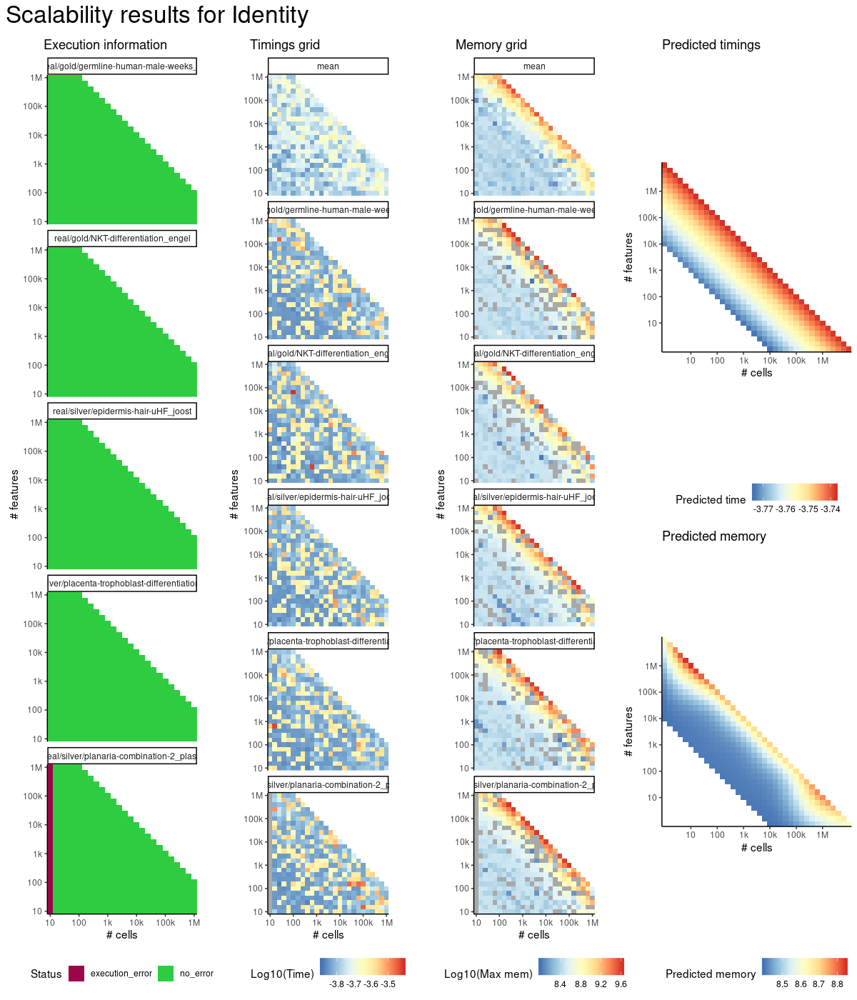
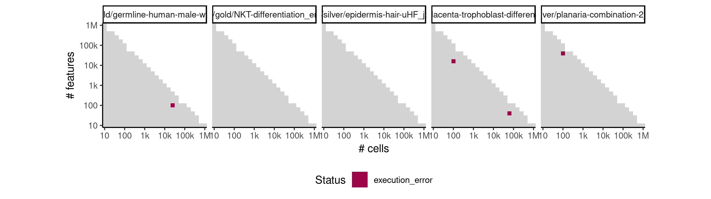
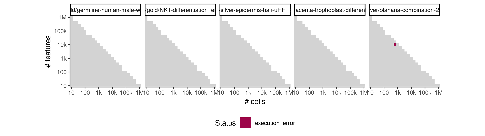
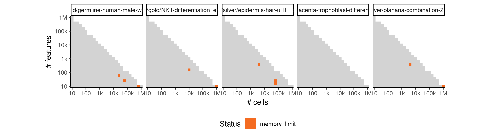

# identity


## ERROR STATUS EXECUTION_ERROR

### ERROR CLUSTER EXECUTION_ERROR -- 1


 * Number of instances: 4
 * Dataset ids: scaling_1217, scaling_1292, scaling_1356, scaling_1431

Last 10 lines of scaling_1217:
```
File: /home/rcannood/Workspace/dynverse/dynbenchmark//derived/05-scaling/suite/identity/Cat3/r2gridengine/20181009_221411_identity_Cat3_0xvEhPTcuP/log/log.72.e.txt
Execution halted
```

### ERROR CLUSTER EXECUTION_ERROR -- 2


 * Number of instances: 1
 * Dataset ids: scaling_1527

Last 10 lines of scaling_1527:
```
File: /home/rcannood/Workspace/dynverse/dynbenchmark//derived/05-scaling/suite/identity/Cat3/r2gridengine/20181009_221411_identity_Cat3_0xvEhPTcuP/log/log.382.e.txt
In addition: There were 18 warnings (use warnings() to see them)
Execution halted
```

## ERROR STATUS MEMORY_LIMIT

### ERROR CLUSTER MEMORY_LIMIT -- 1


 * Number of instances: 354
 * Dataset ids: scaling_1146, scaling_1148, scaling_1149, scaling_1150, scaling_1153, scaling_1154, scaling_1156, scaling_1157, scaling_1159, scaling_1160, scaling_1163, scaling_1165, scaling_1167, scaling_1168, scaling_1169, scaling_1170, scaling_1175, scaling_1176, scaling_1177, scaling_1180, scaling_1181, scaling_1182, scaling_1184, scaling_1186, scaling_1187, scaling_1194, scaling_1195, scaling_1196, scaling_1197, scaling_1203, scaling_1204, scaling_1206, scaling_1207, scaling_1210, scaling_1212, scaling_1213, scaling_1215, scaling_1220, scaling_1224, scaling_1225, scaling_1229, scaling_1232, scaling_1234, scaling_1236, scaling_1237, scaling_1241, scaling_1242, scaling_1244, scaling_1245, scaling_1246, scaling_1248, scaling_1251, scaling_1253, scaling_1259, scaling_1261, scaling_1262, scaling_1265, scaling_1266, scaling_1267, scaling_1271, scaling_1272, scaling_1273, scaling_1274, scaling_1275, scaling_1276, scaling_1277, scaling_1278, scaling_1279, scaling_1280, scaling_1282, scaling_1283, scaling_1286, scaling_1287, scaling_1288, scaling_1289, scaling_1290, scaling_1291, scaling_1294, scaling_1295, scaling_1296, scaling_1297, scaling_1298, scaling_1299, scaling_1300, scaling_1301, scaling_1303, scaling_1304, scaling_1308, scaling_1309, scaling_1310, scaling_1311, scaling_1312, scaling_1313, scaling_1314, scaling_1316, scaling_1317, scaling_1318, scaling_1319, scaling_1322, scaling_1323, scaling_1324, scaling_1326, scaling_1327, scaling_1329, scaling_1330, scaling_1331, scaling_1332, scaling_1333, scaling_1335, scaling_1336, scaling_1337, scaling_1338, scaling_1342, scaling_1345, scaling_1346, scaling_1347, scaling_1348, scaling_1349, scaling_1350, scaling_1351, scaling_1352, scaling_1353, scaling_1355, scaling_1357, scaling_1363, scaling_1364, scaling_1365, scaling_1366, scaling_1367, scaling_1369, scaling_1370, scaling_1372, scaling_1373, scaling_1374, scaling_1375, scaling_1376, scaling_1378, scaling_1379, scaling_1380, scaling_1381, scaling_1384, scaling_1385, scaling_1386, scaling_1387, scaling_1389, scaling_1390, scaling_1391, scaling_1393, scaling_1394, scaling_1395, scaling_1396, scaling_1397, scaling_1399, scaling_1402, scaling_1403, scaling_1404, scaling_1405, scaling_1406, scaling_1407, scaling_1408, scaling_1409, scaling_1410, scaling_1413, scaling_1414, scaling_1415, scaling_1416, scaling_1417, scaling_1418, scaling_1420, scaling_1421, scaling_1423, scaling_1426, scaling_1427, scaling_1428, scaling_1429, scaling_1430, scaling_1432, scaling_1434, scaling_1437, scaling_1441, scaling_1442, scaling_1443, scaling_1444, scaling_1445, scaling_1446, scaling_1447, scaling_1448, scaling_1449, scaling_1451, scaling_1452, scaling_1453, scaling_1454, scaling_1457, scaling_1458, scaling_1459, scaling_1461, scaling_1462, scaling_1463, scaling_1464, scaling_1465, scaling_1467, scaling_1468, scaling_1469, scaling_1472, scaling_1475, scaling_1476, scaling_1477, scaling_1478, scaling_1479, scaling_1481, scaling_1485, scaling_1487, scaling_1488, scaling_1492, scaling_1495, scaling_1497, scaling_1498, scaling_1501, scaling_1502, scaling_1506, scaling_1509, scaling_1510, scaling_1511, scaling_1514, scaling_1515, scaling_1516, scaling_1521, scaling_1522, scaling_1523, scaling_1525, scaling_1526, scaling_1529, scaling_1530, scaling_1532, scaling_1535, scaling_1536, scaling_1537, scaling_1538, scaling_1539, scaling_1540, scaling_1542, scaling_1543, scaling_1544, scaling_1546, scaling_1547, scaling_1548, scaling_1550, scaling_1551, scaling_1552, scaling_1555, scaling_1556, scaling_1557, scaling_1558, scaling_1560, scaling_1561, scaling_1563, scaling_1564, scaling_1565, scaling_1566, scaling_1567, scaling_1568, scaling_1571, scaling_1572, scaling_1576, scaling_1577, scaling_1578, scaling_1579, scaling_1580, scaling_1582, scaling_1585, scaling_1586, scaling_1587, scaling_1592, scaling_1593, scaling_1594, scaling_1596, scaling_1599, scaling_1600, scaling_1601, scaling_1602, scaling_1603, scaling_1605, scaling_1611, scaling_1612, scaling_1613, scaling_1615, scaling_1618, scaling_1619, scaling_1620, scaling_1621, scaling_1622, scaling_1624, scaling_1625, scaling_1627, scaling_1628, scaling_1631, scaling_1634, scaling_1635, scaling_1637, scaling_1638, scaling_1639, scaling_1640, scaling_1641, scaling_1644, scaling_1645, scaling_1646, scaling_1650, scaling_1651, scaling_1654, scaling_1659, scaling_1661, scaling_1662, scaling_1663, scaling_1664, scaling_1666, scaling_1668, scaling_1670, scaling_1671, scaling_1672, scaling_1675, scaling_1676, scaling_1682, scaling_1684, scaling_1685, scaling_1686, scaling_1687, scaling_1688, scaling_1689, scaling_1690, scaling_1695, scaling_1696, scaling_1697, scaling_1698, scaling_1701, scaling_1703, scaling_1704, scaling_1705, scaling_1706, scaling_1707, scaling_1711, scaling_1712, scaling_1713, scaling_1718, scaling_1719, scaling_1720, scaling_1721, scaling_1723, scaling_1727, scaling_1728, scaling_1729, scaling_1731, scaling_1732, scaling_1733, scaling_1734

Last 10 lines of scaling_1146:
```
error writing to connection
```

### ERROR CLUSTER MEMORY_LIMIT -- 2


 * Number of instances: 10
 * Dataset ids: scaling_1151, scaling_1179, scaling_1193, scaling_1208, scaling_1240, scaling_1249, scaling_1257, scaling_1549, scaling_1669, scaling_1735

Last 10 lines of scaling_1151:
```
The following objects are masked from ‘package:stats’:
    filter, lag
The following objects are masked from ‘package:base’:
    intersect, setdiff, setequal, union
Attaching package: ‘purrr’
The following object is masked from ‘package:jsonlite’:
    flatten
Error in saveRDS(x, con) : error writing to connection
Calls: write_rds -> saveRDS
Execution halted
```


