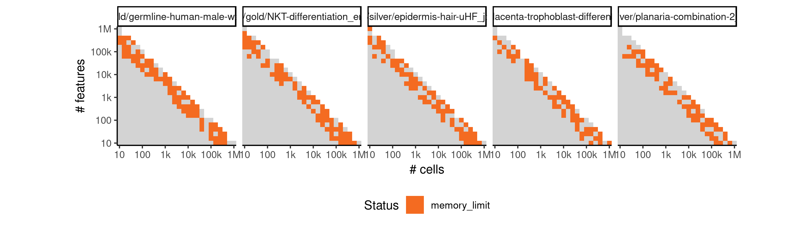

# identity


## ERROR STATUS MEMORY_LIMIT

### ERROR CLUSTER MEMORY_LIMIT -- 1


 * Number of instances: 1
 * Dataset ids: scaling_0086

Last 10 lines of scaling_0086:
```
12: lapply(X = X, FUN = FUN, ...)
13: parallel::mclapply(seq_len(nrow(dataset)), mc.cores = mc_cores,     function(i) {        dataseti <- dynutils::extract_row_to_list(dataset, i)        model <- method_outputs$model[[i]]        if (!is.null(model)) {            time0 <- Sys.time()            model <- model %>% dynwrap::add_cell_waypoints(num_cells_selected = length(dataseti$waypoint_cells))            time1 <- Sys.time()            time_cellwaypoints <- as.numeric(difftime(time1,                 time0, units = "sec"))            df_cellwaypoints <- data_frame(time_cellwaypoints)        }        else {            df_cellwaypoints <- NULL        }        metrics_summary <- calculate_metrics(dataseti, model,             metrics)        summary <- bind_cols(method_outputs$summary[[i]], df_cellwaypoints,             metrics_summary)        if (!output_model && !is.null(model)) {            model <- TRUE        }        lst(summary, model)    })
14: evaluate_ti_method(dataset = dataset, method = method, parameters = params,     metrics = metrics, give_priors = priors, output_model = output_models,     mc_cores = 1, verbose = verbose)
15: benchmark_run_evaluation(i = i, subdesign = subdesign, metrics = metrics,     verbose = verbose, error_mode = FALSE, output_models = output_models)
16: (function (i) {    benchmark_run_evaluation(i = i, subdesign = subdesign, metrics = metrics,         verbose = verbose, error_mode = FALSE, output_models = output_models)})(86L)
17: do.call(PitSoL_params$FUN, c(list(PitSoL_params$X[[PitSoL_data]]),     PitSoL_params$DOTPARAMS))
18: FUN(X[[i]], ...)
19: lapply(seq(PitSoL_params$QSUB_START[[PitSoL_index]], PitSoL_params$QSUB_STOP[[PitSoL_index]]),     function(PitSoL_data) {        do.call(PitSoL_params$FUN, c(list(PitSoL_params$X[[PitSoL_data]]),             PitSoL_params$DOTPARAMS))    })
An irrecoverable exception occurred. R is aborting now ...
/var/spool/sge/prismcls01/job_scripts/8636: line 11: 114481 Segmentation fault      (core dumped) Rscript --default-packages=methods,stats,utils,graphics,grDevices script.R $SGE_TASK_ID
```


