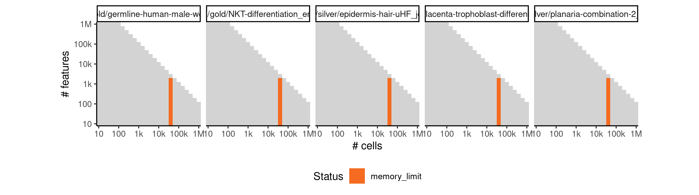
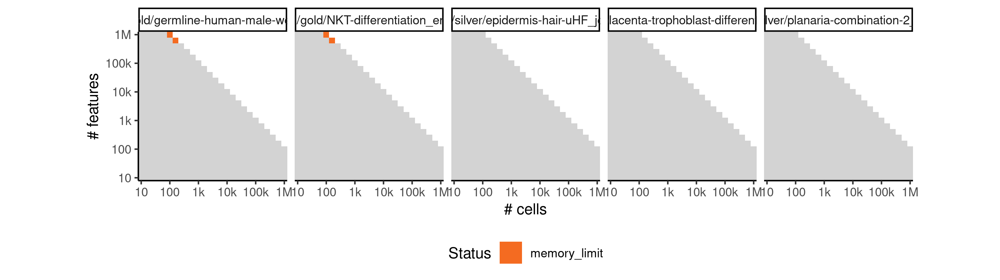

# matcher


## ERROR STATUS EXECUTION_ERROR

### ERROR CLUSTER EXECUTION_ERROR -- 1


 * Number of instances: 1
 * Dataset ids: scaling_1844

Last 10 lines of scaling_1844:
```
File: /home/rcannood/Workspace/dynverse/dynbenchmark//derived/05-scaling/suite/matcher/Cat4/r2gridengine/20181012_214251_matcher_Cat4_kAygK55fPO/log/log.109.e.txt
Execution halted
```

## ERROR STATUS METHOD_ERROR

### ERROR CLUSTER METHOD_ERROR -- 1


 * Number of instances: 1
 * Dataset ids: scaling_1647

Last 10 lines of scaling_1647:
```
    super(BayesianGPLVM,self).parameters_changed()
  File "/usr/local/lib/python3.6/site-packages/GPy/core/sparse_gp_mpi.py", line 122, in parameters_changed
    super(SparseGP_MPI,self).parameters_changed()
  File "/usr/local/lib/python3.6/site-packages/GPy/core/sparse_gp.py", line 80, in parameters_changed
    mean_function=self.mean_function)
  File "/usr/local/lib/python3.6/site-packages/GPy/inference/latent_function_inference/var_dtc.py", line 135, in inference
    LB = jitchol(B)
  File "/usr/local/lib/python3.6/site-packages/GPy/util/linalg.py", line 64, in jitchol
    raise linalg.LinAlgError("not pd: non-positive diagonal elements")
numpy.linalg.linalg.LinAlgError: not pd: non-positive diagonal elements
```

## ERROR STATUS TIME_LIMIT

### ERROR CLUSTER TIME_LIMIT -- 1


 * Number of instances: 52
 * Dataset ids: scaling_0714, scaling_0800, scaling_0801, scaling_0818, scaling_0865, scaling_0876, scaling_0887, scaling_1006, scaling_1007, scaling_1085, scaling_1086, scaling_1193, scaling_1194, scaling_1195, scaling_1226, scaling_1311, scaling_1312, scaling_1313, scaling_1374, scaling_1388, scaling_1400, scaling_1401, scaling_1437, scaling_1461, scaling_1485, scaling_1496, scaling_1510, scaling_1516, scaling_1544, scaling_1560, scaling_1561, scaling_1562, scaling_1563, scaling_1598, scaling_1618, scaling_1619, scaling_1637, scaling_1639, scaling_1641, scaling_1659, scaling_1660, scaling_1661, scaling_1662, scaling_1663, scaling_1681, scaling_1685, scaling_1706, scaling_1707, scaling_1728, scaling_1776, scaling_1853, scaling_2204

Last 10 lines of scaling_0714:
```
File: /home/rcannood/Workspace/dynverse/dynbenchmark//derived/05-scaling/suite/matcher/Cat2/r2gridengine/20181008_214949_matcher_Cat2_YPG3qY3nuD/log/log.34.e.txt
```

## ERROR STATUS MEMORY_LIMIT

### ERROR CLUSTER MEMORY_LIMIT -- 1


 * Number of instances: 40
 * Dataset ids: scaling_0866, scaling_0877, scaling_0888, scaling_0899, scaling_0910, scaling_0956, scaling_0962, scaling_0968, scaling_0974, scaling_0980, scaling_1068, scaling_1087, scaling_1106, scaling_1125, scaling_1144, scaling_1157, scaling_1159, scaling_1161, scaling_1163, scaling_1165, scaling_1267, scaling_1269, scaling_1271, scaling_1273, scaling_1275, scaling_1390, scaling_1402, scaling_1414, scaling_1426, scaling_1438, scaling_1505, scaling_1511, scaling_1517, scaling_1523, scaling_1529, scaling_1642, scaling_1664, scaling_1686, scaling_1708, scaling_1730

Last 10 lines of scaling_0866:
```
    super(BayesianGPLVM,self).parameters_changed()
  File "/usr/local/lib/python3.6/site-packages/GPy/core/sparse_gp_mpi.py", line 122, in parameters_changed
    super(SparseGP_MPI,self).parameters_changed()
  File "/usr/local/lib/python3.6/site-packages/GPy/core/sparse_gp.py", line 80, in parameters_changed
    mean_function=self.mean_function)
  File "/usr/local/lib/python3.6/site-packages/GPy/inference/latent_function_inference/var_dtc.py", line 146, in inference
    - np.eye(Y.shape[0]), VVT_factor)
  File "/usr/local/lib/python3.6/site-packages/numpy/lib/twodim_base.py", line 186, in eye
    m = zeros((N, M), dtype=dtype, order=order)
MemoryError
```

### ERROR CLUSTER MEMORY_LIMIT -- 2


 * Number of instances: 134
 * Dataset ids: scaling_0994, scaling_1008, scaling_1022, scaling_1036, scaling_1050, scaling_1069, scaling_1088, scaling_1107, scaling_1126, scaling_1145, scaling_1147, scaling_1149, scaling_1151, scaling_1153, scaling_1155, scaling_1180, scaling_1181, scaling_1196, scaling_1197, scaling_1212, scaling_1213, scaling_1228, scaling_1229, scaling_1244, scaling_1245, scaling_1249, scaling_1253, scaling_1257, scaling_1261, scaling_1265, scaling_1293, scaling_1294, scaling_1295, scaling_1296, scaling_1314, scaling_1315, scaling_1316, scaling_1317, scaling_1335, scaling_1336, scaling_1337, scaling_1338, scaling_1356, scaling_1357, scaling_1358, scaling_1359, scaling_1377, scaling_1378, scaling_1379, scaling_1380, scaling_1391, scaling_1392, scaling_1403, scaling_1404, scaling_1415, scaling_1416, scaling_1427, scaling_1428, scaling_1439, scaling_1440, scaling_1450, scaling_1451, scaling_1452, scaling_1462, scaling_1463, scaling_1464, scaling_1474, scaling_1475, scaling_1476, scaling_1486, scaling_1487, scaling_1488, scaling_1498, scaling_1499, scaling_1500, scaling_1506, scaling_1512, scaling_1518, scaling_1524, scaling_1530, scaling_1545, scaling_1546, scaling_1547, scaling_1548, scaling_1549, scaling_1564, scaling_1565, scaling_1566, scaling_1567, scaling_1568, scaling_1583, scaling_1584, scaling_1585, scaling_1586, scaling_1587, scaling_1602, scaling_1603, scaling_1604, scaling_1605, scaling_1606, scaling_1621, scaling_1622, scaling_1623, scaling_1624, scaling_1625, scaling_1643, scaling_1644, scaling_1645, scaling_1646, scaling_1665, scaling_1666, scaling_1667, scaling_1668, scaling_1669, scaling_1687, scaling_1688, scaling_1689, scaling_1690, scaling_1691, scaling_1709, scaling_1710, scaling_1711, scaling_1712, scaling_1713, scaling_1731, scaling_1732, scaling_1733, scaling_1734, scaling_1735, scaling_1746, scaling_1807, scaling_1825, scaling_1838, scaling_2241

Last 10 lines of scaling_0994:
```
    self.parameters_changed()
  File "/usr/local/lib/python3.6/site-packages/GPy/models/bayesian_gplvm.py", line 85, in parameters_changed
    super(BayesianGPLVM,self).parameters_changed()
  File "/usr/local/lib/python3.6/site-packages/GPy/core/sparse_gp_mpi.py", line 122, in parameters_changed
    super(SparseGP_MPI,self).parameters_changed()
  File "/usr/local/lib/python3.6/site-packages/GPy/core/sparse_gp.py", line 80, in parameters_changed
    mean_function=self.mean_function)
  File "/usr/local/lib/python3.6/site-packages/GPy/inference/latent_function_inference/var_dtc.py", line 145, in inference
    dL_dm = -np.dot((_LBi_Lmi_psi1.T.dot(_LBi_Lmi_psi1))
MemoryError
```

### ERROR CLUSTER MEMORY_LIMIT -- 3


 * Number of instances: 579
 * Dataset ids: scaling_1736, scaling_1737, scaling_1738, scaling_1739, scaling_1740, scaling_1741, scaling_1742, scaling_1743, scaling_1744, scaling_1745, scaling_1747, scaling_1748, scaling_1750, scaling_1751, scaling_1753, scaling_1754, scaling_1755, scaling_1756, scaling_1757, scaling_1758, scaling_1759, scaling_1760, scaling_1761, scaling_1762, scaling_1763, scaling_1765, scaling_1766, scaling_1767, scaling_1768, scaling_1769, scaling_1770, scaling_1771, scaling_1772, scaling_1773, scaling_1774, scaling_1775, scaling_1777, scaling_1778, scaling_1779, scaling_1780, scaling_1781, scaling_1782, scaling_1783, scaling_1784, scaling_1785, scaling_1786, scaling_1787, scaling_1788, scaling_1789, scaling_1790, scaling_1791, scaling_1792, scaling_1793, scaling_1794, scaling_1795, scaling_1796, scaling_1798, scaling_1799, scaling_1800, scaling_1801, scaling_1802, scaling_1803, scaling_1804, scaling_1805, scaling_1806, scaling_1808, scaling_1809, scaling_1810, scaling_1811, scaling_1812, scaling_1813, scaling_1814, scaling_1815, scaling_1816, scaling_1817, scaling_1818, scaling_1819, scaling_1820, scaling_1822, scaling_1823, scaling_1824, scaling_1826, scaling_1827, scaling_1828, scaling_1829, scaling_1830, scaling_1831, scaling_1832, scaling_1833, scaling_1834, scaling_1835, scaling_1836, scaling_1837, scaling_1839, scaling_1840, scaling_1841, scaling_1842, scaling_1843, scaling_1845, scaling_1846, scaling_1847, scaling_1848, scaling_1849, scaling_1850, scaling_1851, scaling_1852, scaling_1854, scaling_1855, scaling_1856, scaling_1857, scaling_1858, scaling_1859, scaling_1860, scaling_1861, scaling_1862, scaling_1863, scaling_1864, scaling_1865, scaling_1866, scaling_1867, scaling_1868, scaling_1869, scaling_1870, scaling_1871, scaling_1872, scaling_1873, scaling_1874, scaling_1875, scaling_1876, scaling_1877, scaling_1878, scaling_1879, scaling_1880, scaling_1881, scaling_1882, scaling_1883, scaling_1884, scaling_1885, scaling_1886, scaling_1887, scaling_1888, scaling_1889, scaling_1890, scaling_1891, scaling_1892, scaling_1893, scaling_1894, scaling_1895, scaling_1896, scaling_1897, scaling_1898, scaling_1899, scaling_1900, scaling_1901, scaling_1902, scaling_1903, scaling_1904, scaling_1905, scaling_1906, scaling_1907, scaling_1908, scaling_1909, scaling_1910, scaling_1911, scaling_1912, scaling_1913, scaling_1914, scaling_1915, scaling_1916, scaling_1917, scaling_1918, scaling_1919, scaling_1920, scaling_1921, scaling_1922, scaling_1923, scaling_1924, scaling_1925, scaling_1926, scaling_1927, scaling_1928, scaling_1929, scaling_1930, scaling_1931, scaling_1932, scaling_1933, scaling_1934, scaling_1935, scaling_1936, scaling_1937, scaling_1938, scaling_1939, scaling_1940, scaling_1941, scaling_1942, scaling_1943, scaling_1944, scaling_1945, scaling_1946, scaling_1947, scaling_1948, scaling_1949, scaling_1950, scaling_1951, scaling_1952, scaling_1953, scaling_1954, scaling_1955, scaling_1956, scaling_1957, scaling_1958, scaling_1959, scaling_1960, scaling_1961, scaling_1962, scaling_1963, scaling_1964, scaling_1965, scaling_1966, scaling_1967, scaling_1968, scaling_1969, scaling_1970, scaling_1971, scaling_1972, scaling_1973, scaling_1974, scaling_1975, scaling_1976, scaling_1977, scaling_1978, scaling_1979, scaling_1980, scaling_1981, scaling_1982, scaling_1983, scaling_1984, scaling_1985, scaling_1986, scaling_1987, scaling_1988, scaling_1989, scaling_1990, scaling_1991, scaling_1992, scaling_1993, scaling_1994, scaling_1995, scaling_1996, scaling_1997, scaling_1998, scaling_1999, scaling_2000, scaling_2001, scaling_2002, scaling_2003, scaling_2004, scaling_2005, scaling_2006, scaling_2007, scaling_2008, scaling_2009, scaling_2010, scaling_2011, scaling_2012, scaling_2013, scaling_2014, scaling_2015, scaling_2016, scaling_2017, scaling_2018, scaling_2019, scaling_2020, scaling_2022, scaling_2023, scaling_2024, scaling_2025, scaling_2026, scaling_2027, scaling_2028, scaling_2029, scaling_2030, scaling_2031, scaling_2032, scaling_2033, scaling_2034, scaling_2035, scaling_2036, scaling_2037, scaling_2038, scaling_2039, scaling_2040, scaling_2041, scaling_2042, scaling_2043, scaling_2044, scaling_2045, scaling_2046, scaling_2047, scaling_2048, scaling_2049, scaling_2050, scaling_2051, scaling_2052, scaling_2053, scaling_2054, scaling_2055, scaling_2056, scaling_2057, scaling_2058, scaling_2059, scaling_2060, scaling_2061, scaling_2062, scaling_2063, scaling_2064, scaling_2065, scaling_2066, scaling_2067, scaling_2068, scaling_2069, scaling_2070, scaling_2071, scaling_2072, scaling_2073, scaling_2074, scaling_2075, scaling_2076, scaling_2077, scaling_2078, scaling_2079, scaling_2080, scaling_2081, scaling_2082, scaling_2083, scaling_2084, scaling_2085, scaling_2086, scaling_2087, scaling_2088, scaling_2089, scaling_2090, scaling_2091, scaling_2092, scaling_2093, scaling_2094, scaling_2095, scaling_2096, scaling_2097, scaling_2098, scaling_2099, scaling_2100, scaling_2101, scaling_2102, scaling_2103, scaling_2104, scaling_2105, scaling_2106, scaling_2107, scaling_2108, scaling_2109, scaling_2110, scaling_2111, scaling_2112, scaling_2113, scaling_2114, scaling_2115, scaling_2116, scaling_2117, scaling_2118, scaling_2119, scaling_2120, scaling_2121, scaling_2122, scaling_2123, scaling_2124, scaling_2125, scaling_2126, scaling_2127, scaling_2128, scaling_2129, scaling_2130, scaling_2131, scaling_2132, scaling_2133, scaling_2134, scaling_2135, scaling_2136, scaling_2137, scaling_2138, scaling_2139, scaling_2140, scaling_2141, scaling_2142, scaling_2143, scaling_2144, scaling_2145, scaling_2146, scaling_2147, scaling_2148, scaling_2149, scaling_2150, scaling_2151, scaling_2152, scaling_2153, scaling_2154, scaling_2155, scaling_2156, scaling_2157, scaling_2158, scaling_2159, scaling_2160, scaling_2161, scaling_2162, scaling_2163, scaling_2164, scaling_2165, scaling_2166, scaling_2167, scaling_2168, scaling_2169, scaling_2170, scaling_2171, scaling_2172, scaling_2173, scaling_2174, scaling_2175, scaling_2176, scaling_2177, scaling_2178, scaling_2179, scaling_2180, scaling_2181, scaling_2182, scaling_2183, scaling_2184, scaling_2185, scaling_2186, scaling_2187, scaling_2188, scaling_2189, scaling_2190, scaling_2191, scaling_2192, scaling_2193, scaling_2194, scaling_2195, scaling_2196, scaling_2197, scaling_2198, scaling_2199, scaling_2201, scaling_2202, scaling_2203, scaling_2205, scaling_2206, scaling_2207, scaling_2208, scaling_2209, scaling_2210, scaling_2211, scaling_2212, scaling_2213, scaling_2214, scaling_2215, scaling_2216, scaling_2217, scaling_2218, scaling_2219, scaling_2220, scaling_2221, scaling_2222, scaling_2223, scaling_2224, scaling_2225, scaling_2226, scaling_2227, scaling_2228, scaling_2229, scaling_2230, scaling_2231, scaling_2232, scaling_2233, scaling_2234, scaling_2235, scaling_2236, scaling_2237, scaling_2238, scaling_2239, scaling_2240, scaling_2242, scaling_2243, scaling_2244, scaling_2245, scaling_2246, scaling_2247, scaling_2248, scaling_2249, scaling_2250, scaling_2251, scaling_2252, scaling_2253, scaling_2254, scaling_2255, scaling_2256, scaling_2257, scaling_2258, scaling_2259, scaling_2260, scaling_2261, scaling_2262, scaling_2263, scaling_2264, scaling_2265, scaling_2266, scaling_2267, scaling_2268, scaling_2269, scaling_2270, scaling_2271, scaling_2272, scaling_2273, scaling_2274, scaling_2275, scaling_2276, scaling_2277, scaling_2278, scaling_2279, scaling_2280, scaling_2281, scaling_2282, scaling_2283, scaling_2284, scaling_2285, scaling_2286, scaling_2287, scaling_2288, scaling_2289, scaling_2290, scaling_2291, scaling_2292, scaling_2293, scaling_2294, scaling_2295, scaling_2296, scaling_2297, scaling_2298, scaling_2299, scaling_2300, scaling_2301, scaling_2302, scaling_2303, scaling_2304, scaling_2305, scaling_2306, scaling_2307, scaling_2308, scaling_2309, scaling_2310, scaling_2311, scaling_2312, scaling_2313, scaling_2314, scaling_2315, scaling_2316, scaling_2317, scaling_2318, scaling_2319, scaling_2320, scaling_2321, scaling_2322, scaling_2323, scaling_2324, scaling_2325, scaling_2326, scaling_2327, scaling_2328, scaling_2329, scaling_2330

Last 10 lines of scaling_1736:
```
Error writing to connection:  No space left on device
```


