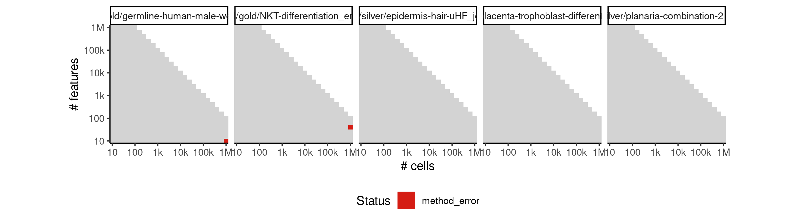
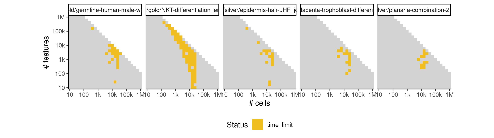

# matcher


## ERROR STATUS METHOD_ERROR

### ERROR CLUSTER METHOD_ERROR -- 1


 * Number of instances: 1
 * Dataset ids: scaling_1647

Last 10 lines of scaling_1647:
```
    super(BayesianGPLVM,self).parameters_changed()
  File "/usr/local/lib/python3.6/site-packages/GPy/core/sparse_gp_mpi.py", line 122, in parameters_changed
    super(SparseGP_MPI,self).parameters_changed()
  File "/usr/local/lib/python3.6/site-packages/GPy/core/sparse_gp.py", line 80, in parameters_changed
    mean_function=self.mean_function)
  File "/usr/local/lib/python3.6/site-packages/GPy/inference/latent_function_inference/var_dtc.py", line 135, in inference
    LB = jitchol(B)
  File "/usr/local/lib/python3.6/site-packages/GPy/util/linalg.py", line 64, in jitchol
    raise linalg.LinAlgError("not pd: non-positive diagonal elements")
numpy.linalg.linalg.LinAlgError: not pd: non-positive diagonal elements
```

## ERROR STATUS TIME_LIMIT

### ERROR CLUSTER TIME_LIMIT -- 1


 * Number of instances: 49
 * Dataset ids: scaling_0714, scaling_0800, scaling_0801, scaling_0818, scaling_0865, scaling_0876, scaling_0887, scaling_1006, scaling_1007, scaling_1085, scaling_1086, scaling_1193, scaling_1194, scaling_1195, scaling_1226, scaling_1311, scaling_1312, scaling_1313, scaling_1374, scaling_1388, scaling_1400, scaling_1401, scaling_1437, scaling_1461, scaling_1485, scaling_1496, scaling_1510, scaling_1516, scaling_1544, scaling_1560, scaling_1561, scaling_1562, scaling_1563, scaling_1598, scaling_1618, scaling_1619, scaling_1637, scaling_1639, scaling_1641, scaling_1659, scaling_1660, scaling_1661, scaling_1662, scaling_1663, scaling_1681, scaling_1685, scaling_1706, scaling_1707, scaling_1728

Last 10 lines of scaling_0714:
```
File: /home/rcannood/Workspace/dynverse/dynbenchmark//derived/05-scaling/suite/matcher/Cat2/r2gridengine/20181008_214949_matcher_Cat2_YPG3qY3nuD/log/log.34.e.txt
```

## ERROR STATUS MEMORY_LIMIT

### ERROR CLUSTER MEMORY_LIMIT -- 1


 * Number of instances: 40
 * Dataset ids: scaling_0866, scaling_0877, scaling_0888, scaling_0899, scaling_0910, scaling_0956, scaling_0962, scaling_0968, scaling_0974, scaling_0980, scaling_1068, scaling_1087, scaling_1106, scaling_1125, scaling_1144, scaling_1157, scaling_1159, scaling_1161, scaling_1163, scaling_1165, scaling_1267, scaling_1269, scaling_1271, scaling_1273, scaling_1275, scaling_1390, scaling_1402, scaling_1414, scaling_1426, scaling_1438, scaling_1505, scaling_1511, scaling_1517, scaling_1523, scaling_1529, scaling_1642, scaling_1664, scaling_1686, scaling_1708, scaling_1730

Last 10 lines of scaling_0866:
```
    super(BayesianGPLVM,self).parameters_changed()
  File "/usr/local/lib/python3.6/site-packages/GPy/core/sparse_gp_mpi.py", line 122, in parameters_changed
    super(SparseGP_MPI,self).parameters_changed()
  File "/usr/local/lib/python3.6/site-packages/GPy/core/sparse_gp.py", line 80, in parameters_changed
    mean_function=self.mean_function)
  File "/usr/local/lib/python3.6/site-packages/GPy/inference/latent_function_inference/var_dtc.py", line 146, in inference
    - np.eye(Y.shape[0]), VVT_factor)
  File "/usr/local/lib/python3.6/site-packages/numpy/lib/twodim_base.py", line 186, in eye
    m = zeros((N, M), dtype=dtype, order=order)
MemoryError
```

### ERROR CLUSTER MEMORY_LIMIT -- 2


 * Number of instances: 129
 * Dataset ids: scaling_0994, scaling_1008, scaling_1022, scaling_1036, scaling_1050, scaling_1069, scaling_1088, scaling_1107, scaling_1126, scaling_1145, scaling_1147, scaling_1149, scaling_1151, scaling_1153, scaling_1155, scaling_1180, scaling_1181, scaling_1196, scaling_1197, scaling_1212, scaling_1213, scaling_1228, scaling_1229, scaling_1244, scaling_1245, scaling_1249, scaling_1253, scaling_1257, scaling_1261, scaling_1265, scaling_1293, scaling_1294, scaling_1295, scaling_1296, scaling_1314, scaling_1315, scaling_1316, scaling_1317, scaling_1335, scaling_1336, scaling_1337, scaling_1338, scaling_1356, scaling_1357, scaling_1358, scaling_1359, scaling_1377, scaling_1378, scaling_1379, scaling_1380, scaling_1391, scaling_1392, scaling_1403, scaling_1404, scaling_1415, scaling_1416, scaling_1427, scaling_1428, scaling_1439, scaling_1440, scaling_1450, scaling_1451, scaling_1452, scaling_1462, scaling_1463, scaling_1464, scaling_1474, scaling_1475, scaling_1476, scaling_1486, scaling_1487, scaling_1488, scaling_1498, scaling_1499, scaling_1500, scaling_1506, scaling_1512, scaling_1518, scaling_1524, scaling_1530, scaling_1545, scaling_1546, scaling_1547, scaling_1548, scaling_1549, scaling_1564, scaling_1565, scaling_1566, scaling_1567, scaling_1568, scaling_1583, scaling_1584, scaling_1585, scaling_1586, scaling_1587, scaling_1602, scaling_1603, scaling_1604, scaling_1605, scaling_1606, scaling_1621, scaling_1622, scaling_1623, scaling_1624, scaling_1625, scaling_1643, scaling_1644, scaling_1645, scaling_1646, scaling_1665, scaling_1666, scaling_1667, scaling_1668, scaling_1669, scaling_1687, scaling_1688, scaling_1689, scaling_1690, scaling_1691, scaling_1709, scaling_1710, scaling_1711, scaling_1712, scaling_1713, scaling_1731, scaling_1732, scaling_1733, scaling_1734, scaling_1735

Last 10 lines of scaling_0994:
```
    self.parameters_changed()
  File "/usr/local/lib/python3.6/site-packages/GPy/models/bayesian_gplvm.py", line 85, in parameters_changed
    super(BayesianGPLVM,self).parameters_changed()
  File "/usr/local/lib/python3.6/site-packages/GPy/core/sparse_gp_mpi.py", line 122, in parameters_changed
    super(SparseGP_MPI,self).parameters_changed()
  File "/usr/local/lib/python3.6/site-packages/GPy/core/sparse_gp.py", line 80, in parameters_changed
    mean_function=self.mean_function)
  File "/usr/local/lib/python3.6/site-packages/GPy/inference/latent_function_inference/var_dtc.py", line 145, in inference
    dL_dm = -np.dot((_LBi_Lmi_psi1.T.dot(_LBi_Lmi_psi1))
MemoryError
```


