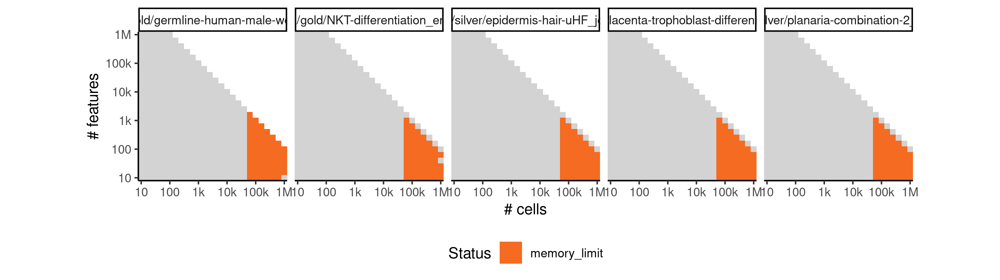

# matcher


## ERROR STATUS TIME_LIMIT

### ERROR CLUSTER TIME_LIMIT -- 1


 * Number of instances: 7
 * Dataset ids: scaling_0714, scaling_0782, scaling_0800, scaling_0865, scaling_0876, scaling_0887, scaling_1006

Last 10 lines of scaling_0714:
```
File: /home/rcannood/Workspace/dynverse/dynbenchmark//derived/05-scaling/suite/matcher/10/r2gridengine/20180924_185024_matcher_10_f0PzbOoAMw/log/log.714.e.txt
```

## ERROR STATUS MEMORY_LIMIT

### ERROR CLUSTER MEMORY_LIMIT -- 1


 * Number of instances: 15
 * Dataset ids: scaling_0783, scaling_0801, scaling_0819, scaling_0837, scaling_0855, scaling_0918, scaling_0926, scaling_0934, scaling_0942, scaling_0950, scaling_0993, scaling_1007, scaling_1021, scaling_1035, scaling_1049

Last 10 lines of scaling_0783:
```
    super(BayesianGPLVM,self).parameters_changed()
  File "/usr/local/lib/python3.6/site-packages/GPy/core/sparse_gp_mpi.py", line 122, in parameters_changed
    super(SparseGP_MPI,self).parameters_changed()
  File "/usr/local/lib/python3.6/site-packages/GPy/core/sparse_gp.py", line 80, in parameters_changed
    mean_function=self.mean_function)
  File "/usr/local/lib/python3.6/site-packages/GPy/inference/latent_function_inference/var_dtc.py", line 146, in inference
    - np.eye(Y.shape[0]), VVT_factor)
  File "/usr/local/lib/python3.6/site-packages/numpy/lib/twodim_base.py", line 186, in eye
    m = zeros((N, M), dtype=dtype, order=order)
MemoryError
```

### ERROR CLUSTER MEMORY_LIMIT -- 2


 * Number of instances: 15
 * Dataset ids: scaling_0866, scaling_0877, scaling_0888, scaling_0899, scaling_0910, scaling_0956, scaling_0962, scaling_0968, scaling_0974, scaling_0980, scaling_0994, scaling_1008, scaling_1022, scaling_1036, scaling_1050

Last 10 lines of scaling_0866:
```
    self.parameters_changed()
  File "/usr/local/lib/python3.6/site-packages/GPy/models/bayesian_gplvm.py", line 85, in parameters_changed
    super(BayesianGPLVM,self).parameters_changed()
  File "/usr/local/lib/python3.6/site-packages/GPy/core/sparse_gp_mpi.py", line 122, in parameters_changed
    super(SparseGP_MPI,self).parameters_changed()
  File "/usr/local/lib/python3.6/site-packages/GPy/core/sparse_gp.py", line 80, in parameters_changed
    mean_function=self.mean_function)
  File "/usr/local/lib/python3.6/site-packages/GPy/inference/latent_function_inference/var_dtc.py", line 145, in inference
    dL_dm = -np.dot((_LBi_Lmi_psi1.T.dot(_LBi_Lmi_psi1))
MemoryError
```


