# merlot


## ERROR STATUS EXECUTION_ERROR

### ERROR CLUSTER EXECUTION_ERROR -- 1
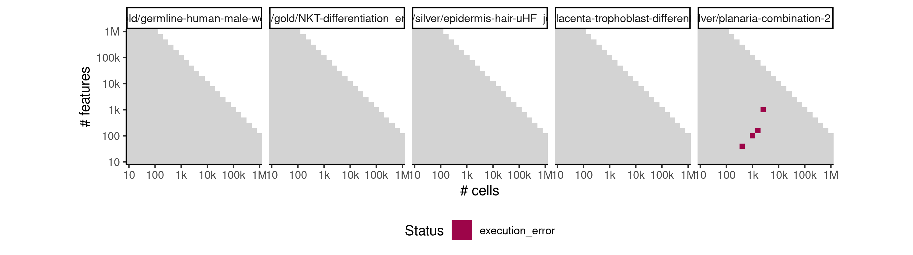

 * Number of instances: 3
 * Dataset ids: scaling_0388, scaling_0675, scaling_0849

Last 10 lines of scaling_0388:
```
File: /home/rcannood/Workspace/dynverse/dynbenchmark//derived/05-scaling/suite/merlot/Cat1/r2gridengine/20181008_142051_merlot_Cat1_PdvFPj52Ua/log/log.388.e.txt
Sum of progressions per cell_id should be exactly one
Execution halted
```

## ERROR STATUS MEMORY_LIMIT

### ERROR CLUSTER MEMORY_LIMIT -- 1
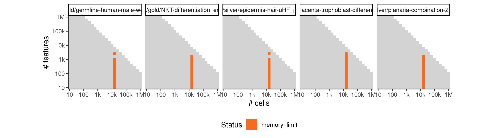

 * Number of instances: 25
 * Dataset ids: scaling_0697, scaling_0714, scaling_0731, scaling_0748, scaling_0765, scaling_0782, scaling_0800, scaling_0818, scaling_0836, scaling_0854, scaling_0865, scaling_0876, scaling_0887, scaling_0898, scaling_0909, scaling_0992, scaling_1006, scaling_1020, scaling_1034, scaling_1048, scaling_1066, scaling_1085, scaling_1104, scaling_1123, scaling_1142

Last 10 lines of scaling_0697:
```
Attaching package: ‘purrr’
The following object is masked from ‘package:jsonlite’:
    flatten
Warning messages:
1: In rgl.init(initValue, onlyNULL) : RGL: unable to open X11 display
2: 'rgl_init' failed, running with rgl.useNULL = TRUE 
Error in asMethod(object) : 
  Cholmod error 'out of memory' at file ../Core/cholmod_memory.c, line 147
Calls: <Anonymous> ... [ -> as -> asMethod -> as -> .class1 -> as -> asMethod
Execution halted
```

### ERROR CLUSTER MEMORY_LIMIT -- 2
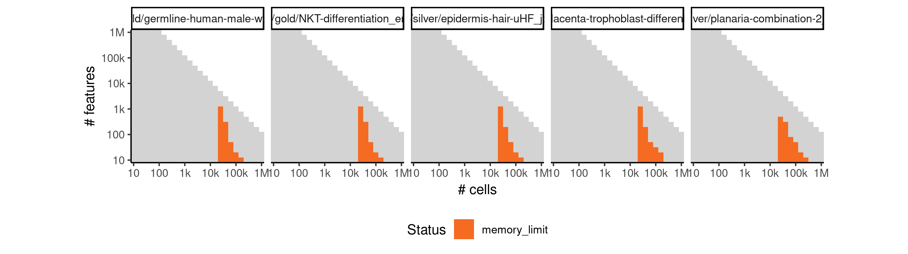

 * Number of instances: 45
 * Dataset ids: scaling_0783, scaling_0801, scaling_0819, scaling_0837, scaling_0855, scaling_0866, scaling_0877, scaling_0888, scaling_0899, scaling_0910, scaling_0918, scaling_0926, scaling_0934, scaling_0942, scaling_0950, scaling_0956, scaling_0962, scaling_0968, scaling_0974, scaling_0980, scaling_0993, scaling_0994, scaling_1007, scaling_1008, scaling_1021, scaling_1022, scaling_1035, scaling_1036, scaling_1049, scaling_1050, scaling_1067, scaling_1068, scaling_1069, scaling_1086, scaling_1087, scaling_1088, scaling_1105, scaling_1106, scaling_1107, scaling_1124, scaling_1125, scaling_1126, scaling_1143, scaling_1144, scaling_1145

Last 10 lines of scaling_0783:
```
The following objects are masked from ‘package:base’:
    intersect, setdiff, setequal, union
Attaching package: ‘purrr’
The following object is masked from ‘package:jsonlite’:
    flatten
Warning messages:
1: In rgl.init(initValue, onlyNULL) : RGL: unable to open X11 display
2: 'rgl_init' failed, running with rgl.useNULL = TRUE 
Error: cannot allocate vector of size 2.4 Gb
Execution halted
```

## ERROR STATUS METHOD_ERROR

### ERROR CLUSTER METHOD_ERROR -- 1
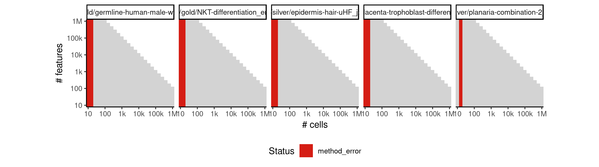

 * Number of instances: 179
 * Dataset ids: scaling_0001, scaling_0002, scaling_0003, scaling_0004, scaling_0006, scaling_0007, scaling_0008, scaling_0009, scaling_0010, scaling_0011, scaling_0012, scaling_0013, scaling_0015, scaling_0016, scaling_0017, scaling_0019, scaling_0020, scaling_0022, scaling_0023, scaling_0025, scaling_0026, scaling_0029, scaling_0031, scaling_0033, scaling_0035, scaling_0037, scaling_0039, scaling_0041, scaling_0043, scaling_0045, scaling_0047, scaling_0051, scaling_0052, scaling_0056, scaling_0057, scaling_0061, scaling_0062, scaling_0066, scaling_0067, scaling_0072, scaling_0076, scaling_0077, scaling_0082, scaling_0083, scaling_0088, scaling_0089, scaling_0094, scaling_0095, scaling_0101, scaling_0106, scaling_0107, scaling_0113, scaling_0114, scaling_0120, scaling_0121, scaling_0127, scaling_0128, scaling_0135, scaling_0151, scaling_0152, scaling_0157, scaling_0158, scaling_0163, scaling_0164, scaling_0169, scaling_0170, scaling_0176, scaling_0181, scaling_0188, scaling_0195, scaling_0202, scaling_0216, scaling_0218, scaling_0220, scaling_0222, scaling_0224, scaling_0226, scaling_0227, scaling_0232, scaling_0233, scaling_0238, scaling_0239, scaling_0244, scaling_0245, scaling_0251, scaling_0276, scaling_0277, scaling_0287, scaling_0288, scaling_0298, scaling_0299, scaling_0309, scaling_0310, scaling_0321, scaling_0341, scaling_0342, scaling_0351, scaling_0352, scaling_0361, scaling_0362, scaling_0371, scaling_0372, scaling_0382, scaling_0391, scaling_0392, scaling_0404, scaling_0405, scaling_0417, scaling_0418, scaling_0430, scaling_0431, scaling_0444, scaling_0456, scaling_0466, scaling_0476, scaling_0486, scaling_0506, scaling_0510, scaling_0514, scaling_0518, scaling_0522, scaling_0526, scaling_0532, scaling_0538, scaling_0544, scaling_0550, scaling_0556, scaling_0565, scaling_0574, scaling_0583, scaling_0601, scaling_0602, scaling_0617, scaling_0618, scaling_0633, scaling_0634, scaling_0649, scaling_0650, scaling_0666, scaling_0681, scaling_0682, scaling_0698, scaling_0699, scaling_0715, scaling_0716, scaling_0732, scaling_0733, scaling_0750, scaling_0766, scaling_0767, scaling_0784, scaling_0785, scaling_0802, scaling_0803, scaling_0820, scaling_0821, scaling_0839, scaling_0856, scaling_0867, scaling_0878, scaling_0889, scaling_0911, scaling_0919, scaling_0927, scaling_0935, scaling_0943, scaling_0951, scaling_0957, scaling_0963, scaling_0969, scaling_0975, scaling_0981, scaling_0995, scaling_1009, scaling_1023, scaling_1051, scaling_1070, scaling_1089, scaling_1108

Last 10 lines of scaling_0001:
```
    intersect, setdiff, setequal, union
Attaching package: ‘purrr’
The following object is masked from ‘package:jsonlite’:
    flatten
Warning messages:
1: In rgl.init(initValue, onlyNULL) : RGL: unable to open X11 display
2: 'rgl_init' failed, running with rgl.useNULL = TRUE 
Error in destiny::DiffusionMap(data = expression, sigma = params$sigma,  : 
  Eigen decomposition not possible if n ≤ n_eigs+1 (And 10 ≤ 21)
Execution halted
```

### ERROR CLUSTER METHOD_ERROR -- 2
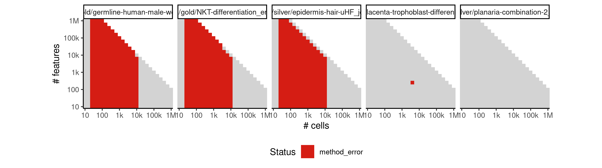

 * Number of instances: 526
 * Dataset ids: scaling_0018, scaling_0021, scaling_0024, scaling_0032, scaling_0034, scaling_0036, scaling_0042, scaling_0044, scaling_0046, scaling_0053, scaling_0054, scaling_0055, scaling_0058, scaling_0059, scaling_0060, scaling_0063, scaling_0064, scaling_0065, scaling_0078, scaling_0079, scaling_0080, scaling_0081, scaling_0084, scaling_0085, scaling_0086, scaling_0087, scaling_0090, scaling_0091, scaling_0092, scaling_0093, scaling_0108, scaling_0109, scaling_0110, scaling_0111, scaling_0112, scaling_0115, scaling_0116, scaling_0117, scaling_0118, scaling_0119, scaling_0122, scaling_0123, scaling_0124, scaling_0125, scaling_0126, scaling_0141, scaling_0142, scaling_0143, scaling_0144, scaling_0145, scaling_0146, scaling_0153, scaling_0154, scaling_0155, scaling_0156, scaling_0159, scaling_0160, scaling_0161, scaling_0162, scaling_0165, scaling_0166, scaling_0167, scaling_0168, scaling_0182, scaling_0183, scaling_0184, scaling_0185, scaling_0186, scaling_0187, scaling_0189, scaling_0190, scaling_0191, scaling_0192, scaling_0193, scaling_0194, scaling_0196, scaling_0197, scaling_0198, scaling_0199, scaling_0200, scaling_0201, scaling_0217, scaling_0219, scaling_0221, scaling_0228, scaling_0229, scaling_0230, scaling_0231, scaling_0234, scaling_0235, scaling_0236, scaling_0237, scaling_0240, scaling_0241, scaling_0242, scaling_0243, scaling_0256, scaling_0257, scaling_0258, scaling_0259, scaling_0260, scaling_0261, scaling_0262, scaling_0263, scaling_0264, scaling_0265, scaling_0266, scaling_0267, scaling_0278, scaling_0279, scaling_0280, scaling_0281, scaling_0282, scaling_0283, scaling_0284, scaling_0285, scaling_0286, scaling_0289, scaling_0290, scaling_0291, scaling_0292, scaling_0293, scaling_0294, scaling_0295, scaling_0296, scaling_0297, scaling_0300, scaling_0301, scaling_0302, scaling_0303, scaling_0304, scaling_0305, scaling_0306, scaling_0307, scaling_0308, scaling_0331, scaling_0332, scaling_0333, scaling_0334, scaling_0335, scaling_0336, scaling_0343, scaling_0344, scaling_0345, scaling_0346, scaling_0347, scaling_0348, scaling_0349, scaling_0350, scaling_0353, scaling_0354, scaling_0355, scaling_0356, scaling_0357, scaling_0358, scaling_0359, scaling_0360, scaling_0363, scaling_0364, scaling_0365, scaling_0366, scaling_0367, scaling_0368, scaling_0369, scaling_0370, scaling_0393, scaling_0394, scaling_0395, scaling_0396, scaling_0397, scaling_0398, scaling_0399, scaling_0400, scaling_0401, scaling_0402, scaling_0403, scaling_0406, scaling_0407, scaling_0408, scaling_0409, scaling_0410, scaling_0411, scaling_0412, scaling_0413, scaling_0414, scaling_0415, scaling_0416, scaling_0419, scaling_0420, scaling_0421, scaling_0422, scaling_0423, scaling_0424, scaling_0425, scaling_0426, scaling_0427, scaling_0428, scaling_0429, scaling_0457, scaling_0458, scaling_0459, scaling_0460, scaling_0461, scaling_0462, scaling_0463, scaling_0464, scaling_0465, scaling_0467, scaling_0468, scaling_0469, scaling_0470, scaling_0471, scaling_0472, scaling_0473, scaling_0474, scaling_0475, scaling_0477, scaling_0478, scaling_0479, scaling_0480, scaling_0481, scaling_0482, scaling_0483, scaling_0484, scaling_0485, scaling_0507, scaling_0508, scaling_0509, scaling_0511, scaling_0512, scaling_0513, scaling_0515, scaling_0516, scaling_0517, scaling_0527, scaling_0528, scaling_0529, scaling_0530, scaling_0531, scaling_0533, scaling_0534, scaling_0535, scaling_0536, scaling_0537, scaling_0539, scaling_0540, scaling_0541, scaling_0542, scaling_0543, scaling_0557, scaling_0558, scaling_0559, scaling_0560, scaling_0561, scaling_0562, scaling_0563, scaling_0564, scaling_0566, scaling_0567, scaling_0568, scaling_0569, scaling_0570, scaling_0571, scaling_0572, scaling_0573, scaling_0575, scaling_0576, scaling_0577, scaling_0578, scaling_0579, scaling_0580, scaling_0581, scaling_0582, scaling_0603, scaling_0604, scaling_0605, scaling_0606, scaling_0607, scaling_0608, scaling_0609, scaling_0610, scaling_0611, scaling_0612, scaling_0613, scaling_0614, scaling_0615, scaling_0616, scaling_0619, scaling_0620, scaling_0621, scaling_0622, scaling_0623, scaling_0624, scaling_0625, scaling_0626, scaling_0627, scaling_0628, scaling_0629, scaling_0630, scaling_0631, scaling_0632, scaling_0635, scaling_0636, scaling_0637, scaling_0638, scaling_0639, scaling_0640, scaling_0641, scaling_0642, scaling_0643, scaling_0644, scaling_0645, scaling_0646, scaling_0647, scaling_0648, scaling_0683, scaling_0684, scaling_0685, scaling_0686, scaling_0687, scaling_0688, scaling_0689, scaling_0690, scaling_0691, scaling_0692, scaling_0693, scaling_0694, scaling_0695, scaling_0696, scaling_0700, scaling_0701, scaling_0702, scaling_0703, scaling_0704, scaling_0705, scaling_0706, scaling_0707, scaling_0708, scaling_0709, scaling_0710, scaling_0711, scaling_0712, scaling_0713, scaling_0717, scaling_0718, scaling_0719, scaling_0720, scaling_0721, scaling_0722, scaling_0723, scaling_0724, scaling_0725, scaling_0726, scaling_0727, scaling_0728, scaling_0729, scaling_0730, scaling_0768, scaling_0769, scaling_0770, scaling_0771, scaling_0772, scaling_0773, scaling_0774, scaling_0775, scaling_0776, scaling_0777, scaling_0778, scaling_0779, scaling_0780, scaling_0781, scaling_0786, scaling_0787, scaling_0788, scaling_0789, scaling_0790, scaling_0791, scaling_0792, scaling_0793, scaling_0794, scaling_0795, scaling_0796, scaling_0797, scaling_0798, scaling_0799, scaling_0804, scaling_0805, scaling_0806, scaling_0807, scaling_0808, scaling_0809, scaling_0810, scaling_0811, scaling_0812, scaling_0813, scaling_0814, scaling_0815, scaling_0816, scaling_0817, scaling_0857, scaling_0858, scaling_0859, scaling_0860, scaling_0861, scaling_0862, scaling_0863, scaling_0864, scaling_0868, scaling_0869, scaling_0870, scaling_0871, scaling_0872, scaling_0873, scaling_0874, scaling_0875, scaling_0879, scaling_0880, scaling_0881, scaling_0882, scaling_0883, scaling_0884, scaling_0885, scaling_0886, scaling_0912, scaling_0913, scaling_0914, scaling_0915, scaling_0916, scaling_0917, scaling_0920, scaling_0921, scaling_0922, scaling_0923, scaling_0924, scaling_0925, scaling_0928, scaling_0929, scaling_0930, scaling_0931, scaling_0932, scaling_0933, scaling_0952, scaling_0953, scaling_0954, scaling_0955, scaling_0958, scaling_0959, scaling_0960, scaling_0961, scaling_0964, scaling_0965, scaling_0966, scaling_0967, scaling_0982, scaling_0983, scaling_0984, scaling_0985, scaling_0986, scaling_0987, scaling_0988, scaling_0989, scaling_0990, scaling_0991, scaling_0996, scaling_0997, scaling_0998, scaling_0999, scaling_1000, scaling_1001, scaling_1002, scaling_1003, scaling_1004, scaling_1005, scaling_1010, scaling_1011, scaling_1012, scaling_1013, scaling_1014, scaling_1015, scaling_1016, scaling_1017, scaling_1018, scaling_1019, scaling_1052, scaling_1053, scaling_1054, scaling_1055, scaling_1056, scaling_1057, scaling_1058, scaling_1059, scaling_1060, scaling_1061, scaling_1062, scaling_1063, scaling_1064, scaling_1065, scaling_1071, scaling_1072, scaling_1073, scaling_1074, scaling_1075, scaling_1076, scaling_1077, scaling_1078, scaling_1079, scaling_1080, scaling_1081, scaling_1082, scaling_1083, scaling_1084, scaling_1090, scaling_1091, scaling_1092, scaling_1093, scaling_1094, scaling_1095, scaling_1096, scaling_1097, scaling_1098, scaling_1099, scaling_1100, scaling_1101, scaling_1102, scaling_1103, scaling_1120

Last 10 lines of scaling_0018:
```
  File "/usr/lib/python3/dist-packages/pandas/io/parsers.py", line 1390, in __init__
    self._reader = _parser.TextReader(src, **kwds)
  File "pandas/parser.pyx", line 538, in pandas.parser.TextReader.__cinit__ (pandas/parser.c:6171)
pandas.io.common.EmptyDataError: No columns to parse from file
Error in file(file, "rt") : cannot open the connection
Calls: <Anonymous> -> read_topology -> <Anonymous> -> file
In addition: Warning message:
In file(file, "rt") :
  cannot open file '/tmp2/Rtmpri5HzW/filec35e25056dc9_TreeTopology.dat': No such file or directory
Execution halted
```

### ERROR CLUSTER METHOD_ERROR -- 3
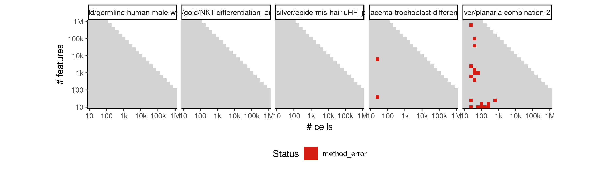

 * Number of instances: 17
 * Dataset ids: scaling_0030, scaling_0073, scaling_0075, scaling_0096, scaling_0105, scaling_0139, scaling_0140, scaling_0180, scaling_0225, scaling_0339, scaling_0340, scaling_0383, scaling_0498, scaling_0551, scaling_0593, scaling_0594, scaling_0734

Last 10 lines of scaling_0030:
```
[Note: EndPoints search terminated because no further positive scores were found...]
Only 2 Endpoints detected.
Endpoints: 2 2 24
Branchpoints: 0 0
Tree_Branch:  1 23
Endpoints: 2 1 23
Finished Scaffold Tree... 0.0074024200439453125 seconds
Error in 1:dim(ScaffoldTree$Branches)[1] : argument of length 0
Calls: <Anonymous>
Execution halted
```

### ERROR CLUSTER METHOD_ERROR -- 4
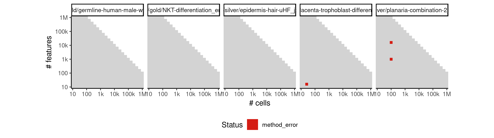

 * Number of instances: 2
 * Dataset ids: scaling_0038, scaling_0670

Last 10 lines of scaling_0038:
```
  number of columns of result is not a multiple of vector length (arg 2)
3: In igraph::get.shortest.paths(Graph_yk, from = TopologyEdges[i,  :
  At structural_properties.c:745 :Couldn't reach some vertices
[1] "Constructing tree 1 of 1 / Subset 1 of 1"
[1] "Computing EPG with 100 nodes on 25 points and 16 dimensions"
BARCODE	ENERGY	NNODES	NEDGES	NRIBS	NSTARS	NRAYS	NRAYS2	MSE	MSEP	FVE	FVEP	UE	UR	URN	URN2	URSD
[1] "Using a single core"
0.076 sec elapsed
Error: Column `edge_id` must be length 1 or 25, not 24
Execution halted
```

### ERROR CLUSTER METHOD_ERROR -- 5
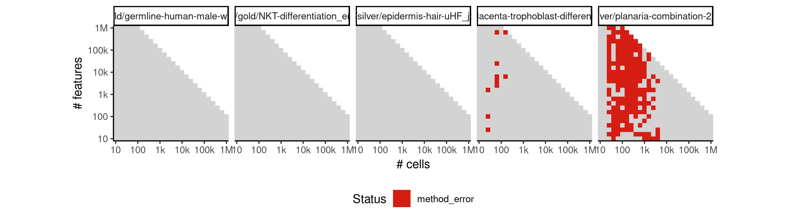

 * Number of instances: 112
 * Dataset ids: scaling_0040, scaling_0050, scaling_0068, scaling_0074, scaling_0102, scaling_0103, scaling_0104, scaling_0137, scaling_0138, scaling_0147, scaling_0150, scaling_0177, scaling_0178, scaling_0210, scaling_0211, scaling_0212, scaling_0214, scaling_0252, scaling_0253, scaling_0254, scaling_0273, scaling_0274, scaling_0275, scaling_0322, scaling_0323, scaling_0324, scaling_0325, scaling_0326, scaling_0327, scaling_0329, scaling_0330, scaling_0384, scaling_0385, scaling_0386, scaling_0389, scaling_0390, scaling_0445, scaling_0446, scaling_0447, scaling_0449, scaling_0452, scaling_0454, scaling_0455, scaling_0487, scaling_0497, scaling_0499, scaling_0500, scaling_0501, scaling_0505, scaling_0523, scaling_0524, scaling_0552, scaling_0554, scaling_0555, scaling_0595, scaling_0596, scaling_0597, scaling_0667, scaling_0669, scaling_0671, scaling_0672, scaling_0673, scaling_0674, scaling_0678, scaling_0736, scaling_0751, scaling_0752, scaling_0753, scaling_0755, scaling_0756, scaling_0757, scaling_0759, scaling_0760, scaling_0824, scaling_0840, scaling_0841, scaling_0842, scaling_0843, scaling_0844, scaling_0845, scaling_0846, scaling_0847, scaling_0848, scaling_0901, scaling_0902, scaling_0903, scaling_0904, scaling_0906, scaling_0936, scaling_0944, scaling_0945, scaling_0946, scaling_0976, scaling_0977, scaling_0978, scaling_1038, scaling_1040, scaling_1041, scaling_1042, scaling_1043, scaling_1044, scaling_1045, scaling_1113, scaling_1128, scaling_1129, scaling_1130, scaling_1131, scaling_1132, scaling_1133, scaling_1134, scaling_1135, scaling_1136

Last 10 lines of scaling_0040:
```
Tree_Branch 4 21
Tree_Branch 5 21
Tree_Branch 8 12
Tree_Branch 10 12
Tree_Branch 21 12
Finished Scaffold Tree... 0.008510589599609375 seconds
Error in FUN(X[[i]], ...) : 
  only defined on a data frame with all numeric variables
Calls: <Anonymous> -> Summary.data.frame -> lapply -> FUN
Execution halted
```

### ERROR CLUSTER METHOD_ERROR -- 6
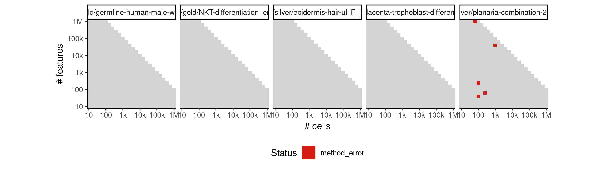

 * Number of instances: 3
 * Dataset ids: scaling_0213, scaling_0387, scaling_0448

Last 10 lines of scaling_0213:
```
  only defined on a data frame with all numeric variables
Calls: <Anonymous> -> Summary.data.frame -> lapply -> FUN
In addition: Warning messages:
1: In rbind(TopologyEdgesAux, Edge2) :
  number of columns of result is not a multiple of vector length (arg 2)
2: In rbind(TopologyEdgesAux, Edge2) :
  number of columns of result is not a multiple of vector length (arg 2)
3: In rbind(TopologyEdgesAux, Edge2) :
  number of columns of result is not a multiple of vector length (arg 2)
Execution halted
```

### ERROR CLUSTER METHOD_ERROR -- 7
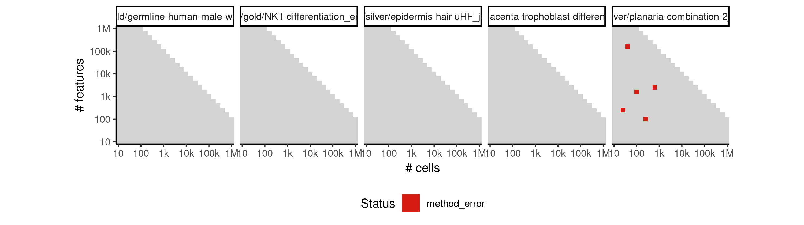

 * Number of instances: 3
 * Dataset ids: scaling_0272, scaling_0450, scaling_0754

Last 10 lines of scaling_0272:
```
Tree_Branch 9 11
Tree_Branch 24 11
Finished Scaffold Tree... 0.009989261627197266 seconds
Error in FUN(X[[i]], ...) : 
  only defined on a data frame with all numeric variables
Calls: <Anonymous> -> Summary.data.frame -> lapply -> FUN
In addition: Warning message:
In rbind(TopologyEdgesAux, Edge2) :
  number of columns of result is not a multiple of vector length (arg 2)
Execution halted
```

## ERROR STATUS TIME_LIMIT

### ERROR CLUSTER TIME_LIMIT -- 1
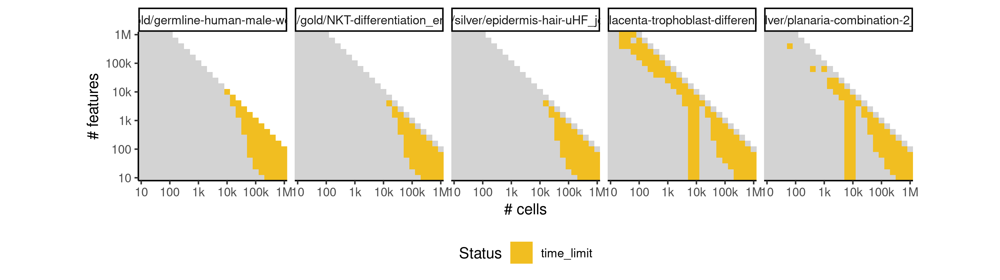

 * Number of instances: 26
 * Dataset ids: scaling_0591, scaling_0600, scaling_0663, scaling_0664, scaling_0679, scaling_0680, scaling_0746, scaling_0747, scaling_0763, scaling_0764, scaling_0834, scaling_0835, scaling_0852, scaling_0853, scaling_0897, scaling_0908, scaling_0941, scaling_0949, scaling_0973, scaling_0979, scaling_1033, scaling_1047, scaling_1121, scaling_1122, scaling_1140, scaling_1141

Last 10 lines of scaling_0591:
```
File: /home/rcannood/Workspace/dynverse/dynbenchmark//derived/05-scaling/suite/merlot/Cat1/r2gridengine/20181008_142051_merlot_Cat1_PdvFPj52Ua/log/log.591.e.txt
```


